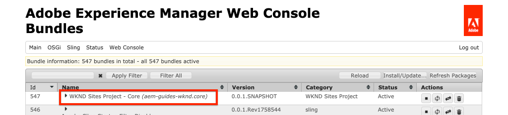

# 專案設定 {#project-setup}

本教學課程涵蓋建立Maven多模組專案，以管理Adobe Experience Manager網站的程式碼和設定。

## 必備條件 {#prerequisites}

檢閱設定 [本地開發環境](./overview.md#local-dev-environment). 請確定您已在本機取得最新的Adobe Experience Manager例項，且未安裝其他範例/示範套件（必要的Service Pack除外）。

## 目標 {#objective}

1. 了解如何使用Maven原型產生新的AEM專案。
1. 了解AEM專案原型產生的不同模組，以及它們如何共同運作。
1. 了解AEM核心元件如何納入AEM專案。

## 您要建置的 {#what-build}

>[!VIDEO](https://video.tv.adobe.com/v/30152/?quality=12&learn=on)

在本章中，您使用 [AEM專案原型](https://github.com/adobe/aem-project-archetype). 您的AEM專案包含用於Sites實作的完整程式碼、內容和設定。 本章生成的項目是WKND站點實施的基礎，並在以後的章節中構建。

**什麼是Maven專案？** - [阿帕奇·馬文](https://maven.apache.org/) 是用於建立項目的軟體管理工具。 *全部Adobe Experience Manager* 實作會使用Maven專案來建置、管理和部署自訂程式碼，同時使用AEM。

**什麼是Maven原型？** - A [馬文原型](https://maven.apache.org/archetype/index.html) 是產生新專案的範本或模式。 AEM專案原型有助於以自訂命名空間產生新專案，並包含遵循最佳實務的專案結構，大幅加快專案開發。

## 建立專案 {#create}

為AEM建立Maven多模組專案有幾個選項。 本教學課程使用 [Maven AEM專案原型 **35**](https://github.com/adobe/aem-project-archetype). Cloud Manager也 [提供UI精靈](https://experienceleague.adobe.com/docs/experience-manager-cloud-manager/content/getting-started/project-creation/using-the-wizard.html) 以啟動建立AEM應用程式專案。 Cloud Manager UI產生的基礎專案結構與直接使用原型相同。

>[!NOTE]
>
>本教學課程使用版本 **35** 原型。 使用 **最新** 原型版本，以產生新專案。

下一系列步驟將使用基於UNIX®的命令行終端進行，但如果使用Windows終端，則應類似。

1. 開啟命令列終端。 確認已安裝Maven:

   ```shell
   $ mvn --version
   Apache Maven 3.6.2
   Maven home: /Library/apache-maven-3.6.2
   Java version: 11.0.4, vendor: Oracle Corporation, runtime: /Library/Java/JavaVirtualMachines/jdk-11.0.4.jdk/Contents/Home
   ```

1. 導覽至您要產生AEM專案的目錄。 這可以是您要維護項目原始碼的任何目錄。 例如，名為的目錄 `code` 在用戶的首頁目錄下：

   ```shell
   $ cd ~/code
   ```

1. 將下列內容貼入命令列以 [以批模式生成項目](https://maven.apache.org/archetype/maven-archetype-plugin/examples/generate-batch.html):

   ```shell
   mvn -B org.apache.maven.plugins:maven-archetype-plugin:3.2.1:generate \
       -D archetypeGroupId=com.adobe.aem \
       -D archetypeArtifactId=aem-project-archetype \
       -D archetypeVersion=39 \
       -D appTitle="WKND Sites Project" \
       -D appId="wknd" \
       -D groupId="com.adobe.aem.guides" \
       -D artifactId="aem-guides-wknd" \
       -D package="com.adobe.aem.guides.wknd" \
       -D version="0.0.1-SNAPSHOT" \
       -D aemVersion="cloud"
   ```

   >[!NOTE]
   >
   > 目標AEM 6.5.14+取代 `aemVersion="cloud"` with `aemVersion="6.5.14"`.

   可用屬性的完整清單，用於配置項目 [可在此處找到](https://github.com/adobe/aem-project-archetype#available-properties).

1. 以下資料夾和檔案結構是由您本機檔案系統上的Maven原型產生：

   ```plain
    ~/code/
       |--- aem-guides-wknd/
           |--- all/
           |--- core/
           |--- ui.apps/
           |--- ui.apps.structure/
           |--- ui.config/
           |--- ui.content/
           |--- ui.frontend/
           |--- ui.tests /
           |--- it.tests/
           |--- dispatcher/
           |--- pom.xml
           |--- README.md
           |--- .gitignore
   ```

## 部署並建置專案 {#build}

建立專案程式碼並部署至AEM的本機執行個體。

1. 請確定您的AEM製作例項在本機的連接埠上執行 **4502**.
1. 從命令列導覽至 `aem-guides-wknd` 項目目錄。

   ```shell
   $ cd aem-guides-wknd
   ```

1. 執行下列命令以建立整個專案並部署至AEM:

   ```shell
   $ mvn clean install -PautoInstallSinglePackage
   ```

   組建需要約一分鐘的時間，且應會以下列訊息結束：

   ```
   ...
   [INFO] ------------------------------------------------------------------------
   [INFO] Reactor Summary for WKND Sites Project 0.0.1-SNAPSHOT:
   [INFO] 
   [INFO] WKND Sites Project ................................. SUCCESS [  0.113 s]
   [INFO] WKND Sites Project - Core .......................... SUCCESS [  3.136 s]
   [INFO] WKND Sites Project - UI Frontend ................... SUCCESS [  4.461 s]
   [INFO] WKND Sites Project - Repository Structure Package .. SUCCESS [  0.359 s]
   [INFO] WKND Sites Project - UI apps ....................... SUCCESS [  1.732 s]
   [INFO] WKND Sites Project - UI content .................... SUCCESS [  0.956 s]
   [INFO] WKND Sites Project - UI config ..................... SUCCESS [  0.064 s]
   [INFO] WKND Sites Project - All ........................... SUCCESS [  8.229 s]
   [INFO] WKND Sites Project - Integration Tests ............. SUCCESS [  3.329 s]
   [INFO] WKND Sites Project - Dispatcher .................... SUCCESS [  0.027 s]
   [INFO] WKND Sites Project - UI Tests ...................... SUCCESS [  0.032 s]
   [INFO] ------------------------------------------------------------------------
   [INFO] BUILD SUCCESS
   [INFO] ------------------------------------------------------------------------
   [INFO] Total time:  23.189 s
   [INFO] Finished at: 2023-01-10T11:12:23-05:00
   [INFO] ------------------------------------------------------------------------    
   ```

   Maven的個人資料 `autoInstallSinglePackage` 編譯專案的個別模組，並將單一套件部署至AEM例項。 依預設，此套件會部署至本機在連接埠上執行的AEM執行個體 **4502** 而且憑 `admin:admin`.

1. 導覽至您本機AEM執行個體上的套件管理器： [http://localhost:4502/crx/packmgr/index.jsp](http://localhost:4502/crx/packmgr/index.jsp). 您應會看到 `aem-guides-wknd.ui.apps`, `aem-guides-wknd.ui.config`, `aem-guides-wknd.ui.content`，和 `aem-guides-wknd.all`.

1. 導覽至Sites Console: [http://localhost:4502/sites.html/content](http://localhost:4502/sites.html/content). WKND站點是其中一個站點。 其中包含具有美國和語言主版階層的網站結構。 此網站階層是以 `language_country` 和 `isSingleCountryWebsite` 使用原型產生專案時。

1. 開啟 **US** `>` **英文** 頁面，方法是選取頁面並按一下 **編輯** 按鈕（在菜單欄中）:

   

1. 已建立入門內容，並可將多個元件新增至頁面。 試用這些元件，以了解功能。 您將在下一章中了解元件的基本知識。

   

   *原型產生的範例內容*

## Inspect專案 {#project-structure}

產生的AEM專案由個別Maven模組組成，每個模組具有不同的角色。 本教學課程和大部分開發工作都著重於這些模組：

* [核心](https://experienceleague.adobe.com/docs/experience-manager-core-components/using/developing/archetype/core.html) - Java Code，主要是後端開發人員。
* [ui.frontend](https://experienceleague.adobe.com/docs/experience-manager-core-components/using/developing/archetype/uifrontend.html)  — 包含CSS、JavaScript、Sass、TypeScript的原始碼，主要供前端開發人員使用。
* [ui.apps](https://experienceleague.adobe.com/docs/experience-manager-core-components/using/developing/archetype/uiapps.html)  — 包含元件和對話方塊定義，內嵌編譯的CSS和JavaScript作為用戶端程式庫。
* [ui.content](https://experienceleague.adobe.com/docs/experience-manager-core-components/using/developing/archetype/uicontent.html)  — 包含結構內容和設定，如可編輯的範本、中繼資料結構(/content, /conf)。

* **all**  — 這是空的Maven模組，將上述模組結合為可部署至AEM環境的單一套件。


請參閱 [AEM專案原型檔案](https://experienceleague.adobe.com/docs/experience-manager-core-components/using/developing/archetype/overview.html?lang=zh-Hant) 若要深入了解 **all** Maven模組。

### 納入核心元件 {#core-components}

[AEM核心元件](https://experienceleague.adobe.com/docs/experience-manager-core-components/using/introduction.html) 是一組適用於AEM的標準化網頁內容管理(WCM)元件。 這些元件提供功能的基準集，並針對個別專案進行樣式化、自訂和延伸。

AEMas a Cloud Service環境包含 [AEM核心元件](https://experienceleague.adobe.com/docs/experience-manager-core-components/using/introduction.html). 因此，為AEMas a Cloud Service產生的專案會 **not** 包含AEM核心元件內嵌。

針對AEM 6.5/6.4產生的專案，原型會自動內嵌 [AEM核心元件](https://experienceleague.adobe.com/docs/experience-manager-core-components/using/introduction.html) 在專案中。 AEM 6.5/6.4內嵌AEM核心元件是最佳實務，可確保專案部署最新版本。 核心元件的相關資訊 [包含在專案中，可在此處找到](https://experienceleague.adobe.com/docs/experience-manager-core-components/using/developing/archetype/using.html#core-components).

## 原始碼管理 {#source-control}

最好使用某種形式的原始碼控制來管理應用程式中的代碼。 本教學課程使用Git和GitHub。 由Maven和/或所選的IDE生成的多個檔案應被SCM忽略。

每當您建置和安裝程式碼套件時，Maven就會建立目標資料夾。 目標資料夾和內容應從SCM中排除。

在底下， `ui.apps` 模組觀察到許多 `.content.xml` 檔案。 這些XML檔案映射JCR中安裝的內容的節點類型和屬性。 這些檔案是關鍵檔案， **不能** 被忽略。

AEM專案原型會產生範例 `.gitignore` 檔案，可作為安全忽略檔案的起點。 檔案是在 `<src>/aem-guides-wknd/.gitignore`.

## 恭喜！ {#congratulations}

恭喜，您已建立第一個AEM專案！

### 後續步驟 {#next-steps}

透過簡單的 `HelloWorld` 範例，搭配 [元件基本知識](component-basics.md) 教學課程。

## 高級Maven命令（額外） {#advanced-maven-commands}

在開發期間，您可能只使用其中一個模組，並想要避免建置整個專案，以節省時間。 您也可以直接部署至AEM Publish執行個體，或部署至未在連接埠4502上執行的AEM執行個體。

接下來，我們來檢閱一些額外的Maven設定檔和命令，讓您在開發期間有更大的彈性。

### 核心模組 {#core-module}

此 **[核心](https://experienceleague.adobe.com/docs/experience-manager-core-components/using/developing/archetype/core.html)** 模組包含與專案相關聯的所有Java™程式碼。 建置 **核心** 模組將OSGi套件組合部署至AEM。 若要僅建置此模組：

1. 導覽至 `core` 資料夾（在下方） `aem-guides-wknd`):

   ```shell
   $ cd core/
   ```

1. 執行下列命令：

   ```shell
   $ mvn clean install -PautoInstallBundle
   ...
   [INFO] --- sling-maven-plugin:2.4.0:install (install-bundle) @ aem-guides-wknd.core ---
   [INFO] Installing Bundle aem-guides-wknd.core(~/code/aem-guides-wknd/core/target/aem-guides-wknd.core-0.0.1-SNAPSHOT.jar) to http://localhost:4502/system/console via WebConsole
   [INFO] Bundle installed
   [INFO] ------------------------------------------------------------------------
   [INFO] BUILD SUCCESS
   [INFO] ------------------------------------------------------------------------
   [INFO] Total time:  8.558 s
   ```

1. 導覽至 [http://localhost:4502/system/console/bundles](http://localhost:4502/system/console/bundles). 這是OSGi Web控制台，包含AEM執行個體上安裝之所有套件組合的相關資訊。

1. 切換 **Id** 排序列，您應該會看到WKND套件已安裝且已啟用。

   

1. 您可以在 [CRXDE-Lite](http://localhost:4502/crx/de/index.jsp#/apps/wknd-packages/application/install/aem-guides-wknd.core-1.0.0-SNAPSHOT.jar):

   

### Ui.apps和Ui.content模組 {#apps-content-module}

此 **[ui.apps](https://experienceleague.adobe.com/docs/experience-manager-core-components/using/developing/archetype/uiapps.html)** maven模組包含網站下方所需的所有轉譯程式碼 `/apps`. 這包括以AEM格式儲存的CSS/JS，稱為 [clientlibs](https://experienceleague.adobe.com/docs/experience-manager-65/developing/introduction/clientlibs.html). 這也包括 [HTL](https://experienceleague.adobe.com/docs/experience-manager-htl/content/overview.html) 用於呈現動態HTML的指令碼。 您可以想到 **ui.apps** 模組，作為JCR中結構的映射，但格式可儲存在檔案系統上並提交到原始碼控制。 此 **ui.apps** 模組僅包含程式碼。

若要僅建置此模組：

1. 從命令列。 導覽至 `ui.apps` 資料夾（在下方） `aem-guides-wknd`):

   ```shell
   $ cd ../ui.apps
   ```

1. 執行下列命令：

   ```shell
   $ mvn clean install -PautoInstallPackage
   ...
   Package installed in 70ms.
   [INFO] ------------------------------------------------------------------------
   [INFO] BUILD SUCCESS
   [INFO] ------------------------------------------------------------------------
   [INFO] Total time:  2.987 s
   [INFO] Finished at: 2023-01-10T11:35:28-05:00
   [INFO] ------------------------------------------------------------------------
   ```

1. 導覽至 [http://localhost:4502/crx/packmgr/index.jsp](http://localhost:4502/crx/packmgr/index.jsp). 您應會看到 `ui.apps` 軟體包作為第一個安裝的軟體包，其時間戳應比其他任何軟體包都更新。

   

1. 返回命令行並運行以下命令(在 `ui.apps` 資料夾):

   ```shell
   $ mvn -PautoInstallPackagePublish clean install
   ...
   [INFO] --- content-package-maven-plugin:1.0.2:install (install-package-publish) @ aem-guides-wknd.ui.apps ---
   [INFO] Installing aem-guides-wknd.ui.apps (/Users/sachinmali/Desktop/code/wknd-tutorial/aem-guides-wknd/ui.apps/target/aem-guides-wknd.ui.apps-0.0.1-SNAPSHOT.zip) to http://localhost:4503/crx/packmgr/service.jsp
   [INFO] I/O exception (java.net.ConnectException) caught when processing request: Connection refused (Connection refused)
   [INFO] Retrying request
   [INFO] I/O exception (java.net.ConnectException) caught when processing request: Connection refused (Connection refused)
   [INFO] Retrying request
   [INFO] I/O exception (java.net.ConnectException) caught when processing request: Connection refused (Connection refused)
   [INFO] Retrying request
   [INFO] ------------------------------------------------------------------------
   [INFO] BUILD FAILURE
   [INFO] ------------------------------------------------------------------------
   [INFO] Total time:  2.812 s
   [INFO] Finished at: 2023-01-10T11:37:28-05:00
   [INFO] ------------------------------------------------------------------------
   [ERROR] Failed to execute goal com.day.jcr.vault:content-package-maven-plugin:1.0.2:install (install-package-publish) on project aem-guides-wknd.ui.apps: Connection refused (Connection refused) -> [Help 1]
   ```

   設定檔 `autoInstallPackagePublish` 是要將套件部署至在連接埠上執行的發佈環境 **4503**. 如果找不到在http://localhost:4503上執行的AEM例項，就會出現上述錯誤。

1. 最後，運行以下命令以部署 `ui.apps` 埠上的包 **4504**:

   ```shell
   $ mvn -PautoInstallPackage clean install -Daem.port=4504
   ...
   [INFO] --- content-package-maven-plugin:1.0.2:install (install-package) @ aem-guides-wknd.ui.apps ---
   [INFO] Installing aem-guides-wknd.ui.apps (/Users/dgordon/code/aem-guides-wknd/ui.apps/target/aem-guides-wknd.ui.apps-0.0.1-SNAPSHOT.zip) to http://localhost:4504/crx/packmgr/service.jsp
   [INFO] I/O exception (java.net.ConnectException) caught when processing request: Connection refused (Connection refused)
   [INFO] Retrying request
   [INFO] I/O exception (java.net.ConnectException) caught when processing request: Connection refused (Connection refused)
   [INFO] Retrying request
   [INFO] I/O exception (java.net.ConnectException) caught when processing request: Connection refused (Connection refused)
   [INFO] Retrying request
   [INFO] ------------------------------------------------------------------------
   [INFO] BUILD FAILURE
   [INFO] --------------------------------------------------------------------
   ```

   如果埠上未執行任何AEM執行個體，則預計會發生組建失敗 **4504** 的URL區段。 參數 `aem.port` 在的POM檔案中定義 `aem-guides-wknd/pom.xml`.

此 **[ui.content](https://experienceleague.adobe.com/docs/experience-manager-core-components/using/developing/archetype/uicontent.html)** 模組的結構與 **ui.apps** 模組。 唯一的區別是 **ui.content** 模組包含所謂的 **可變** 內容。 **可變** 內容主要是指儲存在原始碼控制項中的非代碼配置，如模板、策略或資料夾結構 **但** 可直接在AEM例項上修改。 在頁面和範本的章節中會更詳細地探討此問題。

用來建立 **ui.apps** 模組可用來建置 **ui.content** 模組。 歡迎在 **ui.content** 檔案夾。

## 疑難排解

如果使用AEM專案原型產生專案時發生問題，請參閱 [已知問題](https://github.com/adobe/aem-project-archetype#known-issues) 和開啟的清單 [問題](https://github.com/adobe/aem-project-archetype/issues).

## 再恭喜一次！ {#congratulations-bonus}

恭喜你，請你們翻閱獎金。

### 後續步驟 {#next-steps-bonus}

透過簡單的 `HelloWorld` 範例，搭配 [元件基本知識](component-basics.md) 教學課程。
