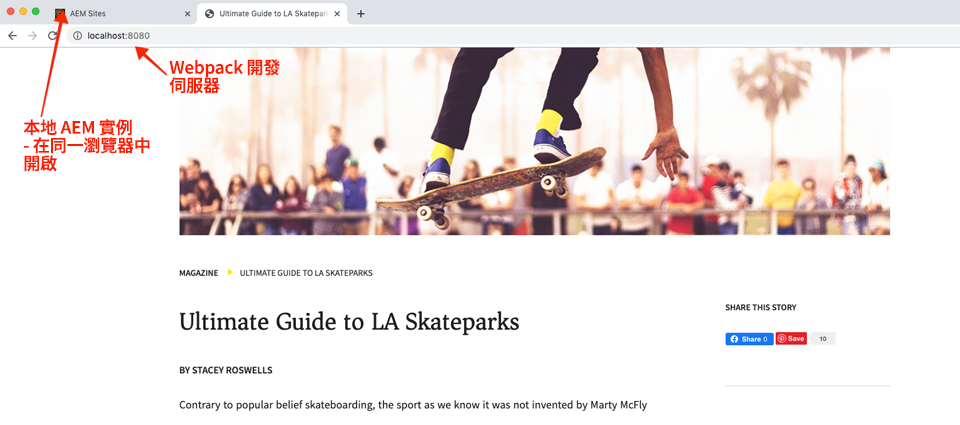
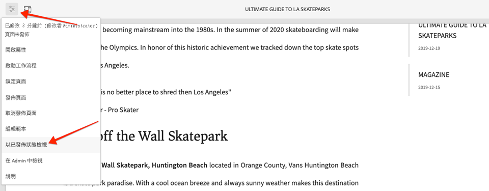

# 使用樣式系統{#developing-with-the-style-system}進行開發

瞭解如何使用Experience Manager的樣式系統來建置個別樣式並重複使用核心元件。 本教學課程涵蓋使用範本編輯器的品牌專用CSS和進階原則組態擴充核心元件的樣式系統開發。

## 必備條件 {#prerequisites}

檢閱設定[本機開發環境](overview.md#local-dev-environment)所需的工具和指示。

建議您檢閱[用戶端程式庫和前端工作流程](client-side-libraries.md)教學課程，以瞭解用戶端程式庫的基礎以及專案內建的各種前端工AEM具。

### Starter Project

>[!NOTE]
>
> 如果您成功完成上一章，可以重新使用項目，並跳過簽出起始項目的步驟。

查看教學課程所建立的基線程式碼：

1. 查看[GitHub](https://github.com/adobe/aem-guides-wknd)的`tutorial/style-system-start`分支

   ```shell
   $ cd aem-guides-wknd
   $ git checkout tutorial/style-system-start
   ```

1. 使用您的Maven技巧，將程式碼AEM庫部署至本機執行個體：

   ```shell
   $ mvn clean install -PautoInstallSinglePackage
   ```

   >[!NOTE]
   >
   > 如果使用AEM6.5或6.4，請將`classic`描述檔附加至任何Maven命令。

   ```shell
   $ mvn clean install -PautoInstallSinglePackage -Pclassic
   ```

您隨時都可以在[GitHub](https://github.com/adobe/aem-guides-wknd/tree/tutorial/style-system-solution)上檢視完成的程式碼，或切換至分支`tutorial/style-system-solution`，在本機檢出程式碼。

## 目標

1. 瞭解如何使用樣式系統，將特定品牌的CSS套用至核AEM心元件。
1. 瞭解BEM記法，以及如何使用它仔細調整樣式。
1. 使用可編輯的模板應用高級策略配置。

## 您將建立的{#what-you-will-build}

在本章中，我們將使用[Style System功能](https://docs.adobe.com/content/help/en/experience-manager-learn/sites/page-authoring/style-system-feature-video-use.html)來建立「文章」頁面上使用之&#x200B;**Title**&#x200B;和&#x200B;**Text**&#x200B;元件的變化。


*可用於標題元件的下划線樣式*

## 背景 {#background}

[Style System](https://docs.adobe.com/content/help/en/experience-manager-65/developing/components/style-system.html)可讓開發人員和範本編輯器建立元件的多種視覺變化。 然後，作者可以決定在撰寫頁面時使用哪種樣式。 在教學課程的其餘部分，我們將運用Style System來建立數種獨特的樣式，同時運用低程式碼的核心元件。

「樣式系統」的一般概念是，作者可以選擇元件外觀的各種樣式。 &quot;styles&quot;由附加的CSS類作為後盾，這些類會插入到元件的外部div中。 在用戶端程式庫中，會根據這些樣式類別新增CSS規則，讓元件變更外觀。

您可在此處找到[有關Style System的詳細文檔](https://experienceleague.adobe.com/docs/experience-manager-cloud-service/sites/authoring/features/style-system.html)。 此外，還有一段絕佳的[技術視訊，可讓您瞭解Style System](https://experienceleague.adobe.com/docs/experience-manager-learn/sites/developing/style-system-technical-video-understand.html)。

## 下划線樣式——標題{#underline-style}

[標題元件](https://experienceleague.adobe.com/docs/experience-manager-core-components/using/components/title.html)已作為&#x200B;**ui.apps**&#x200B;模組的一部分，預裝到`/apps/wknd/components/title`下的專案中。 **ui.frontend**&#x200B;模組中已實作「標題」元素(`H1`、`H2`、`H3`...)的預設樣式。

[WKND文章designs](assets/pages-templates/wknd-article-design.xd)包含具有底線的Title元件的獨特樣式。 「樣式系統」(Style System)可用來允許作者添加下划線樣式，而不是建立兩個元件或修改元件對話框。


### Inspect標題標籤

作為前端開發人員，設定核心元件樣式的第一步是瞭解元件產生的標籤。

1. 開啟新瀏覽器並檢視核心元件庫網站AEM上的標題元件：[https://www.aemcomponents.dev/content/core-components-examples/library/page-authoring/title.html](https://www.aemcomponents.dev/content/core-components-examples/library/page-authoring/title.html)

1. 以下是Title元件的標籤：

   ```html
   <div class="cmp-title">
       <h1 class="cmp-title__text">Lorem Ipsum</h1>
   </div>
   ```

   標題元件的BEM符號：

   ```plain
   BLOCK cmp-title
       ELEMENT cmp-title__text
   ```

1. Style系統將CSS類添加到元件周圍的外部div。 因此，我們要定位的標籤將類似於以下內容：

   ```html
   <div class="STYLE-SYSTEM-CLASS-HERE"> <!-- Custom CSS class - implementation gets to define this -->
       <div class="cmp-title">
           <h1 class="cmp-title__text">Lorem Ipsum</h1>
       </div>
   </div>
   ```

### 實作底線樣式- ui.frontend

接著，使用專案的&#x200B;**ui.frontend**&#x200B;模組實作底線樣式。 我們將使用與&#x200B;**ui.frontend**&#x200B;模組搭售的webpack開發伺服器，在&#x200B;*部署至本機例項之前，先預覽樣式* AEM。

1. 從&#x200B;**ui.frontend**&#x200B;模組中運行以下命令，以啟動webpack dev伺服器：

   ```shell
   $ cd ~/code/aem-guides-wknd/ui.frontend/
   $ npm start
   
   > aem-maven-archetype@1.0.0 start code/aem-guides-wknd/ui.frontend
   > webpack-dev-server --open --config ./webpack.dev.js
   ```

   這應該會在[http://localhost:8080](http://localhost:8080)開啟瀏覽器。

   >[!NOTE]
   >
   > 如果影像顯示中斷，請確定啟動程式專案已部署至本機例項AEM（在埠4502上執行），而使用的瀏覽器也已登入本機例AEM項。

   

1. 在IDE中，開啟位於以下位置的檔案`index.html`:`ui.frontend/src/main/webpack/static/index.html`。 這是webpack開發伺服器使用的靜態標籤。
1. 在`index.html`中，通過搜索文檔&#x200B;*cmp-title*，查找Title元件的實例以向中添加下划線樣式。 選擇文字&#x200B;*&quot;Vans oft the Wall Skatepark&quot;*&#x200B;的Title元件（第218行）。 將類`cmp-title--underline`添加到周圍的div:

   ```diff
   - <div class="title aem-GridColumn--phone--12 aem-GridColumn aem-GridColumn--default--8">
   + <div class="cmp-title--underline title aem-GridColumn--phone--12 aem-GridColumn aem-GridColumn--default--8">
        <div data-cmp-data-layer="{&#34;title-8bea562fa0&#34;:{&#34;@type&#34;:&#34;wknd/components/title&#34;,&#34;repo:modifyDate&#34;:&#34;2021-01-22T18:54:20Z&#34;,&#34;dc:title&#34;:&#34;Vans Off the Wall&#34;}}" id="title-8bea562fa0" class="cmp-title">
            <h2 class="cmp-title__text">Vans Off the Wall</h2>
        </div>
    </div>
   ```

1. 返回瀏覽器並驗證標籤中是否反映了額外類。
1. 返回&#x200B;**ui.frontend**&#x200B;模組，並更新位於以下位置的檔案`title.scss`:`ui.frontend/src/main/webpack/components/_title.scss`:

   ```css
   /* Add Title Underline Style */
   .cmp-title--underline {
       .cmp-title__text {
           &:after {
           display: block;
               width: 84px;
               padding-top: 8px;
               content: '';
               border-bottom: 2px solid $brand-primary;
           }
       }
   }
   ```

   >[!NOTE]
   >
   >始終將樣式嚴格限定在目標元件上，這被認為是一種最佳做法。 這可確保額外樣式不會影響頁面的其他區域。
   >
   >所有核心元件均遵循&#x200B;**[BEM符號](https://github.com/adobe/aem-core-wcm-components/wiki/css-coding-conventions)**。 建立元件的預設樣式時，最佳做法是定位外部CSS類別。 另一個最佳實務是定位核心元件BEM符號（而非HTML元素）指定的類別名稱。

1. 再次返回瀏覽器，您應看到已添加的下划線樣式：

   

1. 停止Webpack開發伺服器。

### 新增標題原則

接下來，我們需要為「標題」元件新增原則，以允許內容作者選擇「底線」樣式以套用至特定元件。 這是使用範本編輯器在中完成的AEM。

1. 使用您的Maven技巧，將程式碼庫部AEM署至本機執行個體：

   ```shell
   $ cd ~/code/aem-guides-wknd
   $ mvn clean install -PautoInstallSinglePackage
   ```

1. 導覽至位於以下位置的&#x200B;**文章頁面**&#x200B;範本：[http://localhost:4502/editor.html/conf/wknd/settings/wcm/templates/article-page/structure.html](http://localhost:4502/editor.html/conf/wknd/settings/wcm/templates/article-page/structure.html)

1. 在&#x200B;**結構**&#x200B;模式中，在主&#x200B;**佈局容器**&#x200B;中，選擇&#x200B;*允許的元件*&#x200B;下列&#x200B;**標題**&#x200B;元件旁的&#x200B;**策略**&#x200B;表徵圖：

   

1. 為Title元件建立新策略，其值如下：

   *政策標題**: **WKND標題**

   *屬性* >樣 *式標籤* >新 *增樣式*

   **下划線** :  `cmp-title--underline`

   

   按一下&#x200B;**Done**&#x200B;保存對「標題」策略的更改。

   >[!NOTE]
   >
   > 值`cmp-title--underline`與我們在&#x200B;**ui.frontend**&#x200B;模組中開發時先前定位的CSS類別相符。

### 應用下划線樣式

最後，作為作者，我們可以選擇將底線樣式應用到某些「標題元件」。

1. 導覽至AEM Sites編輯的&#x200B;**La Skateparks**&#x200B;文章：[http://localhost:4502/editor.html/content/wknd/us/en/magazine/guide-la-skateparks.html](http://localhost:4502/editor.html/content/wknd/us/en/magazine/guide-la-skateparks.html)
1. 在&#x200B;**編輯**&#x200B;模式中，選擇標題元件。 按一下&#x200B;**畫筆**&#x200B;表徵圖並選擇&#x200B;**下划線**&#x200B;樣式：

   

   身為作者，您應該可以開啟／關閉樣式。

1. 按一下「頁面資訊&#x200B;**」圖示> 「以發佈方式檢視」，以檢查編輯器外的頁AEM面。******

   

   使用您的瀏覽器開發人員工具驗證標題元件周圍的標籤是否已將CSS類別`cmp-title--underline`套用至外部div。

## 引號塊樣式——文本{#text-component}

接著，重複類似步驟，將唯一樣式套用至[文字元件](https://experienceleague.adobe.com/docs/experience-manager-core-components/using/components/text.html)。 Text元件已轉譯至`/apps/wknd/components/text`下方的專案中，成為&#x200B;**ui.apps**&#x200B;模組的一部分。 段落元素的預設樣式已在&#x200B;**ui.frontend**&#x200B;中實作。

[WKND文章designs](assets/pages-templates/wknd-article-design.xd)包含具有引號區塊的Text元件的獨特樣式：


### Inspect文本元件標籤

我們將再次檢查Text元件的標籤。

1. 在以下位置查看Text元件的標籤：[https://www.aemcomponents.dev/content/core-components-examples/library/page-authoring/text.html](https://www.aemcomponents.dev/content/core-components-examples/library/page-authoring/text.html)

1. 以下是Text元件的標籤：

   ```html
   <div class="text">
       <div class="cmp-text" data-cmp-data-layer="{&quot;text-2d9d50c5a7&quot;:{&quot;@type&quot;:&quot;core/wcm/components/text/v2/text&quot;,&quot;repo:modifyDate&quot;:&quot;2019-01-22T11:56:17Z&quot;,&quot;xdm:text&quot;:&quot;<p>Lorem ipsum dolor sit amet, consectetur adipiscing elit, sed do eiusmod tempor incididunt ut labore et dolore magna aliqua. Eu mi bibendum neque egestas congue quisque egestas. Varius morbi enim nunc faucibus a pellentesque. Scelerisque eleifend donec pretium vulputate sapien nec sagittis.</p>\n&quot;}}" id="text-2d9d50c5a7">
           <p>Lorem ipsum dolor sit amet, consectetur adipiscing elit, sed do eiusmod tempor incididunt ut labore et dolore magna aliqua. Eu mi bibendum neque egestas congue quisque egestas. Varius morbi enim nunc faucibus a pellentesque. Scelerisque eleifend donec pretium vulputate sapien nec sagittis.</p>
       </div>
   </div>
   ```

   文本元件的BEM表示法：

   ```plain
   BLOCK cmp-text
       ELEMENT
   ```

1. Style系統將CSS類添加到元件周圍的外部div。 因此，我們要定位的標籤將類似於以下內容：

   ```html
   <div class="text STYLE-SYSTEM-CLASS-HERE"> <!-- Custom CSS class - implementation gets to define this -->
       <div class="cmp-text" data-cmp-data-layer="{&quot;text-2d9d50c5a7&quot;:{&quot;@type&quot;:&quot;core/wcm/components/text/v2/text&quot;,&quot;repo:modifyDate&quot;:&quot;2019-01-22T11:56:17Z&quot;,&quot;xdm:text&quot;:&quot;<p>Lorem ipsum dolor sit amet, consectetur adipiscing elit, sed do eiusmod tempor incididunt ut labore et dolore magna aliqua. Eu mi bibendum neque egestas congue quisque egestas. Varius morbi enim nunc faucibus a pellentesque. Scelerisque eleifend donec pretium vulputate sapien nec sagittis.</p>\n&quot;}}" id="text-2d9d50c5a7">
           <p>Lorem ipsum dolor sit amet, consectetur adipiscing elit, sed do eiusmod tempor incididunt ut labore et dolore magna aliqua. Eu mi bibendum neque egestas congue quisque egestas. Varius morbi enim nunc faucibus a pellentesque. Scelerisque eleifend donec pretium vulputate sapien nec sagittis.</p>
       </div>
   </div>
   ```

### 實作報價區塊樣式- ui.frontend

接下來，我們將使用項目的&#x200B;**ui.frontend**&#x200B;模組實施報價塊樣式。

1. 從&#x200B;**ui.frontend**&#x200B;模組中運行以下命令，以啟動webpack dev伺服器：

   ```shell
   $ cd ~/code/aem-guides-wknd/ui.frontend/
   $ npm start
   ```

1. 在IDE中，開啟位於以下位置的檔案`index.html`:`ui.frontend/src/main/webpack/static/index.html`。
1. 在`index.html`中，通過搜索文本&#x200B;*&quot;Jacob Wester&quot;*（第210行）查找文本元件的實例。 將類`cmp-text--quote`添加到周圍的div:

   ```diff
   - <div class="text aem-GridColumn--phone--12 aem-GridColumn aem-GridColumn--default--8">
   + <div class="cmp-text--quote text aem-GridColumn--phone--12 aem-GridColumn aem-GridColumn--default--8">
        <div data-cmp-data-layer="{&#34;text-a15f39a83a&#34;:{&#34;@type&#34;:&#34;wknd/components/text&#34;,&#34;repo:modifyDate&#34;:&#34;2021-01-22T00:23:27Z&#34;,&#34;xdm:text&#34;:&#34;&lt;blockquote>&amp;quot;There is no better place to shred then Los Angeles.”&lt;/blockquote>\r\n&lt;p>- Jacob Wester, Pro Skater&lt;/p>\r\n&#34;}}" id="text-a15f39a83a" class="cmp-text">
            <blockquote>&quot;There is no better place to shred then Los Angeles.”</blockquote>
            <p>- Jacob Wester, Pro Skater</p>
        </div>
    </div>
   ```

1. 更新位於以下位置的檔案`text.scss`:`ui.frontend/src/main/webpack/components/_text.scss`:

   ```css
   /* WKND Text Quote style */
   .cmp-text--quote {
       .cmp-text {
           background-color: $brand-third;
           margin: 1em 0em;
           padding: 1em;
   
           blockquote {
               border: none;
               font-size: $font-size-large;
               font-family: $font-family-serif;
               padding: 14px 14px;
               margin: 0;
               margin-bottom: 0.5em;
   
               &:after {
                   border-bottom: 2px solid $brand-primary; /*yellow border */
                   content: '';
                   display: block;
                   position: relative;
                   top: 0.25em;
                   width: 80px;
               }
           }
           p {
               font-family:  $font-family-serif;
           }
       }
   }
   ```

   >[!CAUTION]
   >
   > 在此範例中，原始HTML元素會依樣式定位。 這是因為「文字」元件為內容作者提供了Rich Text Editor。 直接針對RTE內容建立樣式時應謹慎，而且更重要的是要嚴格地調整樣式範圍。

1. 再次返回瀏覽器，您應看到已添加的報價塊樣式：

   

1. 停止Webpack開發伺服器。

### 新增文字原則

接下來，為Text元件新增原則。

1. 使用您的Maven技巧，將程式碼AEM庫部署至本機執行個體：

   ```shell
   $ cd ~/code/aem-guides-wknd
   $ mvn clean install -PautoInstallSinglePackage
   ```

1. 導覽至&#x200B;**文章頁面範本**，網址為：[http://localhost:4502/editor.html/conf/wknd/settings/wcm/templates/article-page/structure.html](http://localhost:4502/editor.html/conf/wknd/settings/wcm/templates/article-page/structure.html))。

1. 在&#x200B;**結構**&#x200B;模式中，在主&#x200B;**佈局容器**&#x200B;中，選擇&#x200B;*允許的元件*&#x200B;下所列&#x200B;**Text**&#x200B;元件旁的&#x200B;**策略**&#x200B;表徵圖：

   

1. 使用下列值更新Text元件策略：

   *政策標題**: **內容文字**

   *外掛程式* >段 *落樣式* >啟 *用段落樣式*

   *樣式標籤* > *新增樣式*

   **報價塊** :  `cmp-text--quote`

   

   

   按一下&#x200B;**Done**&#x200B;保存對「文本」策略的更改。

### 應用引號塊樣式

1. 導覽至AEM Sites編輯的&#x200B;**La Skateparks**&#x200B;文章：[http://localhost:4502/editor.html/content/wknd/us/en/magazine/guide-la-skateparks.html](http://localhost:4502/editor.html/content/wknd/us/en/magazine/guide-la-skateparks.html)
1. 在&#x200B;**編輯**&#x200B;模式中，選擇文本元件。 編輯元件以包含報價元素：

   

1. 選擇文本元件，然後按一下&#x200B;**paintbrush**&#x200B;表徵圖並選擇&#x200B;**Quote Block**&#x200B;樣式：

   

   身為作者，您應該可以開啟／關閉樣式。

## 固定寬度——容器（額外）{#layout-container}

容器元件已用於建立「文章頁面範本」的基本結構，並提供內容作者在頁面上新增內容的放置區域。 容器也可運用樣式系統，為內容作者提供更多版面設計選項。

「文章頁面」範本的&#x200B;**主容器**&#x200B;包含兩個可作者使用的容器，且寬度固定。


*文章頁面範本中的主容器*。

**主容器**&#x200B;的原則將預設元素設定為`main`:


修正&#x200B;**主容器**&#x200B;的CSS設定在&#x200B;**ui.frontend**&#x200B;模組中，位於`ui.frontend/src/main/webpack/site/styles/container_main.scss`:

```SCSS
main.container {
    padding: .5em 1em;
    max-width: $max-content-width;
    float: unset!important;
    margin: 0 auto!important;
    clear: both!important;
}
```

Style System可用來建立&#x200B;**固定寬度**&#x200B;樣式，而非定位`main` HTML元素，做為容器原則的一部分。 樣式系統可讓使用者選擇切換&#x200B;**固定寬度**&#x200B;和&#x200B;**流暢寬度**&#x200B;容器。

1. **附加挑戰** -使用先前練習中的經驗教訓，並使用樣式系統為容器元件建置固 **定** 寬度 **和流** 動寬度樣式。

## 恭喜！{#congratulations}

恭喜，「文章頁面」的樣式幾乎已完全完整，您使用「樣式系統」獲得了實際AEM操作經驗。

### 後續步驟{#next-steps}

瞭解建立[自訂元件](custom-component.md)以顯示在Dialog中撰寫的內容的步驟，並探索開發Sling Model以封裝商業邏輯，以填入元件的HTL。

在[GitHub](https://github.com/adobe/aem-guides-wknd)上檢視完成的程式碼，或在`tutorial/style-system-solution`的Git位置上檢視並部署程式碼。

1. 克隆[github.com/adobe/aem-wknd-guides](https://github.com/adobe/aem-guides-wknd)儲存庫。
1. 查看`tutorial/style-system-solution`分支。
