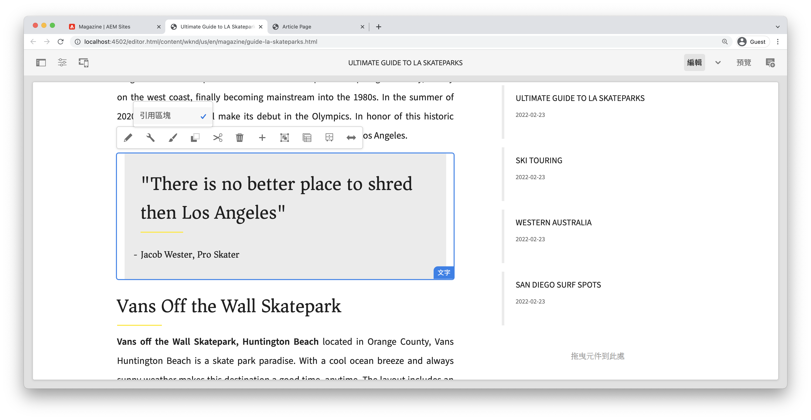

# 使用樣式系統進行開發 {#developing-with-the-style-system}

了解如何使用 Experience Manager 的樣式系統實施個別樣式以及重複使用核心元件。本教學課程會涵蓋樣式系統的開發，以便使用品牌特定的 CSS 和範本編輯器的進階原則設定來擴充核心元件。

## 先決條件 {#prerequisites}

檢閱設定[本機開發環境](overview.md#local-dev-environment)所需的工具與指示。

也建議檢閱[用戶端程式庫和前端工作流程](client-side-libraries.md)教學課程，以了解用戶端程式庫的基礎知識以及 AEM 專案內建的各種前端工具。

### 入門專案

>[!NOTE]
>
> 若已成功完成上一章，您可以重複使用該專案並略過摸索入門專案的步驟。

查看作為本教學課程基礎內容的基準程式碼：

1. 查看來自 [GitHub](https://github.com/adobe/aem-guides-wknd) 的 `tutorial/style-system-start` 分支

   ```shell
   $ cd aem-guides-wknd
   $ git checkout tutorial/style-system-start
   ```

1. 使用您的 Maven 技能將程式碼基底部署到本機 AEM 實例：

   ```shell
   $ mvn clean install -PautoInstallSinglePackage
   ```

   >[!NOTE]
   >
   > 若是使用 AEM 6.5 或 6.4，請將 `classic` 設定檔附加到任何 Maven 命令。

   ```shell
   $ mvn clean install -PautoInstallSinglePackage -Pclassic
   ```

您隨時可以在 [GitHub](https://github.com/adobe/aem-guides-wknd/tree/tutorial/style-system-solution) 上檢視完成的程式碼，或透過切換到分支 `tutorial/style-system-solution` 在本機查看程式碼。

## 目標

1. 了解如何使用樣式系統將品牌特定的 CSS 套用至 AEM 核心元件。
1. 了解 BEM 命名規範以及如何使用此規範來詳細限定樣式範圍。
1. 使用可編輯範本套用進階原則設定。

## 您將要建置的內容 {#what-build}

本章使用[樣式系統功能](https://experienceleague.adobe.com/docs/experience-manager-learn/sites/page-authoring/style-system-feature-video-use.html)來建立文章頁面上使用的&#x200B;**標題**&#x200B;和&#x200B;**文字**&#x200B;元件的變化版本。


*標題元件可使用的底線樣式*

## 背景 {#background}

開發人員和範本編輯者可使用[樣式系統](https://experienceleague.adobe.com/docs/experience-manager-65/authoring/siteandpage/style-system.html)建立元件的多個視覺變化版本。然後作者可以在編寫頁面時決定要使用哪個樣式。本教學課程的其餘部分使用樣式系統來實現幾種獨特的樣式，並用低程式碼方式使用核心元件。

樣式系統的通用概念是，作者可以針對元件的外觀選擇多種不同的樣式。「樣式」由其 CSS 類別提供支援，而這些類別會注入到元件的外層 div 中。在用戶端程式庫中，根據這些樣式類別新增 CSS 規則，以便元件變更外觀。

[樣式系統的詳細文件請參閱這裡](https://experienceleague.adobe.com/docs/experience-manager-cloud-service/content/sites/authoring/features/style-system.html)。我們也有一段很好的[技術影片協助您了解樣式系統](https://experienceleague.adobe.com/docs/experience-manager-learn/sites/developing/style-system-technical-video-understand.html)。

## 底線樣式 - 標題 {#underline-style}

[標題元件](https://experienceleague.adobe.com/docs/experience-manager-core-components/using/wcm-components/title.html)已經使用 Proxy 帶入專案中，放在 `/apps/wknd/components/title` 之下並作為 **ui.apps** 模組的一部分。在 **ui.frontend** 模組中已經實施標題元素的預設樣式 (`H1`、`H2`、`H3`)。

[WKND 文章設計](assets/pages-templates/wknd-article-design.xd)包含帶有底線的標題元件獨特樣式。「樣式系統」可讓作者選擇新增底線樣式，而不是建立兩個元件或修改元件對話框。


### 新增標題原則

我們為標題元件新增原則，以便允許內容作者選擇底線樣式並套用至特定元件。在 AEM 中使用範本編輯器即可做到。

1. 導覽至&#x200B;**文章頁面**&#x200B;範本，路徑是：[http://localhost:4502/editor.html/conf/wknd/settings/wcm/templates/article-page/structure.html](http://localhost:4502/editor.html/conf/wknd/settings/wcm/templates/article-page/structure.html)

1. 在「**結構**」模式中，在主要「**版面容器**」中，選取「*允許的元件*」之下列出的&#x200B;**標題**&#x200B;元件旁邊的「**原則**」圖示：

   

1. 使用以下值建立標題元件的原則：

   *原則標題&#42;*：**WKND 標題**

   「*屬性* > *樣式標籤* > *新增樣式*」

   **底線**：`cmp-title--underline`

   

   按一下「**完成**」來儲存標題原則的變更。

   >[!NOTE]
   >
   > 數值 `cmp-title--underline` 會填入元件的 HTML 標記之外層 div 的 CSS 類別。

### 套用底線樣式

作為作者，我們來將底線樣式套用到某些標題元件。

1. 導覽至 AEM Sites 編輯器中的「**洛杉磯滑板場**」文章，路徑是：[http://localhost:4502/editor.html/content/wknd/us/en/magazine/guide-la-skateparks.html](http://localhost:4502/editor.html/content/wknd/us/en/magazine/guide-la-skateparks.html)
1. 在「**編輯**」模式中，選擇一個標題元件。按一下&#x200B;**筆刷**&#x200B;圖示並選取&#x200B;**底線**&#x200B;樣式：

   

   >[!NOTE]
   >
   > 在這個時候，沒有發生可見的變更，因為尚未實施 `underline` 樣式。在下一個練習中便會實施此樣式。

1. 按一下「**頁面資訊**」圖示 >「**以發佈頁面形式檢視**」，在 AEM 編輯器以外的地方檢查頁面。
1. 使用瀏覽器開發者工具來驗證標題元件周圍的標記是否已將 CSS 類別 `cmp-title--underline` 套用至外層 div。

   

   ```html
   <div class="title cmp-title--underline">
       <div data-cmp-data-layer="{&quot;title-b6450e9cab&quot;:{&quot;@type&quot;:&quot;wknd/components/title&quot;,&quot;repo:modifyDate&quot;:&quot;2022-02-23T17:34:42Z&quot;,&quot;dc:title&quot;:&quot;Vans Off the Wall Skatepark&quot;}}" 
       id="title-b6450e9cab" class="cmp-title">
           <h2 class="cmp-title__text">Vans Off the Wall Skatepark</h2>
       </div>
   </div>
   ```

### 實施底線樣式 - ui.frontend

接下來，使用 AEM 專案的 **ui.frontend** 模組來實施底線樣式。我們會使用 **ui.frontend** 模組內建的 webpack 開發伺服器，在樣式部署至 AEM 本機實例&#x200B;*之前*&#x200B;進行預覽。

1. 從 **ui.frontend** 模組內部啟動 `watch` 程序：

   ```shell
   $ cd ~/code/aem-guides-wknd/ui.frontend/
   $ npm run watch
   ```

   這樣做會啟動一個程序，負責監視 `ui.frontend` 模組中的變更並將變更同步至 AEM 實例。


1. 返回您的 IDE 並從以下路徑開啟檔案 `_title.scss`：`ui.frontend/src/main/webpack/components/_title.scss`。
1. 引進針對 `cmp-title--underline` 類別的新規則：

   ```scss
   /* Default Title Styles */
   .cmp-title {}
   .cmp-title__text {}
   .cmp-title__link {}
   
   /* Add Title Underline Style */
   .cmp-title--underline {
       .cmp-title__text {
           &:after {
           display: block;
               width: 84px;
               padding-top: 8px;
               content: '';
               border-bottom: 2px solid $brand-primary;
           }
       }
   }
   ```

   >[!NOTE]
   >
   >將樣式的適用範圍嚴格限定在目標元件上是最佳做法。這樣可確保額外的樣式不會影響頁面的其他區域。
   >
   >所有核心元件均遵守 **[BEM 命名規範](https://github.com/adobe/aem-core-wcm-components/wiki/css-coding-conventions)**。建立元件的預設樣式時，最佳做法是以外層 CSS 類別為目標。另一種最佳做法是以核心元件 BEM 命名規範所指定的類別名稱為目標，而不是 HTML 元素。

1. 返回瀏覽器和 AEM 頁面。您應該會看到底線樣式已新增：

   

1. 現在，您應該能夠在 AEM 編輯器中切換開啟和關閉&#x200B;**底線**&#x200B;樣式，並看到該變更以視覺方式反映出來。

## 引述區塊樣式 - 文字 {#text-component}

接下來，重複類似的步驟將獨特的樣式套用至[文字元件](https://experienceleague.adobe.com/docs/experience-manager-core-components/using/wcm-components/text.html)。文字元件已經用 Proxy 帶入專案中，放在 `/apps/wknd/components/text` 之下並做為 **ui.apps** 模組的一部分。段落元素的預設樣式已在 **ui.frontend** 中實施。

[WKND 文章設計](assets/pages-templates/wknd-article-design.xd)包含帶有引述區塊的文字元件獨特樣式：


### 新增文字原則

接下來新增文字元件的原則。

1. 導覽至&#x200B;**文章頁面範本**，路徑是：[http://localhost:4502/editor.html/conf/wknd/settings/wcm/templates/article-page/structure.html](http://localhost:4502/editor.html/conf/wknd/settings/wcm/templates/article-page/structure.html)

1. 在「**結構**」模式中，在主要「**版面容器**」中，選取「*允許的元件*」之下列出的&#x200B;**文字**&#x200B;元件旁邊的「**原則**」圖示：

   

1. 使用以下值更新文字元件原則：

   「*原則標題&#42;*」：「**內容文字**」

   「*外掛程式* > *段落樣式* > *啟用段落樣式*」

   「*樣式標籤* > *新增樣式*」

   「**引述區塊**」：「`cmp-text--quote`」

   

   

   按一下「**完成**」來儲存文字原則的變更。

### 套用引述區塊樣式

1. 導覽至 AEM Sites 編輯器中的「**洛杉磯滑板場**」文章，路徑是：[http://localhost:4502/editor.html/content/wknd/us/en/magazine/guide-la-skateparks.html](http://localhost:4502/editor.html/content/wknd/us/en/magazine/guide-la-skateparks.html)
1. 在「**編輯**」模式中，選擇一個文字元件。編輯元件以包含引述元素：

   

1. 選擇文字元件，並按一下&#x200B;**筆刷**&#x200B;圖示，再選取「**引述區塊**」樣式：

   

1. 使用瀏覽器的開發者工具檢查標記。您應該會看到類別名稱 `cmp-text--quote` 已新增至元件的外層 div：

   ```html
   <!-- Quote Block style class added -->
   <div class="text cmp-text--quote">
       <div data-cmp-data-layer="{&quot;text-60910f4b8d&quot;:{&quot;@type&quot;:&quot;wknd/components/text&quot;,&quot;repo:modifyDate&quot;:&quot;2022-02-24T00:55:26Z&quot;,&quot;xdm:text&quot;:&quot;<blockquote>&amp;nbsp; &amp;nbsp; &amp;nbsp;&amp;quot;There is no better place to shred then Los Angeles&amp;quot;</blockquote>\r\n<p>- Jacob Wester, Pro Skater</p>\r\n&quot;}}" id="text-60910f4b8d" class="cmp-text">
           <blockquote>&nbsp; &nbsp; &nbsp;"There is no better place to shred then Los Angeles"</blockquote>
           <p>- Jacob Wester, Pro Skater</p>
       </div>
   </div>
   ```

### 實施引述區塊樣式 - ui.frontend

接下來讓我們使用 AEM 專案的 **ui.frontend** 模組實施引述區塊樣式。

1. 若尚未執行，請從 `watch` ui.frontend **模組內部啟動** 程序：

   ```shell
   $ npm run watch
   ```

1. 更新以下路徑的檔案 `text.scss`：`ui.frontend/src/main/webpack/components/_text.scss`：

   ```css
   /* Default text style */
   .cmp-text {}
   .cmp-text__paragraph {}
   
   /* WKND Text Quote style */
   .cmp-text--quote {
       .cmp-text {
           background-color: $brand-third;
           margin: 1em 0em;
           padding: 1em;
   
           blockquote {
               border: none;
               font-size: $font-size-large;
               font-family: $font-family-serif;
               padding: 14px 14px;
               margin: 0;
               margin-bottom: 0.5em;
   
               &:after {
                   border-bottom: 2px solid $brand-primary; /*yellow border */
                   content: '';
                   display: block;
                   position: relative;
                   top: 0.25em;
                   width: 80px;
               }
           }
           p {
               font-family:  $font-family-serif;
           }
       }
   }
   ```

   >[!CAUTION]
   >
   > 在這種情況下，樣式的目標就是原始 HTML 元素。這是因為文字元件為內容作者提供 RTF 編輯器。直接針對 RTE 內容建立樣式應謹慎小心，嚴格限定樣式的適用範圍更加重要。

1. 再次返回瀏覽器，您應該看到已新增引述區塊樣式：

   

1. 停止 webpack 開發伺服器。

## 固定寬度 - 容器 (額外內容) {#layout-container}

容器元件已用於建立文章頁面範本的基本結構，並為內容作者提供在頁面上新增內容的放置區。容器也可以使用樣式系統，為內容作者提供更多設計版面的選項。

文章頁面範本的&#x200B;**主容器**&#x200B;包含兩個寬度固定的可製作容器。


*文章頁面範本中的主容器*。

**主容器**&#x200B;的原則將預設元素設為「`main`」：


讓&#x200B;**主容器**&#x200B;固定的 CSS 是在位於 `ui.frontend/src/main/webpack/site/styles/container_main.scss` 的 **ui.frontend** 模組中進行設定：

```SCSS
main.container {
    padding: .5em 1em;
    max-width: $max-content-width;
    float: unset!important;
    margin: 0 auto!important;
    clear: both!important;
}
```

與其以 `main` HTML 元素為目標，可以使用樣式系統來建立&#x200B;**固定寬度**&#x200B;樣式，作為容器原則的一部分。使用樣式系統的使用者可以選擇切換&#x200B;**固定寬度**&#x200B;和&#x200B;**流動寬度**&#x200B;的容器。

1. **額外挑戰** - 利用前面練習中所獲得之經驗，並使用樣式系統為容器組件實施&#x200B;**固定寬度**&#x200B;和&#x200B;**流動寬度**&#x200B;樣式。

## 恭喜！ {#congratulations}

恭喜，文章頁面的樣式將近完成，而您獲得使用 AEM 樣式系統的實作經驗。

### 後續步驟 {#next-steps}

了解建立可顯示在對話框中製作之內容的[自訂 AEM 元件](custom-component.md)的端到端步驟，並探索如何開發 Sling 模型以便將填入元件 HTL 的商業邏輯封裝起來。

在 [GitHub](https://github.com/adobe/aem-guides-wknd) 上檢視已完成的程式碼，或在 Git 分支 `tutorial/style-system-solution` 上本機檢閱與部署程式碼。

1. 原地複製 [github.com/adobe/aem-wknd-guides](https://github.com/adobe/aem-guides-wknd) 存放庫。
1. 查看 `tutorial/style-system-solution` 分支。
