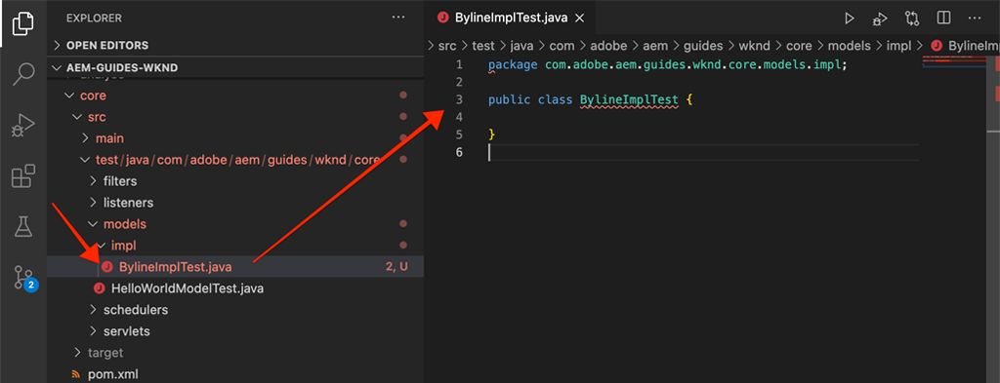

# 單元測試 {#unit-testing}

本教學課程涵蓋單元測試的實施情形，此測試會驗證在[自訂元件](./custom-component.md)教學課程中建立的署名元件的 Sling 模型行為。

## 先決條件 {#prerequisites}

檢閱設定[本機開發環境](overview.md#local-dev-environment)所需的工具與指示。

_如果系統上同時安裝 Java™ 8 和 Java™ 11，VS Code 測試執行程式在執行測試時可能會選擇較低版本的 Java™ 執行階段，而導致測試失敗。如果發生這種情況，請將 Java™ 8 解除安裝。_

### 入門專案

>[!NOTE]
>
> 若已成功完成上一章，您可以重複使用該專案並略過摸索入門專案的步驟。

查看作為本教學課程基礎內容的基準程式碼：

1. 查看來自 [GitHub](https://github.com/adobe/aem-guides-wknd) 的 `tutorial/unit-testing-start` 分支

   ```shell
   $ cd aem-guides-wknd
   $ git checkout tutorial/unit-testing-start
   ```

1. 使用您的 Maven 技能將程式碼基底部署到本機 AEM 實例：

   ```shell
   $ mvn clean install -PautoInstallSinglePackage
   ```

   >[!NOTE]
   >
   > 若是使用 AEM 6.5 或 6.4，請將 `classic` 設定檔附加到任何 Maven 命令。

   ```shell
   $ mvn clean install -PautoInstallSinglePackage -Pclassic
   ```

您隨時可以在 [GitHub](https://github.com/adobe/aem-guides-wknd/tree/tutorial/unit-testing-start) 上檢視完成的程式碼，或透過切換到分支 `tutorial/unit-testing-start` 在本機查看程式碼。

## 目標

1. 了解單元測試的基礎知識。
1. 了解 AEM 程式碼測試中經常使用的框架和工具。
1. 了解編寫單元測試時模擬或模仿 AEM 資源的選項。

## 背景 {#unit-testing-background}

在本教學課程中，我們將探索如何為署名元件的 [Sling 模型](https://sling.apache.org/documentation/bundles/models.html) (在「[建立自訂 AEM 元件](custom-component.md)」中建立) 編寫[單元測試](https://zh.wikipedia.org/wiki/Unit_testing)。單元測試是用 Java™ 編寫的建置時間測試，用來驗證 Java™ 程式碼的預期行為。每個單元測試通常都很小，並根據預期結果驗證方法 (或工作單元) 的輸出。

我們使用 AEM 最佳做法，並採用：

* [JUnit 5](https://junit.org/junit5/)
* [Mockito Testing Framework](https://site.mockito.org/)
* [wcm.io Test Framework](https://wcm.io/testing/) (以 [Apache Sling Mocks](https://sling.apache.org/documentation/development/sling-mock.html) 為建置基礎)

## 單元測試和 Adobe Cloud Manager {#unit-testing-and-adobe-cloud-manager}

[Adobe Cloud Manager](https://experienceleague.adobe.com/docs/experience-manager-cloud-manager/content/introduction.html) 將執行單元測試和[程式碼覆蓋率報告](https://experienceleague.adobe.com/docs/experience-manager-cloud-manager/content/using/code-quality-testing.html)整合到其 CI/CD 管道中，鼓勵和推廣 AEM 程式碼單元測試的最佳做法。

雖然任何程式碼基底來說，單元測試程式碼都是很好的做法，但在使用 Cloud Manager 時，一定要讓 Cloud Manager 執行單元測試，以便利用其程式碼品質測試和報告功能。

## 更新測試 Maven 相依性 {#inspect-the-test-maven-dependencies}

第一步是檢查 Maven 相依性以支援編寫和執行測試。需要四種相依性：

1. JUnit5
1. Mockito Test Framework
1. Apache Sling Mocks
1. AEM Mocks Test Framework (由 io.wcm 提供)

**JUnit5**、**Mockito 和 **AEM Mocks** 測試相依性會在設定期間使用 [AEM Maven 原型](project-setup.md) 自動新增到專案中。

1. 若要檢視這些相依性，請開啟在 **aem-guides-wknd/pom.xml** 之下的 Parent Reactor POM，導覽至 `<dependencies>..</dependencies>` 並在 `<!-- Testing -->` 之下檢視 JUnit、Mockito、Apache Sling Mocks 和 io.wcm 提供的 AEM Mock Tests 的相依性。
1. 確保 `io.wcm.testing.aem-mock.junit5` 設定為 **4.1.0**：

   ```xml
   <dependency>
       <groupId>io.wcm</groupId>
       <artifactId>io.wcm.testing.aem-mock.junit5</artifactId>
       <version>4.1.0</version>
       <scope>test</scope>
   </dependency>
   ```

   >[!CAUTION]
   >
   > 原型 **35** 使用 `io.wcm.testing.aem-mock.junit5` 版本 **4.1.8** 來產生專案。請降級至 **4.1.0**，才能依照本章其餘部分操作。

1. 開啟 **aem-guides-wknd/core/pom.xml** 並檢視對應的測試相依性是可用狀態。

   **核心**&#x200B;專案中的平行原始碼資料夾將包含單元測試和任何支援的測試檔案。此&#x200B;**測試**&#x200B;資料夾將測試類別與原始碼分開，但允許測試操作時如同與原始碼位於同一個封裝中。

## 建立 JUnit 測試 {#creating-the-junit-test}

單元測試通常與 Java™ 類別一對一對應。在本章中，我們將為 **BylineImpl.java** (即支援署名元件的 Sling 模型) 編寫 JUnit 測試。


*儲存單元測試的位置。*

1. 建立 `BylineImpl.java` 的單元測試，方法是在 `src/test/java` 之下建立新的 Java™ 類別，而其 Java™ 封裝資料夾結構會鏡像要測試的 Java™ 類別的位置。

   

   由於我們正在測試

   * `src/main/java/com/adobe/aem/guides/wknd/core/models/impl/BylineImpl.java`

   在以下路徑建立對應的單元測試 Java™ 類別

   * `src/test/java/com/adobe/aem/guides/wknd/core/models/impl/BylineImplTest.java`

   單元測試檔案 `BylineImplTest.java` 使用後置詞 `Test` 是一種命名慣例，讓我們可以

   1. 輕鬆認出這是 `BylineImpl.java` _的_&#x200B;測試檔案
   1. 同時可以讓測試檔案與所要測試的類別 `BylineImpl.java` _有所區別_

## 檢閱 BylineImplTest.java {#reviewing-bylineimpltest-java}

在這個時候，JUnit 測試檔案是一個空的 Java™ 類別。

1. 使用以下程式碼更新檔案：

   ```java
   package com.adobe.aem.guides.wknd.core.models.impl;
   
   import static org.junit.jupiter.api.Assertions.*;
   
   import org.junit.jupiter.api.BeforeEach;
   import org.junit.jupiter.api.Test;
   
   public class BylineImplTest {
   
       @BeforeEach
       void setUp() throws Exception {
   
       }
   
       @Test 
       void testGetName() { 
           fail("Not yet implemented");
       }
   
       @Test 
       void testGetOccupations() { 
           fail("Not yet implemented");
       }
   
       @Test 
       void testIsEmpty() { 
           fail("Not yet implemented");
       }
   }
   ```

1. 第一個方法 `public void setUp() { .. }` 使用 JUnit 的 `@BeforeEach` 加上註解，指示 JUnit 測試執行程式在執行這個類別的每個測試方法之前，先執行此方法。在這裡可以初始化所有測試所需的通用測試狀態，非常方便。

1. 後續方法是測試方法，其名稱依命名慣例使用 `test` 為前置詞，並以 `@Test` 加上註解。請注意，因為我們還沒有實施這些測試，所以在預設情況下，所有的測試都會失敗。

   首先，我們從我們正在測試的類別中的每個公共方法的單一測試方法開始，因此：

   | BylineImpl.java |              | BylineImplTest.java |
   | ------------------|--------------|---------------------|
   | getName() | 的測試方法是 | testGetName() |
   | getOccupations() | 的測試方法是 | testGetOccupations() |
   | isEmpty() | 的測試方法是 | testIsEmpty() |

   這些方法可以根據需要進行擴展，在本章後面將有說明。

   當執行這個 JUnit 測試類別 (也稱為 JUnit 測試案例) 時，標有 `@Test` 的每個方法都視為測試來執行，而該測試可能會通過或失敗。


*`core/src/test/java/com/adobe/aem/guides/wknd/core/models/impl/BylineImplTest.java`*

1. 用右鍵按一下 `BylineImplTest.java` 檔案，然後點選「**執行**」來執行 JUnit 測試案例。
正如預期那樣，因為測試尚未實施，所以全部都失敗了。

   

   *用右鍵按一下「BylineImplTests.java > 執行」*

## 檢閱 BylineImpl.java {#reviewing-bylineimpl-java}

編寫單元測試主要有兩種方法：

* [TDD 或測試驅動開發](https://zh.wikipedia.org/wiki/Test-driven_development)，包括以循序漸進的方式編寫單元測試，而且在開發實施之前立即進行；方法是編寫一個測試，再編寫一個能夠通過測試的實施。
* 實施優先的開發，包括先開發工作程式碼，然後編寫驗證該程式碼的測試。

本教學課程採用後一種方法 (因為我們已經在上一章建立一個可運作的 **BylineImpl.java**)。因此，我們必須回顧並理解其公共方法的行為，以及其中一些實施細節。這個做法聽起來很矛盾，因為好的測試應該只關心輸入和輸出，但是在使用 AEM 時，我們必須了解各種不同的實施考量，才能建構可運作的測試。

在 AEM 環境中進行 TDD 需要一定程度的專業知識，由精通 AEM 開發和 AEM 程式碼單元測試的 AEM 開發人員採用效果最佳。

## 設定 AEM 測試環境  {#setting-up-aem-test-context}

大部分為 AEM 編寫的程式碼都依賴 JCR、Sling 或 AEM 的 API，而這些 API 又需要執行中的 AEM 才能正確執行。

因為單元測試是在建置時執行，不在運作中的 AEM 實例環境之內，所以沒有這樣的環境。為了實現這一點，[wcm.io 的 AEM Mocks](https://wcm.io/testing/aem-mock/usage.html) 建立模擬環境，使這些 API _在大部分情況下_&#x200B;當作在 AEM 中執行一樣。

1. 在 **BylineImplTest.java** 中使用 **wcm.io** 的 `AemContext` 建立 AEM 環境，將這個環境當作使用 `@ExtendWith` 修飾的 JUnit 擴充功能新增到 **BylineImplTest.java** 檔案。此擴充功能會處理所有必要的初始化和清理任務。建立一個適用於 `AemContext` 而且可供所有測試方法使用的類別變數。

   ```java
   import org.junit.jupiter.api.extension.ExtendWith;
   import io.wcm.testing.mock.aem.junit5.AemContext;
   import io.wcm.testing.mock.aem.junit5.AemContextExtension;
   ...
   
   @ExtendWith(AemContextExtension.class)
   class BylineImplTest {
   
       private final AemContext ctx = new AemContext();
   ```

   這個變數 `ctx` 提供一個模擬的 AEM 環境，且其中包含一些 AEM 和 Sling 抽象概念：

   * 已經在這個環境中註冊 BylineImpl Sling 模型
   * 已經在這個環境中建立模擬 JCR 內容結構
   * 可以在這個環境中註冊自訂 OSGi 服務
   * 提供各種常見的必要模擬物件和輔助程式，例如 SlingHttpServletRequest 物件、各種模擬 Sling 和 AEM OSGi 服務 (例如 ModelFactory、PageManager、Page、Template、ComponentManager、Component、TagManager、Tag 等)。
      * *並不是這些物件的所有方法都會實施！*
   * 以及[其他更多](https://wcm.io/testing/aem-mock/usage.html)！

   **`ctx`** 物件將用作我們大部分模擬環境的進入點。

1. `setUp(..)` 方法會在每個 `@Test` 方法之前執行，請使用這個方法定義通用的模擬測試狀態：

   ```java
   @BeforeEach
   public void setUp() throws Exception {
       ctx.addModelsForClasses(BylineImpl.class);
       ctx.load().json("/com/adobe/aem/guides/wknd/core/models/impl/BylineImplTest.json", "/content");
   }
   ```

   * **`addModelsForClasses`**&#x200B;把要測試的 Sling 模型註冊到模擬 AEM 環境中，以便在 `@Test` 方法中實例化。
   * **`load().json`** 將資源結構載入到模擬環境中，讓程式碼能夠與這些資源互動，就好像這些資源是由實際存放庫提供的一樣。檔案 **`BylineImplTest.json`** 中的資源定義載入模擬 JCR 環境中並放在 **/content** 之下。
   * **`BylineImplTest.json`** 尚不存在，所以我們建立此檔案並定義測試所需的 JCR 資源結構。

1. 表示模擬資源結構的 JSON 檔案儲存在 **core/src/test/resources** 之下，使用的封裝路徑與 JUnit Java™ 測試檔案相同。

   在 `core/test/resources/com/adobe/aem/guides/wknd/core/models/impl` 建立命為 **BylineImplTest.json** 的 JSON 檔案，並包含下列內容：

   ```json
   {
       "byline": {
       "jcr:primaryType": "nt:unstructured",
       "sling:resourceType": "wknd/components/content/byline"
       }
   }
   ```

   

   此 JSON 定義署名元件單元測試的模擬資源 (JCR 節點)。在這個時候，JSON 具有表示署名元件內容資源所需的最少量屬性，`jcr:primaryType` 和 `sling:resourceType`。

   使用單元測試時的一般規則是，建立滿足每個測試所需的最少量模擬內容、環境和程式碼。避免在編寫測試之前便建置完整的模擬環境，因為這通常會製造非必要的成品。

   現在已有 **BylineImplTest.json**，當執行 `ctx.json("/com/adobe/aem/guides/wknd/core/models/impl/BylineImplTest.json", "/content")` 時，模擬資源定義會載入環境中並放在路徑 **/content** 之下。

## 測試 getName() {#testing-get-name}

現在我們已經設定基本的模擬環境，可以為 **BylineImpl 的 getName()** 編寫第一個測試。此測試必須確保方法 **getName()** 傳回儲存在資源的「**名稱**」屬性中正確製作的名稱。

1. 更新 **BylineImplTest.java** 中的 **testGetName**() 方法，如下所示：

   ```java
   import com.adobe.aem.guides.wknd.core.models.Byline;
   ...
   @Test
   public void testGetName() {
       final String expected = "Jane Doe";
   
       ctx.currentResource("/content/byline");
       Byline byline = ctx.request().adaptTo(Byline.class);
   
       String actual = byline.getName();
   
       assertEquals(expected, actual);
   }
   ```

   * **`String expected`** 設定預期值。我們將預期值設定為「**Jane Done**」。
   * **`ctx.currentResource`** 設定模擬資源的環境以便評估程式碼，因此會設定為 **/content/byline**，因為那是模擬署名內容資源載入的地方。
   * **`Byline byline`** 透過改寫模擬請求物件，將署名 Sling 模型實例化。
   * **`String actual`** 叫用我們在署名 Sling 模型物件上正在測試的方法 `getName()`。
   * **`assertEquals`** 斷言預期值與署名 Sling 模型物件傳回的值相符。若這些值不相等，測試將會失敗。

1. 執行測試...但失敗了並顯示 `NullPointerException`。

   此測試沒有失敗，因為我們從來沒有在模擬 JSON 中定義會導致測試失敗的 `name` 屬性，但是測試執行尚未到達那一步！此測試失敗，原因是署名物件本身發生 `NullPointerException`。

1. 在 `BylineImpl.java` 中，如果 `@PostConstruct init()` 發生異常，Sling 模型便無法實例化，並導致 Sling 模型物件變成 null。

   ```java
   @PostConstruct
   private void init() {
       image = modelFactory.getModelFromWrappedRequest(request, request.getResource(), Image.class);
   }
   ```

   結果發現，雖然 ModelFactory OSGi 服務是透過 `AemContext` (經由 Apache Sling Context) 提供的，但並未實施所有方法，包括在 BylineImpl 的 `getModelFromWrappedRequest(...)` 方法中呼叫的 `init()`。這會導致 [AbstractMethodError](https://docs.oracle.com/en/java/javase/11/docs/api/java.base/java/lang/AbstractMethodError.html)，進而導致 `init()` 失敗，而且所改寫的 `ctx.request().adaptTo(Byline.class)` 為 null 物件。

   由於所提供的模擬無法容納我們的程式碼，所以我們必須自行實施模擬環境。為此，我們可以使用 Mockito 來建立模擬 ModelFactory 物件，並在物件叫用 `getModelFromWrappedRequest(...)` 時傳回一個模擬影像物件。

   為了將署名 Sling 模型實例化，這個模擬環境必須設定妥當，我們可以將其新增到 `@Before setUp()` 方法。我們也需要把 `MockitoExtension.class` 新增到位在 **BylineImplTest** 類別上方的 `@ExtendWith` 註解。

   ```java
   package com.adobe.aem.guides.wknd.core.models.impl;
   
   import org.mockito.junit.jupiter.MockitoExtension;
   import org.mockito.Mock;
   
   import com.adobe.aem.guides.wknd.core.models.Byline;
   import com.adobe.cq.wcm.core.components.models.Image;
   
   import io.wcm.testing.mock.aem.junit5.AemContext;
   import io.wcm.testing.mock.aem.junit5.AemContextExtension;
   
   import org.apache.sling.models.factory.ModelFactory;
   import org.junit.jupiter.api.BeforeEach;
   import org.junit.jupiter.api.Test;
   import org.junit.jupiter.api.extension.ExtendWith;
   
   import static org.junit.jupiter.api.Assertions.*;
   import static org.mockito.Mockito.*;
   import org.apache.sling.api.resource.Resource;
   
   @ExtendWith({ AemContextExtension.class, MockitoExtension.class })
   public class BylineImplTest {
   
       private final AemContext ctx = new AemContext();
   
       @Mock
       private Image image;
   
       @Mock
       private ModelFactory modelFactory;
   
       @BeforeEach
       public void setUp() throws Exception {
           ctx.addModelsForClasses(BylineImpl.class);
   
           ctx.load().json("/com/adobe/aem/guides/wknd/core/models/impl/BylineImplTest.json", "/content");
   
           lenient().when(modelFactory.getModelFromWrappedRequest(eq(ctx.request()), any(Resource.class), eq(Image.class)))
                   .thenReturn(image);
   
           ctx.registerService(ModelFactory.class, modelFactory, org.osgi.framework.Constants.SERVICE_RANKING,
                   Integer.MAX_VALUE);
       }
   
       @Test
       void testGetName() { ...
   }
   ```

   * **`@ExtendWith({AemContextExtension.class, MockitoExtension.class})`** 將測試案例類別標記為要搭配 [Mockito JUnit Jupiter Extension](https://www.javadoc.io/static/org.mockito/mockito-junit-jupiter/4.11.0/org/mockito/junit/jupiter/MockitoExtension.html) 一起執行，這樣便可以使用 @Mock 註解，在類別層級定義模擬物件。
   * **`@Mock private Image`** 建立一個類型為 `com.adobe.cq.wcm.core.components.models.Image`的模擬物件。這是在類別層級定義的物件，所以在必要時，`@Test` 方法可以視需要變更其行為。
   * **`@Mock private ModelFactory`** 建立 ModelFactory 類型的模擬物件。這個單純是 Mockito 模擬，並未實施任何方法。這是在類別層級定義的物件，所以在必要時，`@Test` 方法可以視需要變更其行為。
   * **`when(modelFactory.getModelFromWrappedRequest(..)`** 註冊當有人呼叫模擬 ModelFactory 物件的 `getModelFromWrappedRequest(..)` 時之模擬行為。 `thenReturn (..)` 中定義的結果是傳回模擬影像物件。唯有發生以下情況時才會叫用這個行為：第一個參數等於 `ctx`的請求物件，第二個參數是任何資源物件，而第三個參數必須是核心元件影像類別。我們接受任何資源，因為在測試過程中我們將 `ctx.currentResource(...)` 設定為 **BylineImplTest.json** 中定義的各種模擬資源。請注意，我們新增 **lenient()** 嚴謹性，因為稍後將要覆蓋 ModelFactory 的這種行為。
   * **`ctx.registerService(..)`。** 將模擬的 ModelFactory 物件註冊到 AemContext 中，並設定最高服務層級。這是必要的，因為 BylineImpl 的 `init()` 中使用的 ModelFactory 是透過 `@OSGiService ModelFactory model` 欄位注入的。為了讓 AemContext 注入&#x200B;**我們的**&#x200B;模擬物件，而該物件處理對 `getModelFromWrappedRequest(..)` 的呼叫，我們必須將其註冊為該類型 (ModelFactory) 的最高服務層級。

1. 重新執行測試，然後再次失敗，但這次的訊息清楚說明失敗的原因。

   

   *testGetName() 因為斷言而失敗*

   我們收到一個 **AssertionError**，意味著測試中的斷言條件執行失敗，並告訴我們&#x200B;**預期值是「Jane Doe」**，但&#x200B;**實際值為 null**。這是合理的情況，因為還未新增「**name**」屬性來模擬 **BylineImplTest.json** 中的 **/content/byline** 資源定義，所以我們要新增這個屬性：

1. 更新 **BylineImplTest.json** 來定義 `"name": "Jane Doe".`

   ```json
   {
       "byline": {
       "jcr:primaryType": "nt:unstructured",
       "sling:resourceType": "wknd/components/content/byline",
       "name": "Jane Doe"
       }
   }
   ```

1. 重新執行測試，**`testGetName()`** 現在通過了！

   


## 測試 getOccupations() {#testing-get-occupations}

太好了！第一個測試已經通過！讓我們繼續測試 `getOccupations()`。由於模擬環境的初始化是在 `@Before setUp()`方法中完成的，所以可供此測試案例中所有 `@Test` 方法使用，包括 `getOccupations()`。

請記住，此方法必須傳回儲存在職業屬性中、按字母順序排列的職業清單 (降序)。

1. 更新 **`testGetOccupations()`**，如下所示：

   ```java
   import java.util.List;
   import com.google.common.collect.ImmutableList;
   ...
   @Test
   public void testGetOccupations() {
       List<String> expected = new ImmutableList.Builder<String>()
                               .add("Blogger")
                               .add("Photographer")
                               .add("YouTuber")
                               .build();
   
       ctx.currentResource("/content/byline");
       Byline byline = ctx.request().adaptTo(Byline.class);
   
       List<String> actual = byline.getOccupations();
   
       assertEquals(expected, actual);
   }
   ```

   * **`List<String> expected`** 定義預期結果。
   * **`ctx.currentResource`** 設定目前資源來評估環境是否符合 /content/byline 的模擬資源定義。這樣會確保 **BylineImpl.java** 在模擬資源的環境中執行。
   * **`ctx.request().adaptTo(Byline.class)`** 透過改寫模擬請求物件，將署名 Sling 模型實例化。
   * **`byline.getOccupations()`** 叫用我們在署名 Sling 模型物件上正在測試的方法 `getOccupations()`。
   * **`assertEquals(expected, actual)`** 斷言預期清單與實際清單相同。

1. 請記住，如同上面的 **`getName()`** 一樣，**BylineImplTest.json** 並未定義職業，我們如果執行這項測試便會失敗，因為 `byline.getOccupations()` 將傳回空清單。

   更新 **BylineImplTest.json** 以包含職業清單，而且並非按照字母順序排列，以確保我們的測試透過 **`getOccupations()`** 驗證各項職業是否按字母順序排列。

   ```json
   {
       "byline": {
       "jcr:primaryType": "nt:unstructured",
       "sling:resourceType": "wknd/components/content/byline",
       "name": "Jane Doe",
       "occupations": ["Photographer", "Blogger", "YouTuber"]
       }
   }
   ```

1. 執行測試，而且我們再次通過！看起來，取得已排序的職業是可行的！

   

   *testGetOccupations() 通過*

## 測試 isEmpty() {#testing-is-empty}

最後的方法是測試 **`isEmpty()`**。

測試 `isEmpty()` 很有趣，因為必須針對各種條件進行測試。檢閱 **BylineImpl.java**&#x200B;的 `isEmpty()` 方法時，必須測試下列條件：

* 當名稱為空時傳回 true
* 當職業為 null 或空時傳回 true
* 當影像為 null 或沒有 src URL 時傳回 true
* 當名稱、職業和影像 (附有 src URL) 存在時傳回 false

為此，我們必須建立測試方法，每個方法測試一項特定條件，並由 `BylineImplTest.json` 中新的模擬資源結構來驅動這些測試。

這項檢查讓我們在 `getName()`、`getOccupations()` 和 `getImage()` 為空時可以略過測試，因為該狀態的預期行為是透過 `isEmpty()` 測試。

1. 第一個測試將測試未設定任何屬性的全新元件的狀況。

   新增資源定義至 `BylineImplTest.json`，並給予語義名稱「**empty**」

   ```json
   {
       "byline": {
           "jcr:primaryType": "nt:unstructured",
           "sling:resourceType": "wknd/components/content/byline",
           "name": "Jane Doe",
           "occupations": ["Photographer", "Blogger", "YouTuber"]
       },
       "empty": {
           "jcr:primaryType": "nt:unstructured",
           "sling:resourceType": "wknd/components/content/byline"
       }
   }
   ```

   **`"empty": {...}`** 定義一個名為「empty」且只有 `jcr:primaryType` 和 `sling:resourceType` 的新資源定義。

   請記得，在 `@setUp` 中執行各項測試方法之前，我們將 `BylineImplTest.json` 載入 `ctx`，以便位在 **/content/empty** 的測試可以立即使用這項新的資源定義。

1. 更新 `testIsEmpty()`，如下所示，將目前資源設定為新的「**empty**」模擬資源定義。

   ```java
   @Test
   public void testIsEmpty() {
       ctx.currentResource("/content/empty");
       Byline byline = ctx.request().adaptTo(Byline.class);
   
       assertTrue(byline.isEmpty());
   }
   ```

   執行測試並確保其通過。

1. 接下來，建立一組方法來確保如果任何所需的資料點 (名稱、職業或影像) 為空，`isEmpty()` 傳回 true。

   對每項測試都使用獨立的模擬資源定義，使用 **without-name** 和 **without-occupations** 的其他資源定義來更新 **BylineImplTest.json**。

   ```json
   {
       "byline": {
           "jcr:primaryType": "nt:unstructured",
           "sling:resourceType": "wknd/components/content/byline",
           "name": "Jane Doe",
           "occupations": ["Photographer", "Blogger", "YouTuber"]
       },
       "empty": {
           "jcr:primaryType": "nt:unstructured",
           "sling:resourceType": "wknd/components/content/byline"
       },
       "without-name": {
           "jcr:primaryType": "nt:unstructured",
           "sling:resourceType": "wknd/components/content/byline",
           "occupations": "[Photographer, Blogger, YouTuber]"
       },
       "without-occupations": {
           "jcr:primaryType": "nt:unstructured",
           "sling:resourceType": "wknd/components/content/byline",
           "name": "Jane Doe"
       }
   }
   ```

   建立以下測試方法來分別測試這些狀態。

   ```java
   @Test
   public void testIsEmpty() {
       ctx.currentResource("/content/empty");
   
       Byline byline = ctx.request().adaptTo(Byline.class);
   
       assertTrue(byline.isEmpty());
   }
   
   @Test
   public void testIsEmpty_WithoutName() {
       ctx.currentResource("/content/without-name");
   
       Byline byline = ctx.request().adaptTo(Byline.class);
   
       assertTrue(byline.isEmpty());
   }
   
   @Test
   public void testIsEmpty_WithoutOccupations() {
       ctx.currentResource("/content/without-occupations");
   
       Byline byline = ctx.request().adaptTo(Byline.class);
   
       assertTrue(byline.isEmpty());
   }
   
   @Test
   public void testIsEmpty_WithoutImage() {
       ctx.currentResource("/content/byline");
   
       lenient().when(modelFactory.getModelFromWrappedRequest(eq(ctx.request()),
           any(Resource.class),
           eq(Image.class))).thenReturn(null);
   
       Byline byline = ctx.request().adaptTo(Byline.class);
   
       assertTrue(byline.isEmpty());
   }
   
   @Test
   public void testIsEmpty_WithoutImageSrc() {
       ctx.currentResource("/content/byline");
   
       when(image.getSrc()).thenReturn("");
   
       Byline byline = ctx.request().adaptTo(Byline.class);
   
       assertTrue(byline.isEmpty());
   }
   ```

   **`testIsEmpty()`** 針對空的模擬資源定義進行測試，並斷言 `isEmpty()` 為 true。

   **`testIsEmpty_WithoutName()`** 針對具有職業但沒有名稱的模擬資源定義進行測試。

   **`testIsEmpty_WithoutOccupations()`** 針對具有名稱但沒有職業的模擬資源定義進行測試。

   **`testIsEmpty_WithoutImage()`** 針對具有名稱和職業但將模擬影像設定為傳回 null 的模擬資源定義進行測試。請注意，我們要覆寫 `setUp()` 中定義的 `modelFactory.getModelFromWrappedRequest(..)` 行為，以確保此呼叫傳回的影像物件為 null。Mockito stub 功能非常嚴格，且不接受重複的程式碼。因此我們的模擬採用 **`lenient`** 設定，明確指出我們正在覆蓋 `setUp()` 方法中的行為。

   **`testIsEmpty_WithoutImageSrc()`** 針對具有名稱和職業的模擬資源定義進行測試，但設定模擬影像在 `getSrc()` 被叫用時傳回空白字串。

1. 最後，編寫一個測試來確保 **isEmpty()** 在元件設定正確的情況下傳回 false。為了這個條件，我們可以重複使用 **/content/byline**，因為其代表設定完成的署名元件。

   ```java
   @Test
   public void testIsNotEmpty() {
       ctx.currentResource("/content/byline");
       when(image.getSrc()).thenReturn("/content/bio.png");
   
       Byline byline = ctx.request().adaptTo(Byline.class);
   
       assertFalse(byline.isEmpty());
   }
   ```

1. 現在執行 BylineImplTest.java 檔案中所有單元測試，並檢閱 Java™ 測試報告輸出。


## 在建置過程中執行單元測試 {#running-unit-tests-as-part-of-the-build}

在 Maven 建置過程中，要執行單元測試且必須通過。這樣可以確保在部署應用程式之前，所有測試都成功通過。執行 Maven 目標 (例如封裝或安裝) 會自動叫用並要求通過專案中所有單元測試。

```shell
$ mvn package
```


```shell
$ mvn package
```

同樣地，如果我們將測試方法變更為失敗，則建置會失敗並報告哪個測試失敗及其原因。


## 檢閱程式碼 {#review-the-code}

在 [GitHub](https://github.com/adobe/aem-guides-wknd) 上檢視已完成的程式碼，或在 Git 分支 `tutorial/unit-testing-solution` 上本機檢閱與部署程式碼。
