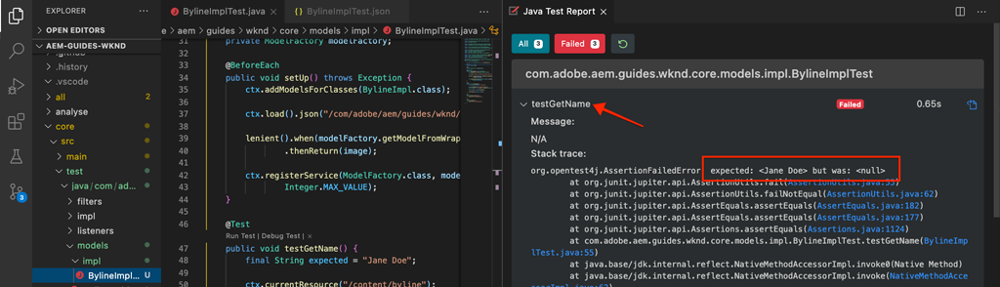

# 單元測試 {#unit-testing}

本教學課程涵蓋單元測試的實作，該測試會驗證[自訂元件](./custom-component.md)教學課程中建立的Byline元件的Sling模型的行為。

## 先決條件 {#prerequisites}

檢閱設定[本機開發環境](overview.md#local-dev-environment)所需的工具和指示。

_如果系統上同時安裝了Java™ 8和Java™ 11，則VS Code測試執行程式會在執行測試時挑選較低的Java™執行階段，導致測試失敗。 如果發生這種狀況，請解除安裝Java™ 8._

### 入門專案

>[!NOTE]
>
> 如果您成功完成上一章，您可以重複使用專案，並略過出庫入門專案的步驟。

檢視教學課程建置的基底程式碼：

1. 從[GitHub](https://github.com/adobe/aem-guides-wknd)檢視`tutorial/unit-testing-start`分支

   ```shell
   $ cd aem-guides-wknd
   $ git checkout tutorial/unit-testing-start
   ```

1. 使用您的Maven技能將程式碼庫部署到本機AEM執行個體：

   ```shell
   $ mvn clean install -PautoInstallSinglePackage
   ```

   >[!NOTE]
   >
   > 如果使用AEM 6.5或6.4，請將`classic`設定檔附加至任何Maven命令。

   ```shell
   $ mvn clean install -PautoInstallSinglePackage -Pclassic
   ```

您一律可以在[GitHub](https://github.com/adobe/aem-guides-wknd/tree/tutorial/unit-testing-start)上檢視完成的程式碼，或切換至分支`tutorial/unit-testing-start`在本機簽出程式碼。

## 目標

1. 瞭解單元測試的基本概念。
1. 瞭解測試AEM程式碼常用的架構和工具。
1. 瞭解在編寫單元測試時模擬或模擬AEM資源的選項。

## 背景 {#unit-testing-background}

在本教學課程中，我們將探索如何為署名元件的[Sling模型](https://sling.apache.org/documentation/bundles/models.html) (在[建立自訂AEM元件](custom-component.md)中建立)寫入[單元測試](https://en.wikipedia.org/wiki/Unit_testing)。 單元測試是以Java™撰寫的建置時間測試，可驗證Java™程式碼的預期行為。 每個單元測試通常都很小，並且會根據預期結果來驗證方法（或工作單位）的輸出。

我們採用AEM最佳實務，並採用：

* [JUnit 5](https://junit.org/junit5/)
* [Mockito測試架構](https://site.mockito.org/)
* [wcm.io Test Framework](https://wcm.io/testing/) （以[Apache Sling Mocks](https://sling.apache.org/documentation/development/sling-mock.html)為基礎）

## 單元測試與Adobe Cloud Manager {#unit-testing-and-adobe-cloud-manager}

[Adobe Cloud Manager](https://experienceleague.adobe.com/docs/experience-manager-cloud-manager/content/introduction.html)在其CI/CD管道中整合了單元測試執行和[程式碼涵蓋範圍報告](https://experienceleague.adobe.com/docs/experience-manager-cloud-manager/content/using/code-quality-testing.html)，以協助鼓勵並推廣單元測試AEM程式碼的最佳作法。

雖然單元測試程式碼是任何程式碼庫的良好做法，但在使用Cloud Manager時，請務必提供單元測試供Cloud Manager執行，以便利用其程式碼品質測試和報告功能。

## 更新測試Maven依賴項 {#inspect-the-test-maven-dependencies}

第一步是檢查Maven依賴項以支援寫入和執行測試。 需要四個相依性：

1. JUnit5
1. Mockito測試架構
1. Apache Sling Mocks
1. AEM Mocks Test Framework （由io.wcm）

使用[AEM Maven原型](project-setup.md)安裝期間，**JUnit5**、**Mockito和&#x200B;**&#x200B;AEM Mocks**&#x200B;測試相依性會自動新增到專案。

1. 若要檢視這些相依性，請開啟位於&#x200B;**aem-guides-wknd/pom.xml**&#x200B;的Parent Reactor POM，瀏覽至`<dependencies>..</dependencies>`並檢視`<!-- Testing -->`下io.wcm的JUnit、Mockito、Apache Sling Mocks和AEM Mock Tests相依性。
1. 請確定`io.wcm.testing.aem-mock.junit5`已設為&#x200B;**4.1.0**：

   ```xml
   <dependency>
       <groupId>io.wcm</groupId>
       <artifactId>io.wcm.testing.aem-mock.junit5</artifactId>
       <version>4.1.0</version>
       <scope>test</scope>
   </dependency>
   ```

   >[!CAUTION]
   >
   > 原型&#x200B;**35**&#x200B;產生`io.wcm.testing.aem-mock.junit5`版本&#x200B;**4.1.8**&#x200B;的專案。 請降級為&#x200B;**4.1.0**&#x200B;以遵循本章其餘部分。

1. 開啟&#x200B;**aem-guides-wknd/core/pom.xml**&#x200B;並檢視對應的測試相依性是否可用。

   **核心**&#x200B;專案中的平行來源資料夾將包含單元測試和任何支援的測試檔案。 此&#x200B;**test**&#x200B;資料夾提供測試類別與原始程式碼的分離，但允許測試就像它們存在於與原始程式碼相同的套件中一樣。

## 建立JUnit測試 {#creating-the-junit-test}

單元測試通常使用Java™類別對應1對1。 在本章中，我們將為&#x200B;**BylineImpl.java**&#x200B;撰寫JUnit測試，這是支援Byline元件的Sling模型。


*儲存單元測試的位置。*

1. 在Java™封裝資料夾結構中的`src/test/java`下建立新的Java™類別，以反映`BylineImpl.java`要測試的Java™類別的位置，藉此建立的單元測試。

   

   由於我們正在測試

   * `src/main/java/com/adobe/aem/guides/wknd/core/models/impl/BylineImpl.java`

   在下列位置建立對應的單元測試Java™類別

   * `src/test/java/com/adobe/aem/guides/wknd/core/models/impl/BylineImplTest.java`

   單位測試檔案`BylineImplTest.java`上的`Test`尾碼是慣例，允許我們

   1. 輕鬆識別為&#x200B;_`BylineImpl.java`的測試檔案_
   1. 但是，也要區分測試檔案&#x200B;_與_&#x200B;所測試的類別，`BylineImpl.java`

## 檢閱BylineImplTest.java {#reviewing-bylineimpltest-java}

此時，JUnit測試檔案是空的Java™類別。

1. 使用以下程式碼更新檔案：

   ```java
   package com.adobe.aem.guides.wknd.core.models.impl;
   
   import static org.junit.jupiter.api.Assertions.*;
   
   import org.junit.jupiter.api.BeforeEach;
   import org.junit.jupiter.api.Test;
   
   public class BylineImplTest {
   
       @BeforeEach
       void setUp() throws Exception {
   
       }
   
       @Test 
       void testGetName() { 
           fail("Not yet implemented");
       }
   
       @Test 
       void testGetOccupations() { 
           fail("Not yet implemented");
       }
   
       @Test 
       void testIsEmpty() { 
           fail("Not yet implemented");
       }
   }
   ```

1. 第一個方法`public void setUp() { .. }`是以JUnit的`@BeforeEach`加上註解，它會指示JUnit測試執行程式先執行此方法，然後再執行此類別中的每個測試方法。 這為初始化所有測試所需的通用測試狀態提供了一個方便的位置。

1. 後續方法是測試方法，其名稱依照慣例以`test`為前置詞，並以`@Test`註解標籤。 請注意，根據預設，我們所有的測試都會設為失敗，因為我們尚未實作這些測試。

   首先，我們先對我們測試的類別上的每個公用方法使用單一測試方法，因此：

   | BylineImpl.java |              | BylineImplTest.java |
   | ------------------|--------------|---------------------|
   | getName() | 測試者 | testGetName() |
   | getOccupations() | 測試者 | testGetOccupations() |
   | isEmpty() | 測試者 | testIsEmpty() |

   您可以視需要展開這些方法，我們將在本章的稍後章節中看到。

   執行此JUnit測試類別（也稱為JUnit測試案例）時，每個標示`@Test`的方法都會當作測試執行，測試可能會通過或失敗。


*`core/src/test/java/com/adobe/aem/guides/wknd/core/models/impl/BylineImplTest.java`*

1. 在`BylineImplTest.java`檔案上按一下滑鼠右鍵，並點選&#x200B;**執行**，以執行JUnit測試案例。
如預期，所有測試都會失敗，因為它們尚未實作。

   

   *在BylineImplTests.java >執行*&#x200B;上按一下滑鼠右鍵

## 檢閱BylineImpl.java {#reviewing-bylineimpl-java}

編寫單元測試時，有兩個主要方法：

* [TDD或測試驅動開發](https://en.wikipedia.org/wiki/Test-driven_development)，涉及在開發實作之前以增量方式寫入單元測試；請撰寫測試，然後寫入實作以通過測試。
* 實作優先開發，包括先開發工作程式碼，然後撰寫測試以驗證該程式碼。

在本教學課程中，會使用後一種方法（因為我們在先前的章節中已建立有效的&#x200B;**BylineImpl.java**）。 因此，我們必須檢閱並瞭解其公開方法的行為，但也要瞭解其部分實作細節。 這聽起來可能恰恰相反，因為良好的測試應該只關心輸入和輸出，然而在AEM中工作時，為了建構有效的測試，需要瞭解各種實施考量。

在AEM中，TDD需要一定程度的專業知識，最能被精通AEM開發和AEM程式碼單元測試的AEM開發人員採用。

## 設定AEM測試內容  {#setting-up-aem-test-context}

大部分為AEM撰寫的程式碼都仰賴JCR、Sling或AEM API，而這些API又需要執行AEM的內容才能正確執行。

由於單元測試是在建置時執行，因此在執行中的AEM執行個體環境之外沒有這類環境。 為方便起見，[wcm.io的AEM Mocks](https://wcm.io/testing/aem-mock/usage.html)會建立模擬內容，讓這些API _大部分_&#x200B;就像在AEM中執行一樣。

1. 在&#x200B;**BylineImplTest.java**&#x200B;中使用&#x200B;**wcm.io的** `AemContext`來建立AEM內容，方法是將其新增為裝飾有`@ExtendWith`的JUnit延伸模組，並新增至&#x200B;**BylineImplTest.java**&#x200B;檔案。 擴充功能會處理所有必要的初始化和清理工作。 為`AemContext`建立類別變數，該變數可用於所有測試方法。

   ```java
   import org.junit.jupiter.api.extension.ExtendWith;
   import io.wcm.testing.mock.aem.junit5.AemContext;
   import io.wcm.testing.mock.aem.junit5.AemContextExtension;
   ...
   
   @ExtendWith(AemContextExtension.class)
   class BylineImplTest {
   
       private final AemContext ctx = new AemContext();
   ```

   此變數`ctx`會公開提供一些AEM和Sling抽象概念的模擬AEM內容：

   * BylineImpl Sling模型已登入至此內容
   * 模擬JCR內容結構會在此內容中建立
   * 可在此內容中註冊自訂OSGi服務
   * 提供各種常見的必要模擬物件和協助程式，例如SlingHttpServletRequest物件、各種模擬Sling和AEM OSGi服務，例如ModelFactory、PageManager、Page、Template、ComponentManager、Component、TagManager、Tag等。
      * *並非這些物件的所有方法都已實作！*
   * 以及[更多](https://wcm.io/testing/aem-mock/usage.html)！

   **`ctx`**&#x200B;物件將做為大部分模擬內容的進入點。

1. 在每個`@Test`方法之前執行的`setUp(..)`方法中，定義共同的模擬測試狀態：

   ```java
   @BeforeEach
   public void setUp() throws Exception {
       ctx.addModelsForClasses(BylineImpl.class);
       ctx.load().json("/com/adobe/aem/guides/wknd/core/models/impl/BylineImplTest.json", "/content");
   }
   ```

   * **`addModelsForClasses`**&#x200B;將要測試的Sling模型註冊到模擬AEM內容中，以便在`@Test`方法中具現化。
   * **`load().json`**&#x200B;將資源結構載入模擬內容中，讓程式碼與這些資源互動，就像它們是由真正的存放庫提供一樣。 檔案&#x200B;**`BylineImplTest.json`**&#x200B;中的資源定義已載入到&#x200B;**/content**&#x200B;下的模擬JCR內容中。
   * **`BylineImplTest.json`**&#x200B;尚不存在，所以讓我們建立它並定義測試所需的JCR資源結構。

1. 代表模擬資源結構的JSON檔案儲存在&#x200B;**core/src/test/resources**&#x200B;下，其路徑與JUnit Java™測試檔案相同。

   在`core/test/resources/com/adobe/aem/guides/wknd/core/models/impl`建立一個名為&#x200B;**BylineImplTest.json**&#x200B;的JSON檔案，其內容如下：

   ```json
   {
       "byline": {
       "jcr:primaryType": "nt:unstructured",
       "sling:resourceType": "wknd/components/content/byline"
       }
   }
   ```

   

   此JSON定義了Byline元件單元測試的模擬資源（JCR節點）。 此時，JSON具有代表Byline元件內容資源所需的最小屬性集`jcr:primaryType`和`sling:resourceType`。

   使用單元測試時，一般規則是建立滿足每個測試所需的最小模擬內容、前後關聯和程式碼集合。 避免在撰寫測試之前建置完整模擬內容的誘惑，因為這通常會導致不需要的成品。

   現在有&#x200B;**BylineImplTest.json**&#x200B;存在，執行`ctx.json("/com/adobe/aem/guides/wknd/core/models/impl/BylineImplTest.json", "/content")`時，模擬資源定義會載入到路徑&#x200B;**/content.**&#x200B;的內容中

## 測試getName() {#testing-get-name}

現在我們已有基本的模擬內容設定，讓我們來撰寫&#x200B;**BylineImpl的getName()**&#x200B;的第一個測試。 此測試必須確定方法&#x200B;**getName()**&#x200B;傳回儲存在資源「**name」**&#x200B;屬性中的正確編寫名稱。

1. 更新&#x200B;**BylineImplTest.java**&#x200B;中的&#x200B;**testGetName**()方法，如下所示：

   ```java
   import com.adobe.aem.guides.wknd.core.models.Byline;
   ...
   @Test
   public void testGetName() {
       final String expected = "Jane Doe";
   
       ctx.currentResource("/content/byline");
       Byline byline = ctx.request().adaptTo(Byline.class);
   
       String actual = byline.getName();
   
       assertEquals(expected, actual);
   }
   ```

   * **`String expected`**&#x200B;設定預期的值。 我們會將此專案設為&quot;**Jane Done**&quot;。
   * **`ctx.currentResource`**&#x200B;設定模擬資源的內容以評估程式碼，因此這會設為&#x200B;**/content/byline**，因為這是載入模擬署名內容資源的位置。
   * **`Byline byline`**&#x200B;從模擬要求物件改寫並具現化署名Sling模型。
   * **`String actual`**&#x200B;在Byline Sling模型物件上叫用我們正在測試的方法`getName()`。
   * **`assertEquals`**&#x200B;斷言預期值與署名Sling模型物件傳回的值相符。 如果這些值不相等，測試就會失敗。

1. 執行測試……但失敗並出現`NullPointerException`。

   此測試不會失敗，因為我們從未在模擬JSON中定義`name`屬性，這將導致測試失敗，但測試執行尚未到達該點！ 此測試失敗，因為署名物件本身有`NullPointerException`。

1. 在`BylineImpl.java`中，如果`@PostConstruct init()`擲回例外狀況，這會阻止Sling模型具現化，並導致該Sling模型物件為空。

   ```java
   @PostConstruct
   private void init() {
       image = modelFactory.getModelFromWrappedRequest(request, request.getResource(), Image.class);
   }
   ```

   雖然ModelFactory OSGi服務是透過`AemContext` （透過Apache Sling Context）提供，但並非所有方法皆已實作，包括在BylineImpl的`init()`方法中呼叫的`getModelFromWrappedRequest(...)`。 這會導致[AbstractMethodError](https://docs.oracle.com/en/java/javase/11/docs/api/java.base/java/lang/AbstractMethodError.html)，字詞中會導致`init()`失敗，`ctx.request().adaptTo(Byline.class)`的調整結果為Null物件。

   由於提供的模擬無法容納我們的程式碼，我們必須自行實作模擬內容。為此，我們可以使用Mockito建立模擬ModelFactory物件，當對其呼叫`getModelFromWrappedRequest(...)`時，會傳回模擬Image物件。

   因為即使要例項化Byline Sling模型，這個模擬內容必須準備就緒，我們可以將其新增到`@Before setUp()`方法。 我們還需要將`MockitoExtension.class`新增至&#x200B;**BylineImplTest**&#x200B;類別上方的`@ExtendWith`註解。

   ```java
   package com.adobe.aem.guides.wknd.core.models.impl;
   
   import org.mockito.junit.jupiter.MockitoExtension;
   import org.mockito.Mock;
   
   import com.adobe.aem.guides.wknd.core.models.Byline;
   import com.adobe.cq.wcm.core.components.models.Image;
   
   import io.wcm.testing.mock.aem.junit5.AemContext;
   import io.wcm.testing.mock.aem.junit5.AemContextExtension;
   
   import org.apache.sling.models.factory.ModelFactory;
   import org.junit.jupiter.api.BeforeEach;
   import org.junit.jupiter.api.Test;
   import org.junit.jupiter.api.extension.ExtendWith;
   
   import static org.junit.jupiter.api.Assertions.*;
   import static org.mockito.Mockito.*;
   import org.apache.sling.api.resource.Resource;
   
   @ExtendWith({ AemContextExtension.class, MockitoExtension.class })
   public class BylineImplTest {
   
       private final AemContext ctx = new AemContext();
   
       @Mock
       private Image image;
   
       @Mock
       private ModelFactory modelFactory;
   
       @BeforeEach
       public void setUp() throws Exception {
           ctx.addModelsForClasses(BylineImpl.class);
   
           ctx.load().json("/com/adobe/aem/guides/wknd/core/models/impl/BylineImplTest.json", "/content");
   
           lenient().when(modelFactory.getModelFromWrappedRequest(eq(ctx.request()), any(Resource.class), eq(Image.class)))
                   .thenReturn(image);
   
           ctx.registerService(ModelFactory.class, modelFactory, org.osgi.framework.Constants.SERVICE_RANKING,
                   Integer.MAX_VALUE);
       }
   
       @Test
       void testGetName() { ...
   }
   ```

   * **`@ExtendWith({AemContextExtension.class, MockitoExtension.class})`**&#x200B;會將Test Case類別標示為使用[Mockito JUnit Jupiter延伸模組](https://www.javadoc.io/static/org.mockito/mockito-junit-jupiter/4.11.0/org/mockito/junit/jupiter/MockitoExtension.html)執行，允許使用@Mock註解在類別層級定義模擬物件。
   * **`@Mock private Image`**&#x200B;建立型別`com.adobe.cq.wcm.core.components.models.Image`的模擬物件。 這是在類別層級定義，因此`@Test`方法可以根據需要變更其行為。
   * **`@Mock private ModelFactory`**&#x200B;會建立ModelFactory型別的模擬物件。 這是純粹的Mockito模擬，而且沒有實作任何方法。 這是在類別層級定義，因此`@Test`方法可以根據需要變更其行為。
   * 在模擬ModelFactory物件上呼叫`getModelFromWrappedRequest(..)`時，**`when(modelFactory.getModelFromWrappedRequest(..)`**&#x200B;會登入的模擬行為。 在`thenReturn (..)`中定義的結果是傳回模擬影像物件。 唯有在下列情況下才會叫用此行為：第一個引數等於`ctx`的要求物件、第二個引數是任何Resource物件，而第三個引數必須是核心元件Image類別。 我們接受任何資源，因為在整個測試中，我們將`ctx.currentResource(...)`設定為&#x200B;**BylineImplTest.json**&#x200B;中定義的各種模擬資源。 請注意，我們新增&#x200B;**lenient()**&#x200B;嚴格，因為我們稍後會想要覆寫ModelFactory的這個行為。
   * **`ctx.registerService(..)`。**&#x200B;將模擬ModelFactory物件註冊到AemContext中，具有最高的服務排名。 這是必要的，因為BylineImpl的`init()`中使用的ModelFactory是透過`@OSGiService ModelFactory model`欄位插入。 為了讓AemContext插入&#x200B;**我們的**&#x200B;模擬物件（處理對`getModelFromWrappedRequest(..)`的呼叫），我們必須將它註冊為該型別的最高等級Service (ModelFactory)。

1. 重新執行測試，再次失敗，但這次訊息已清楚說明失敗的原因。

   

   由於宣告&#x200B;*，* testGetName()失敗

   我們收到&#x200B;**AssertionError**，表示測試中的判斷提示條件失敗，它告訴我們&#x200B;**預期值為「Jane Doe」**，但&#x200B;**實際值為null**。 這是有道理的，因為「**name」**&#x200B;屬性尚未新增至&#x200B;**BylineImplTest.json**&#x200B;中的模擬&#x200B;**/content/byline**&#x200B;資源定義，所以讓我們新增它：

1. 更新&#x200B;**BylineImplTest.json**&#x200B;以定義`"name": "Jane Doe".`

   ```json
   {
       "byline": {
       "jcr:primaryType": "nt:unstructured",
       "sling:resourceType": "wknd/components/content/byline",
       "name": "Jane Doe"
       }
   }
   ```

1. 重新執行測試，**`testGetName()`**&#x200B;現在通過！

   


## 測試getOccupations() {#testing-get-occupations}

很好！ 已通過第一個測試！ 讓我們繼續並測試`getOccupations()`。 因為模擬內容的初始化已在`@Before setUp()`方法中完成，所以這個測試案例中的所有`@Test`方法都可以使用，包括`getOccupations()`。

請記住，此方法必須傳回儲存在occupations屬性中的按字母順序排序的職業清單（降序）。

1. 更新&#x200B;**`testGetOccupations()`**，如下所示：

   ```java
   import java.util.List;
   import com.google.common.collect.ImmutableList;
   ...
   @Test
   public void testGetOccupations() {
       List<String> expected = new ImmutableList.Builder<String>()
                               .add("Blogger")
                               .add("Photographer")
                               .add("YouTuber")
                               .build();
   
       ctx.currentResource("/content/byline");
       Byline byline = ctx.request().adaptTo(Byline.class);
   
       List<String> actual = byline.getOccupations();
   
       assertEquals(expected, actual);
   }
   ```

   * **`List<String> expected`**&#x200B;定義預期的結果。
   * **`ctx.currentResource`**&#x200B;設定目前資源，以針對/content/byline處的模擬資源定義評估內容。 這可確保在模擬資源的內容中執行&#x200B;**BylineImpl.java**。
   * **`ctx.request().adaptTo(Byline.class)`**&#x200B;從模擬要求物件改寫並具現化署名Sling模型。
   * **`byline.getOccupations()`**&#x200B;在Byline Sling模型物件上叫用我們正在測試的方法`getOccupations()`。
   * **`assertEquals(expected, actual)`**&#x200B;宣告預期的清單與實際清單相同。

1. 請記住，如同上述&#x200B;**`getName()`**，**BylineImplTest.json**&#x200B;未定義職業，因此如果執行該測試，將會失敗，因為`byline.getOccupations()`將傳回空白清單。

   更新&#x200B;**BylineImplTest.json**&#x200B;以包含職業清單，且這些職業是以非字母順序設定的，以確保我們的測試可驗證這些職業是否按&#x200B;**`getOccupations()`**&#x200B;的字母順序排序。

   ```json
   {
       "byline": {
       "jcr:primaryType": "nt:unstructured",
       "sling:resourceType": "wknd/components/content/byline",
       "name": "Jane Doe",
       "occupations": ["Photographer", "Blogger", "YouTuber"]
       }
   }
   ```

1. 執行測試，再次通過測試！ 取得已排序的職業似乎可以運作！

   

   *testGetOccupations()通過*

## 測試isEmpty() {#testing-is-empty}

最後一個測試&#x200B;**`isEmpty()`**&#x200B;的方法。

測試`isEmpty()`很有趣，因為它需要測試各種條件。 檢閱&#x200B;**BylineImpl.java**&#x200B;的`isEmpty()`方法必須測試下列條件：

* 當名稱為空時傳回true
* 當職業為空值或空白時傳回true
* 當影像為null或沒有src URL時傳回true
* 出現名稱、佔用和影像（具有src URL）時，傳回false

為此，我們需要建立測試方法，每個方法都會在`BylineImplTest.json`中測試特定條件和新的模擬資源結構，以推動這些測試。

此檢查可讓我們略過當`getName()`、`getOccupations()`和`getImage()`為空時的測試，因為該狀態的預期行為是透過`isEmpty()`測試的。

1. 第一個測試將會測試全新元件的狀態，該元件沒有設定屬性。

   新增資源定義至`BylineImplTest.json`，賦予其語意名稱「**empty**」

   ```json
   {
       "byline": {
           "jcr:primaryType": "nt:unstructured",
           "sling:resourceType": "wknd/components/content/byline",
           "name": "Jane Doe",
           "occupations": ["Photographer", "Blogger", "YouTuber"]
       },
       "empty": {
           "jcr:primaryType": "nt:unstructured",
           "sling:resourceType": "wknd/components/content/byline"
       }
   }
   ```

   **`"empty": {...}`**&#x200B;定義名稱為「empty」的新資源定義，其中只有`jcr:primaryType`和`sling:resourceType`。

   請記住，在`@setUp`中執行每個測試方法之前，我們先將`BylineImplTest.json`載入`ctx`，所以這個新的資源定義在&#x200B;**/content/empty.**&#x200B;的測試中立即可供我們使用。

1. 更新`testIsEmpty()`，如下所示，將目前資源設定為新的&quot;**empty**&quot;模擬資源定義。

   ```java
   @Test
   public void testIsEmpty() {
       ctx.currentResource("/content/empty");
       Byline byline = ctx.request().adaptTo(Byline.class);
   
       assertTrue(byline.isEmpty());
   }
   ```

   執行測試並確保測試通過。

1. 接下來，建立一組方法，以確保如果任何必要的資料點（名稱、職務或影像）是空的，`isEmpty()`會傳回true。

   每個測試都使用分散式模擬資源定義，請更新&#x200B;**BylineImplTest.json**&#x200B;以包含&#x200B;**不含name**&#x200B;和&#x200B;**不含occupations**&#x200B;的其他資源定義。

   ```json
   {
       "byline": {
           "jcr:primaryType": "nt:unstructured",
           "sling:resourceType": "wknd/components/content/byline",
           "name": "Jane Doe",
           "occupations": ["Photographer", "Blogger", "YouTuber"]
       },
       "empty": {
           "jcr:primaryType": "nt:unstructured",
           "sling:resourceType": "wknd/components/content/byline"
       },
       "without-name": {
           "jcr:primaryType": "nt:unstructured",
           "sling:resourceType": "wknd/components/content/byline",
           "occupations": "[Photographer, Blogger, YouTuber]"
       },
       "without-occupations": {
           "jcr:primaryType": "nt:unstructured",
           "sling:resourceType": "wknd/components/content/byline",
           "name": "Jane Doe"
       }
   }
   ```

   建立下列測試方法來測試每種狀態。

   ```java
   @Test
   public void testIsEmpty() {
       ctx.currentResource("/content/empty");
   
       Byline byline = ctx.request().adaptTo(Byline.class);
   
       assertTrue(byline.isEmpty());
   }
   
   @Test
   public void testIsEmpty_WithoutName() {
       ctx.currentResource("/content/without-name");
   
       Byline byline = ctx.request().adaptTo(Byline.class);
   
       assertTrue(byline.isEmpty());
   }
   
   @Test
   public void testIsEmpty_WithoutOccupations() {
       ctx.currentResource("/content/without-occupations");
   
       Byline byline = ctx.request().adaptTo(Byline.class);
   
       assertTrue(byline.isEmpty());
   }
   
   @Test
   public void testIsEmpty_WithoutImage() {
       ctx.currentResource("/content/byline");
   
       lenient().when(modelFactory.getModelFromWrappedRequest(eq(ctx.request()),
           any(Resource.class),
           eq(Image.class))).thenReturn(null);
   
       Byline byline = ctx.request().adaptTo(Byline.class);
   
       assertTrue(byline.isEmpty());
   }
   
   @Test
   public void testIsEmpty_WithoutImageSrc() {
       ctx.currentResource("/content/byline");
   
       when(image.getSrc()).thenReturn("");
   
       Byline byline = ctx.request().adaptTo(Byline.class);
   
       assertTrue(byline.isEmpty());
   }
   ```

   針對空白模擬資源定義進行&#x200B;**`testIsEmpty()`**&#x200B;測試，並斷定`isEmpty()`為true。

   **`testIsEmpty_WithoutName()`**&#x200B;針對模擬資源定義進行測試，該定義具有佔用專案但沒有名稱。

   **`testIsEmpty_WithoutOccupations()`**&#x200B;針對名稱為但無佔用位置的模擬資源定義進行測試。

   **`testIsEmpty_WithoutImage()`**&#x200B;針對名稱與佔用情況的模擬資源定義進行測試，但將模擬影像設定為傳回null。 請注意，我們要覆寫`setUp()`中定義的`modelFactory.getModelFromWrappedRequest(..)`行為，以確保此呼叫傳回的影像物件為Null。 Mockito stubs功能非常嚴格，並且不想要重複的程式碼。 因此，我們將模型設定為&#x200B;**`lenient`**&#x200B;設定，以明確指出我們正在覆寫`setUp()`方法中的行為。

   **`testIsEmpty_WithoutImageSrc()`**&#x200B;針對具有名稱與佔用情況的模擬資源定義進行測試，但設定模擬影像以在叫用`getSrc()`時傳回空白字串。

1. 最後，撰寫測試以確保&#x200B;**isEmpty()**&#x200B;在正確設定元件時傳回false。 針對此情況，我們可以重複使用代表完整設定的Byline元件的&#x200B;**/content/byline**。

   ```java
   @Test
   public void testIsNotEmpty() {
       ctx.currentResource("/content/byline");
       when(image.getSrc()).thenReturn("/content/bio.png");
   
       Byline byline = ctx.request().adaptTo(Byline.class);
   
       assertFalse(byline.isEmpty());
   }
   ```

1. 現在執行BylineImplTest.java檔案中的所有單元測試，並檢閱Java™測試報告輸出。


## 在建置過程中執行單元測試 {#running-unit-tests-as-part-of-the-build}

單元測試會執行，並需要作為Maven組建的一部分通過。 這可確保在部署應用程式之前成功通過所有測試。 執行Maven目標（例如封裝或安裝）會自動叫用，並需要傳遞專案中的所有單元測試。

```shell
$ mvn package
```


```shell
$ mvn package
```

同樣地，如果我們將測試方法變更為失敗，建置將失敗並報告哪些測試失敗及原因。


## 檢閱程式碼 {#review-the-code}

在[GitHub](https://github.com/adobe/aem-guides-wknd)上檢視完成的程式碼，或在Git分支`tutorial/unit-testing-solution`上檢閱並部署本機的程式碼。
