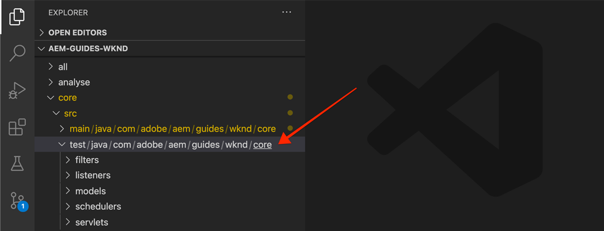

# 單元測試 {#unit-testing}

本教學課程涵蓋單位測試的實作，以驗證以下項目建立之Byline元件的Sling模型的行為： [自訂元件](./custom-component.md) 教學課程。

## 必備條件 {#prerequisites}

檢閱設定 [本地開發環境](overview.md#local-dev-environment).

_如果系統上同時安裝了Java 8和Java 11，則VS代碼測試運行程式在執行測試時可能會選擇較低的Java運行時，從而導致測試失敗。 如果發生此情況，請解除安裝Java 8。_

### 入門專案

>[!NOTE]
>
> 如果成功完成上一章，則可以重新使用項目，並跳過簽出入門項目的步驟。

查看本教學課程所建置的底線程式碼：

1. 查看 `tutorial/unit-testing-start` 分支 [GitHub](https://github.com/adobe/aem-guides-wknd)

   ```shell
   $ cd aem-guides-wknd
   $ git checkout tutorial/unit-testing-start
   ```

1. 使用您的Maven技能，將程式碼基底部署至本機AEM執行個體：

   ```shell
   $ mvn clean install -PautoInstallSinglePackage
   ```

   >[!NOTE]
   >
   > 如果使用AEM 6.5或6.4，請附加 `classic` 配置檔案。

   ```shell
   $ mvn clean install -PautoInstallSinglePackage -Pclassic
   ```

您一律可以在上檢視完成的程式碼 [GitHub](https://github.com/adobe/aem-guides-wknd/tree/tutorial/unit-testing-start) 或切換到分支，本地檢出代碼 `tutorial/unit-testing-start`.

## 目標

1. 了解單元測試的基本知識。
1. 了解常用於測試AEM程式碼的架構和工具。
1. 了解撰寫單元測試時模擬或模擬AEM資源的選項。

## 背景 {#unit-testing-background}

在本教學課程中，我們將探討如何撰寫 [單元測試](https://en.wikipedia.org/wiki/Unit_testing) 的位元組 [Sling模型](https://sling.apache.org/documentation/bundles/models.html) (於 [建立自訂AEM元件](custom-component.md))。 單元測試是以Java編寫的建置時間測試，用於驗證Java代碼的預期行為。 每個單元測試通常都較小，並根據預期結果來驗證方法（或工作單元）的輸出。

我們採用AEM最佳實務，並採用：

* [JUnit 5](https://junit.org/junit5/)
* [莫基托測試框架](https://site.mockito.org/)
* [wcm.io測試架構](https://wcm.io/testing/) (以 [Apache Sling Mocks](https://sling.apache.org/documentation/development/sling-mock.html))

## 單元測試和AdobeCloud Manager {#unit-testing-and-adobe-cloud-manager}

[AdobeCloud Manager](https://experienceleague.adobe.com/docs/experience-manager-cloud-manager/using/introduction-to-cloud-manager.html?lang=zh-Hant) 整合單元測試執行和 [代碼涵蓋範圍報告](https://experienceleague.adobe.com/docs/experience-manager-cloud-manager/using/how-to-use/understand-your-test-results.html#code-quality-testing) 進入其CI/CD管道，協助鼓勵和推廣單元測試AEM程式碼的最佳實務。

雖然單位測試程式碼是任何程式碼基底的理想作法，但使用Cloud Manager時，請務必利用其程式碼品質測試和報告功能，為Cloud Manager執行單元測試。

## 更新測試Maven相依性 {#inspect-the-test-maven-dependencies}

第一步是檢查Maven相依性，以支援編寫和執行測試。 需要四個相依性：

1. JUnit5
1. 莫基托測試框架
1. Apache Sling Mocks
1. AEM Mocks Test Framework（由io.wcm提供）

此 **JUnit5**, **莫基托** 和 **AEM Mocks** 在設定期間，會使用 [AEM Maven原型](project-setup.md).

1. 若要檢視這些相依性，請開啟父Reactor POM() **aem-guides-wknd/pom.xml**，導覽至 `<dependencies>..</dependencies>` 並在io.wcm下查看JUnit、Mockito、Apache Sling Mocks和AEM Mock Tests的依賴項 `<!-- Testing -->`.
1. 確保 `io.wcm.testing.aem-mock.junit5` 設為 **4.1.0**:

   ```xml
   <dependency>
       <groupId>io.wcm</groupId>
       <artifactId>io.wcm.testing.aem-mock.junit5</artifactId>
       <version>4.1.0</version>
       <scope>test</scope>
   </dependency>
   ```

   >[!CAUTION]
   >
   > 原型 **35** 會以產生專案 `io.wcm.testing.aem-mock.junit5` 版本 **4.1.8**. 請降級為 **4.1.0** 以遵循本章的其餘部分。

1. 開啟 **aem-guides-wknd/core/pom.xml** 並檢視對應的測試相依性是否可用。

   中的並行源資料夾 **核心** 項目將包含單元測試和任何支援測試檔案。 此 **測試** 資料夾可將測試類與原始碼分開，但允許測試的作用與原始碼位於相同的包中。

## 建立JUnit測試 {#creating-the-junit-test}

單元測試通常將1對1與Java類映射。 在本章中，我們將為 **BylineImpl.java**，即支援Byline元件的Sling模型。



*儲存單元測試的位置。*

1. 為 `BylineImpl.java` 在 `src/test/java` 在Java包資料夾結構中，該結構鏡像要測試的Java類的位置。

   

   因為我們在測試

   * `src/main/java/com/adobe/aem/guides/wknd/core/models/impl/BylineImpl.java`

   在

   * `src/test/java/com/adobe/aem/guides/wknd/core/models/impl/BylineImplTest.java`

   此 `Test` 單元測試檔案的尾碼， `BylineImplTest.java` 是一項公約，允許我們

   1. 輕鬆將其識別為測試檔案 _for_ `BylineImpl.java`
   1. 同時，區分測試檔案 _從_ 正在接受測試的班， `BylineImpl.java`


## 檢閱BylineImplTest.java {#reviewing-bylineimpltest-java}

此時，JUnit測試檔案是空的Java類。

1. 使用下列程式碼更新檔案：

   ```java
   package com.adobe.aem.guides.wknd.core.models.impl;
   
   import static org.junit.jupiter.api.Assertions.*;
   
   import org.junit.jupiter.api.BeforeEach;
   import org.junit.jupiter.api.Test;
   
   public class BylineImplTest {
   
       @BeforeEach
       void setUp() throws Exception {
   
       }
   
       @Test 
       void testGetName() { 
           fail("Not yet implemented");
       }
   
       @Test 
       void testGetOccupations() { 
           fail("Not yet implemented");
       }
   
       @Test 
       void testIsEmpty() { 
           fail("Not yet implemented");
       }
   }
   ```

1. 第一種方法 `public void setUp() { .. }` 用JUnit的注釋 `@BeforeEach`，指示JUnit測試運行程式在運行此類中的每個測試方法之前執行此方法。 這為初始化所有測試所需的常見測試狀態提供了便利的位置。

1. 後續方法為測試方法，其名稱會加上前置詞 `test` 以及 `@Test` 註解。 請注意，依預設，我們的所有測試都會設為失敗，因為我們尚未實作這些測試。

   首先，我們從測試類別上每個公用方法的單一測試方法開始，因此：

   | BylineImpl.java |  | BylineImplTest.java |
   | ------------------|--------------|---------------------|
   | getName() | 由測試 | testGetName() |
   | getSchropies() | 由測試 | testGetSchropies() |
   | isEmpty() | 由測試 | testIsEmpty() |

   如本章稍後所述，我們可視需要擴展這些方法。

   運行此JUnit測試類（也稱為JUnit測試實例）時，每個方法都標籤有 `@Test` 將作為可通過或失敗的測試執行。


*`core/src/test/java/com/adobe/aem/guides/wknd/core/models/impl/BylineImplTest.java`*

1. 按一下右鍵「 `BylineImplTest.java` 檔案和點選 **執行**.
如預期，所有測試都會失敗，因為這些測試尚未實作。

   

   *按一下右鍵BylineImplTests.java >運行*

## 檢閱BylineImpl.java {#reviewing-bylineimpl-java}

編寫單元測試時，有兩種主要方法：

* [TDD或測試驅動開發](https://en.wikipedia.org/wiki/Test-driven_development)，即在實施開發之前，以增量方式編寫單元測試；撰寫測試，撰寫實施以讓測試通過。
* 實作優先開發，包括先開發工作程式碼，然後撰寫驗證該程式碼的測試。

在本教學課程中，會使用後一種方法(因為我們已建立工作 **BylineImpl.java** )。 因此，我們必須審視和了解其公用方法的行為，並了解其實施細節。 這聽起來可能相反，因為良好的測試只應關心輸入和輸出，但在AEM中工作時，需要理解各種實施考慮因素，以便構建工作測試。

TDD在AEM領域需要一定的專業知識，最能被精通AEM程式碼的AEM開發和單元測試的AEM開發人員所採用。

## 設定AEM測試內容  {#setting-up-aem-test-context}

大部分為AEM編寫的程式碼都仰賴JCR、Sling或AEM API，而這反過來又需要執行中AEM的內容才能正確執行。

由於單位測試是在組建時執行，因此在執行中AEM例項的內容之外，就沒有這類內容。 為了方便， [wcm.io的AEM Mocks](https://wcm.io/testing/aem-mock/usage.html) 建立可讓這些API _mod_ 就像在AEM中執行一樣。

1. 使用建立AEM內容 **wcm.io** `AemContext` in **BylineImplTest.java** 將其添加為JUnit擴展 `@ExtendWith` 到 **BylineImplTest.java** 檔案。 擴充功能會處理所有必要的初始化和清除工作。 為 `AemContext` 可用於所有測試方法。

   ```java
   import org.junit.jupiter.api.extension.ExtendWith;
   import io.wcm.testing.mock.aem.junit5.AemContext;
   import io.wcm.testing.mock.aem.junit5.AemContextExtension;
   ...
   
   @ExtendWith(AemContextExtension.class)
   class BylineImplTest {
   
       private final AemContext ctx = new AemContext();
   ```

   此變數， `ctx`，會公開可提供多個AEM和Sling抽象化的模擬AEM內容：

   * BylineImpl Sling模型已註冊至此內容
   * 在此內容中建立模擬JCR內容結構
   * 可在此內容中註冊自訂OSGi服務
   * 提供多種常見的必要模擬物件和輔助工具，例如SlingHttpServletRequest物件、各種模擬Sling和AEM OSGi服務，例如ModelFactory、PageManager、Page、Template、ComponentManager、Component、TagManager、Tag等。
      * *請注意，並非所有這些物件的方法都已實作！*
   * 和 [更多](https://wcm.io/testing/aem-mock/usage.html)!

   此 **`ctx`** 物件將作為模擬內容的入口點。

1. 在 `setUp(..)` 方法，在每個 `@Test` 方法，定義通用的模擬測試狀態：

   ```java
   @BeforeEach
   public void setUp() throws Exception {
       ctx.addModelsForClasses(BylineImpl.class);
       ctx.load().json("/com/adobe/aem/guides/wknd/core/models/impl/BylineImplTest.json", "/content");
   }
   ```

   * **`addModelsForClasses`** 在模擬AEM內容中註冊要測試的Sling模型，以便在 `@Test` 方法。
   * **`load().json`** 將資源結構載入模擬內容中，讓程式碼可像由實際存放庫提供一樣與這些資源互動。 檔案中的資源定義 **`BylineImplTest.json`** 會載入到 **/content**.
   * **`BylineImplTest.json`** 尚不存在，因此請建立它，並定義測試所需的JCR資源結構。

1. 代表模擬資源結構的JSON檔案會儲存在 **核心/src/test/resources** 跟蹤與JUnit Java測試檔案相同的包路徑。

   在建立新的JSON檔案 `core/test/resources/com/adobe/aem/guides/wknd/core/models/impl` 已命名 **BylineImplTest.json** 包含下列內容：

   ```json
   {
       "byline": {
       "jcr:primaryType": "nt:unstructured",
       "sling:resourceType": "wknd/components/content/byline"
       }
   }
   ```

   

   此JSON會定義署名元件單元測試的模擬資源（JCR節點）。 此時，JSON會有最少一組必要的屬性，用以表示署名元件內容資源： `jcr:primaryType` 和 `sling:resourceType`.

   處理單元測試時，一般規則是建立滿足每個測試所需的最小模擬內容、內容和程式碼集。 撰寫測試前，請避免建立完整的模擬內容的誘惑，因為這通常會導致不需要的成品。

   現在，隨著 **BylineImplTest.json**，當 `ctx.json("/com/adobe/aem/guides/wknd/core/models/impl/BylineImplTest.json", "/content")` 執行，則會將模擬資源定義載入路徑的內容中 **/content.**

## 測試getName() {#testing-get-name}

既然我們已有基本的模擬內容設定，那麼就為 **BylineImpl的getName()**. 此測試必須確保方法 **getName()** 返回儲存在資源「**name.** 屬性。

1. 更新 **testGetName**()中的方法 **BylineImplTest.java** 如下所示：

   ```java
   import com.adobe.aem.guides.wknd.core.models.Byline;
   ...
   @Test
   public void testGetName() {
       final String expected = "Jane Doe";
   
       ctx.currentResource("/content/byline");
       Byline byline = ctx.request().adaptTo(Byline.class);
   
       String actual = byline.getName();
   
       assertEquals(expected, actual);
   }
   ```

   * **`String expected`** 設定預期值。 我們將此設定為「**簡·多內**」。
   * **`ctx.currentResource`** 設定模擬資源的上下文以評估代碼，因此此設定為 **/content/byline** 因為是載入模擬署名內容資源的位置。
   * **`Byline byline`** 從模擬要求物件中調整以實例化Byline Sling模型。
   * **`String actual`** 叫用我們測試的方法， `getName()`，位於署名Sling模型物件上。
   * **`assertEquals`** 斷言預期值與署名Sling模型物件傳回的值相符。 如果這些值不相等，則測試會失敗。

1. 執行測試……而測試失敗，且 `NullPointerException`.

   請注意，此測試「不會」失敗，因為我們從未定義 `name` 屬性，會導致測試失敗，但測試執行尚未達到該點！ 此測試因 `NullPointerException` 在署名物件本身上。

1. 在 `BylineImpl.java`，如果 `@PostConstruct init()` 擲回例外狀況，使Sling模型無法具現化，並導致Sling模型物件為null。

   ```java
   @PostConstruct
   private void init() {
       image = modelFactory.getModelFromWrappedRequest(request, request.getResource(), Image.class);
   }
   ```

   事實上，雖然ModelFactory OSGi服務是透過 `AemContext` （透過Apache Sling Context），並非所有方法皆已實作，包括 `getModelFromWrappedRequest(...)` 在拜林姆普的 `init()` 方法。 這會導致 [AbstractMethodError](https://docs.oracle.com/en/java/javase/11/docs/api/java.base/java/lang/AbstractMethodError.html)，其原因 `init()` 失敗，並因此調整 `ctx.request().adaptTo(Byline.class)` 是空對象。

   由於提供的吊床無法容納我們的代碼，因此我們必須自己實施模擬上下文。為此，我們可以使用Mockito建立模擬ModelFactory對象，該對象在 `getModelFromWrappedRequest(...)` 叫用它。

   因為若要具現化署名Sling模型，此模擬內容必須已就緒，我們可將其新增至 `@Before setUp()` 方法。 我們也需要新增 `MockitoExtension.class` 到 `@ExtendWith` 註解 **BylineImplTest** 類別。

   ```java
   package com.adobe.aem.guides.wknd.core.models.impl;
   
   import org.mockito.junit.jupiter.MockitoExtension;
   import org.mockito.Mock;
   
   import com.adobe.aem.guides.wknd.core.models.Byline;
   import com.adobe.cq.wcm.core.components.models.Image;
   
   import io.wcm.testing.mock.aem.junit5.AemContext;
   import io.wcm.testing.mock.aem.junit5.AemContextExtension;
   
   import org.apache.sling.models.factory.ModelFactory;
   import org.junit.jupiter.api.BeforeEach;
   import org.junit.jupiter.api.Test;
   import org.junit.jupiter.api.extension.ExtendWith;
   
   import static org.junit.jupiter.api.Assertions.*;
   import static org.mockito.Mockito.*;
   import org.apache.sling.api.resource.Resource;
   
   @ExtendWith({ AemContextExtension.class, MockitoExtension.class })
   public class BylineImplTest {
   
       private final AemContext ctx = new AemContext();
   
       @Mock
       private Image image;
   
       @Mock
       private ModelFactory modelFactory;
   
       @BeforeEach
       public void setUp() throws Exception {
           ctx.addModelsForClasses(BylineImpl.class);
   
           ctx.load().json("/com/adobe/aem/guides/wknd/core/models/impl/BylineImplTest.json", "/content");
   
           lenient().when(modelFactory.getModelFromWrappedRequest(eq(ctx.request()), any(Resource.class), eq(Image.class)))
                   .thenReturn(image);
   
           ctx.registerService(ModelFactory.class, modelFactory, org.osgi.framework.Constants.SERVICE_RANKING,
                   Integer.MAX_VALUE);
       }
   
       @Test
       void testGetName() { ...
   }
   ```

   * **`@ExtendWith({AemContextExtension.class, MockitoExtension.class})`** 會標籤要使用 [Mockito JUnit Jupiter擴展](https://www.javadoc.io/page/org.mockito/mockito-junit-jupiter/latest/org/mockito/junit/jupiter/MockitoExtension.html) 允許使用@Mock注釋來定義類級別的模擬對象。
   * **`@Mock private Image`** 建立類型的模擬對象 `com.adobe.cq.wcm.core.components.models.Image`. 請注意，這會在類別層級定義，以便視需要 `@Test` 方法可視需要變更其行為。
   * **`@Mock private ModelFactory`** 建立ModelFactory類型的模擬對象。 請注意，這是純Mockito模擬，沒有實作方法。 請注意，這會在類別層級定義，以便視需要 `@Test`方法可視需要變更其行為。
   * **`when(modelFactory.getModelFromWrappedRequest(..)`** 註冊模擬行為，時機 `getModelFromWrappedRequest(..)` 在模擬ModelFactory對象上調用。 中定義的結果 `thenReturn (..)` 是傳回模擬影像物件。 請注意，只有在下列情況下才會叫用此行為：第1個參數等於 `ctx`&#39;s要求物件，第2個參數是任何資源物件，第3個參數必須是核心元件影像類別。 我們接受任何資源，因為在整個測試中，我們會設定 `ctx.currentResource(...)` 至 **BylineImplTest.json**. 請注意，我們會新增 **envile()** 嚴格，因為我們以後將要覆蓋ModelFactory的此行為。
   * **`ctx.registerService(..)`。** 在AemContext中註冊模擬的ModelFactory物件，並排名最高。 這是必需的，因為BylineImpl中使用的ModelFactory `init()` 會透過 `@OSGiService ModelFactory model` 欄位。 AemContext插入的順序 **我們的** mock object，可處理呼叫 `getModelFromWrappedRequest(..)`，我們必須將其註冊為該類型(ModelFactory)的最高排名服務。

1. 重新執行測試，但再次失敗，但這次的訊息清楚說明失敗的原因。

   

   *testGetName()因斷言而失敗*

   我們收到 **AssertionError** 這意味著測試中的斷言條件失敗了，它告訴我們 **預期值為「Jane Doe」** 但 **實際值為null**. 這很合理，因為「**name.** 未將屬性新增至mock **/content/byline** 資源定義 **BylineImplTest.json**，因此，我們新增：

1. 更新 **BylineImplTest.json** 定義 `"name": "Jane Doe".`

   ```json
   {
       "byline": {
       "jcr:primaryType": "nt:unstructured",
       "sling:resourceType": "wknd/components/content/byline",
       "name": "Jane Doe"
       }
   }
   ```

1. 重新執行測試，並 **`testGetName()`** 現在通過！

   


## 測試getSchropies() {#testing-get-occupations}

很好！ 我們的第一次測試通過了！ 讓我們繼續測試 `getOccupations()`. 由於模擬上下文的初始化是在 `@Before setUp()`方法，這適用於所有 `@Test` 本測試案例中的方法，包括 `getOccupations()`.

請記住，此方法必須返回職業屬性中儲存的職業（降序）清單。

1. 更新 **`testGetOccupations()`** 如下所示：

   ```java
   import java.util.List;
   import com.google.common.collect.ImmutableList;
   ...
   @Test
   public void testGetOccupations() {
       List<String> expected = new ImmutableList.Builder<String>()
                               .add("Blogger")
                               .add("Photographer")
                               .add("YouTuber")
                               .build();
   
       ctx.currentResource("/content/byline");
       Byline byline = ctx.request().adaptTo(Byline.class);
   
       List<String> actual = byline.getOccupations();
   
       assertEquals(expected, actual);
   }
   ```

   * **`List<String> expected`** 定義預期結果。
   * **`ctx.currentResource`** 在/content/byline設定當前資源，以根據模擬資源定義評估上下文。 這可確保 **BylineImpl.java** 會在模擬資源的環境中執行。
   * **`ctx.request().adaptTo(Byline.class)`** 從模擬要求物件中調整以實例化Byline Sling模型。
   * **`byline.getOccupations()`** 叫用我們測試的方法， `getOccupations()`，位於署名Sling模型物件上。
   * **`assertEquals(expected, actual)`** 斷言預期清單與實際清單相同。

1. 記住，就像 **`getName()`** 以上， **BylineImplTest.json** 不定義職業，因此如果我們運行它，測試將失敗，因為 `byline.getOccupations()` 會傳回空白清單。

   更新 **BylineImplTest.json** 包括職業清單，這些職業按非字母順序設定，以確保我們的測試驗證職業按字母順序排序 **`getOccupations()`**.

   ```json
   {
       "byline": {
       "jcr:primaryType": "nt:unstructured",
       "sling:resourceType": "wknd/components/content/byline",
       "name": "Jane Doe",
       "occupations": ["Photographer", "Blogger", "YouTuber"]
       }
   }
   ```

1. 執行測試，我們再次通過！ 看來分類的職業有用！

   

   *testGetSchropies()通過*

## 測試isEmpty() {#testing-is-empty}

最後一個測試方法 **`isEmpty()`**.

測試 `isEmpty()` 很有趣，因為需要針對多種條件進行測試。 檢閱 **BylineImpl.java**&#39;s `isEmpty()` 方法必須測試下列條件：

* 名稱為空時傳回true
* 職業為null或為空時返回true
* 影像為null或沒有src URL時傳回true
* 名稱、職業和影像（含src URL）存在時，傳回false

為此，我們需要建立新的測試方法，每個測試都是特定條件，以及 `BylineImplTest.json` 來進行這些測試。

請注意，此檢查可讓我們略過測試的時間 `getName()`, `getOccupations()` 和 `getImage()` 為空，因為該狀態的預期行為是透過測試 `isEmpty()`.

1. 第一個測試將測試未設定屬性的全新元件的條件。

   將新資源定義添加到 `BylineImplTest.json`，提供語義名稱「**空白**&quot;

   ```json
   {
       "byline": {
           "jcr:primaryType": "nt:unstructured",
           "sling:resourceType": "wknd/components/content/byline",
           "name": "Jane Doe",
           "occupations": ["Photographer", "Blogger", "YouTuber"]
       },
       "empty": {
           "jcr:primaryType": "nt:unstructured",
           "sling:resourceType": "wknd/components/content/byline"
       }
   }
   ```

   **`"empty": {...}`** 定義名為「empty」的新資源定義，該定義只有 `jcr:primaryType` 和 `sling:resourceType`.

   記住我們載入 `BylineImplTest.json` into `ctx` 在 `@setUp`，因此，我們可立即在 **/content/empty。**

1. 更新 `testIsEmpty()` 如下所示，將當前資源設定為新的「**空白**&quot;模擬資源定義。

   ```java
   @Test
   public void testIsEmpty() {
       ctx.currentResource("/content/empty");
       Byline byline = ctx.request().adaptTo(Byline.class);
   
       assertTrue(byline.isEmpty());
   }
   ```

   執行測試並確保通過。

1. 接下來，建立一組方法，以確保任何必要的資料點（名稱、職業或影像）為空白時， `isEmpty()` 傳回true。

   對於每個測試，都會使用離散的模擬資源定義，更新 **BylineImplTest.json** 以及 **無名稱** 和 **無職業**.

   ```json
   {
       "byline": {
           "jcr:primaryType": "nt:unstructured",
           "sling:resourceType": "wknd/components/content/byline",
           "name": "Jane Doe",
           "occupations": ["Photographer", "Blogger", "YouTuber"]
       },
       "empty": {
           "jcr:primaryType": "nt:unstructured",
           "sling:resourceType": "wknd/components/content/byline"
       },
       "without-name": {
           "jcr:primaryType": "nt:unstructured",
           "sling:resourceType": "wknd/components/content/byline",
           "occupations": "[Photographer, Blogger, YouTuber]"
       },
       "without-occupations": {
           "jcr:primaryType": "nt:unstructured",
           "sling:resourceType": "wknd/components/content/byline",
           "name": "Jane Doe"
       }
   }
   ```

   建立下列測試方法以測試這些狀態的每一個。

   ```java
   @Test
   public void testIsEmpty() {
       ctx.currentResource("/content/empty");
   
       Byline byline = ctx.request().adaptTo(Byline.class);
   
       assertTrue(byline.isEmpty());
   }
   
   @Test
   public void testIsEmpty_WithoutName() {
       ctx.currentResource("/content/without-name");
   
       Byline byline = ctx.request().adaptTo(Byline.class);
   
       assertTrue(byline.isEmpty());
   }
   
   @Test
   public void testIsEmpty_WithoutOccupations() {
       ctx.currentResource("/content/without-occupations");
   
       Byline byline = ctx.request().adaptTo(Byline.class);
   
       assertTrue(byline.isEmpty());
   }
   
   @Test
   public void testIsEmpty_WithoutImage() {
       ctx.currentResource("/content/byline");
   
       lenient().when(modelFactory.getModelFromWrappedRequest(eq(ctx.request()),
           any(Resource.class),
           eq(Image.class))).thenReturn(null);
   
       Byline byline = ctx.request().adaptTo(Byline.class);
   
       assertTrue(byline.isEmpty());
   }
   
   @Test
   public void testIsEmpty_WithoutImageSrc() {
       ctx.currentResource("/content/byline");
   
       when(image.getSrc()).thenReturn("");
   
       Byline byline = ctx.request().adaptTo(Byline.class);
   
       assertTrue(byline.isEmpty());
   }
   ```

   **`testIsEmpty()`** 針對空的模擬資源定義進行測試，並斷言 `isEmpty()` 為true。

   **`testIsEmpty_WithoutName()`** 針對有職業但沒有名字的模擬資源定義進行測試。

   **`testIsEmpty_WithoutOccupations()`** 測試有名字但沒有職業的模擬資源定義。

   **`testIsEmpty_WithoutImage()`** 以名稱和職業來測試模擬資源定義，但將模擬影像設為null。 請注意，我們要覆寫 `modelFactory.getModelFromWrappedRequest(..)`在 `setUp()` 以確保此呼叫傳回的影像物件為null。 莫基托小作品的特徵是嚴格的，不要有重複的代碼。 因此我們用 **`lenient`** 的設定來明確注意，我們會覆寫 `setUp()` 方法。

   **`testIsEmpty_WithoutImageSrc()`** 使用名稱和職業對模擬資源定義進行測試，但在 `getSrc()` 叫用的是。

1. 最後，撰寫測試以確保 **isEmpty()** 正確設定元件時，會傳回false。 針對此情況，我們可以重複使用 **/content/byline** 代表完全設定的Byline元件。

   ```java
   @Test
   public void testIsNotEmpty() {
       ctx.currentResource("/content/byline");
       when(image.getSrc()).thenReturn("/content/bio.png");
   
       Byline byline = ctx.request().adaptTo(Byline.class);
   
       assertFalse(byline.isEmpty());
   }
   ```

1. 現在，在BylineImplTest.java檔案中運行所有單元測試，並查看Java測試報告輸出。


## 在組建中執行單元測試 {#running-unit-tests-as-part-of-the-build}

執行單元測試時，必須在maven組建中通過。 這可確保在部署應用程式之前成功通過所有測試。 執行Maven目標（如包或安裝）會自動調用，並要求通過項目中的所有單元測試。

```shell
$ mvn package
```


```shell
$ mvn package
```

同樣地，如果我們將測試方法變更為失敗，組建會失敗，並回報哪些測試失敗及原因。


## 檢閱程式碼 {#review-the-code}

在上檢視完成的程式碼 [GitHub](https://github.com/adobe/aem-guides-wknd) 或是在本機的Git程式庫上檢閱並部署程式碼 `tutorial/unit-testing-solution`.
