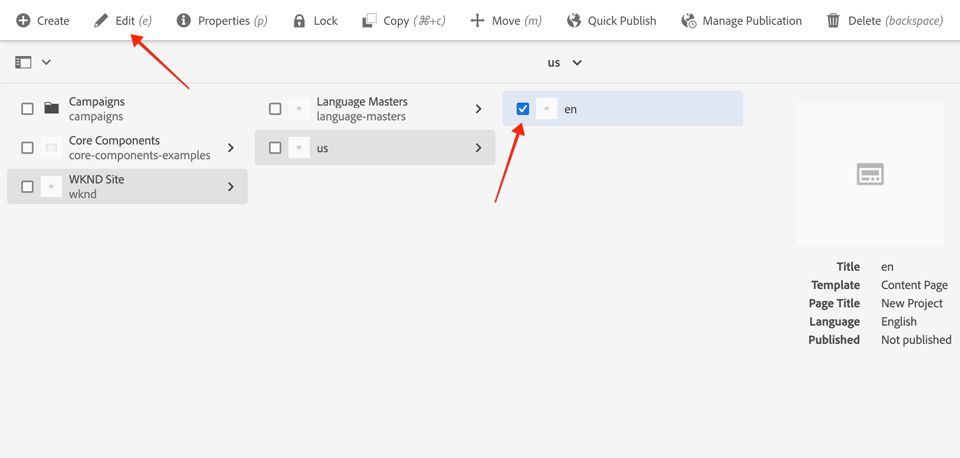

# 項目設定{#project-setup}

本教學課程涵蓋建立Maven Multi Module專案，以管理Adobe Experience Manager網站的程式碼和組態。

## 必備條件 {#prerequisites}

檢閱設定[本機開發環境](overview.md#local-dev-environment)所需的工具和指示。 請確定您在本機有新的Adobe Experience Manager實例，且未安裝其他示例／示範軟體包（所需服務包除外）。

## 目標 {#objective}

1. 瞭解如何使用Maven原型AEM產生新專案。
1. 瞭解專案原型產生的不AEM同模組，以及它們如何搭配運作。
1. 瞭解AEM核心元件如何包含在專案AEM中。

## 您將建立的{#what-build}

>[!VIDEO](https://video.tv.adobe.com/v/30152/?quality=12&learn=on)

在本章中，您將使用[項目原型](https://github.com/adobe/aem-project-archetype)生成AEM新的Adobe Experience Manager項目。 您的AEM專案包含用於網站實作的所有程式碼、內容和設定。 本章中生成的項目將作為實施WKND網站的基礎，並將在今後各章中建立。

**什麼是Maven專案？** -  [Apache ](https://maven.apache.org/) Mavenis是用於建立專案的軟體管理工具。*所有Adobe Experience* Manager實作都會使用Maven專案來建立、管理和部署自訂程式碼AEM。

**什麼是馬文原型？** - Maven原 [型是](https://maven.apache.org/archetype/index.html) 產生新專案的範本或模式。「專AEM案」原型可讓我們使用自訂命名空間產生新專案，並包含遵循最佳實務的專案結構，大幅加速我們的專案。

## 建立項目{#create}

為建立Maven多模組項目有幾個選項AEM。 本教學課程將利用[Maven AEM Project Archetype **26**](https://github.com/adobe/aem-project-archetype)。 Cloud Manager也[提供UI精靈](https://docs.adobe.com/content/help/en/experience-manager-cloud-manager/using/getting-started/create-an-application-project.html)，以開始建立應用程AEM式專案。 由Cloud Manager UI產生的基礎專案會產生與直接使用原型相同的結構。

>[!NOTE]
>
>本教學課程使用原型的&#x200B;**26**&#x200B;版。 使用&#x200B;**latest**&#x200B;版本的原型來產生新專案一直是最佳實務。

下一系列步驟將使用基於UNIX的命令行終端進行，但使用Windows終端時應類似。

1. 開啟命令行終端。 驗證Maven是否已安裝：

   ```shell
   $ mvn --version
   Apache Maven 3.6.2
   Maven home: /Library/apache-maven-3.6.2
   Java version: 11.0.4, vendor: Oracle Corporation, runtime: /Library/Java/JavaVirtualMachines/jdk-11.0.4.jdk/Contents/Home
   ```

1. 執行下列命令，確認&#x200B;**adobe-public**&#x200B;描述檔是否作用中：

   ```shell
   $ mvn help:effective-settings
       ...
   <activeProfiles>
       <activeProfile>adobe-public</activeProfile>
   </activeProfiles>
   <pluginGroups>
       <pluginGroup>org.apache.maven.plugins</pluginGroup>
       <pluginGroup>org.codehaus.mojo</pluginGroup>
   </pluginGroups>
   </settings>
   [INFO] ------------------------------------------------------------------------
   [INFO] BUILD SUCCESS
   [INFO] ------------------------------------------------------------------------
   [INFO] Total time:  0.856 s
   ```

   如果您執行&#x200B;**not**&#x200B;檢視&#x200B;**adobe-public**，表示您的`~/.m2/settings.xml`檔案中未正確參考Adobe回購。 請重新訪問在[本地開發環境](https://docs.adobe.com/content/help/en/experience-manager-learn/foundation/development/set-up-a-local-aem-development-environment.html#install-apache-maven)中安裝和配置Apache Maven的步驟。

1. 導覽至您要產生專案的目AEM錄。 此目錄可以是您要維護專案原始碼的任何目錄。 例如，用戶主目錄下的`code`目錄：

   ```shell
   $ cd ~/code
   ```

1. 將以下內容貼上到命令行中，以[批次模式](https://maven.apache.org/archetype/maven-archetype-plugin/examples/generate-batch.html)生成項目：

   ```shell
   mvn -B archetype:generate \
       -D archetypeGroupId=com.adobe.aem \
       -D archetypeArtifactId=aem-project-archetype \
       -D archetypeVersion=26 \
       -D appTitle="WKND Sites Project" \
       -D appId="wknd" \
       -D groupId="com.adobe.aem.guides.wknd" \
       -D artifactId="aem-guides-wknd" \
       -D version="0.0.1-SNAPSHOT" \
       -D aemVersion="cloud"
   ```

   >[!NOTE]
   >
   > 如果定AEM位6.5.5+，請將`aemVersion="cloud"`取代為`aemVersion="6.5.5"`。 如果目標是6.4.8+，請使用`aemVersion="6.4.8"`。

   可在此](https://github.com/adobe/aem-project-archetype#available-properties)找到用於配置項目[的可用屬性的完整清單。

1. 以下資料夾和檔案結構將由本地檔案系統上的Maven原型生成：

   ```plain
    ~/code/
       |--- aem-guides-wknd/
           |--- all/
           |--- core/
           |--- ui.apps/
           |--- ui.apps.structure/
           |--- ui.config/
           |--- ui.content/
           |--- ui.frontend/
           |--- ui.tests /
           |--- it.tests/
           |--- dispatcher/
           |--- analyse/
           |--- pom.xml
           |--- README.md
           |--- .gitignore
   ```

## 部署和構建項目{#build}

建立專案程式碼並部署至的本機例AEM項。

1. 請確定您的作者例AEM項在埠&#x200B;**4502**&#x200B;上本機執行。
1. 從命令行導航到`aem-guides-wknd`項目目錄。

   ```shell
   $ cd aem-guides-wknd
   ```

1. 執行下列命令，以建立並部署整個專案至AEM:

   ```shell
   $ mvn clean install -PautoInstallSinglePackage
   ```

   建置約需要一分鐘，並應以下列訊息結束：

   ```
   ...
   [INFO] ------------------------------------------------------------------------
   [INFO] Reactor Summary for aem-guides-wknd 0.0.1-SNAPSHOT:
   [INFO]
   [INFO] aem-guides-wknd .................................... SUCCESS [  0.269 s]
   [INFO] WKND Sites Project - Core .......................... SUCCESS [  8.047 s]
   [INFO] WKND Sites Project - UI Frontend ................... SUCCESS [01:02 min]
   [INFO] WKND Sites Project - Repository Structure Package .. SUCCESS [  1.985 s]
   [INFO] WKND Sites Project - UI apps ....................... SUCCESS [  8.037 s]
   [INFO] WKND Sites Project - UI content .................... SUCCESS [  4.672 s]
   [INFO] WKND Sites Project - UI config ..................... SUCCESS [  0.313 s]
   [INFO] WKND Sites Project - All ........................... SUCCESS [  0.270 s]
   [INFO] WKND Sites Project - Integration Tests ............. SUCCESS [ 15.571 s]
   [INFO] WKND Sites Project - Dispatcher .................... SUCCESS [  0.232 s]
   [INFO] WKND Sites Project - UI Tests ...................... SUCCESS [  0.728 s]
   [INFO] WKND Sites Project - Project Analyser .............. SUCCESS [ 33.398 s]
   [INFO] ------------------------------------------------------------------------
   [INFO] BUILD SUCCESS
   [INFO] ------------------------------------------------------------------------
   [INFO] Total time:  02:18 min
   [INFO] Finished at: 2021-01-31T12:33:56-08:00
   [INFO] ------------------------------------------------------------------------
   ```

   Maven配置檔案`autoInstallSinglePackage`將編譯項目的各個模組，並將單個軟體包部署到實AEM例中。 預設情況下，此軟體包將部署AEM到在埠&#x200B;**4502**&#x200B;本地運行且憑據為`admin:admin`的實例。

1. 導覽至您本機例項上的Package ManagerAEM:[http://localhost:4502/crx/packmgr/index.jsp](http://localhost:4502/crx/packmgr/index.jsp)。 您應看到`aem-guides-wknd.ui.apps`、`aem-guides-wknd.ui.config`、`aem-guides-wknd.ui.content`和`aem-guides-wknd.all`的套件。

1. 導覽至「網站」主控台：[http://localhost:4502/sites.html/content](http://localhost:4502/sites.html/content)。 WKND網站將是其中一個網站。 其中將包含具有美國和語言碩士階層的網站結構。 此站點分層結構基於使用原型生成項目時`language_country`和`isSingleCountryWebsite`的值。

1. 選擇頁面並按一下菜單欄中的&#x200B;**編輯**&#x200B;按鈕，開啟&#x200B;**US** `>` **英文**&#x200B;頁面：

   

1. 已建立入門內容，並有數個元件可供新增至頁面。 嘗試這些元件，以瞭解其功能。 您將在下一章中學習元件的基本知識。

   

   *原型產生的範例內容*

## Inspect項目{#project-structure}

生成的AEM項目由各個Maven模組組成，每個模組具有不同的角色。 本教學課程和大部份的開發工作都著重於這些模組：

* [核心](https://docs.adobe.com/content/help/en/experience-manager-core-components/using/developing/archetype/core.html) - Java程式碼，主要是後端開發人員。
* [ui.frontend](https://docs.adobe.com/content/help/en/experience-manager-core-components/using/developing/archetype/uifrontend.html) -包含CSS、JavaScript、Sass、Type Script的原始碼，主要適用於前端開發人員。
* [ui.apps](https://docs.adobe.com/content/help/en/experience-manager-core-components/using/developing/archetype/uiapps.html)  —— 包含元件和對話框定義，內嵌編譯的CSS和JavaScript作為用戶端程式庫。
* [ui.content](https://docs.adobe.com/content/help/en/experience-manager-core-components/using/developing/archetype/uicontent.html) -包含結構內容和組態，例如可編輯範本、中繼資料結構(/content、/conf)。

* **all**  —— 此為空的Maven模組，將上述模組組合到可部署到環境的單個包AEM中。


請參閱[AEM Project Archetype文檔](https://docs.adobe.com/content/help/en/experience-manager-core-components/using/developing/archetype/overview.html)以瞭解&#x200B;**all** Maven模組的詳細資訊。

### 包含核心元件{#core-components}

[核心AEM元](https://docs.adobe.com/content/help/zh-Hant/experience-manager-core-components/using/introduction.html) 件是一套適用於的標準化網頁內容管理(WCM)元AEM件。這些元件提供功能的基準集，可針對個別專案設定樣式、自訂和擴充。

作AEM為Cloud Service環境，包含最新版[AEM核心元件](https://docs.adobe.com/content/help/en/experience-manager-core-components/using/introduction.html)。 因此，作為AEMCloud Service生成的項目&#x200B;**not**&#x200B;包含內嵌的核心AEM元件。

對於AEM6.5/6.4生成的項目，原型會自動嵌入項目中的&lt;a0/AEM>核心元件](https://docs.adobe.com/content/help/en/experience-manager-core-components/using/introduction.html)。 [6.5/6.4內嵌核心元件是AEM最佳實務，AEM以確保專案部署最新版本。 有關核心元件如何包含在項目中的詳細資訊，請參閱](https://docs.adobe.com/content/help/en/experience-manager-core-components/using/developing/archetype/using.html#core-components)。[

## 源控制管理{#source-control}

使用某種形式的原始碼控制來管理應用程式中的程式碼，總是很好的主意。 本教學課程使用git和GitHub。 Maven和／或所選IDE生成的多個檔案應由SCM忽略。

每當您建立並安裝程式碼套件時，Maven會建立目標資料夾。 目標資料夾和內容應從SCM中排除。

在`ui.apps`下方，觀察許多`.content.xml`檔案已建立。 這些XML檔案映射JCR中安裝內容的節點類型和屬性。 這些檔案是重要的，應忽略&#x200B;**not**。

項AEM目原型將生成一個示例`.gitignore`檔案，該檔案可用作可安全忽略檔案的起點。 檔案生成於`<src>/aem-guides-wknd/.gitignore`。

## 恭喜！{#congratulations}

恭喜您，您剛建立了第一個專AEM案！

### 後續步驟{#next-steps}

透過[元件基本知識AEM](component-basics.md)教學課程的簡單`HelloWorld`範例，瞭解Adobe Experience Manager(Sites)元件的基礎技術。

## 進階Maven命令（附加）{#advanced-maven-commands}

在開發期間，您可能只使用其中一個模組，並想要避免建立整個專案，以節省時間。 您也可以直接部署至AEM Publish執行個體，或是部署至未在端AEM口4502上執行的執行個體。

接下來，我們將討論一些額外的Maven描述檔和指令，讓您在開發時有更大的彈性。

### 核心模組{#core-module}

**[core](https://docs.adobe.com/content/help/en/experience-manager-core-components/using/developing/archetype/core.html)**&#x200B;模組包含與項目關聯的所有Java代碼。 在構建時，它將OSGi包部署到AEM。 要僅構建此模組：

1. 導覽至`core`資料夾（位於`aem-guides-wknd`下方）:

   ```shell
   $ cd core/
   ```

1. 運行以下命令：

   ```shell
   $ mvn clean install -PautoInstallBundle
   ...
   [INFO] --- sling-maven-plugin:2.4.0:install (install-bundle) @ aem-guides-wknd.core ---
   [INFO] Installing Bundle aem-guides-wknd.core(~/code/aem-guides-wknd/core/target/aem-guides-wknd.core-0.0.1-SNAPSHOT.jar) to http://localhost:4502/system/console via WebConsole
   [INFO] Bundle installed
   [INFO] ------------------------------------------------------------------------
   [INFO] BUILD SUCCESS
   [INFO] ------------------------------------------------------------------------
   [INFO] Total time:  8.558 s
   ```

1. 導覽至[http://localhost:4502/system/console/bundles](http://localhost:4502/system/console/bundles)。 這是OSGi Web控制台，包含實例上安裝的所有捆綁包的AEM資訊。

1. 切換&#x200B;**Id**&#x200B;排序欄，您會看到WKND包已安裝並處於活動狀態。

   

1. 您可以在[CRXDE-Lite](http://localhost:4502/crx/de/index.jsp#/apps/wknd-packages/application/install/aem-guides-wknd.core-1.0.0-SNAPSHOT.jar)中看到jar的「physical」位置：

   

### Ui.apps和Ui.content模組{#apps-content-module}

**[ui.apps](https://docs.adobe.com/content/help/en/experience-manager-core-components/using/developing/archetype/uiapps.html)**&#x200B;主模組包含`/apps`下方網站所需的所有演算程式碼。 這包括將儲存為[clientlibsAEM](https://docs.adobe.com/content/help/en/experience-manager-cloud-service/implementing/developing/clientlibs.html)格式的CSS/JS。 這也包含用於轉譯動態HTML的[HTL](https://docs.adobe.com/content/help/zh-Hant/experience-manager-htl/using/overview.html)指令碼。 您可以將&#x200B;**ui.apps**&#x200B;模組視為JCR中結構的對應，但格式可儲存在檔案系統並提交至來源控制項。 **ui.apps**&#x200B;模組僅包含程式碼。

要構建此模組：

1. 從命令行。 導覽至`ui.apps`資料夾（位於`aem-guides-wknd`下方）:

   ```shell
   $ cd ../ui.apps
   ```

1. 運行以下命令：

   ```shell
   $ mvn clean install -PautoInstallPackage
   ...
   Package installed in 122ms.
   [INFO] ------------------------------------------------------------------------
   [INFO] BUILD SUCCESS
   [INFO] ------------------------------------------------------------------------
   [INFO] Total time:  6.972 s
   [INFO] Finished at: 2019-12-06T14:44:12-08:00
   [INFO] ------------------------------------------------------------------------
   ```

1. 導覽至[http://localhost:4502/crx/packmgr/index.jsp](http://localhost:4502/crx/packmgr/index.jsp)。 您應將`ui.apps`套件視為第一個安裝的套件，而且其時間戳記應比其他任何套件都更新。

   

1. 返回命令行並運行以下命令（在`ui.apps`資料夾中）:

   ```shell
   $ mvn -PautoInstallPackagePublish clean install
   ...
   [INFO] --- content-package-maven-plugin:1.0.2:install (install-package-publish) @ aem-guides-wknd.ui.apps ---
   [INFO] Installing aem-guides-wknd.ui.apps (/Users/dgordon/code/aem-guides-wknd/ui.apps/target/aem-guides-wknd.ui.apps-0.0.1-SNAPSHOT.zip) to http://localhost:4503/crx/packmgr/service.jsp
   [INFO] I/O exception (java.net.ConnectException) caught when processing request: Connection refused (Connection refused)
   [INFO] Retrying request
   [INFO] I/O exception (java.net.ConnectException) caught when processing request: Connection refused (Connection refused)
   [INFO] Retrying request
   [INFO] I/O exception (java.net.ConnectException) caught when processing request: Connection refused (Connection refused)
   [INFO] Retrying request
   [INFO] ------------------------------------------------------------------------
   [INFO] BUILD FAILURE
   [INFO] ------------------------------------------------------------------------
   [INFO] Total time:  6.717 s
   [INFO] Finished at: 2019-12-06T14:51:45-08:00
   [INFO] ------------------------------------------------------------------------
   ```

   配置檔案`autoInstallPackagePublish`旨在將軟體包部署到在埠&#x200B;**4503**&#x200B;上運行的發佈環境。 如果找不到在http://localhost:4503上執AEM行的例項，則會出現上述錯誤。

1. 最後，運行以下命令將`ui.apps`軟體包部署在埠&#x200B;**4504**&#x200B;上：

   ```shell
   $ mvn -PautoInstallPackage clean install -Daem.port=4504
   ...
   [INFO] --- content-package-maven-plugin:1.0.2:install (install-package) @ aem-guides-wknd.ui.apps ---
   [INFO] Installing aem-guides-wknd.ui.apps (/Users/dgordon/code/aem-guides-wknd/ui.apps/target/aem-guides-wknd.ui.apps-0.0.1-SNAPSHOT.zip) to http://localhost:4504/crx/packmgr/service.jsp
   [INFO] I/O exception (java.net.ConnectException) caught when processing request: Connection refused (Connection refused)
   [INFO] Retrying request
   [INFO] I/O exception (java.net.ConnectException) caught when processing request: Connection refused (Connection refused)
   [INFO] Retrying request
   [INFO] I/O exception (java.net.ConnectException) caught when processing request: Connection refused (Connection refused)
   [INFO] Retrying request
   [INFO] ------------------------------------------------------------------------
   [INFO] BUILD FAILURE
   [INFO] --------------------------------------------------------------------
   ```

   如果埠&#x200B;**4504&lt;a1/AEM>上沒有運行實例，則預計會發生構建失敗。**&#x200B;參數`aem.port`在POM檔案中定義在`aem-guides-wknd/pom.xml`。

**[ui.content](https://docs.adobe.com/content/help/en/experience-manager-core-components/using/developing/archetype/uicontent.htm)**&#x200B;模組的結構與&#x200B;**ui.apps**&#x200B;模組相同。 唯一的區別是，**ui.content**&#x200B;模組包含稱為&#x200B;**mutable**&#x200B;的內容。 **Mutablecontent** 實質上是指非代碼配置，如儲存在原始碼控制中的模板、策略或資料夾結構， **** 但可以直接在實例AEM上修改。在「頁面與範本」一章中，將會更詳細地探討此問題。

用來建立&#x200B;**ui.apps**&#x200B;模組的相同Maven命令可用來建立&#x200B;**ui.content**&#x200B;模組。 您可從&#x200B;**ui.content**&#x200B;資料夾重複上述步驟。
