# 製作與發佈簡介 {#author-content-publish}

了解使用者如何更新網站內容是非常重要的事。在本章中，我們將採用&#x200B;**內容作者**&#x200B;的人物誌，並對上一章產生的網站進行編輯式更新。在本章結束時，我們將發佈這些變更，以了解即時網站如何更新。

## 先決條件 {#prerequisites}

這是包含多個部分的教學課程，並假設您已經完成「[建立網站](./create-site.md)」章節所述的步驟。

## 目標 {#objective}

1. 了解 AEM Sites 中&#x200B;**頁面**&#x200B;和&#x200B;**元件**&#x200B;的概念。
1. 了解如何更新網站內容。
1. 了解如何將變更發佈到即時網站。

## 建立新頁面 {#create-page}

一個網站通常會拆分成多個頁面，以便打造出多頁面的使用體驗。AEM 用相同的方式建立內容結構。接下來，為該網站建立一個新頁面。

1. 登入上一章使用的 AEM **Author** 服務。
1. 在 AEM 開始畫面中，按一下「**Sites** > **WKND 網站** > **英文** > **文章**」
1. 在右上角按一下「**建立** > **頁面**」。

   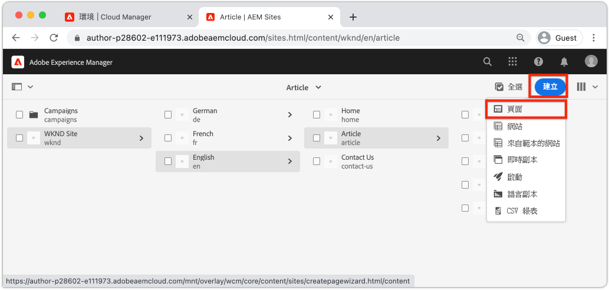

   這樣會啟動「**建立頁面**」精靈。

1. 選擇「**文章頁面**」範本並按一下「**下一步**」。

   AEM 中的頁面是以頁面範本為基礎建立的。 [頁面範本](page-templates.md)的章節會詳細探討頁面範本。

1. 在「**屬性**」下，在「**標題**」中輸入「Hello World」。
1. 將「**名稱**」設定為「`hello-world`」，然後按一下「**建立**」。

   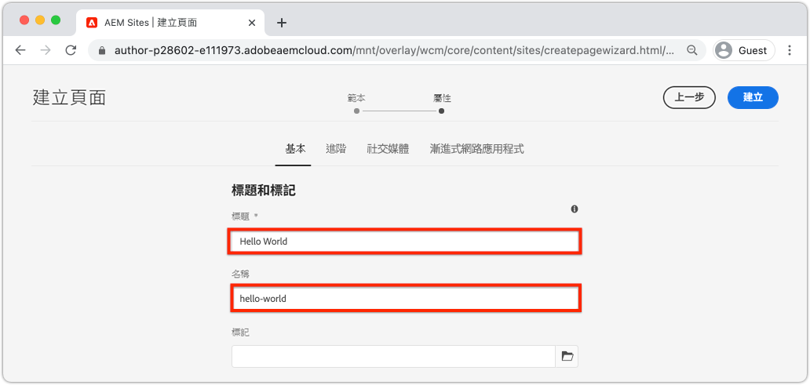

1. 在對話框快顯視窗中，按一下「**開啟**」以開啟新建立的頁面。

## 製作元件 {#author-component}

您可以把 AEM 元件想像成網頁的小型模組化建構區塊。把 UI 拆分成多個邏輯區塊或元件，管理變得更輕鬆。若要重複使用元件，元件必須可以設定。您可以透過作者對話框來完成元件設定。

AEM 提供一組可立即投入生產的[核心元件](https://experienceleague.adobe.com/docs/experience-manager-core-components/using/introduction.html?lang=zh-Hant)。**核心元件**&#x200B;包括基本元素，例如[文字](https://experienceleague.adobe.com/docs/experience-manager-core-components/using/components/text.html?lang=zh-Hant)和[影像](https://experienceleague.adobe.com/docs/experience-manager-core-components/using/components/image.html?lang=zh-Hant)，以及比較複雜的 UI 元素，例如[輪播](https://experienceleague.adobe.com/docs/experience-manager-core-components/using/components/carousel.html?lang=zh-Hant)。

接下來，使用 AEM 頁面編輯器來製作一些元件。

1. 導覽至上一個練習中建立的 **Hello World** 頁面。
1. 確認您處於「**編輯**」模式，並在左側邊欄中按一下「**元件**」圖示。

   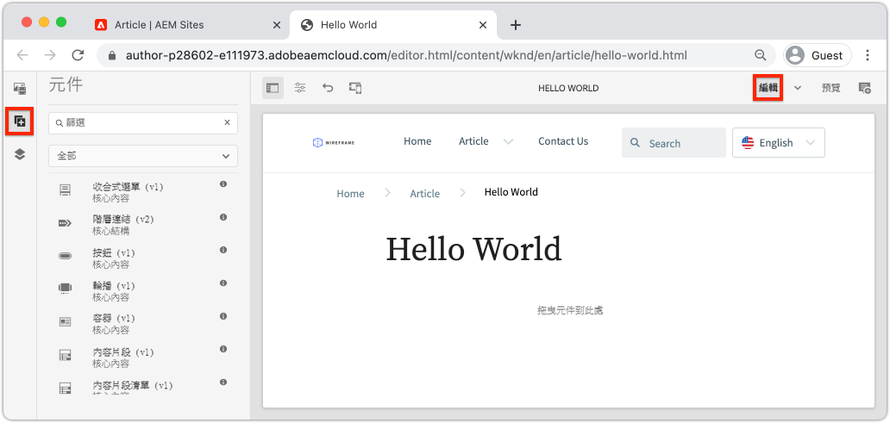

   這樣將開啟元件庫並列出可在頁面上使用的可用元件。

1. 向下捲動並&#x200B;**拖放**&#x200B;一個&#x200B;**文字 (v2)** 元件到頁面的主要可編輯區域。

   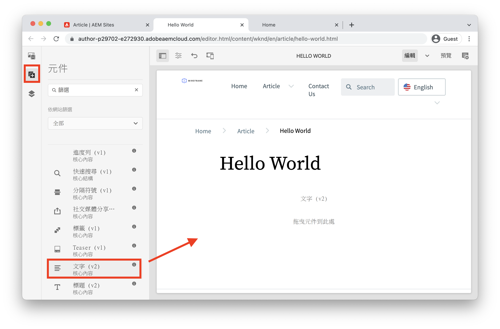

1. 按一下&#x200B;**文字**&#x200B;元件來醒目標示，然後按一下&#x200B;**扳手**&#x200B;圖示開啟元件的對話框。輸入一些文字並將變更儲存到對話框中。

   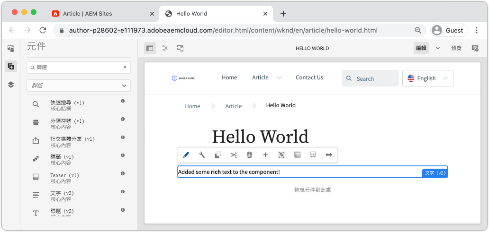

   **文字**&#x200B;元件現在應該在頁面上顯示 RTF 文字。

1. 重複上述步驟，但是不包含拖曳&#x200B;**影像 (v2)** 元件的一個實例到頁面上。開啟&#x200B;**影像**&#x200B;元件的對話框。

1. 在左側邊欄中，切換到&#x200B;**資產尋找器**，只要按一下&#x200B;**資產**&#x200B;圖示即可。
1. **拖放**&#x200B;一個影像到元件對話框中，然後按一下「**完成**」來儲存變更。

   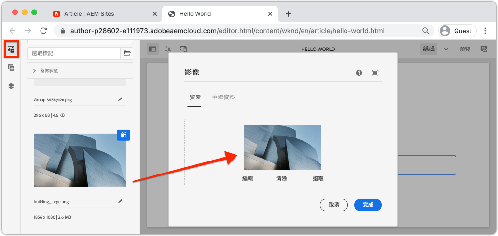

1. 請觀察，頁面上已有一些元件，例如固定的元件「**標題**」、「**導覽**」、「**搜尋**」。這些區域經設定成為頁面範本的一部分，而且無法在個別頁面上修改。下一章將進一步探討這些部分。

您可以自由使用一些其他元件進行實驗。關於每個[核心元件的文件請參閱這裡](https://experienceleague.adobe.com/docs/experience-manager-core-components/using/introduction.html?lang=zh-Hant)。詳細介紹[頁面製作的一系列影片可以參閱這裡](https://experienceleague.adobe.com/docs/experience-manager-learn/sites/page-authoring/aem-sites-authoring-overview.html?lang=zh-Hant)。

## 發佈更新 {#publish-updates}

AEM 環境分為 **Author 服務**&#x200B;和 **Publish 服務**。在本章中，我們對 **Author 服務**&#x200B;上的網站進行若干修改。為了讓網站訪客檢視變更，我們必須將變更發佈到 **Publish 服務**。

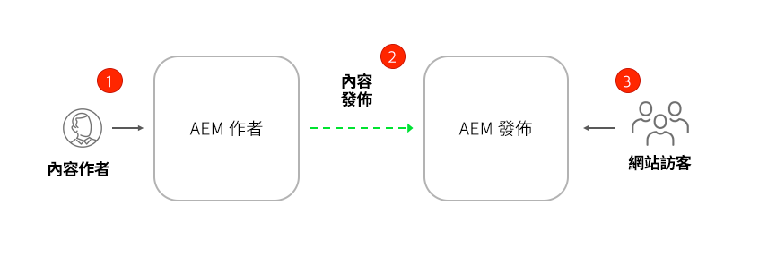

*內容從作者環境發佈到發佈環境的概要流程*

**1.**&#x200B;內容作者更新網站內容。可以預覽、審閱這些更新，以及核准更新並推送上線。

**2.**&#x200B;發佈內容。可以按需求或是安排未來某個日子進行出版。

**3.** 網站訪客將會在 Publish 服務上看到相關變更。

### 發佈變更

接下來，我們要發佈變更。

1. 從 AEM 開始畫面導覽至「**Sites**」並選取「**WKND 網站**」。
1. 在選單列按一下「**管理出版物**」。

   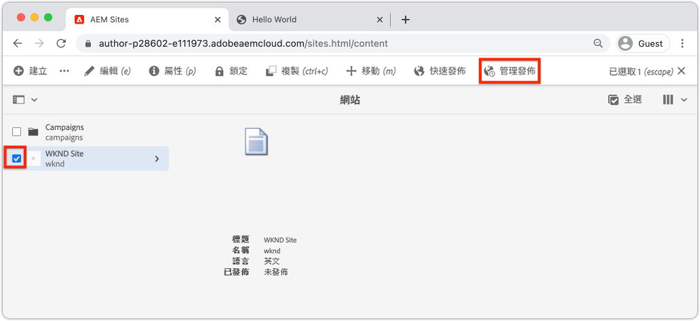

   由於這是全新的網站，我們想要發佈所有頁面，並可以使用管理發佈精靈來準確定義需要發佈的內容。

1. 在「**選項**」之下，保留預設設定「**發佈**」並安排「**現在**」進行。按一下「**下一步**」。
1. 在「**範圍**」下，選取「**WKND 網站**」，然後按一下「**包含子系設定**」。在對話框中，勾選「**包括子系**」。取消勾選其餘的方塊，以確保發佈整個網站。

   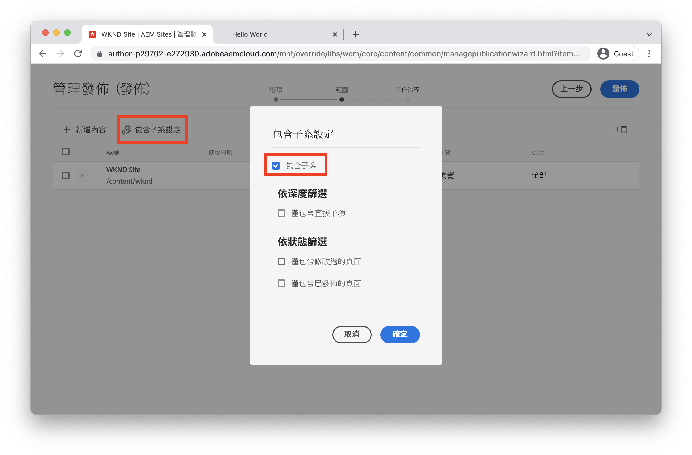

1. 按一下「**已發佈參考**」按鈕。確認對話框中所有項目皆已勾選。這將包括&#x200B;**標準網站範本**&#x200B;以及由網站範本產生的數個設定。按一下「**完成**」進行更新。

   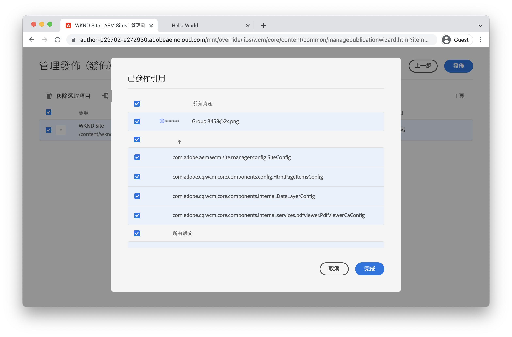

1. 最後，勾選「**WKND 網站**」旁邊的方塊，然後按一下右上角的「**下一步**」。
1. 在「**工作流程**」步驟中，輸入「**工作流程標題**」。此標題可以輸入任何文字，而且日後作為稽核軌跡的一部分很有幫助。輸入「初次發佈」，然後按一下「**發佈**」。

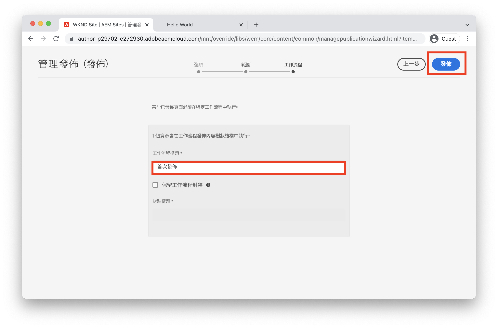

## 檢視已發佈的內容 {#publish}

接下來，導覽到 Publish 服務來檢視變更。

1. 取得 Publish 服務 URL 的一個簡單方法，是複製作者 URL 並將字詞 `author` 取代為 `publish`。例如：

   * **作者 URL** - `https://author-pYYYY-eXXXX.adobeaemcloud.com/`
   * **發佈 URL** - `https://publish-pYYYY-eXXXX.adobeaemcloud.com/`

1. 在發佈 URL 中新增 `/content/wknd.html`，以便最後的 URL 變成這樣：`https://publish-pYYYY-eXXXX.adobeaemcloud.com/content/wknd.html`。

   >[!NOTE]
   >
   > 若您在[建立網站](create-site.md)時提供唯一名稱的話，變更 `wknd.html` 以便和您的網站名稱相符。

1. 導覽至發佈 URL，您應該會看到該網站，但沒有任何 AEM 製作功能。

   

1. 使用「**導覽**」選單按一下「**文章** > **Hello World**」，以便導覽至先前建立的 Hello World 頁面。
1. 返回 **AEM Author 服務**，然後在頁面編輯器中進行一些其他內容變更。
1. 按一下「**頁面屬性**」圖示 >「**發佈頁面**」，可直接從頁面編輯器發佈這些變更

   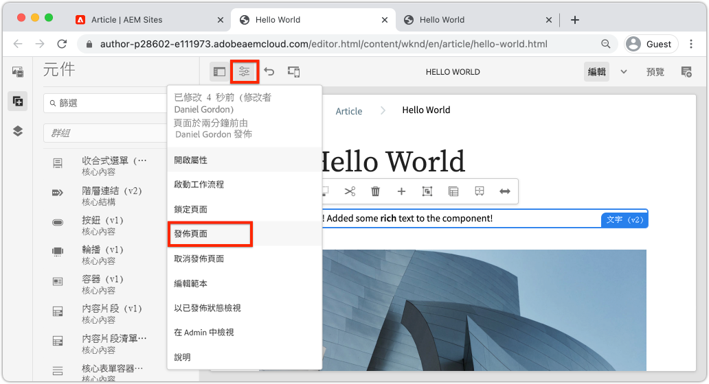

1. 返回「**AEM Publish 服務**」來檢視變更。您很可能&#x200B;**不會**&#x200B;馬上看到更新。這是因為 **AEM Publish 服務**[透過 Apache 網頁伺服器和內容傳遞網路來包含快取功能](https://experienceleague.adobe.com/docs/experience-manager-cloud-service/implementing/content-delivery/caching.html?lang=zh-Hant)。在預設情況下，HTML 內容快取的時間約 5 分鐘。

1. 若要為了測試/除錯目的而略過快取，直接新增一個查詢參數如 `?nocache=true` 即可。URL 看起來像這樣：`https://publish-pYYYY-eXXXX.adobeaemcloud.com/content/wknd/en/article/hello-world.html?nocache=true`。有關快取策略和可用設定的更多詳細資料[請參閱這裡](https://experienceleague.adobe.com/docs/experience-manager-cloud-service/implementing/content-delivery/overview.html?lang=zh-Hant)。

1. 您也可以在 Cloud Manager 中找到 Publish 服務的 URL。導覽至「**Cloud Manager 程式** > **環境** > **環境**」。

   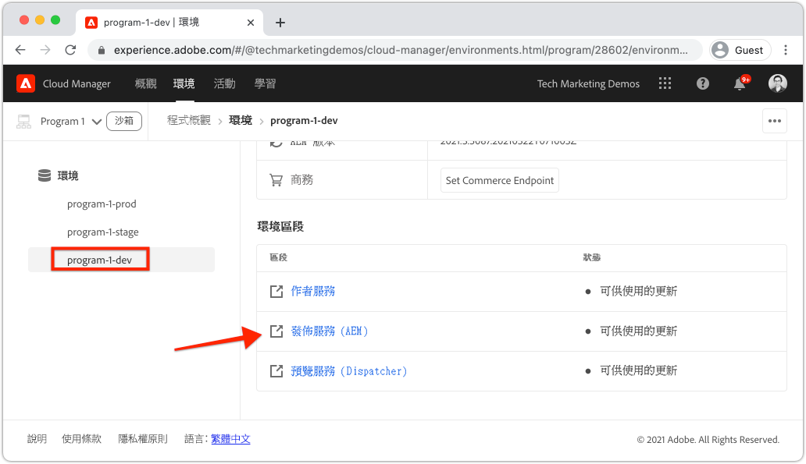

   您可以在「**環境區段**」下找到 **Author** 和 **Publish** 服務的連結。

## 恭喜！ {#congratulations}

恭喜，您剛剛已製作並發佈變更到您的 AEM 網站！

### 後續步驟 {#next-steps}

在現實世界的實施中，通常在建立網站之前，會先使用模型和 UI 設計進行網站規劃。了解在[使用 Adobe XD 進行 UI 規劃](./ui-planning-adobe-xd.md)時，如何利用 Adobe XD UI 套件來設計和加速 Adobe Experience Manager Sites 實施。

要繼續探索 AEM Sites 的功能嗎？歡迎直接進入[頁面範本](./page-templates.md)章節，以了解頁面範本和頁面之間的關係。

