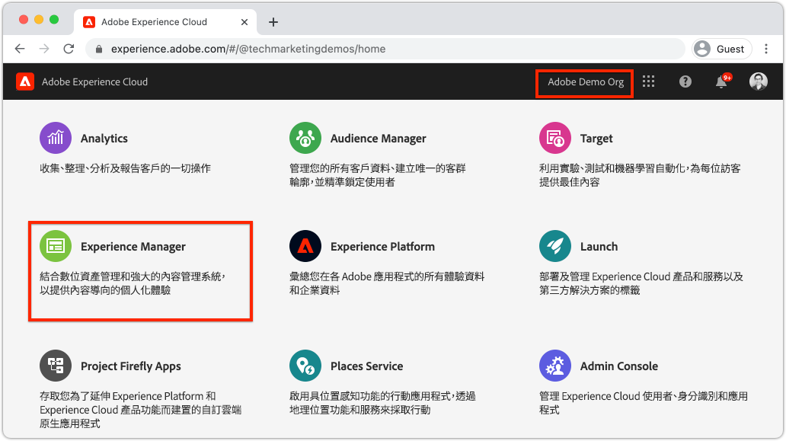
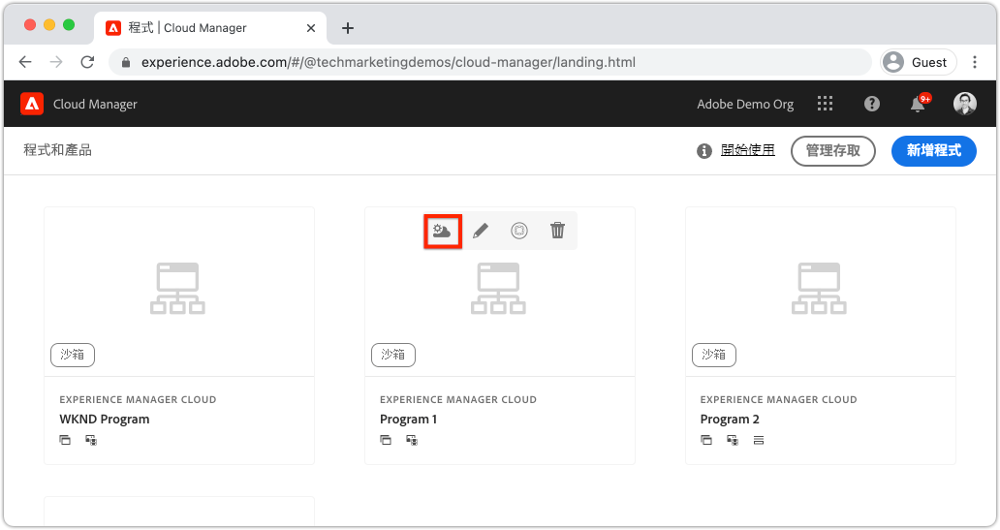
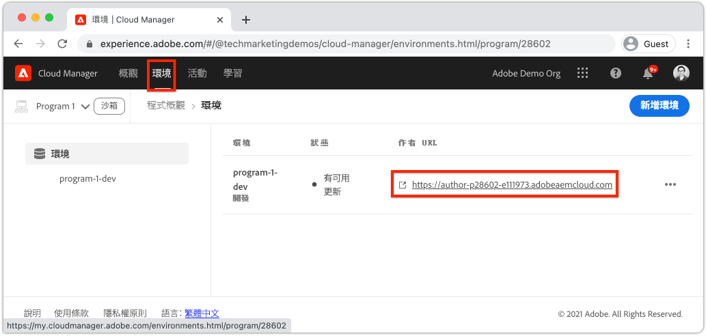
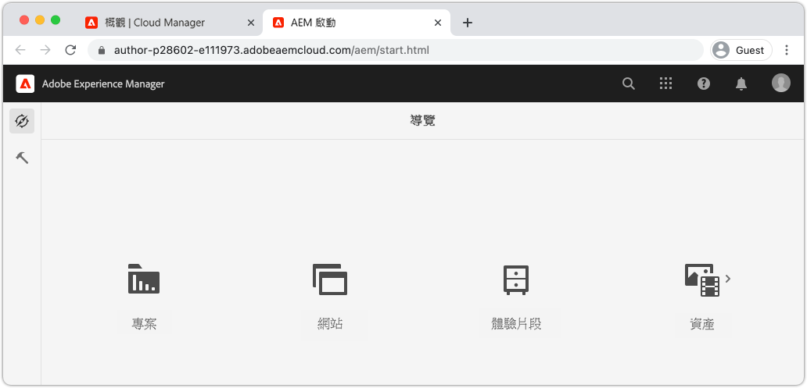
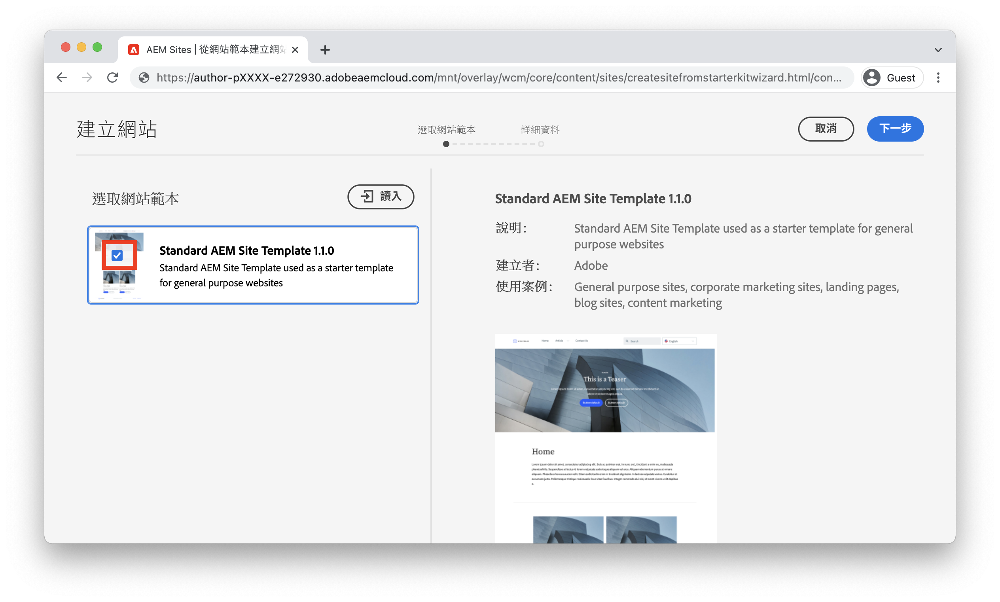
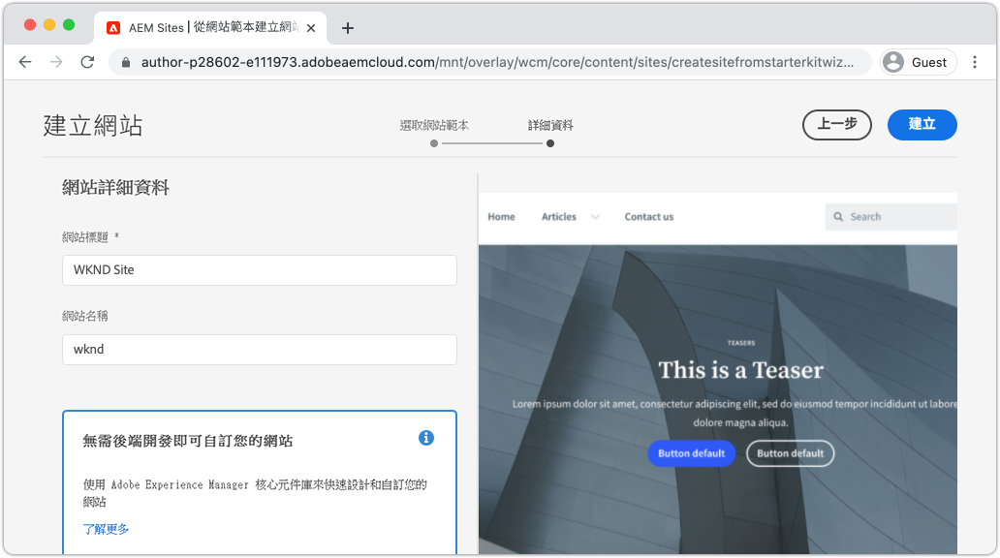
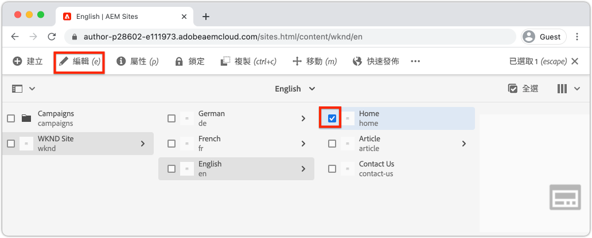
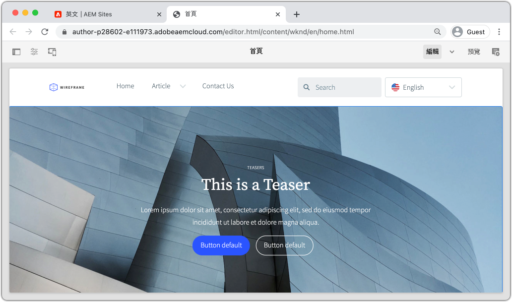

# 建立站點 {#create-site}

作為快速建立網站的一部分，請使用Adobe Experience Manager的「網站建立嚮導」AEM來生成新網站。 由Adobe提供的標準站點模板用作新站點的起點。

## 必備條件 {#prerequisites}

本章中的步驟將在Adobe Experience Manager as a Cloud Service環境中進行。 確保您對環境具有管理訪AEM問權。 建議使用 [沙盒程式](https://experienceleague.adobe.com/docs/experience-manager-cloud-service/onboarding/getting-access/sandbox-programs/introduction-sandbox-programs.html) 和 [開發環境](https://experienceleague.adobe.com/docs/experience-manager-cloud-service/implementing/using-cloud-manager/manage-environments.html) 完成本教程時。

查看 [登記文檔](https://experienceleague.adobe.com/docs/experience-manager-cloud-service/onboarding/home.html) 的子菜單。

## 目標 {#objective}

1. 瞭解如何使用網站建立嚮導生成新網站。
1. 瞭解網站模板的角色。
1. 瀏覽生成的AEM站點。

## 登錄到Adobe Experience Manager作者 {#author}

作為第一步，請登錄到您的AEMas a Cloud Service環境。 環AEM境在 **作者服務** 和 **發佈服務**。

* **作者服務**  — 建立、管理和更新站點內容的位置。 通常，只有內部用戶才能訪問 **作者服務** 並位於登錄螢幕後。
* **發佈服務**  — 主持即時網站。 這是最終用戶將看到的服務，並且通常可公開使用。

本教程的大部分內容將使用 **作者服務**。

1. 導航到Adobe Experience Cloud [https://experience.adobe.com/](https://experience.adobe.com/)。 使用個人帳戶或公司/學校帳戶登錄。
1. 確保在菜單中選擇了正確的「組織」，然後按一下 **Experience Manager**。

   

1. 下 **雲管理器** 按一下 **啟動**。
1. 將滑鼠懸停在要使用的程式上，然後按一下 **雲管理器程式** 表徵圖

   

1. 在頂部菜單中按一下 **環境** 查看已設定的環境。

1. 查找要使用的環境，然後按一下 **作者URL**。

   

   >[!NOTE]
   >
   >建議使用 **開發** 環境。

1. 將啟動新頁籤AEM **作者服務**。 按一下 **使用Adobe登錄** 並且您應使用相同的Experience Cloud憑據自動登錄。

1. 重定向和驗證後，您現在應該看到AEM開始螢幕。

   

>[!NOTE]
>
> 訪問Experience Manager時遇到問題？ 查看 [登記文檔](https://experienceleague.adobe.com/docs/experience-manager-cloud-service/onboarding/home.html)

## 下載基本網站模板

「站點模板」為新站點提供起點。 站點模板包括一些基本主題、頁面模板、配置和示例內容。 「站點模板」中包含的內容完全由開發人員決定。 Adobe提供 **基本網站模板** 加快新實施。

1. 開啟新瀏覽器頁籤並導航到GitHub上的「基本站點模板」項目： [https://github.com/adobe/aem-site-template-standard](https://github.com/adobe/aem-site-template-standard)。 該項目是開源的，並獲得許可供任何人使用。
1. 按一下 **發行** 導航到 [最新版本](https://github.com/adobe/aem-site-template-standard/releases/latest)。
1. 展開 **資產** 下拉並下載模板zip檔案：

   

   此zip檔案將用於下一練習。

   >[!NOTE]
   >
   > 本教程使用版本編寫 **1.1.0** 的子菜單。 啟動新項目以供生產使用時，始終建議使用最新版本。

## 建立新站點

接下來，使用上一練習中的「站點模板」生成新站點。

1. 返回環AEM境。 從「開始AEM」螢幕導航到 **站點**。
1. 在右上角按一下 **建立** > **站點（模板）**。 這將提出 **建立站點嚮導**。
1. 下 **選擇站點模板** 按一下 **導入** 按鈕

   上載 **.zip** 從上一練習下載的模板檔案。

1. 選擇 **基本站AEM點模板** 按一下 **下一個**。

   

1. 下 **站點詳細資訊** > **網站標題** 輸入 `WKND Site`。

   在實際實施中，「WKND站點」將被您公司或組織的品牌名稱替換。 在本教程中，我們正在模擬為虛幻的生活方式品牌「WKND」建立站點。

1. 下 **站點名稱** 輸入 `wknd`。

   

   >[!NOTE]
   >
   > 如果使用共用環AEM境，請向 **站點名稱**。 例如 `wknd-site-johndoe`。 這將確保多個用戶可以完成同一教程，而不會發生任何衝突。

1. 按一下 **建立** 的子菜單。 按一下 **完成** 的 **成功** 對話框AEM。

## 瀏覽新站點

1. 導航到AEM Sites控制台（如果尚未）。
1. 新 **WKND站點** 已生成。 它將包括具有多語言層次結構的站點結構。
1. 開啟 **英語** > **首頁** 頁面 **編輯** 按鈕：

   

1. 已建立啟動程式內容，並且有幾個元件可添加到頁面。 對這些元件進行實驗，以瞭解其功能。 您將在下一章中學習元件的基本知識。

   

   *站點模板提供的示例內容*

## 恭喜！ {#congratulations}

祝賀您，您剛剛建立了第一個AEM網站！

### 後續步驟 {#next-steps}

使用Adobe Experience Manager的頁面編AEM輯器，更新 [編寫內容並發佈](author-content-publish.md) 一章。 瞭解如何配置原子元件以更新內容。 瞭解AEM作者和發佈環境之間的差異，並瞭解如何將更新發佈到即時站點。
