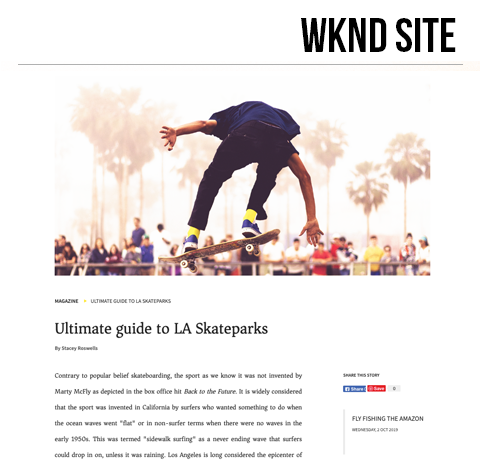

# 頁面範本 {#page-templates}

在本章中，我們將探討頁面範本和頁面之間的關係。我們以 [ AdobeXD](https://www.adobe.com/tw/products/xd.html) 中某些模型為基礎，建置一個無樣式的雜誌文章範本。在建置範本的過程中，也會說明核心元件和進階原則設定。

## 先決條件 {#prerequisites}

這是包含多個部分的教學課程，並假設您已經完成「[製作內容和發佈發更](./author-content-publish.md)」章節所述的步驟。

## 目標

1. 了解頁面範本的詳細資訊以及如何使用原則對頁面內容執行精細控制。
1. 了解範本與頁面如何連結。
1. 建立新範本並製作一個頁面。

## 您將要建置的內容 {#what-you-will-build}

在這一部分的教學課程中，您將建置一個新的雜誌文章頁面範本，該範本可用來建立新的雜誌文章並與通用結構保持一致。該範本是以設計以及在 AdobeXD 中產生的 UI 套件為基礎。本章的重點僅在於建置範本的結構或框架。沒有實施任何樣式，但範本和頁面皆可正常運作。

## 建立雜誌文章頁面範本

建立頁面時，您必須選取範本，以用作建立新頁面的基礎。範本定義所產生頁面的結構、初始內容和允許使用的元件。

[頁面範本](https://experienceleague.adobe.com/docs/experience-manager-cloud-service/sites/authoring/features/templates.html?lang=zh-Hant)包含三個主要部分：

1. **結構** - 定義屬於範本一部分的元件。內容作者無法編輯這些元件。
1. **初始內容** - 定義範本開始時使用的元件，而內容作者可以編輯和/或刪除這些元件
1. **原則** - 定義各個元件的行為方式以及作者可以使用哪些選項的設定。

接下來，在 AEM 中建立一個與模型結構相符的新範本。這個動作將發生在 AEM 本機實例中。請按照以下影片的步驟操作：

>[!VIDEO](https://video.tv.adobe.com/v/332915?quality=12&learn=on)

您可以使用以下縮圖來找出您的範本 (或上傳您自己的範本！)

### 解決方案封裝

已完成的[雜誌範本解決方案](assets/page-templates/WKND-Magazine-Template-SOLUTION-1.1.zip)可以透過封裝管理員下載及安裝。

## 使用體驗片段更新頁首和頁尾 {#experience-fragments}

在建立全域內容 (例如頁首或頁尾) 時，常見的做法是使用[體驗片段](https://experienceleague.adobe.com/docs/experience-manager-learn/sites/experience-fragments/experience-fragments-feature-video-use.html?lang=zh-Hant)。使用者可以利用體驗片段，將多個元件結合起來建立成單一可參考的元件。體驗片段的優點在於支援多網站管理和[本地化](https://experienceleague.adobe.com/docs/experience-manager-core-components/using/components/experience-fragment.html?lang=zh-hant#localized-site-structure)。

網站範本產生頁首和頁尾。接下來，更新體驗片段以和模型相符。請按照以下影片的步驟操作：

>[!VIDEO](https://video.tv.adobe.com/v/3447810?quality=12&learn=on&captions=chi_hant)

以下影片的概括性步驟：

1. 下載範例內容套件 **[WKND-Starter-Assets-Skate-Article-1.2.zip](assets/page-templates/WKND-Starter-Assets-Skate-Article-1.2.zip)**。
1. 使用封裝管理員上傳及安裝內容套件。
1. 更新頁首和頁尾體驗片段以使用 WKND 標誌

## 建立雜誌文章頁面

接下來，使用雜誌文章頁面範本建立新頁面。編寫頁面內容以和網站模型相符。請按照以下影片的步驟操作：

>[!VIDEO](https://video.tv.adobe.com/v/332917?quality=12&learn=on)

使用[所提供的文字](./assets/page-templates/la-skateparks-copy.txt)來填入文章正文。

## 恭喜！ {#congratulations}

恭喜，您剛剛已使用 Adobe Experience Manager Sites 建立一個新範本和頁面。

### 後續步驟 {#next-steps}

目前，此雜誌文章頁面和網站與 WKND 的品牌風格並不相符。依照「[主題](theming.md)」教學課程，了解將全域樣式套用到網站所使用的 CSS 和 Javascript 前端程式碼的更新最佳做法。

### 解決方案封裝

本章的解決方案封裝提供下載：[WKND-Magazine-Template-SOLUTION-1.0.zip](assets/page-templates/WKND-Magazine-Template-SOLUTION-1.0.zip)。
