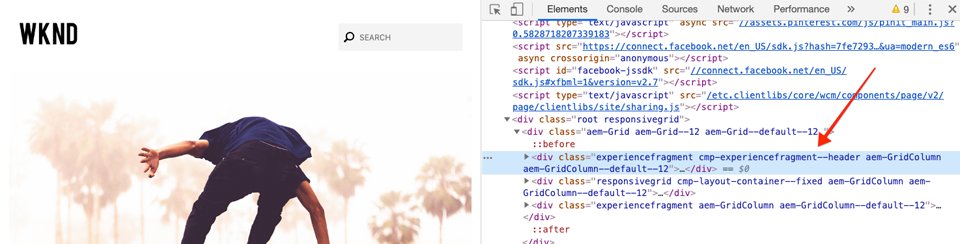

# 使用樣式系統{#developing-with-the-style-system}進行開發

瞭解如何使用Experience Manager的Style System建置個別樣式並重複使用核心元件。 本教學課程涵蓋使用範本編輯器的品牌專用CSS和進階原則組態擴充核心元件的樣式系統開發。

## 必備條件 {#prerequisites}

檢閱設定[本機開發環境](overview.md#local-dev-environment)所需的工具和指示。

此外，建議您檢閱[用戶端程式庫和前端工作流程](client-side-libraries.md)教學課程，以瞭解用戶端程式庫的基礎以及AEM專案中內建的各種前端工具。

### Starter Project

查看教學課程所建立的基線程式碼：

1. 克隆[github.com/adobe/aem-guides-wknd](https://github.com/adobe/aem-guides-wknd)儲存庫。
1. 查看`style-system/start`分支

   ```shell
   $ git clone git@github.com:adobe/aem-guides-wknd.git ~/code/aem-guides-wknd
   $ cd ~/code/aem-guides-wknd
   $ git checkout style-system/start
   ```

1. 使用您的Maven技巧，將程式碼庫部署至本機AEM實例：

   ```shell
   $ cd ~/code/aem-guides-wknd
   $ mvn clean install -PautoInstallSinglePackage
   ```

您隨時都可以在[GitHub](https://github.com/adobe/aem-guides-wknd/tree/style-system/solution)上檢視完成的程式碼，或切換至分支`style-system/solution`，在本機檢出程式碼。

## 目標

1. 瞭解如何使用樣式系統將品牌專屬的CSS套用至AEM核心元件。
1. 瞭解BEM記法，以及如何使用它仔細調整樣式。
1. 使用可編輯的模板應用高級策略配置。

## 您將建立的{#what-you-will-build}

在本章中，我們將使用[Style System功能](https://docs.adobe.com/content/help/en/experience-manager-learn/sites/page-authoring/style-system-feature-video-use.html)來建立「文章」頁面上使用的多種元件變化。 我們也會使用樣式系統來建立結構元素的變化，例如頁首／頁尾和版面容器。

>[!VIDEO](https://video.tv.adobe.com/v/30386/?quality=12&learn=on)

## 背景 {#background}

[Style System](https://docs.adobe.com/content/help/en/experience-manager-65/developing/components/style-system.html)可讓開發人員和範本編輯器建立元件的多種視覺變化。 然後，作者可以決定在撰寫頁面時使用哪種樣式。 在教學課程的其餘部分，我們將運用Style System來建立數種獨特的樣式，同時運用低程式碼的核心元件。

「樣式系統」的一般概念是，作者可以選擇元件外觀的各種樣式。 &quot;styles&quot;由附加的CSS類作為後盾，這些類會插入到元件的外部div中。 在用戶端程式庫中，會根據這些樣式類別新增CSS規則，讓元件變更外觀。

您可在此處找到[有關Style System的詳細文檔](https://docs.adobe.com/content/help/en/experience-manager-65/developing/components/style-system.html)。 此外，還有一段絕佳的[技術視訊，可讓您瞭解Style System](https://docs.adobe.com/content/help/en/experience-manager-learn/sites/developing/style-system-technical-video-understand.html)。

## 標題元件樣式{#title-component}

此時，[Title Component](https://docs.adobe.com/content/help/en/experience-manager-core-components/using/components/title.html)已作為&#x200B;**ui.apps**&#x200B;模組的一部分，轉存至`/apps/wknd/components/content/title`下的專案中。 在`ui.frontend/src/main/webpack/base/sass/_elements.scss`檔案的&#x200B;**ui.frontend**&#x200B;模組中，已實作標題元素(`H1`、`H2`、`H3`...)的預設樣式。`_elements.scss`

### 下划線樣式

[WKND文章designs](assets/pages-templates/wknd-article-design.xd)包含具有底線的Title元件的獨特樣式。 「樣式系統」(Style System)可用來允許作者添加下划線樣式，而不是建立兩個元件或修改元件對話框。


### 檢查標題元件標籤

作為前端開發人員，設定核心元件樣式的第一步是瞭解元件產生的標籤。

作為生成項目的一部分，原型嵌入&#x200B;**核心元件示例**&#x200B;項目。 對於開發人員和內容作者，本文提供簡單的參考，以便瞭解核心元件的所有功能。 即時版本也[available](https://opensource.adobe.com/aem-core-wcm-components/library.html)。

1. 開啟新瀏覽器並檢視標題元件：

   本機AEM例項：[http://localhost:4502/editor.html/content/core-components-examples/library/title.html](http://localhost:4502/editor.html/content/core-components-examples/library/title.html)

   即時範例：[https://opensource.adobe.com/aem-core-wcm-components/library/title.html](https://opensource.adobe.com/aem-core-wcm-components/library/title.html)

1. 以下是Title元件的標籤：

   ```html
   <div class="cmp-title">
       <h1 class="cmp-title__text">Lorem Ipsum</h1>
   </div>
   ```

   標題元件的BEM符號：

   ```plain
   BLOCK cmp-title
       ELEMENT cmp-title__text
   ```

1. Style系統將CSS類添加到元件周圍的外部div。 因此，我們要定位的標籤將類似於以下內容：

   ```html
   <div class="STYLE-SYSTEM-CLASS-HERE"> <!-- Custom CSS class - implementation gets to define this -->
       <div class="cmp-title">
           <h1 class="cmp-title__text">Lorem Ipsum</h1>
       </div>
   </div>
   ```

### 實作底線樣式- ui.frontend

接下來，我們將使用專案的&#x200B;**ui.frontend**&#x200B;模組實作底線樣式。 我們將使用與&#x200B;**ui.frontend**&#x200B;模組搭售的webpack開發伺服器，在&#x200B;*部署至AEM的本機例項之前預覽樣式*。

1. 從&#x200B;**ui.frontend**&#x200B;模組中運行以下命令，以啟動webpack dev伺服器：

   ```shell
   $ cd ~/code/aem-guides-wknd/ui.frontend/
   $ npm start
   
   > aem-maven-archetype@1.0.0 start code/aem-guides-wknd/ui.frontend
   > webpack-dev-server --open --config ./webpack.dev.js
   ```

   這應該會在[http://localhost:8080](http://localhost:8080)開啟瀏覽器。

   >[!NOTE]
   >
   > 如果影像顯示中斷，請確定起始專案已部署至AEM的本機例項（在埠4502上執行），而使用的瀏覽器也已登入本機AEM例項。

   

1. 在Eclipse或您選擇的IDE中，開啟位於：`ui.frontend/src/main/webpack/static/index.html`。 `index.html`這是webpack開發伺服器使用的靜態標籤。
1. 在`index.html`中，通過搜索文檔&#x200B;*cmp-title*，查找Title元件的實例以向中添加下划線樣式。 選擇文字&#x200B;*&quot;Vans oft the Wall Skatepark&quot;*&#x200B;的Title元件（第218行）。 將類`cmp-title--underline`添加到周圍的div:

   ```html
    <!-- before -->
    <div class="title aem-GridColumn aem-GridColumn--default--8">
        <div class="cmp-title">
            <h2 class="cmp-title__text">Vans off the Wall Skatepark</h2>
        </div>
    </div>
   ```

   ```html
    <!-- After -->
    <div class="cmp-title--underline title aem-GridColumn aem-GridColumn--default--8">
        <div class="cmp-title">
            <h2 class="cmp-title__text">Vans off the Wall Skatepark</h2>
        </div>
    </div>
   ```

1. 返回瀏覽器並驗證標籤中是否反映了額外類。
1. 返回&#x200B;**ui.frontend**&#x200B;模組，並更新位於以下位置的檔案`title.scss`:`ui.frontend/src/main/webpack/components/content/title/scss/title.scss`:

   ```css
   /* Add Title Underline Style */
   .cmp-title--underline {
   
       .cmp-title {
       }
   
       .cmp-title__text {
           &:after {
           display: block;
               width: 84px;
               padding-top: 8px;
               content: '';
               border-bottom: 2px solid $brand-primary;
           }
       }
   }
   ```

   >[!NOTE]
   >
   >始終將樣式嚴格限定在目標元件上，這被認為是一種最佳做法。 這可確保額外樣式不會影響頁面的其他區域。
   >
   >所有核心元件均遵循&#x200B;**[BEM符號](https://github.com/adobe/aem-core-wcm-components/wiki/css-coding-conventions)**。 建立元件的預設樣式時，最佳做法是定位外部CSS類別。 另一個最佳實務是定位核心元件BEM符號（而非HTML元素）指定的類別名稱。

1. 再次返回瀏覽器，您應看到已添加的下划線樣式：

   

1. 停止Webpack開發伺服器。

### 新增標題原則

接下來，我們需要為「標題」元件新增原則，以允許內容作者選擇「底線」樣式以套用至特定元件。 這是使用AEM中的範本編輯器來完成。

1. 使用您的Maven技巧，將程式碼庫部署至本機AEM實例：

   ```shell
   $ cd ~/code/aem-guides-wknd
   $ mvn clean install -PautoInstallSinglePackage
   ```

1. 導覽至&#x200B;**文章頁面範本**，網址為：[http://localhost:4502/editor.html/conf/wknd/settings/wcm/templates/article-page-template/structure.html](http://localhost:4502/editor.html/conf/wknd/settings/wcm/templates/article-page-template/structure.html)。

1. 在&#x200B;**結構**&#x200B;模式中，在主&#x200B;**佈局容器**&#x200B;中，選擇&#x200B;*允許的元件*&#x200B;下列&#x200B;**標題**&#x200B;元件旁的&#x200B;**策略**&#x200B;表徵圖：

   

1. 為Title元件建立新策略，其值如下：

   *政策標題**: **WKND標題**

   *屬性* >樣 *式標籤* >新 *增樣式*

   **下划線** :  `cmp-title--underline`

   

   按一下&#x200B;**Done**&#x200B;保存對「標題」策略的更改。

   >[!NOTE]
   >
   > 值`cmp-title--underline`與我們在&#x200B;**ui.frontend**&#x200B;模組中開發時先前定位的CSS類別相符。

### 應用下划線樣式

最後，作為作者，我們可以選擇將底線樣式應用到某些「標題元件」。

1. 導覽至AEM Sites編輯器中的&#x200B;**La Skateparks**&#x200B;文章，網址為：[http://localhost:4502/editor.html/content/wknd/us/en/magazine/guide-la-skateparks.html](http://localhost:4502/editor.html/content/wknd/us/en/magazine/guide-la-skateparks.html)
1. 在&#x200B;**編輯**&#x200B;模式中，選擇標題元件。 按一下&#x200B;**畫筆**&#x200B;表徵圖並選擇&#x200B;**下划線**&#x200B;樣式：

   

   身為作者，您應該可以開啟／關閉樣式。

1. 按一下「頁面資訊&#x200B;**」圖示> 「以發佈方式檢視」，以檢查AEM編輯器外的頁面。******

   

   使用您的瀏覽器開發人員工具驗證標題元件周圍的標籤是否已將CSS類別`cmp-title--underline`套用至外部div。

## 文本元件樣式{#text-component}

接下來，我們將重複類似步驟，以對[文字元件](https://docs.adobe.com/content/help/en/experience-manager-core-components/using/components/text.html)套用獨特樣式。 Text元件已轉譯至`/apps/wknd/components/content/text`下方的專案中，成為&#x200B;**ui.apps**&#x200B;模組的一部分。 段落元素的預設樣式已建置在&#x200B;**ui.frontend**&#x200B;模組中，位於`_elements.scss`檔案下方的`ui.frontend/src/main/webpack/base/sass/_elements.scss`模組中。

### 報價塊樣式

[WKND文章designs](assets/pages-templates/wknd-article-design.xd)包含具有引號區塊的Text元件的獨特樣式：


### 檢查文本元件標籤

我們將再次檢查Text元件的標籤。

1. 開啟新的瀏覽器並檢視Text元件做為核心元件庫的一部分：
本機AEM例項：[http://localhost:4502/editor.html/content/core-components-examples/library/text.html](http://localhost:4502/editor.html/content/core-components-examples/library/text.html)

   即時範例：[https://opensource.adobe.com/aem-core-wcm-components/library/text.html](https://opensource.adobe.com/aem-core-wcm-components/library/text.html)

1. 以下是Text元件的標籤：

   ```html
   <div class="cmp-text">
       <p><b>Bold </b>can be used to emphasize a word or phrase, as can <u>underline</u> and <i>italics.&nbsp;</i><sup>Superscript</sup> and <sub>subscript</sub> are useful for mathematical (E = mc<sup>2</sup>) or scientific (h<sub>2</sub>O) expressions. Paragraph styles can provide alternative renderings, such as quote sections:</p>
       <blockquote>"<i>Be yourself; everyone else is already taken"</i></blockquote>
       <b>- Oscar Wilde</b>
   </div>
   ```

   標題元件的BEM符號：

   ```plain
   BLOCK cmp-text
       ELEMENT
   ```

1. Style系統將CSS類添加到元件周圍的外部div。 因此，我們要定位的標籤將類似於以下內容：

   ```html
   <div class="STYLE-SYSTEM-CLASS-HERE"> <!-- Custom CSS class - implementation gets to define this -->
       <div class="cmp-text">
           <p><b>Bold </b>can be used to emphasize a word or phrase, as can <u>underline</u> and <i>italics.&nbsp;</i><sup>Superscript</sup> and <sub>subscript</sub> are useful for mathematical (E = mc<sup>2</sup>) or scientific (h<sub>2</sub>O) expressions. Paragraph styles can provide alternative renderings, such as quote sections:</p>
           <blockquote>"<i>Be yourself; everyone else is already taken"</i></blockquote>
           <b>- Oscar Wilde</b>
       </div>
   </div>
   ```

### 實作報價區塊樣式- ui.frontend

接下來，我們將使用項目的&#x200B;**ui.frontend**&#x200B;模組實施報價塊樣式。

1. 從&#x200B;**ui.frontend**&#x200B;模組中運行以下命令，以啟動webpack dev伺服器：

   ```shell
   $ cd ~/code/aem-guides-wknd/ui.frontend/
   $ npm start
   
   > aem-maven-archetype@1.0.0 start code/aem-guides-wknd/ui.frontend
   > webpack-dev-server --open --config ./webpack.dev.js
   ```

1. 在Eclipse或您選擇的IDE中，開啟位於：`ui.frontend/src/main/webpack/static/index.html`。 `index.html`這是webpack開發伺服器使用的靜態標籤。
1. 在`index.html`中，通過搜索文本&#x200B;*&quot;Jacob Wester&quot;*（第210行）查找文本元件的實例。 將類`cmp-text--quote`添加到周圍的div:

   ```html
    <!-- before -->
    <div class="text aem-GridColumn aem-GridColumn--default--8">
        <div class="cmp-text">
            <blockquote>"There is no better place to shred then Los Angeles"</blockquote>
            <p>Jacob Wester - Pro Skater</p>
        </div>
    </div>
   ```

   ```html
    <!-- After -->
    <div class="cmp-text--quote text aem-GridColumn aem-GridColumn--default--8">
        <div class="cmp-text">
            <blockquote>"There is no better place to shred then Los Angeles"</blockquote>
            <p>Jacob Wester - Pro Skater</p>
        </div>
    </div>
   ```

1. 返回瀏覽器並驗證標籤中是否反映了額外類。
1. 返回&#x200B;**ui.frontend**&#x200B;模組，並更新位於以下位置的檔案`text.scss`:`ui.frontend/src/main/webpack/components/content/text/scss/text.scss`:

   ```css
   /* WKND Text Quote style */
   
   .cmp-text--quote {
   
       .cmp-text {
           background-color: $brand-third;
           margin: 1em 0em;
           padding: 1em;
   
           blockquote {
               border: none;
               font-size: $font-size-h2;
               font-family: $font-family-serif;
               padding: 14px 14px;
               margin: 0;
               margin-bottom: 0.5em;
   
               &:after {
                   border-bottom: 2px solid $brand-primary; /*yellow border */
                   content: '';
                   display: block;
                   position: relative;
                   top: 0.25em;
                   width: 80px;
               }
           }
   
           p {
               font-size:    $font-size-large;
               font-family:  $font-family-serif;
           }
       }
   }
   ```

   >[!CAUTION]
   >
   > 在此範例中，原始HTML元素會依樣式定位。 這是因為「文字」元件為內容作者提供了Rich Text Editor。 直接針對RTE內容建立樣式時應謹慎，而且更重要的是要嚴格地調整樣式範圍。

1. 再次返回瀏覽器，您應看到已添加的報價塊樣式：

   

1. 停止Webpack開發伺服器。

### 新增文字原則

接下來，為Text元件新增原則。

1. 使用您的Maven技巧，將程式碼庫部署至本機AEM實例：

   ```shell
   $ cd ~/code/aem-guides-wknd
   $ mvn clean install -PautoInstallSinglePackage
   ```

1. 導覽至&#x200B;**文章頁面範本**，網址為：[http://localhost:4502/editor.html/conf/wknd/settings/wcm/templates/article-page-template/structure.html](http://localhost:4502/editor.html/conf/wknd/settings/wcm/templates/article-page-template/structure.html)。

1. 在&#x200B;**結構**&#x200B;模式中，在主&#x200B;**佈局容器**&#x200B;中，選擇&#x200B;*允許的元件*&#x200B;下所列&#x200B;**Text**&#x200B;元件旁的&#x200B;**策略**&#x200B;表徵圖：

   

1. 為具有以下值的文本元件建立新策略：

   *政策標題**: **WKND文字**

   *外掛程式* >段 *落樣式* >啟 *用段落樣式*

   *樣式標籤* > *新增樣式*

   **報價塊** :  `cmp-text--quote`

   

   

   按一下&#x200B;**Done**&#x200B;保存對「文本」策略的更改。

### 應用引號塊樣式

1. 導覽至AEM Sites編輯器中的&#x200B;**La Skateparks**&#x200B;文章，網址為：[http://localhost:4502/editor.html/content/wknd/us/en/magazine/guide-la-skateparks.html](http://localhost:4502/editor.html/content/wknd/us/en/magazine/guide-la-skateparks.html)
1. 在&#x200B;**編輯**&#x200B;模式中，選擇文本元件。 編輯元件以包含報價元素：

   

1. 選擇文本元件，然後按一下&#x200B;**paintbrush**&#x200B;表徵圖並選擇&#x200B;**Quote Block**&#x200B;樣式：

   

   身為作者，您應該可以開啟／關閉樣式。

## 配置容器 {#layout-container}

「版面容器」已用來建立「文章頁面範本」的基本結構，並提供內容作者在頁面上新增內容的放置區域。 「版面容器」也可運用「樣式系統」，為內容作者提供更多版面設計選項。

目前，CSS規則會套用至整個頁面，並強制使用固定寬度。 相反，更有彈性的方法是建立內容作者可以開啟／關閉的&#x200B;**固定寬度**&#x200B;樣式。

### 實作固定寬度樣式- ui.frontend

我們將開始在專案的&#x200B;**ui.frontend**&#x200B;模組中實作固定寬度樣式。

1. 從&#x200B;**ui.frontend**&#x200B;模組中運行以下命令，以啟動webpack dev伺服器：

   ```shell
   $ cd ~/code/aem-guides-wknd/ui.frontend/
   $ npm start
   ```

1. 開啟位於以下位置的檔案`index.html`:`ui.frontend/src/main/webpack/static/index.html`。
1. 我們希望將「文章頁面範本」的內文設為固定寬度，讓「頁首」和「頁尾」可以自由展開。 因此，我們想要定位兩個體驗片段之間的第二個`<div class='responsivegrid aem-GridColumn aem-GridColumn--default--12'`（版面容器）（第136行）

   

1. 將`cmp-layout-container--fixed`類添加到上一步中標識的`div`。

   ```html
   <!-- Experience Fragment Header -->
   <div class="experiencefragment aem-GridColumn aem-GridColumn--default--12">
       ...
   </div>
   <!-- Main body Layout Container -->
   <div class="responsivegrid cmp-layout-container--fixed aem-GridColumn aem-GridColumn--default--12">
       ...
   </div>
   <!-- Experience Fragment Footer -->
   <div class="experiencefragment aem-GridColumn aem-GridColumn--default--12">
       ...
   </div>
   ```

1. 更新位於以下位置的檔案`container.scss`:`ui.frontend/src/main/webpack/components/content/container/scss/container.scss`:

   ```css
   /* WKND Layout Container - Fixed Width */
   
   .cmp-layout-container--fixed {
       @media (min-width: $screen-medium + 1) {
           display:block;
           max-width:  $max-width !important;
           float: unset !important;
           margin: 0 auto !important;
           padding: 0 $gutter-padding;
           clear: both !important;
       }
   }
   ```

1. 更新位於以下位置的檔案`_elements.scss`:`ui.frontend/src/main/webpack/base/sass/_elements.scss`並變更`.root`規則，將新的最大寬度設定為變數`$max-body-width`。

   ```css
    /* Before */
    body {
        ...
   
        .root {
            max-width: $max-width;
            margin: 0 auto;
            padding-top: 12px;
        }
    }
   ```

   ```css
    /* After */
    body {
        ...
   
        .root {
            max-width: $max-body-width;
            margin: 0 auto;
            padding-top: 12px;
        }
    }
   ```

   >[!NOTE]
   >
   > 變數和值的完整清單可在以下網址找到：`ui.frontend/src/main/webpack/base/sass/_variables.scss`。

1. 返回瀏覽器時，您應會看到頁面的主要內容顯示相同，但頁首和頁尾的延伸範圍更廣。 這是預期的。

   

### 更新配置容器原則

接下來，我們將在AEM中更新「版面容器」原則，以新增「固定寬度」樣式。

1. 使用您的Maven技巧，將程式碼庫部署至本機AEM實例：

   ```shell
   $ cd ~/code/aem-guides-wknd
   $ mvn clean install -PautoInstallSinglePackage
   ```

1. 導覽至&#x200B;**文章頁面範本**，網址為：[http://localhost:4502/editor.html/conf/wknd/settings/wcm/templates/article-page-template/structure.html](http://localhost:4502/editor.html/conf/wknd/settings/wcm/templates/article-page-template/structure.html)。

1. 在&#x200B;**結構**&#x200B;模式中，選擇主&#x200B;**版面容器**（位於體驗片段頁首和頁尾之間），並選擇&#x200B;**原則**&#x200B;圖示。

   

1. 更新&#x200B;**WKND Site Default**&#x200B;策略，為&#x200B;**Fixed Width**&#x200B;加入值`cmp-layout-container--fixed`的其他樣式：

   

   儲存您的變更，並重新整理「文章頁面範本」頁面。

1. 再次選取主&#x200B;**版面容器**（位於體驗片段頁首和頁尾之間）。 此時應會出現&#x200B;**彩筆**&#x200B;圖示，您可從樣式下拉式清單中選取「固定寬度」。****

   

   您應該可以開啟／關閉樣式。

1. 導覽至AEM Sites編輯器中的&#x200B;**La Skateparks**&#x200B;文章，網址為：[http://localhost:4502/editor.html/content/wknd/us/en/magazine/guide-la-skateparks.html](http://localhost:4502/editor.html/content/wknd/us/en/magazine/guide-la-skateparks.html)。 您應該會看到固定寬度的容器實際運作。

## 頁首／頁尾——體驗片段{#experience-fragment}

接下來，我們將新增樣式至頁首和頁尾，以完成「文章頁面範本」。 「頁首」和「頁尾」皆已實作為「體驗片段」，即容器內的一組元件。 我們可以套用獨特的CSS類別至Experience Fragment元件，就像Style System中的其他核心元件一樣。

### 實作頁首樣式- ui.frontend

Header元件中的元件已設定樣式，以符合[AdobeXD設計](assets/pages-templates/wknd-article-design.xd)，只需修改一些小版面。

1. 從&#x200B;**ui.frontend**&#x200B;模組中運行以下命令，以啟動webpack dev伺服器：

   ```shell
   $ cd ~/code/aem-guides-wknd/ui.frontend/
   $ npm start
   ```

1. 開啟位於以下位置的檔案`index.html`:`ui.frontend/src/main/webpack/static/index.html`。
1. 搜尋&#x200B;*class=&quot;experiencefragment*（第48行），尋找體驗片段元件的&#x200B;**first**&#x200B;例項。
1. 將`cmp-experiencefragment--header`類添加到上一步中標識的`div`。

   ```html
       ...
       <div class="root responsivegrid">
           <div class="aem-Grid aem-Grid--12 aem-Grid--default--12 ">
   
           <!-- add cmp-experiencefragment--header -->
           <div class="experiencefragment cmp-experiencefragment--header aem-GridColumn aem-GridColumn--default--12">
               ...
   ```

1. 開啟位於以下位置的檔案`experiencefragment.scss`:`ui.frontend/src/main/webpack/components/content/experiencefragment/scss/experiencefragment.scss`。 在檔案中附加下列樣式：

   ```css
   /* Header Style */
   .cmp-experiencefragment--header {
   
       .cmp-experiencefragment {
           max-width: $max-width;
           margin: 0 auto;
       }
   
       /* Logo Image */
       .cmp-image__image {
           max-width: 8rem;
           margin-top: $gutter-padding / 2;
           margin-bottom: $gutter-padding / 2;
       }
   
       @media (max-width: $screen-medium) {
   
           .cmp-experiencefragment {
               padding-top: 1rem;
               padding-bottom: 1rem;
           }
           /* Logo Image */
           .cmp-image__image {
               max-width: 6rem;
               margin-top: .75rem;
           }
       }
   }
   ```

   >[!CAUTION]
   >
   > 我們在此採取一些捷徑，在標題中設定標誌的樣式。 標誌其實只是影像元件，恰好位於體驗片段內。 假設稍後，我們需要新增另一個影像至標題，我們無法區分兩者。 如有需要，一律可在此處新增「logo」類別至「影像」元件。

1. 返回瀏覽器並查看webpack dev伺服器。 您應該會看到「頁首」樣式已更新，與其他內容更一致。 當將瀏覽器縮小為平板電腦／行動裝置寬度時，您也應注意標誌的大小更適當。

   

### 實作頁尾樣式- ui.frontend

[AdobeXD designs](assets/pages-templates/wknd-article-design.xd)中的頁尾包含黑色背景和淺色文字。 我們需要在「體驗片段頁尾」中設定內容樣式，以反映這點。

1. 開啟位於以下位置的檔案`index.html`:`ui.frontend/src/main/webpack/static/index.html`。

1. 搜尋&#x200B;*class=&quot;experiencefragment*（第385行），尋找體驗片段元件的&#x200B;**second**&#x200B;例項。

1. 將`cmp-experiencefragment--footer`類添加到上一步中標識的`div`。

   ```html
   <!-- add cmp-experiencefragment--footer -->
   <div class="experiencefragment cmp-experiencefragment--footer aem-GridColumn aem-GridColumn--default--12">
   ```

1. 重新開啟位於以下位置的檔案`experiencefragment.scss`:`ui.frontend/src/main/webpack/components/content/experiencefragment/scss/experiencefragment.scss`。 **將下** 列樣式附錄至檔案：

   ```css
   /* Footer Style */
   .cmp-experiencefragment--footer {
   
       background-color: $black;
       color: $gray-light;
       margin-top: 5rem;
   
       p {
           font-size: $font-size-small;
       }
   
       .cmp-experiencefragment {
           max-width: $max-width;
           margin: 0 auto;
           padding-bottom: 0rem;
       }
   
       /* Separator */
       .cmp-separator {
           margin-top: 2rem;
           margin-bottom: 2rem;
       }
   
       .cmp-separator__horizontal-rule {
           border: 0;
       }
   
       /* Navigation */
       .cmp-navigation__item-link {
           color: $nav-link-inverse;
           &:hover,
           &:focus {
               background-color: unset;
               text-decoration: underline;
           }
       }
   
       .cmp-navigation__item--level-1.cmp-navigation__item--active .cmp-navigation__item-link {
           background-color: unset;
           color: $gray-lighter;
           text-decoration: underline;
       }
   
   }
   ```

   >[!CAUTION]
   >
   > 我們也會從Experience Fragment頁尾CSS中覆寫導覽元件的預設樣式，以取得一些捷徑。 頁尾中不太可能有多個導覽元件，而內容作者想要切換導覽樣式的可能性同樣小。 更好的做法是僅為導覽元件建立頁尾樣式。

1. 返回瀏覽器和webpack dev server。 您應該會看到頁尾樣式已更新，以更符合XD設計。

   

1. 停止Webpack開發伺服器。

### 更新體驗片段原則

接下來，我們將在AEM中更新「體驗片段」元件原則，以新增「頁首」和「頁尾」樣式。

1. 使用您的Maven技巧，將程式碼庫部署至本機AEM實例：

   ```shell
   $ cd ~/code/aem-guides-wknd
   $ mvn clean install -PautoInstallSinglePackage
   ```

1. 導覽至&#x200B;**文章頁面範本**，網址為：[http://localhost:4502/editor.html/conf/wknd/settings/wcm/templates/article-page-template/structure.html](http://localhost:4502/editor.html/conf/wknd/settings/wcm/templates/article-page-template/structure.html)。

1. 在&#x200B;**Structure**&#x200B;模式中，選擇Header **Experience Fragment**，然後選擇&#x200B;**Policy**&#x200B;圖示。

   

1. 更新&#x200B;**WKND網站體驗片段——標題**&#x200B;原則，新增值`cmp-experiencefragment--header`的&#x200B;**預設CSS類別**:

   

   儲存您所做的變更，您現在應該會看到套用的標題CSS樣式。

   >[!NOTE]
   >
   > 由於除了在範本上切換頁首樣式外，我們只需將它設定為預設CSS樣式。

1. 接著，選擇頁尾&#x200B;**體驗片段**，然後按一下其&#x200B;**原則**&#x200B;圖示以開啟原則設定。

1. 更新&#x200B;**WKND網站體驗片段——頁尾**&#x200B;原則，以新增值`cmp-experiencefragment--footer`的&#x200B;**預設CSS類別**:

   

   儲存您所做的變更，您應該會看到套用的頁尾CSS樣式。

   

1. 導覽至AEM Sites編輯器中的&#x200B;**La Skateparks**&#x200B;文章，網址為：[http://localhost:4502/editor.html/content/wknd/us/en/magazine/guide-la-skateparks.html](http://localhost:4502/editor.html/content/wknd/us/en/magazine/guide-la-skateparks.html)。 您應該會看到已套用更新的頁首和頁尾。

## 評論 {#review}

檢閱在本章中實作的樣式和功能。

>[!VIDEO](https://video.tv.adobe.com/v/30378/?quality=12&learn=on)

## 恭喜！{#congratulations}

恭喜，「文章頁面」幾乎已完全建立樣式，而且您使用AEM Style System獲得實際操作的經驗。

### 後續步驟{#next-steps}

瞭解建立[自訂AEM元件](custom-component.md)的端對端步驟，以顯示在Dialog中編寫的內容，並探索開發Sling Model以封裝商業邏輯，以填入元件的HTL。

在[GitHub](https://github.com/adobe/aem-guides-wknd)上檢視完成的程式碼，或在`style-system/solution`的Git位置上檢視並部署程式碼。

1. 克隆[github.com/adobe/aem-wknd-guides](https://github.com/adobe/aem-guides-wknd)儲存庫。
1. 查看`style-system/solution`分支。
