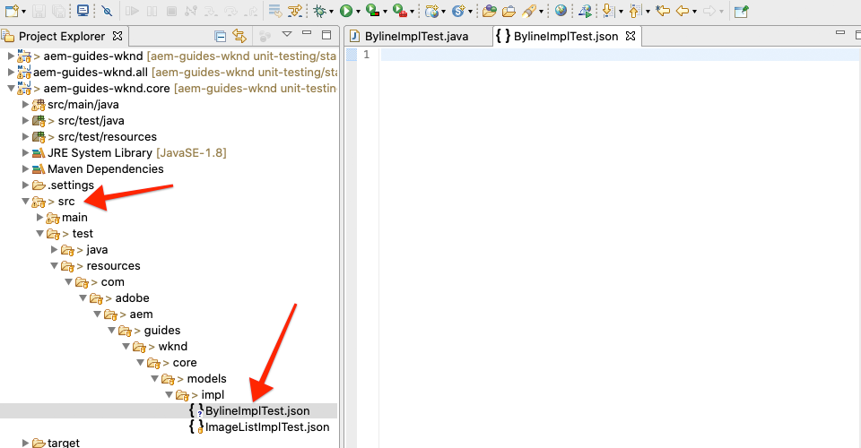
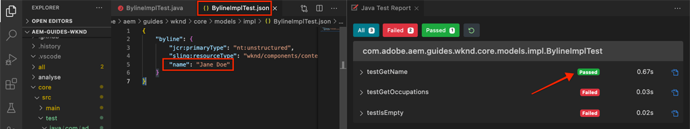

# 設備測試{#unit-testing}

本教學課程涵蓋Unit Test的實作，可驗證Byline元件的Sling Model的行為，此行為是在[Custom Component](./custom-component.md)教學課程中建立的。

## 必備條件 {#prerequisites}

檢閱設定[本機開發環境](overview.md#local-dev-environment)所需的工具和指示。

_如果系統上同時安裝了Java 8和Java 11,VS程式碼測試執行者在執行測試時可能會選擇較低的Java執行時期，導致測試失敗。如果發生此情況，請卸載Java 8._

### Starter Project

>[!NOTE]
>
> 如果您成功完成上一章，可以重新使用項目，並跳過簽出起始項目的步驟。

查看教學課程所建立的基線程式碼：

1. 查看[GitHub](https://github.com/adobe/aem-guides-wknd)的`tutorial/unit-testing-start`分支

   ```shell
   $ cd aem-guides-wknd
   $ git checkout tutorial/unit-testing-start
   ```

1. 使用您的Maven技巧，將程式碼AEM庫部署至本機執行個體：

   ```shell
   $ mvn clean install -PautoInstallSinglePackage
   ```

   >[!NOTE]
   >
   > 如果使用AEM6.5或6.4，請將`classic`描述檔附加至任何Maven命令。

   ```shell
   $ mvn clean install -PautoInstallSinglePackage -Pclassic
   ```

您隨時都可以在[GitHub](https://github.com/adobe/aem-guides-wknd/tree/tutorial/unit-testing-start)上檢視完成的程式碼，或切換至分支`tutorial/unit-testing-start`，在本機檢出程式碼。

## 目標

1. 瞭解單元測試的基本知識。
1. 瞭解常用於測試程式碼的架構和工AEM具。
1. 瞭解編寫單元測試時，模AEM擬或模擬資源的選項。

## 背景 {#unit-testing-background}

在本教學課程中，我們將探討如何編寫[Unit Tests](https://en.wikipedia.org/wiki/Unit_testing)，以取得Byline元件的[Sling Model](https://sling.apache.org/documentation/bundles/models.html)(在[Creating a custom AEM Component](custom-component.md)中建立)。 單元測試是使用Java編寫的建置時測試，可驗證Java代碼的預期行為。 每個單元測試通常都很小，並根據預期結果驗證方法（或工作單元）的輸出。

我們將使用最AEM佳實務，並使用：

* [JUnit 5](https://junit.org/junit5/)
* [Mockito測試框架](https://site.mockito.org/)
* [wcm.io Test Framework](https://wcm.io/testing/) (以 [Apache Sling Mocks為基礎](https://sling.apache.org/documentation/development/sling-mock.html))

## 設備測試和Adobe雲管理器{#unit-testing-and-adobe-cloud-manager}

[Adobe雲管](https://docs.adobe.com/content/help/zh-Hant/experience-manager-cloud-manager/using/introduction-to-cloud-manager.html) 理器將單元測試執行和 [程式碼](https://docs.adobe.com/content/help/en/experience-manager-cloud-manager/using/how-to-use/understand-your-test-results.html#code-quality-testing) 覆蓋報告整合至其CI/CD管道，以協助鼓勵和推廣單元測試程式碼的最佳AEM實務。

雖然單位測試程式碼是任何程式碼庫的最佳實務，但使用Cloud Manager時，請務必善用其程式碼品質測試和報告功能，為Cloud Manager執行單元測試。

## Inspect測試Maven依賴項{#inspect-the-test-maven-dependencies}

第一步是檢查Maven相依性，以支援編寫和執行測試。 需要4個依賴項：

1. JUnit5
1. Mockito測試框架
1. Apache Sling Mocks
1. Mocks AEM Test Framework(by io.wcm)

在使用[AEM Maven archetype](project-setup.md)的設定期間，將&#x200B;**JUnit5**、**Mockito**&#x200B;和&#x200B;**AEMMocks**&#x200B;測試依賴項自動添加到項目中。

1. 要查看這些相關性，請在&#x200B;**aem-guides-wknd/pom.xml**&#x200B;開啟父反應器POM，導航到`<dependencies>..</dependencies>`並確保已定義以下相關性：

   ```xml
   <dependencies>
       ...       
       <!-- Testing -->
       <dependency>
           <groupId>org.junit</groupId>
           <artifactId>junit-bom</artifactId>
           <version>5.6.2</version>
           <type>pom</type>
           <scope>import</scope>
       </dependency>
       <dependency>
           <groupId>org.mockito</groupId>
           <artifactId>mockito-core</artifactId>
           <version>3.3.3</version>
           <scope>test</scope>
       </dependency>
       <dependency>
           <groupId>org.mockito</groupId>
           <artifactId>mockito-junit-jupiter</artifactId>
           <version>3.3.3</version>
           <scope>test</scope>
       </dependency>
       <dependency>
           <groupId>junit-addons</groupId>
           <artifactId>junit-addons</artifactId>
           <version>1.4</version>
           <scope>test</scope>
       </dependency>
       <dependency>
           <groupId>io.wcm</groupId>
           <artifactId>io.wcm.testing.aem-mock.junit5</artifactId>
           <!-- Prefer the latest version of AEM Mock Junit5 dependency -->
           <version>3.0.2</version>
           <scope>test</scope>
       </dependency>        
       ...
   </dependencies>
   ```

1. 開啟&#x200B;**aem-guides-wknd/core/pom.xml**，並檢視對應的測試相依性是否可用：

   ```xml
   ...
   <!-- Testing -->
   <dependency>
       <groupId>org.junit.jupiter</groupId>
       <artifactId>junit-jupiter</artifactId>
       <scope>test</scope>
   </dependency>
   <dependency>
       <groupId>org.mockito</groupId>
       <artifactId>mockito-core</artifactId>
       <scope>test</scope>
   </dependency>
   <dependency>
       <groupId>org.mockito</groupId>
       <artifactId>mockito-junit-jupiter</artifactId>
       <scope>test</scope>
   </dependency>
   <dependency>
       <groupId>junit-addons</groupId>
       <artifactId>junit-addons</artifactId>
       <scope>test</scope>
   </dependency>
   <dependency>
       <groupId>io.wcm</groupId>
       <artifactId>io.wcm.testing.aem-mock.junit5</artifactId>
       <exclusions>
           <exclusion>
               <groupId>org.apache.sling</groupId>
               <artifactId>org.apache.sling.models.impl</artifactId>
           </exclusion>
           <exclusion>
               <groupId>org.slf4j</groupId>
               <artifactId>slf4j-simple</artifactId>
           </exclusion>
       </exclusions>
       <scope>test</scope>
   </dependency>
   <!-- Required to be able to support injection with @Self and @Via -->
   <dependency>
       <groupId>org.apache.sling</groupId>
       <artifactId>org.apache.sling.models.impl</artifactId>
       <version>1.4.4</version>
       <scope>test</scope>
   </dependency>
   ...
   ```

   **core**&#x200B;專案中的並行源資料夾將包含單元測試和任何支援測試檔案。 此&#x200B;**test**&#x200B;資料夾提供測試類別與原始程式碼的區隔，但允許測試如同其位於原始程式碼的相同封裝。

## 建立JUnit測試{#creating-the-junit-test}

設備測試通常使用Java類對應1對1。 在本章中，我們將編寫&#x200B;**BylineImpl.java**&#x200B;的JUnit測試，此為Byline元件的Sling Model。


*儲存設備測試的位置。*

1. 通過在Java包資料夾結構中在`src/test/java`下建立一個新的Java類，以便為`BylineImpl.java`建立設備測試，該資料夾結構鏡像要測試的Java類的位置。

   

   由於我們正在測試

   * `src/main/java/com/adobe/aem/guides/wknd/core/models/impl/BylineImpl.java`

   在

   * `src/test/java/com/adobe/aem/guides/wknd/core/models/impl/BylineImplTest.java`

   但是，讓測試檔案與眾不同    設備測試檔案`Test`的尾碼`BylineImplTest.java`是一種約定，它允許我們
      1.輕鬆將它識別為_`BylineImpl.java`的測試檔案_
      2.但是，也請將測試檔案_與_&#x200B;所測試的類別區分開來，`BylineImpl.java`

## 檢視BylineImplTest.java {#reviewing-bylineimpltest-java}

此時，JUnit測試檔案是空的Java類。 使用下列程式碼更新檔案：

```java
package com.adobe.aem.guides.wknd.core.models.impl;

import static org.junit.jupiter.api.Assertions.*;

import org.junit.jupiter.api.BeforeEach;
import org.junit.jupiter.api.Test;

public class BylineImplTest {

    @BeforeEach
    void setUp() throws Exception {

    }

    @Test 
    void testGetName() { 
        fail("Not yet implemented");
    }
    
    @Test 
    void testGetOccupations() { 
        fail("Not yet implemented");
    }

    @Test 
    void testIsEmpty() { 
        fail("Not yet implemented");
    }
}
```

1. 第一個方法`public void setUp() { .. }`用JUnit的`@BeforeEach`加上注釋，指示JUnit測試運行者在運行該類中的每個測試方法之前執行此方法。 這提供了一個方便的位置，可初始化所有測試所需的一般測試狀態。

2. 後續方法是測試方法，其名稱由約定以`test`為前置詞，並加上`@Test`註解。 請注意，依預設，我們的所有測試都會失敗，因為我們尚未實作這些測試。

   首先，我們從測試類別上每個公開方法的單一測試方法開始，因此：

   | BylineImpl.java |  | BylineImplTest.java |
   | ------------------|--------------|---------------------|
   | getName() | 由 | testGetName() |
   | getSchorips() | 由 | testGetSchorips() |
   | isEmpty() | 由 | testIsEmpty() |

   這些方法可視需要加以擴充，如本章稍後所述。

   運行此JUnit測試類（也稱為JUnit測試案例）時，每個標有`@Test`的方法都將作為測試執行，該測試可以通過或失敗。


*`core/src/test/java/com/adobe/aem/guides/wknd/core/models/impl/BylineImplTest.java`*

1. 按一下右鍵`BylineImplTest.java`檔案，然後按一下&#x200B;**運行** ，運行JUnit測試案例。
如預期，所有測試都會失敗，因為尚未實施。

   

   *在BylineImplTests.java上按一下滑鼠右鍵>執行*

## 正在查看BylineImpl.java {#reviewing-bylineimpl-java}

在編寫單元測試時，主要有兩種方法：

* [TDD或測試驅動開發](https://en.wikipedia.org/wiki/Test-driven_development)，即在開發實施之前，逐步編寫單元測試；撰寫測試，編寫實作，讓測試通過。
* 實作優先開發，包括先開發工作程式碼，然後撰寫測試以驗證此程式碼。

在本教學課程中，使用後一種方法（因為我們已在上一章中建立了工作&#x200B;**BylineImpl.java**）。 因此，我們既要審視和瞭解其公開手段的行為，也要瞭解其實施細節。 這聽起來可能相反，因為良好的測試只應關注輸入和輸出，但在工作中AEM，需要瞭解各種執行考慮因素，才能構建工作測試。

TDD在程式碼的開發AEM與單元測試方面，需要一定的專AEM業知識，並最AEM能被熟悉程式碼開發與單元測試的開發人員所AEM採用。

## 設定AEM測試內容{#setting-up-aem-test-context}

大部份的程式AEM碼都需仰賴JCR、Sling或AEMAPI，而API則需要執行的上下文才能正AEM確執行。

由於單位測試是在建置時執行，因此在執行中例項的上下AEM文外，沒有此類上下文。 為方便執行此動作，[wcm.io的AEMMocks](https://wcm.io/testing/aem-mock/usage.html)會建立模擬內容，讓這些API對&#x200B;_大多_&#x200B;的作用如同在其中執行AEM。

1. 使用AEM **BylineImplTest.java**&#x200B;中的&#x200B;**wcm.io的** `AemContext`建立內容，方法是將其新增為以`@ExtendWith`裝飾的JUnit擴充功能至&#x200B;**BylineImplTest.java**&#x200B;檔案。 擴充功能會處理所有必要的初始化和清除工作。 為`AemContext`建立可用於所有測試方法的類別變數。

   ```java
   import org.junit.jupiter.api.extension.ExtendWith;
   import io.wcm.testing.mock.aem.junit5.AemContext;
   import io.wcm.testing.mock.aem.junit5.AemContextExtension;
   ...
   
   @ExtendWith(AemContextExtension.class)
   class BylineImplTest {
   
       private final AemContext ctx = new AemContext();
   ```

   此變數`ctx`會公開模擬內容，AEM提供數個AEM和Sling抽象：

   * BylineImpl Sling Model將會註冊至此內容
   * 在此上下文中建立模擬JCR內容結構
   * 可在此上下文中註冊自訂OSGi服務
   * 提供多種常用的必要模擬物件和輔助工具，例如SlingHttpServletRequest物件、多種模擬Sling和AEMOSGi服務，例如ModelFactory、PageManager、Page、Template、ComponentManager、Component、TagManager、Tag等。
      * *請注意，並非所有這些物件的方法都會實作！*
   * 而且[更多](https://wcm.io/testing/aem-mock/usage.html)!

   **`ctx`**&#x200B;物件將作為我們大部分模擬內容的入口點。

1. 在每個`@Test`方法之前執行的`setUp(..)`方法中，定義共同的模擬測試狀態：

   ```java
   @BeforeEach
   public void setUp() throws Exception {
       ctx.addModelsForClasses(BylineImpl.class);
       ctx.load().json("/com/adobe/aem/guides/wknd/core/models/impl/BylineImplTest.json", "/content");
   }
   ```

   * **`addModelsForClasses`** 將要測試的Sling Model註冊至模AEM擬內容，以便在方法中實 `@Test` 例化。
   * **`load().json`** 將資源結構載入到模擬上下文中，使代碼能夠與這些資源交互，就像它們是由真實儲存庫提供的一樣。檔案&#x200B;**`BylineImplTest.json`**&#x200B;中的資源定義將載入到&#x200B;**/content**&#x200B;下的模擬JCR上下文中。
   * **`BylineImplTest.json`** 尚未存在，因此，我們建立它並定義測試所需的JCR資源結構。

1. 代表模擬資源結構的JSON檔案儲存在&#x200B;**core/src/test/resources**&#x200B;下，跟隨與JUnit Java測試檔案相同的包路徑。

   在&#x200B;**core/test/resources/com/adobe/aem/guides/wknd/core/models/impl**&#x200B;建立名為&#x200B;**BylineImplTest.json**&#x200B;的新JSON檔案，其中包含下列內容：

   ```json
   {
       "byline": {
       "jcr:primaryType": "nt:unstructured",
       "sling:resourceType": "wknd/components/content/byline"
       }
   }
   ```

   

   此JSON會為Byline元件單元測試定義模擬資源（JCR節點）。 目前，JSON擁有代表Byline元件內容資源（`jcr:primaryType`和`sling:resourceType`）所需的最小屬性集。

   使用單位測試時的一般規則是建立滿足每項測試所需的模擬內容、內容和程式碼的最小集。 避免在撰寫測試前先建立完整的模擬內容，因為這通常會產生不需要的文物。

   現在，由於&#x200B;**BylineImplTest.json**&#x200B;的存在，當`ctx.json("/com/adobe/aem/guides/wknd/core/models/impl/BylineImplTest.json", "/content")`執行時，模擬資源定義會載入路徑&#x200B;**/content的內容中。**

## 正在測試getName(){#testing-get-name}

既然我們已有基本的模擬上下文設定，讓我們撰寫&#x200B;**BylineImpl&#39;s getName()**&#x200B;的第一個測試。 此測試必須確保方法&#x200B;**getName()**&#x200B;返回儲存在資源&quot;**name&quot;**&#x200B;屬性中的正確編寫名稱。

1. 如下所示，更新&#x200B;**BylineImplTest.java**&#x200B;中的&#x200B;**testGetName**()方法：

   ```java
   import com.adobe.aem.guides.wknd.core.components.Byline;
   ...
   @Test
   public void testGetName() {
       final String expected = "Jane Doe";
   
       ctx.currentResource("/content/byline");
       Byline byline = ctx.request().adaptTo(Byline.class);
   
       String actual = byline.getName();
   
       assertEquals(expected, actual);
   }
   ```

   * **`String expected`** 設定預期值。我們會將此值設為&quot;**Jane Done**&quot;。
   * **`ctx.currentResource`** 設定模擬資源的上下文以評估代碼，因此此，此內容會設為載入模擬署名內容資源的 **/** content/bylineas。
   * **`Byline byline`** 從mock Request物件調整Byline Sling Model，以實例化它。
   * **`String actual`** 叫用我們測試的方 `getName()`法，在Byline Sling Model物件上。
   * **`assertEquals`** 斷言預期值與byline Sling Model物件傳回的值相符。如果這些值不相等，則測試將失敗。

1. 執行測試……而且會以`NullPointerException`失敗。

   請注意，此測試不會失敗，因為我們從未在模擬JSON中定義`name`屬性，這會導致測試失敗，但測試執行尚未到達該點！ 此測試失敗，因為位元物件本身有`NullPointerException`。

1. 在`BylineImpl.java`中，如果`@PostConstruct init()`拋出例外，則會防止Sling Model執行個體化，並導致該Sling Model物件為null。

   ```java
   @PostConstruct
   private void init() {
       image = modelFactory.getModelFromWrappedRequest(request, request.getResource(), Image.class);
   }
   ```

   事實上，雖然ModelFactory OSGi服務是透過`AemContext`（透過Apache Sling Context）提供，但並非所有方法都會實作，包括在BylineImpl的`init()`方法中呼叫的`getModelFromWrappedRequest(...)`。 這會導致[AbstractMethodError](https://docs.oracle.com/en/java/javase/11/docs/api/java.base/java/lang/AbstractMethodError.html)，在術語中會導致`init()`失敗，而所產生的`ctx.request().adaptTo(Byline.class)`適配是空對象。

   由於提供的吊床無法容納我們的代碼，因此我們必須自己實施模擬上下文。為此，我們可以使用Mockito建立一個模擬ModelFactory對象，當調用該對象時，該對象將返回一個模擬Image對象。`getModelFromWrappedRequest(...)`

   因為若要實例化Byline Sling Model，此模擬內容必須就位，我們可將它新增至`@Before setUp()`方法。 我們還需要將`MockitoExtension.class`添加到&#x200B;**BylineImplTest**&#x200B;類別上方的`@ExtendWith`注釋中。

   ```java
   package com.adobe.aem.guides.wknd.core.models.impl;
   
   import org.mockito.junit.jupiter.MockitoExtension;
   import org.mockito.Mock;
   
   import com.adobe.aem.guides.wknd.core.models.Byline;
   import com.adobe.cq.wcm.core.components.models.Image;
   
   import io.wcm.testing.mock.aem.junit5.AemContext;
   import io.wcm.testing.mock.aem.junit5.AemContextExtension;
   
   import org.apache.sling.models.factory.ModelFactory;
   import org.junit.jupiter.api.BeforeEach;
   import org.junit.jupiter.api.Test;
   import org.junit.jupiter.api.extension.ExtendWith;
   
   import static org.junit.jupiter.api.Assertions.*;
   import static org.mockito.Mockito.*;
   import org.apache.sling.api.resource.Resource;
   
   @ExtendWith({ AemContextExtension.class, MockitoExtension.class })
   public class BylineImplTest {
   
       private final AemContext ctx = new AemContext();
   
       @Mock
       private Image image;
   
       @Mock
       private ModelFactory modelFactory;
   
       @BeforeEach
       public void setUp() throws Exception {
           ctx.addModelsForClasses(BylineImpl.class);
   
           ctx.load().json("/com/adobe/aem/guides/wknd/core/models/impl/BylineImplTest.json", "/content");
   
           lenient().when(modelFactory.getModelFromWrappedRequest(eq(ctx.request()), any(Resource.class), eq(Image.class)))
                   .thenReturn(image);
   
           ctx.registerService(ModelFactory.class, modelFactory, org.osgi.framework.Constants.SERVICE_RANKING,
                   Integer.MAX_VALUE);
       }
   
       @Test
       void testGetName() { ...
   }
   ```

   * **`@ExtendWith({AemContextExtension.class, MockitoExtension.class})`** 標籤Test Case類，該類與 [Mockito JUnit Jupiter ](https://www.javadoc.io/page/org.mockito/mockito-junit-jupiter/latest/org/mockito/junit/jupiter/MockitoExtension.html) Extension一起運行，該類允許使用@Mock批注在類級別定義模擬對象。
   * **`@Mock private Image`** 建立類型的模擬對象 `com.adobe.cq.wcm.core.components.models.Image`。請注意，這是在類別層級定義的，因此，`@Test`方法可視需要改變其行為。
   * **`@Mock private ModelFactory`** 建立ModelFactory類型的模擬對象。請注意，這是純Mockito模型，沒有實作方法。 請注意，這是在類別層級定義的，因此，`@Test`方法可視需要改變其行為。
   * **`when(modelFactory.getModelFromWrappedRequest(..)`** 註冊在模擬ModelFactory對 `getModelFromWrappedRequest(..)` 像上調用時的模擬行為。在`thenReturn (..)`中定義的結果是返回模擬影像對象。 請注意，此行為僅在下列情況下才被調用：第1個參數等於`ctx`的請求物件，第2個參數是任何資源物件，而第3個參數必須是核心元件影像類別。 我們接受任何資源，因為在測試期間，我們將將`ctx.currentResource(...)`設定為&#x200B;**BylineImplTest.json**&#x200B;中定義的各種模擬資源。 請注意，我們添加了&#x200B;**enlighte()**&#x200B;嚴格性，因為我們稍後將希望覆蓋ModelFactory的此行為。
   * **`ctx.registerService(..)`。** 以最高的服務排名，將模擬ModelFactory物件註冊到AemContext。由於BylineImpl的`init()`中使用的ModelFactory是通過`@OSGiService ModelFactory model`欄位插入的，因此此為必需欄位。 為了讓AemContext注入&#x200B;**our**&#x200B;模擬物件（可處理對`getModelFromWrappedRequest(..)`的呼叫），我們必須將它註冊為該類型最高等級的服務(ModelFactory)。

1. 重新執行測試，然後再次失敗，但這次的訊息清楚說明其失敗的原因。

   

   *testGetName()因斷言而失敗*

   我們收到&#x200B;**AssertionError**，這表示測試中的斷言條件失敗，它告訴我們&#x200B;**預期值為&quot;Jane Doe&quot;**，但&#x200B;**實際值為null**。 這有意義，因為&#x200B;**name&quot;**&#x200B;屬性尚未新增至&#x200B;**BylineImplTest.json**&#x200B;中模擬&#x200B;**/content/byline**&#x200B;資源定義，所以我們加入：

1. 更新&#x200B;**BylineImplTest.json**&#x200B;以定義`"name": "Jane Doe".`

   ```json
   {
       "byline": {
       "jcr:primaryType": "nt:unstructured",
       "sling:resourceType": "wknd/components/content/byline",
       "name": "Jane Doe"
       }
   }
   ```

1. 重新執行測試，現在&#x200B;**`testGetName()`**&#x200B;已通過！

   


## 測試getSchorips(){#testing-get-occupations}

很好！ 我們的第一次考試通過了！ 讓我們繼續測試`getOccupations()`。 由於模擬上下文的初始化是在`@Before setUp()`方法中進行的，因此此測試案例中的所有`@Test`方法都可使用此選項，包括`getOccupations()`。

請記住，此方法必須返回按字母順序排序的職業清單（遞減），這些職業儲存在職業屬性中。

1. 按如下方式更新&#x200B;**`testGetOccupations()`**:

   ```java
   import java.util.List;
   import com.google.common.collect.ImmutableList;
   ...
   @Test
   public void testGetOccupations() {
       List<String> expected = new ImmutableList.Builder<String>()
                               .add("Blogger")
                               .add("Photographer")
                               .add("YouTuber")
                               .build();
   
       ctx.currentResource("/content/byline");
       Byline byline = ctx.request().adaptTo(Byline.class);
   
       List<String> actual = byline.getOccupations();
   
       assertEquals(expected, actual);
   }
   ```

   * **`List<String> expected`** 定義預期結果。
   * **`ctx.currentResource`** 將當前資源設定為根據/content/byline上的模擬資源定義評估上下文。這可確保在模擬資源的上下文中執行&#x200B;**BylineImpl.java**。
   * **`ctx.request().adaptTo(Byline.class)`** 從mock Request物件調整Byline Sling Model，以實例化它。
   * **`byline.getOccupations()`** 叫用我們測試的方 `getOccupations()`法，在Byline Sling Model物件上。
   * **`assertEquals(expected, actual)`** 斷言預期清單與實際清單相同。

1. 請記住，如同上文的&#x200B;**`getName()`**,**BylineImplTest.json**&#x200B;不會定義職業，因此如果我們執行此測試，此測試將會失敗，因為`byline.getOccupations()`會傳回空白的清單。

   更新&#x200B;**BylineImplTest.json**&#x200B;以包含職業清單，這些職業將以非字母順序設定，以確保我們的測試可驗證職業是否依&#x200B;**`getOccupations()`**&#x200B;的字母順序排序。

   ```json
   {
       "byline": {
       "jcr:primaryType": "nt:unstructured",
       "sling:resourceType": "wknd/components/content/byline",
       "name": "Jane Doe",
       "occupations": ["Photographer", "Blogger", "YouTuber"]
       }
   }
   ```

1. 測試，我們又通過了！ 看來分類的職業很管用！

   

   *testGetSchorips()通過*

## 測試isEmpty(){#testing-is-empty}

測試&#x200B;**`isEmpty()`**&#x200B;的最後一個方法。

測試`isEmpty()`很有趣，因為它需要測試各種情況。 檢閱&#x200B;**BylineImpl.java**&#x200B;的`isEmpty()`方法，必須測試下列條件：

* 名稱為空時返回true
* 當職業為空或空時返回true
* 當影像為null或沒有src URL時傳回true
* 當名稱、職業和影像（含src URL）存在時傳回false

為此，我們需要建立新的測試方法，每個測試都要測試特定條件以及`BylineImplTest.json`中的新模擬資源結構來驅動這些測試。

請注意，此檢查可讓我們略過測試`getName()`、`getOccupations()`和`getImage()`何時為空，因為該狀態的預期行為是透過`isEmpty()`測試。

1. 第一個測試將測試沒有設定屬性的全新元件的狀況。

   將新資源定義添加到`BylineImplTest.json`中，為其提供語義名稱&quot;**empty**&quot;

   ```json
   {
       "byline": {
           "jcr:primaryType": "nt:unstructured",
           "sling:resourceType": "wknd/components/content/byline",
           "name": "Jane Doe",
           "occupations": ["Photographer", "Blogger", "YouTuber"]
       },
       "empty": {
           "jcr:primaryType": "nt:unstructured",
           "sling:resourceType": "wknd/components/content/byline"
       }
   }
   ```

   **`"empty": {...}`** 定義名為&quot;empty&quot;的新資源定義，該定義只包含 `jcr:primaryType` 和 `sling:resourceType`。

   請記住，我們在`@setUp`中每個測試方法執行之前將`BylineImplTest.json`載入`ctx`，因此在&#x200B;**/content/empty的測試中，我們可立即使用此新的資源定義。**

1. 按如下方式更新`testIsEmpty()`，將當前資源設定為新的&quot;**empty**&quot;模擬資源定義。

   ```java
   @Test
   public void testIsEmpty() {
       ctx.currentResource("/content/empty");
       Byline byline = ctx.request().adaptTo(Byline.class);
   
       assertTrue(byline.isEmpty());
   }
   ```

   執行測試並確保通過。

1. 接著，建立一組方法，以確保任何必要的資料點（名稱、職業或影像）為空白時，`isEmpty()`會傳回true。

   對於每項測試，都會使用離散的模擬資源定義，使用&#x200B;**without-name**&#x200B;和&#x200B;**witthout-prictions**&#x200B;的額外資源定義更新&#x200B;**BylineImplTest.json**。

   ```json
   {
       "byline": {
           "jcr:primaryType": "nt:unstructured",
           "sling:resourceType": "wknd/components/content/byline",
           "name": "Jane Doe",
           "occupations": ["Photographer", "Blogger", "YouTuber"]
       },
       "empty": {
           "jcr:primaryType": "nt:unstructured",
           "sling:resourceType": "wknd/components/content/byline"
       },
       "without-name": {
           "jcr:primaryType": "nt:unstructured",
           "sling:resourceType": "wknd/components/content/byline",
           "occupations": "[Photographer, Blogger, YouTuber]"
       },
       "without-occupations": {
           "jcr:primaryType": "nt:unstructured",
           "sling:resourceType": "wknd/components/content/byline",
           "name": "Jane Doe"
       }
   }
   ```

   建立下列測試方法以測試這些狀態。

   ```java
   @Test
   public void testIsEmpty() {
       ctx.currentResource("/content/empty");
   
       Byline byline = ctx.request().adaptTo(Byline.class);
   
       assertTrue(byline.isEmpty());
   }
   
   @Test
   public void testIsEmpty_WithoutName() {
       ctx.currentResource("/content/without-name");
   
       Byline byline = ctx.request().adaptTo(Byline.class);
   
       assertTrue(byline.isEmpty());
   }
   
   @Test
   public void testIsEmpty_WithoutOccupations() {
       ctx.currentResource("/content/without-occupations");
   
       Byline byline = ctx.request().adaptTo(Byline.class);
   
       assertTrue(byline.isEmpty());
   }
   
   @Test
   public void testIsEmpty_WithoutImage() {
       ctx.currentResource("/content/byline");
   
       lenient().when(modelFactory.getModelFromWrappedRequest(eq(ctx.request()),
           any(Resource.class),
           eq(Image.class))).thenReturn(null);
   
       Byline byline = ctx.request().adaptTo(Byline.class);
   
       assertTrue(byline.isEmpty());
   }
   
   @Test
   public void testIsEmpty_WithoutImageSrc() {
       ctx.currentResource("/content/byline");
   
       when(image.getSrc()).thenReturn("");
   
       Byline byline = ctx.request().adaptTo(Byline.class);
   
       assertTrue(byline.isEmpty());
   }
   ```

   **`testIsEmpty()`** 測試空的模擬資源定義，並斷言 `isEmpty()` 正確。

   **`testIsEmpty_WithoutName()`** 對一個模擬資源定義進行測試，該定義有職業，但沒有名字。

   **`testIsEmpty_WithoutOccupations()`** 測試一個有名無實的模擬資源定義。

   **`testIsEmpty_WithoutImage()`** 使用名稱和職稱測試模擬資源定義，但將模擬映像設定為null。請注意，我們要覆寫`setUp()`中定義的`modelFactory.getModelFromWrappedRequest(..)`行為，以確保此呼叫傳回的Image物件為null。 莫基托小作品的特點是嚴格的，不需要重複的代碼。 因此，我們使用&#x200B;**`lenient`**&#x200B;設定設定來設定模擬，以明確指出我們正在覆寫`setUp()`方法中的行為。

   **`testIsEmpty_WithoutImageSrc()`** 使用名稱和職稱測試模擬資源定義，但將模擬映像設定為在調用時返回空 `getSrc()` 白字串。

1. 最後，請撰寫測試，以確保在正確設定元件時&#x200B;**isEmpty()**&#x200B;傳回false。 對於此情況，我們可以重新使用&#x200B;**/content/byline**，它代表完全配置的Byline元件。

   ```java
   @Test
   public void testIsNotEmpty() {
       ctx.currentResource("/content/byline");
       when(image.getSrc()).thenReturn("/content/bio.png");
   
       Byline byline = ctx.request().adaptTo(Byline.class);
   
       assertFalse(byline.isEmpty());
   }
   ```

1. 現在，在BylineImplTest.java檔案中執行所有單元測試，並檢視Java測試報表輸出。


## 作為構建版本{#running-unit-tests-as-part-of-the-build}的一部分運行單元測試

執行單元測試時，必須通過，才能作為Maven Build的一部分。 這可確保在部署應用程式之前，所有測試都能成功通過。 執行Maven目標（如軟體包或安裝）時，會自動調用並要求通過項目中的所有設備測試。

```shell
$ mvn package
```


```shell
$ mvn package
```

同樣地，如果我們將測試方法變更為失敗，則建置會失敗，並報告測試失敗的原因。


## 檢閱程式碼{#review-the-code}

在[GitHub](https://github.com/adobe/aem-guides-wknd)上檢視完成的程式碼，或在`tutorial/unit-testing-solution`的Git位置上檢視並部署程式碼。
