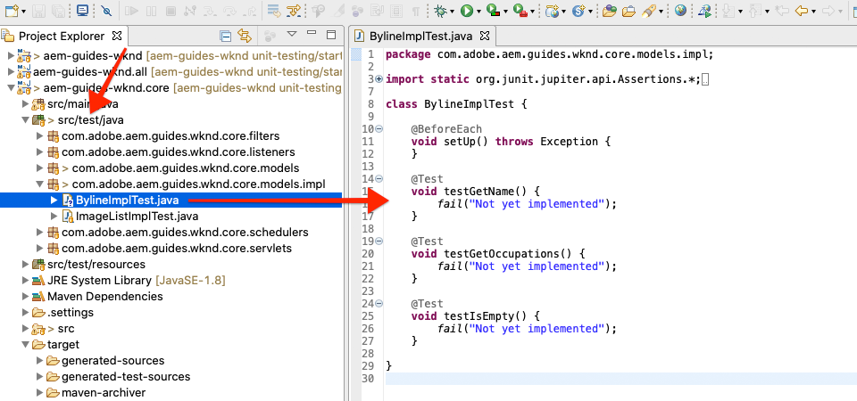

# 單元測試 {#unit-testing}

本教學課程涵蓋Unit Test的實作，可驗證Byline元件的Sling Model（在自訂元件教學課程中建立）的 [行為](./custom-component.md) 。

## 必備條件 {#prerequisites}

查看教學課程所建立的基線程式碼：

1. 克隆github.com/adobe/aem-guides-wknd [儲存庫](https://github.com/adobe/aem-guides-wknd) 。
1. 查看分 `unit-testing/start` 支

```shell
$ git clone git@github.com:adobe/aem-guides-wknd.git ~/code/aem-guides-wknd
$ cd ~/code/aem-guides-wknd
$ git checkout unit-testing/start
```

您隨時都可以在 [GitHub上檢視完成的程式碼](https://github.com/adobe/aem-guides-wknd/tree/unit-testing/solution) ，或切換至分支，在本機檢出程式碼 `unit-testing/solution`。

## 目標

1. 瞭解單元測試的基本知識。
1. 瞭解常用於測試AEM程式碼的架構和工具。
1. 瞭解在撰寫單元測試時模擬AEM資源的選項。

## 背景 {#unit-testing-background}

在本教學課程中，我們將探討如何為我們的 [Byline元件的](https://en.wikipedia.org/wiki/Unit_testing) Sling Model [(在「建立自訂AEM元](https://sling.apache.org/documentation/bundles/models.html) 件」中建立 [](custom-component.md))編寫Unit Tests。 單元測試是使用Java編寫的建置時測試，可驗證Java代碼的預期行為。 每個單元測試通常都很小，並根據預期結果驗證方法（或工作單元）的輸出。

我們將使用AEM最佳實務，並使用：

* [JUnit 5](https://junit.org/junit5/)
* [Mockito測試框架](https://site.mockito.org/)
* [wcm.io Test Framework](https://wcm.io/testing/) (以 [Apache Sling Mocks為基礎](https://sling.apache.org/documentation/development/sling-mock.html))

>[!VIDEO](https://video.tv.adobe.com/v/30207/?quality=12&learn=on)

## 單元測試與Adobe Cloud Manager {#unit-testing-and-adobe-cloud-manager}

[Adobe Cloud Manager](https://docs.adobe.com/content/help/zh-Hant/experience-manager-cloud-manager/using/introduction-to-cloud-manager.html) 將單元測試執行和程式碼涵蓋 [範圍報告整合至](https://docs.adobe.com/content/help/en/experience-manager-cloud-manager/using/how-to-use/understand-your-test-results.html#code-quality-testing) CI/CD管道，以協助鼓勵和推廣單元測試AEM程式碼的最佳實務。

雖然單位測試程式碼是任何程式碼庫的最佳實務，但使用Cloud Manager時，請務必善用其程式碼品質測試和報告功能，為Cloud Manager執行單元測試。

## 檢查測試Maven依賴項 {#inspect-the-test-maven-dependencies}

第一步是檢查Maven相依性，以支援編寫和執行測試。 需要4個依賴項：

1. JUnit5
1. Mockito測試框架
1. Apache Sling Mocks
1. AEM Mocks Test Framework(by io.wcm)

在使 **用** AEM Maven原型模型 **AEM Maven** 的設定期間，會自動將JUnit5、Mockito **和**[](project-setup.md)AEM Mockito測試依賴項新增至專案。

1. 要查看這些相關性，請在aem-guides-wknd/pom.xml中開啟Parent Reactor POM **，導航到**`<dependencies>..</dependencies>` 並確保已定義以下相關性：

   ```xml
   <dependencies>
       ...
       <!-- Testing -->
       <dependency>
           <groupId>org.junit</groupId>
           <artifactId>junit-bom</artifactId>
           <version>5.5.2</version>
           <type>pom</type>
           <scope>import</scope>
       </dependency>
       <dependency>
           <groupId>org.slf4j</groupId>
           <artifactId>slf4j-simple</artifactId>
           <version>1.7.25</version>
           <scope>test</scope>
       </dependency>
       <dependency>
           <groupId>org.mockito</groupId>
           <artifactId>mockito-core</artifactId>
           <version>2.25.1</version>
           <scope>test</scope>
       </dependency>
       <dependency>
           <groupId>org.mockito</groupId>
           <artifactId>mockito-junit-jupiter</artifactId>
           <version>2.25.1</version>
           <scope>test</scope>
       </dependency>
       <dependency>
           <groupId>junit-addons</groupId>
           <artifactId>junit-addons</artifactId>
           <version>1.4</version>
           <scope>test</scope>
       </dependency>
       <dependency>
           <groupId>io.wcm</groupId>
           <artifactId>io.wcm.testing.aem-mock.junit5</artifactId>
           <!-- Prefer the latest version of AEM Mock Junit5 dependency -->
           <version>2.5.2</version>
           <scope>test</scope>
       </dependency>
       ...
   </dependencies>
   ```

1. 開啟 **aem-guides-wknd/core/pom.xml** ，並檢視對應的測試相依性是否可用：

   ```xml
   ...
   <dependency>
       <groupId>org.junit.jupiter</groupId>
       <artifactId>junit-jupiter</artifactId>
       <scope>test</scope>
   </dependency>
   <dependency>
       <groupId>org.mockito</groupId>
       <artifactId>mockito-core</artifactId>
       <scope>test</scope>
   </dependency>
   <dependency>
       <groupId>org.mockito</groupId>
       <artifactId>mockito-junit-jupiter</artifactId>
       <scope>test</scope>
   </dependency>
   <dependency>
       <groupId>junit-addons</groupId>
       <artifactId>junit-addons</artifactId>
   </dependency>
   <dependency>
       <groupId>io.wcm</groupId>
       <artifactId>io.wcm.testing.aem-mock.junit5</artifactId>
   </dependency>
   ...
   ```

   核心項目中的並行源 **資料夾** ，將包含單元測試和任何支援測試檔案。 此 **test** 資料夾可將測試類別與原始碼分開，但可讓測試如同其與原始碼位於相同的套件中。

## 建立JUnit測試 {#creating-the-junit-test}

設備測試通常使用Java類對應1對1。 在本章中，我們將編寫 **** BylineImpl.java的JUnit測試，此為支援Byline元件的Sling Model。


*儲存設備測試的位置。*

1. 在Eclipse中，我們可以按一下右鍵要測試的Java類，然後選擇「新建」>「其他」>「 **Java」>「JUnit」>「JUnit測試案例」**。

   

1. 在第一個精靈畫面中，驗證下列項目：

   * JUnit測試類型是 **新的JUnit Jupiter測試** ，因為這些是在 **pom.xml中設定的JUnit Maven從屬關係**。
   * 該 **軟體包** 是所測試類的java軟體包(`BylineImpl.java`)
   * Source資料夾指向核 **心專案** (`aem-guides-wknd.core/src/test/java`)，指示儲存單位測試檔案的Eclipse。
   * 方 `setUp()` 法存根將手動建立；我們稍後會看到它的用途。
   * 測試的類是， `BylineImpl.java`因為這是我們要測試的Java類。

   

   *JUnit測試案例嚮導——步驟2*

1. 按一下 **嚮導** 底部的「下一步」按鈕。

   下一步驟可協助自動產生測試方法。 通常，Java類的每個公共方法都至少具有一個相應的測試方法，驗證其行為。 通常單位測試會有多種測試方法來測試單一公用方法，每種方法代表不同的輸入或狀態集。

   在精靈中，選取下方的所 `BylineImpl`有方法，但 `init()` Sling Model內部(透過 `@PostConstruct`)使用的方法除外。 由於其他方法依賴 `init()` 於成功的執行，因此我們將通過測試其他方法來有效 `init()` 地測試。

   可隨時將新的測試方法添加到JUnit測試類中，該嚮導的此頁僅為了方便。

   

   *JUnit測試案例嚮導（續）*

1. 按一下嚮導底部的「完成」按鈕以生成JUnit5測試檔案。
1. 驗證是否已在 **aem-guides-wknd.core** > **/src/test/java上的對應套件結構中建立JUnit5測試檔案，此檔案名為**`BylineImplTest.java`。

## 檢閱BylineImplTest.java {#reviewing-bylineimpltest-java}

我們的測試檔案有許多自動產生的方法。 此時，此JUnit測試檔案沒有AEM特定內容。

第一種方法是 `public void setUp() { .. }` 加上注釋 `@BeforeEach`。

注 `@BeforeEach` 釋是JUnit注釋，它指示運行的JUnit測試在運行該類中的每個測試方法之前執行此方法。

後續方法本身是測試方法，並標籤為注釋 `@Test` 。 請注意，依預設，我們的所有測試都會設為失敗。

運行此JUnit測試類（也稱為JUnit測試案例）時，標有該類的每個方法都將作為 `@Test` 測試執行，該測試可以通過或失敗。



*`core/src/test/java/com/adobe/aem/guides/wknd/core/models/impl/BylineImplTest.java`*

1. 按一下右鍵類名並運行「JUnit測試案例」，然後 **運行方式> JUnit測試**。

   

   *按一下右鍵BylineImplTests.java >運行方式> JUnit測試*

1. 如預期，所有測試都會失敗。

   

   *Eclipse的JUnit視圖>窗口>顯示視圖> Java > JUnit*

## 查看BylineImpl.java {#reviewing-bylineimpl-java}

在編寫單元測試時，主要有兩種方法：

* [TDD或測試驅動開發](https://en.wikipedia.org/wiki/Test-driven_development)，即在開發實施之前，逐步編寫單元測試；撰寫測試，編寫實作，讓測試通過。
* 實作優先開發，包括先開發工作程式碼，然後撰寫測試以驗證此程式碼。

在本教學課程中，會使用後一種方法(因為我們已在上一章中建立了 **BylineImpl.java** )。 因此，我們既要審視和瞭解其公開手段的行為，也要瞭解其實施細節。 這聽起來可能相反，因為良好的測試只應關注輸入和輸出，但是在AEM中工作時，需要瞭解多種實作考量，才能建立執行測試。

TDD在AEM方面需要一定的專業水準，最能被精通AEM開發與AEM程式碼單元測試的AEM開發人員採用。

>[!VIDEO](https://video.tv.adobe.com/v/30208/?quality=12&learn=on)

## 設定AEM測試內容  {#setting-up-aem-test-context}

大部份為AEM編寫的程式碼都仰賴JCR、Sling或AEM API，而JCR、Sling或AEM API則需要執行中AEM的內容才能正確執行。

由於裝置測試是在建置時執行，因此在執行中AEM例項的上下文以外，就沒有此類資源。 為方便使用， [wcm.io的AEM Mocks](https://wcm.io/testing/aem-mock/usage.html) (AEM Mocks)會建立模擬內容，讓這些API在大部分情況下都能像在AEM中執行一樣運作。

1. 使用 **BylineImplTest.java中的wcm.io** ，將其新增為以 `AemContext`****`@ExtendWith`**** BylineImplTest.java檔案裝飾的JUnit擴充功能，以建立AEM內容。 擴充功能會處理所有必要的初始化和清除工作。 建立可用於所 `AemContext` 有測試方法的類別變數。

   ```java
   import org.junit.jupiter.api.extension.ExtendWith;
   import io.wcm.testing.mock.aem.junit5.AemContext;
   import io.wcm.testing.mock.aem.junit5.AemContextExtension;
   ...
   
   @ExtendWith(AemContextExtension.class)
   class BylineImplTest {
   
       private final AemContext ctx = new AemContext();
   ```

   此變數 `ctx`會公開模擬AEM內容，提供許多AEM和Sling抽象化：

   * BylineImpl Sling Model將會註冊至此內容
   * 在此上下文中建立模擬JCR內容結構
   * 可在此上下文中註冊自訂OSGi服務
   * 提供多種常用的必要模擬物件和輔助工具，例如SlingHttpServletRequest物件、多種模擬Sling和AEM OSGi服務，例如ModelFactory、PageManager、Page、Template、ComponentManager、Component、TagManager、Tag等。
      * *請注意，並非所有這些物件的方法都會實作！*
   * And [much more](https://wcm.io/testing/aem-mock/usage.html)!

   物 **`ctx`** 件將做為我們大部分模擬內容的入口點。

1. 在每個 `setUp(..)` 方法之前執行的方法中，定 `@Test` 義一個通用的模擬測試狀態：

   ```java
   @BeforeEach
   public void setUp() throws Exception {
       ctx.addModelsForClasses(BylineImpl.class);
       ctx.load().json("/com/adobe/aem/guides/wknd/core/models/impl/BylineImplTest.json", "/content");
   }
   ```

   * **`addModelsForClasses`** 將要測試的Sling Model，註冊至模擬AEM Context，以便在方法中執行個 `@Test` 體化。
   * **`load().json`** 將資源結構載入到模擬上下文中，使代碼能夠與這些資源交互，就像它們是由真實儲存庫提供的一樣。 檔案中的資源定 **`BylineImplTest.json`** 義將載入到/content下的模擬JCR上 **下文中**。
   * **`BylineImplTest.json`** 尚未存在，因此，我們建立它並定義測試所需的JCR資源結構。

1. 代表模擬資源結構的JSON檔案儲存在 **core/src/test/resources** （遵循與JUnit Java測試檔案相同的包路徑）下。

   在core/test/resources/com/adobe/aem/guides/wknd/core/models/impl中建立新的JSON檔案 **，名** 為BylineImplTest.json **** ，內容如下：

   ```json
   {
       "byline": {
       "jcr:primaryType": "nt:unstructured",
       "sling:resourceType": "wknd/components/content/byline"
       }
   }
   ```

   

   此JSON會為Byline元件單位測試定義模擬資源定義。 目前，JSON擁有表示Byline元件內容資源、和所需的最小屬 `jcr:primaryType` 性集 `sling:resourceType`。

   使用單元測試時，其一般規則是建立滿足每項測試所需之模擬內容、上下文和程式碼的最小集。 避免在撰寫測試前先建立完整的模擬內容，因為這通常會產生不需要的文物。

   現在有了 **BylineImplTest.json**，當執行 `ctx.json("/com/adobe/aem/guides/wknd/core/models/impl/BylineImplTest.json", "/content")` 時，模擬資源定義會載入路徑 **/內容的上下文。**

## 測試getName() {#testing-get-name}

既然我們已有基本的模擬內容設定，讓我們為 **BylineImpl的getName()撰寫第一項測試**。 此測試必須確保 **getName()** ，返回儲存在資源「**name」屬性中的正確編寫名** 稱。

1. 在 **BylineImplTest.java中更新** testGetName **()方** 法，如下所示：

   ```java
   import com.adobe.aem.guides.wknd.core.components.Byline;
   import static org.junit.jupiter.api.Assertions.assertEquals;
   ...
   @Test
   public void testGetName() {
       final String expected = "Jane Doe";
   
       ctx.currentResource("/content/byline");
       Byline byline = ctx.request().adaptTo(Byline.class);
   
       String actual = byline.getName();
   
       assertEquals(expected, actual);
   }
   ```

   * **`String expected`** 設定預期值。 我們會把這個設&#x200B;**定為&quot;Jane Done**&quot;
   * **`ctx.currentResource`** 設定模擬資源的上下文以評估代碼，因此，此設定設定為 **/content/byline** ，與載入模擬的byline內容資源的位置相同。
   * **`Byline byline`** 從mock Request物件調整Byline Sling Model，以實例化它。
   * **`String actual`** 叫用我們測試的方 `getName()`法，在Byline Sling Model物件上。
   * **`assertEquals`** 斷言預期值與byline Sling Model物件傳回的值相符。 如果這些值不相等，則測試將失敗。

1. 執行測試……而且失敗 `NullPointerException`。

   請注意，此測試不會失敗，因為我們從未在模擬 `name` JSON中定義屬性，這會導致測試失敗，但測試執行尚未到達該階段！ 由於位元物件本身有 `NullPointerException` 問題，此測試失敗。

1. 在上述 [Reviewing BylineImpl.java](#reviewing-bylineimpl-java) video中，我們討論如 `@PostConstruct init()` 何擲回例外來防止Sling Model執行個體化，而這就是發生的情況。

   ```java
   @PostConstruct
   private void init() {
       image = modelFactory.getModelFromWrappedRequest(request, request.getResource(), Image.class);
   }
   ```

   事實證明，雖然ModelFactory OSGi服務是透過 `AemContext` （透過Apache Sling Context）提供，但並非所有方法都會實作，包括 `getModelFromWrappedRequest(...)` 在BylineImpl方法中呼叫的 `init()` 方法。 這會導致 [AbstractMethodError](https://docs.oracle.com/javase/8/docs/api/java/lang/AbstractMethodError.html)，在術語中 `init()` 會導致失敗，而結果的適配是 `ctx.request().adaptTo(Byline.class)` 空對象。

   由於提供的吊床無法容納我們的代碼，我們必須自己實施模擬上下文。為此，我們可以使用Mockito建立一個模擬的ModelFactory對象，當調用該對象時，該對象將返回一個模 `getModelFromWrappedRequest(...)` 擬的Image對象。

   因為若要實例化Byline Sling Model，此模擬內容必須已就位，我們可將它新增至方 `@Before setUp()` 法。 我們還需要將注釋 `MockitoExtension.class` 添加到 `@ExtendWith`**BylineImplTest類的上** 方。

   ```java
   package com.adobe.aem.guides.wknd.core.models.impl;
   
   import org.mockito.junit.jupiter.MockitoExtension;
   import org.mockito.Mock;
   
   import com.adobe.aem.guides.wknd.core.models.Byline;
   import com.adobe.cq.wcm.core.components.models.Image;
   
   import io.wcm.testing.mock.aem.junit5.AemContext;
   import io.wcm.testing.mock.aem.junit5.AemContextExtension;
   
   import org.apache.sling.models.factory.ModelFactory;
   import org.junit.jupiter.api.BeforeEach;
   import org.junit.jupiter.api.Test;
   import org.junit.jupiter.api.extension.ExtendWith;
   
   import static org.junit.jupiter.api.Assertions.assertEquals;
   import static org.junit.jupiter.api.Assertions.fail;
   import static org.mockito.Mockito.*;
   import org.apache.sling.api.resource.Resource;
   
   @ExtendWith({ AemContextExtension.class, MockitoExtension.class })
   public class BylineImplTest {
   
       private final AemContext ctx = new AemContext();
   
       @Mock
       private Image image;
   
       @Mock
       private ModelFactory modelFactory;
   
       @BeforeEach
       public void setUp() throws Exception {
           ctx.addModelsForClasses(BylineImpl.class);
   
           ctx.load().json("/com/adobe/aem/guides/wknd/core/models/impl/BylineImplTest.json", "/content");
   
           lenient().when(modelFactory.getModelFromWrappedRequest(eq(ctx.request()), any(Resource.class), eq(Image.class)))
                   .thenReturn(image);
   
           ctx.registerService(ModelFactory.class, modelFactory, org.osgi.framework.Constants.SERVICE_RANKING,
                   Integer.MAX_VALUE);
       }
   
       @Test
       void testGetName() { ...
   }
   ```

   * **`@ExtendWith({AemContextExtension.class, MockitoExtension.class})`** 標籤Test Case類，該類與 [Mockito JUnit Jupiter Extension](https://www.javadoc.io/page/org.mockito/mockito-junit-jupiter/latest/org/mockito/junit/jupiter/MockitoExtension.html) 一起運行，該類允許使用@Mock批注在類級別定義模擬對象。
   * **`@Mock private Image`** 建立類型的模擬對象 `com.adobe.cq.wcm.core.components.models.Image`。 請注意，這是在類別層級定義的，因此，方法 `@Test` 可視需要改變其行為。
   * **`@Mock private ModelFactory`** 建立ModelFactory類型的模擬對象。 請注意，這是純Mockito模型，沒有實作方法。 請注意，這是在類別層級定義的，因此，方法 `@Test`可視需要改變其行為。
   * **`when(modelFactory.getModelFromWrappedRequest(..)`** 註冊在模擬ModelFactory對 `getModelFromWrappedRequest(..)` 像上調用時的模擬行為。 中定義的結果 `thenReturn (..)` 是返回模擬影像對象。 請注意，此行為僅在下列情況下才被調用：第1個參數等於請求 `ctx`物件，第2個參數是任何資源物件，而第3個參數必須是核心元件影像類別。 我們接受任何「資源」，因為在整個測試中，我們將 `ctx.currentResource(...)` 設定為 **BylineImplTest.json中定義的各種模擬資源**。 請注意，我們添加 **了寬鬆()** ，因為我們稍後將要覆蓋ModelFactory的此行為。
   * **`ctx.registerService(..)`。** 以最高的服務排名，將模擬ModelFactory物件註冊到AemContext。 這是必需的，因為BylineImpl中使用的ModelFactory `init()` 通過欄位 `@OSGiService ModelFactory model` 插入。 為了讓AemContext注入我們的 **模擬物件** （可處理呼叫） `getModelFromWrappedRequest(..)`，我們必須將它註冊為該類型的最高等級服務(ModelFactory)。

1. 重新執行測試，然後再次失敗，但這次的訊息清楚說明其失敗的原因。

   

   *testGetName()因斷言而失敗*

   我們收到 **AssertionError** ，這表示測試中的assert條件失敗，它告訴我們 **預期值為&quot;Jane Doe&quot;** ，但實 **際值為null**。 這有意義，因為&#x200B;**&quot;name** &quot;屬性尚未新增至BylineImplTest.json中的mock **/content/byline****** resource definition，所以，讓我們加入：

1. 更新 **BylineImplTest.json** 以定義 `"name": "Jane Doe".`

   ```json
   {
       "byline": {
       "jcr:primaryType": "nt:unstructured",
       "sling:resourceType": "wknd/components/content/byline",
       "name": "Jane Doe"
       }
   }
   ```

1. 重新執行測試，現 **`testGetName()`** 在通過！

## 測試getSchorips() {#testing-get-occupations}

很好！ 我們的第一次考試通過了！ 讓我們繼續測試 `getOccupations()`。 由於模擬上下文的初始化是在方法中 `@Before setUp()`進行的，因此此測試案例中的所 `@Test` 有方法都可使用此選項，包括 `getOccupations()`。

請記住，此方法必須返回按字母順序排序的職業清單（遞減），這些職業儲存在職業屬性中。

1. 更新 **`testGetOccupations()`** 如下：

   ```java
   import java.util.List;
   import com.google.common.collect.ImmutableList;
   ...
   @Test
   public void testGetOccupations() {
       List<String> expected = new ImmutableList.Builder<String>()
                               .add("Blogger")
                               .add("Photographer")
                               .add("YouTuber")
                               .build();
   
       ctx.currentResource("/content/byline");
       Byline byline = ctx.request().adaptTo(Byline.class);
   
       List<String> actual = byline.getOccupations();
   
       assertEquals(expected, actual);
   }
   ```

   * **`List<String> expected`** 定義預期結果。
   * **`ctx.currentResource`** 將當前資源設定為根據/content/byline上的模擬資源定義評估上下文。 這可確保 **BylineImpl.java** 在模擬資源的上下文中執行。
   * **`ctx.request().adaptTo(Byline.class)`** 從mock Request物件調整Byline Sling Model，以實例化它。
   * **`byline.getOccupations()`** 叫用我們測試的方 `getOccupations()`法，在Byline Sling Model物件上。
   * **`assertEquals(expected, actual)`** 斷言預期清單與實際清單相同。

1. 請記住，就像 **`getName()`** 上述， **BylineImplTest.json** 不定義職業，因此，如果我們執行此測試，此測試將會失敗，因為 `byline.getOccupations()` 會傳回空清單。

   更新 **BylineImplTest.json** ，以包含職業清單，這些職業將以非字母順序設定，以確保我們的測試可驗證職業是否依序排序 **`getOccupations()`**。

   ```json
   {
       "byline": {
       "jcr:primaryType": "nt:unstructured",
       "sling:resourceType": "wknd/components/content/byline",
       "name": "Jane Doe",
       "occupations": ["Photographer", "Blogger", "YouTuber"]
       }
   }
   ```

1. 測試，我們又通過了！ 看來分類的職業很管用！

   

   *testGetSchorips()通過*

## 測試isEmpty() {#testing-is-empty}

最後一個測試方法 **`isEmpty()`**。

測試 `isEmpty()` 很有趣，因為它需要針對多種情況進行測試。 檢閱 **BylineImpl.java**`isEmpty()` 的方法，必須測試下列條件：

* 名稱為空時返回true
* 當職業為空或空時返回true
* 當影像為null或沒有src URL時傳回true
* 當名稱、職業和影像（含src URL）存在時傳回false

為此，我們需要建立新的測試方法，每種測試都要測試特定的條件，以及新的模擬資源結構，以 `BylineImplTest.json` 推動這些測試。

請注意，此檢查可讓我們略過測試的時間 `getName()`和 `getOccupations()` 空白 `getImage()` ，因為該狀態的預期行為是透過測試的 `isEmpty()`。

1. 第一個測試將測試沒有設定屬性的全新元件的狀況。

   將新資源定義添加 `BylineImplTest.json`到，為其提供語義名&#x200B;**稱「空**」

   ```json
   {
       "byline": {
       "jcr:primaryType": "nt:unstructured",
       "sling:resourceType": "wknd/components/content/byline",
       "name": "Jane Doe",
       "occupations": ["Photographer", "Blogger", "YouTuber"]
       },
       "empty": {
       "jcr:primaryType": "nt:unstructured",
       "sling:resourceType": "wknd/components/content/byline"
       }
   }
   ```

   **`"empty": {...}`** 定義名為「空」的新資源定義，該定義只包含 `jcr:primaryType` 和 `sling:resourceType`。

   請記住，我 `BylineImplTest.json` 們在執行 `ctx` 中的每個測試方法之前已載入 `@setUp`，因此在測試中，我們可立即在 **/content/empty中使用此新資源定義。**

1. 按如 `testIsEmpty()` 下方式更新，將當前資源設定為新的「空&#x200B;**白**」模擬資源定義。

   ```java
   @Test
   public void testIsEmpty() {
       ctx.currentResource("/content/empty");
       Byline byline = ctx.request().adaptTo(Byline.class);
   
       assertTrue(byline.isEmpty());
   }
   ```

   執行測試並確保通過。

1. 接著，建立一組方法，以確保任何必要的資料點（名稱、職業或影像）為空白時，傳回 `isEmpty()` true。

   對於每項測試，都會使用離散的模擬資源定義，使用 **BylineImplTest.json** ，更新 **Without-name** and **without-prochiples的其他資源定義**。

   ```json
   {
       "byline": {
       "jcr:primaryType": "nt:unstructured",
       "sling:resourceType": "wknd/components/content/byline",
       "name": "Jane Doe",
       "occupations": ["Photographer", "Blogger", "YouTuber"]
       },
       "empty": {
       "jcr:primaryType": "nt:unstructured",
       "sling:resourceType": "wknd/components/content/byline"
       },
       "without-name": {
       "jcr:primaryType": "nt:unstructured",
       "sling:resourceType": "wknd/components/content/byline",
       "occupations": "[Photographer, Blogger, YouTuber]"
       },
       "without-occupations": {
       "jcr:primaryType": "nt:unstructured",
       "sling:resourceType": "wknd/components/content/byline",
       "name": "Jane Doe"
       }
   }
   ```

   建立下列測試方法以測試這些狀態。

   ```java
   @Test
   public void testIsEmpty() {
       ctx.currentResource("/content/empty");
   
       Byline byline = ctx.request().adaptTo(Byline.class);
   
       assertTrue(byline.isEmpty());
   }
   
   @Test
   public void testIsEmpty_WithoutName() {
       ctx.currentResource("/content/without-name");
   
       Byline byline = ctx.request().adaptTo(Byline.class);
   
       assertTrue(byline.isEmpty());
   }
   
   @Test
   public void testIsEmpty_WithoutOccupations() {
       ctx.currentResource("/content/without-occupations");
   
       Byline byline = ctx.request().adaptTo(Byline.class);
   
       assertTrue(byline.isEmpty());
   }
   
   @Test
   public void testIsEmpty_WithoutImage() {
       ctx.currentResource("/content/byline");
   
       lenient().when(modelFactory.getModelFromWrappedRequest(eq(ctx.request()),
           any(Resource.class),
           eq(Image.class))).thenReturn(null);
   
       Byline byline = ctx.request().adaptTo(Byline.class);
   
       assertTrue(byline.isEmpty());
   }
   
   @Test
   public void testIsEmpty_WithoutImageSrc() {
       ctx.currentResource("/content/byline");
   
       when(image.getSrc()).thenReturn("");
   
       Byline byline = ctx.request().adaptTo(Byline.class);
   
       assertTrue(byline.isEmpty());
   }
   ```

   **`testIsEmpty()`** 測試空的模擬資源定義，並斷言 `isEmpty()` 正確。

   **`testIsEmpty_WithoutName()`** 對一個模擬資源定義進行測試，該定義有職業，但沒有名字。

   **`testIsEmpty_WithoutOccupations()`** 測試一個有名無實的模擬資源定義。

   **`testIsEmpty_WithoutImage()`** 使用名稱和職稱測試模擬資源定義，但將模擬映像設定為null。 請注意，我們想要覆寫中定 `modelFactory.getModelFromWrappedRequest(..)`義的行為， `setUp()` 以確保此呼叫傳回的Image物件為null。 莫基托小作品的特點是嚴格的，不需要重複的代碼。 因此，我們使用設定來設 **`lenient`** 定模型，以明確地注意，我們正在覆寫方法中的 `setUp()` 行為。

   **`testIsEmpty_WithoutImageSrc()`** 使用名稱和職稱測試模擬資源定義，但將模擬映像設定為在調用時返回空 `getSrc()` 字串。

1. 最後，請撰寫測試，以確保 **isEmpty()** 在正確設定元件時傳回false。 對於此情況，我們可以重新使用 **/content/byline** ，它代表完全配置的Byline元件。

   ```java
   @Test
   public void testIsNotEmpty() {
   ctx.currentResource("/content/byline");
   when(image.getSrc()).thenReturn("/content/bio.png");
   
   Byline byline = ctx.request().adaptTo(Byline.class);
   
   assertFalse(byline.isEmpty());
   }
   ```

## 程式碼涵蓋範圍 {#code-coverage}

代碼涵蓋範圍是單位測試所涵蓋的原始代碼量。 現代IDE提供工具，可自動檢查在單元測試期間執行的原始碼。 雖然程式碼涵蓋範圍本身並非程式碼品質的指標，但瞭解是否有重要的原始碼區域未由單元測試測試來測試，會有所幫助。

1. 在Eclipse的「項目總管」中，按一下右鍵 **BylineImplTest.java** ，然後選擇「 **涵蓋範圍為」>「JUnit測試」**

   確保已開啟「涵蓋範圍」概要視圖（「窗口」>「顯示視圖」>「其他」>「Java」>「涵蓋範圍」）。

   這會在此檔案中執行單元測試，並提供指示程式碼涵蓋範圍的報告。 深入探究類別和方法可更清楚地指出測試檔案的哪些部分，哪些部分沒有。

   

   *代碼涵蓋範圍摘要*

   Eclipse可快速檢視單元測試涵蓋的每個類別和方法。 Eclipse甚至用顏色代碼代碼行：

   * **綠色** ：由至少一個測試執行的程式碼
   * **黃色** ：表示未由任何測試評估的分支
   * **紅色** ：表示任何測試未執行的程式碼

1. 在保險報表中，已確定在職業欄位為null且傳回空清單時執行的分支，從不進行評估。 這由行571和86表示為黃色，表示未執行if/else的分支，以及用紅色表示該行代碼從未執行的行75表示。

   

1. 可通過添加測試來修正此問題，該測 `getOccupations()` 試斷言在資源上沒有職業值時返回空清單。 將下列新的測試方法新 **增至BylineImplTests.java**。

   ```java
   @Test
   public void testGetOccupations_WithoutOccupations() {
       List<String> expected = Collections.emptyList();
   
       ctx.currentResource("/content/empty");
       Byline byline = ctx.request().adaptTo(Byline.class);
   
       List<String> actual = byline.getOccupations();
   
       assertEquals(expected, actual);
   }
   ```

   **`Collections.emptyList();`** 將預期值設為空白清單。

   **`ctx.currentResource("/content/empty")`** 將當前資源設定為/content/empty，我們知道該資源沒有定義職業屬性。

1. 重新執行「涵蓋範圍為」時，會報告 **BylineImpl.java** 目前的涵蓋範圍為100%，不過，isEmpty()中仍有一個未評估的分支，這又與職業有關。 在此情況下，會評估職業== null，但是throppitions.isEmpty()不是因為沒有設定的模擬資源定義 `"occupations": []`。

   

   *涵蓋範圍與testGetSchorpions_WithoutSchorpies()*

1. 建立另一種測試方法可輕鬆解決此問題，該測試方法使用將職業設定為空陣列的模擬資源定義。

   將新的模擬資源定義新增至 **BylineImplTest.json** ，此定義是 **&quot;with-procitions&quot;的副本，並將職業屬性集新增至空白陣列，並將其命名為&quot;witthorges-empty-array******&quot;。

   ```json
   "without-occupations-empty-array": {
      "jcr:primaryType": "nt:unstructured",
      "sling:resourceType": "wknd/components/content/byline",
      "name": "Jane Doe",
      "occupations": []
    }
   ```

   在中建立一 **個新的@Test**`BylineImplTest.java` 方法，該方法使用此新的模擬資源，斷言返回 `isEmpty()` true。

   ```java
   @Test
   public void testIsEmpty_WithEmptyArrayOfOccupations() {
       ctx.currentResource("/content/without-occupations-empty-array");
   
       Byline byline = ctx.request().adaptTo(Byline.class);
   
       assertTrue(byline.isEmpty());
   }
   ```

   

   *涵蓋範圍與testIsEmpty_WithEmptyArrayOfSchroptions()*

1. 在最後一個新增功能中， `BylineImpl.java` 享有100%的程式碼涵蓋範圍，並評估其所有條件式路徑。

   測試會驗證預期的行為， `BylineImpl` 而不需依賴最少的實作詳細資訊集。

## 作為構建的一部分運行單元測試 {#running-unit-tests-as-part-of-the-build}

執行單元測試時，必須通過，才能作為Maven Build的一部分。 這可確保在部署應用程式之前，所有測試都能成功通過。 執行Maven目標（如軟體包或安裝）時，會自動調用並要求通過項目中的所有設備測試。

```shell
$ mvn package
```


```shell
$ mvn package
```

同樣地，如果我們將測試方法變更為失敗，則建置會失敗，並報告測試失敗的原因。


## 檢閱程式碼 {#review-the-code}

在 [GitHub上檢視完成的程式碼](https://github.com/adobe/aem-guides-wknd) ，或在Git筆刷上在本機檢視並部署程式碼 `unit-testing/solution`。
