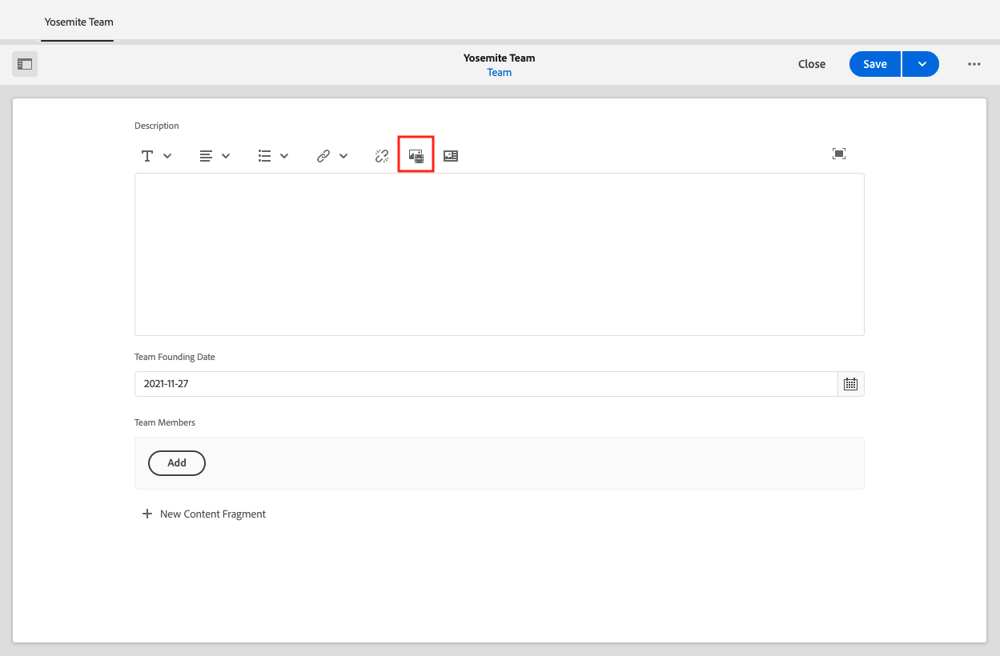

# 作者內容片段

在[上一章](/help/headless-tutorial/graphql/advanced-graphql/create-content-fragment-models.md)中，您已建立五個內容片段模式：人員、團隊、位置、地址和連絡人資訊。 本章會逐步引導您根據這些模型建立內容片段。 它也會探討如何建立檔案夾原則，以限制哪些內容片段模型可用於檔案夾。

## 先決條件 {#prerequisites}

本檔案是多部分教學課程的一部分。 在繼續此章節之前，請確定已完成[先前的章節](create-content-fragment-models.md)。

## 目標 {#objectives}

在本章中，瞭解如何：

* 使用檔案夾原則建立檔案夾並設定限制
* 直接從內容片段編輯器建立片段參考
* 使用標籤、日期和JSON物件資料型別
* 將內容和片段參考插入多行文字編輯器中
* 新增多個片段參考
* 巢狀內嵌內容片段

## 安裝範例內容 {#sample-content}

安裝包含數個資料夾和用於加速教學課程之範例影像的AEM套件。

1. 下載[Advanced-GraphQL-Tutorial-Starter-Package-1.1.zip](/help/headless-tutorial/graphql/advanced-graphql/assets/tutorial-files/Advanced-GraphQL-Tutorial-Starter-Package-1.1.zip)
1. 在AEM中，瀏覽至&#x200B;**工具** > **部署** > **封裝**&#x200B;以存取&#x200B;**封裝管理員**。
1. 上傳並安裝上一步驟中下載的套件（zip檔案）。

   

## 使用檔案夾原則建立檔案夾並設定限制

從AEM首頁選取&#x200B;**Assets** > **檔案** > **共用的WKND** > **英文**。 您可以在此處檢視各種內容片段類別，包括冒險和投稿人。

### 建立檔案夾 {#create-folders}

導覽至&#x200B;**Adventures**&#x200B;資料夾。 您可以看到已建立Teams和Locations的資料夾來儲存Teams和Locations內容片段。

為以人員內容片段模式為基礎的講師內容片段建立資料夾。

1. 從「冒險」頁面，選取右上角的&#x200B;**建立** > **資料夾**。

   

1. 在出現的「建立資料夾」強制回應視窗中，於&#x200B;**Title**&#x200B;欄位中輸入「講師」。 記下結尾的「s」。 包含許多片段的資料夾標題必須為複數。 選取「**建立**」。

   

   您現在已建立資料夾來儲存冒險導師。

### 使用檔案夾原則設定限制

AEM可讓您定義內容片段檔案夾的許可權和原則。 透過使用許可權，您只能授予特定使用者（作者）或作者群組存取特定檔案夾的許可權。 透過使用資料夾原則，您可以限製作者在這些資料夾中可以使用的內容片段模型。 在此範例中，我們將資料夾限製為「人員」和「聯絡資訊」模型。 若要設定資料夾原則：

1. 選取您已建立的&#x200B;**講師**&#x200B;資料夾，然後從上方導覽列選取&#x200B;**內容**。

   

1. 選取&#x200B;**原則**&#x200B;標籤，然後取消選取&#x200B;**繼承自/content/dam/wknd-shared**。 在&#x200B;**依路徑允許的內容片段模型**&#x200B;欄位中，選取資料夾圖示。

   

1. 在開啟的「選取路徑」對話方塊中，依路徑&#x200B;**conf** > **WKND已共用**&#x200B;操作。 在上一章建立的人員內容片段模式包含聯絡資訊內容片段模式的參考。 講師資料夾中必須同時允許使用人物和聯絡資訊模型，才能建立講師內容片段。 選取&#x200B;**人員**&#x200B;和&#x200B;**連絡人資訊**，然後按&#x200B;**選取**&#x200B;關閉對話方塊。

   

1. 選取「**儲存並關閉**」，然後在出現的成功對話方塊中選取「**確定**」。

1. 您現在已為「講師」資料夾設定資料夾原則。 導覽至&#x200B;**講師**&#x200B;資料夾，並選取&#x200B;**建立** > **內容片段**。 您現在只能選取&#x200B;**人員**&#x200B;和&#x200B;**連絡人資訊**&#x200B;模型。

   

## 為講師製作內容片段

導覽至&#x200B;**講師**&#x200B;資料夾。 從這裡，讓我們建立巢狀資料夾，以儲存講師的聯絡資訊。

依照[建立資料夾](#create-folders)一節中概述的步驟，建立名為「聯絡資訊」的資料夾。 巢狀資料夾會繼承父資料夾的資料夾原則。 請隨意設定更具體的原則，這樣新建立的資料夾就只允許使用聯絡資訊模型。

### 建立講師內容片段

讓我們建立四個可以加入冒險家講師團隊的人員。

1. 在「講師」資料夾中，根據人員內容片段模式建立內容片段，並命名為「Jacob Wester」。

   新建立的內容片段如下所示：

   

1. 在欄位中輸入下列內容：

   * **全名**： Jacob Wester
   * **傳記**： Jacob Wester當了10年的遠足教練，愛上了每一分鐘！ Jacob是一名探險家，具有攀巖和揹包操作的天賦。 Jacob是登山比賽的贏家，包括海灣之戰登山比賽。 Jacob目前住在加州。
   * **講師經驗層級**：專家
   * **技能**：攀巖、衝浪、揹包
   * **管理員詳細資料**： Jacob Wester已協調揹包冒險活動達三年。

1. 在&#x200B;**個人資料圖片**&#x200B;欄位中，新增影像的內容參考。 瀏覽至&#x200B;**共用的WKND** > **英文** > **貢獻者** > **jacob_wester.jpg**&#x200B;以建立影像的路徑。

### 從內容片段編輯器建立片段參考 {#fragment-reference-from-editor}

AEM可讓您直接從內容片段編輯器建立片段參考。 讓我們建立Jacob聯絡資訊的參考。

1. 在&#x200B;**聯絡資訊**&#x200B;欄位下方選取&#x200B;**新內容片段**。

   

1. 新內容片段模式隨即開啟。 在「選取目的地」標籤下，依路徑&#x200B;**Adventures** > **講師**&#x200B;並選取&#x200B;**連絡人資訊**&#x200B;資料夾旁的核取方塊。 選取&#x200B;**下一步**&#x200B;以繼續前往屬性標籤。

   

1. 在「屬性」標籤下，在&#x200B;**標題**&#x200B;欄位中輸入「Jacob Wester聯絡資訊」。 選取「**建立**」，然後在出現的成功對話方塊中按「**開啟**」。

   

   出現新欄位，可讓您編輯聯絡資訊內容片段。

   

1. 在欄位中輸入下列內容：

   * **電話**： 209-888-0000
   * **電子郵件**： jwester@wknd.com

   完成時，選取&#x200B;**儲存**。 您現在已建立聯絡資訊內容片段。

1. 若要導覽回講師內容片段，請選取編輯器左上角的&#x200B;**Jacob Wester**。

   

   **連絡人資訊**&#x200B;欄位現在包含參考連絡人資訊片段的路徑。 這是巢狀片段參考。 完成的講師內容片段如下所示：

   

1. 選取&#x200B;**儲存並關閉**&#x200B;以儲存內容片段。 您現在有新的講師內容片段。

### 建立其他片段

按照[上一節](#fragment-reference-from-editor)中概述的相同程式，為這些講師另外建立三個講師內容片段和三個連絡資訊內容片段。 在講師片段中新增下列內容：

**Stacey Roswells**

| 欄位 | 值 |
| --- | --- |
| 內容片段標題 | 史黛西·羅斯韋爾斯 |
| 完整名稱 | 史黛西·羅斯韋爾斯 |
| 聯絡資訊 | /content/dam/wknd-shared/en/adventures/instructors/contact-info/stacey-roswells-contact-info |
| 個人資料圖片 | /content/dam/wknd-shared/en/contributors/stacey-roswells.jpg |
| 傳記 | Stacey Roswells是一位成功的攀巖家和高山冒險家。 斯泰西出生於馬里蘭州巴爾的摩，是六個孩子中的老幺。 Stacey的父親是美國海軍的中校，母親則是現代舞蹈教練。 斯泰西的家人經常因父親的職務任務而搬家，並在父親駐泰國時拍攝了第一張照片。 這也是Stacey學會攀巖的地方。 |
| 講師經驗等級 | 進階 |
| 技能 | 攀巖 | 滑雪 | 揹包 |

**Kumar Selvaraj**

| 欄位 | 值 |
| --- | --- |
| 內容片段標題 | Kumar Selvaraj |
| 完整名稱 | Kumar Selvaraj |
| 聯絡資訊 | /content/dam/wknd-shared/en/adventures/instructors/contact-info/kumar-selvaraj-contact-info |
| 個人資料圖片 | /content/dam/wknd-shared/en/contributors/kumar-selvaraj.jpg |
| 傳記 | Kumar Selvaraj是經驗豐富的AMGA認證專業講師，其主要目標是協助學生提升攀巖和徒步旅行技能。 |
| 講師經驗等級 | 進階 |
| 技能 | 攀巖 | 揹包 |

**Ayo Ogunseinde**

| 欄位 | 值 |
| --- | --- |
| 內容片段標題 | 文藝男女 |
| 完整名稱 | 文藝男女 |
| 聯絡資訊 | /content/dam/wknd-shared/en/adventures/instructors/contact-info/ayo-ogunseinde-contact-info |
| 個人資料圖片 | /content/dam/wknd-shared/en/contributors/ayo-ogunseinde-237739.jpg |
| 傳記 | Ayo Ogunseinde是一名位於加州中部Fresno的專業登山師和揹包教練。 Ayo的目標是引導徒步旅行者進行他們最壯觀的國家公園冒險。 |
| 講師經驗等級 | 進階 |
| 技能 | 攀巖 | 循環 | 揹包 |

將&#x200B;**其他資訊**&#x200B;欄位保留空白。

在聯絡資訊片段中新增下列資訊：

| 內容片段標題 | 手機 | 電子郵件 |
| ------- | -------- | -------- |
| Stacey Roswells聯絡資訊 | 209-888-0011 | sroswells@wknd.com |
| Kumar Selvaraj聯絡資訊 | 209-888-0002 | kselvaraj@wknd.com |
| Ayo Ogunseinde聯絡資訊 | 209-888-0304 | aogunseinde@wknd.com |

您現在已準備好建立團隊！

## 為位置創作內容片段

導覽至&#x200B;**位置**&#x200B;資料夾。 在這裡，您會看到兩個已建立的巢狀資料夾：約塞米蒂國家公園和約塞米蒂山谷旅館。


暫時忽略Yosemite Valley Lodge資料夾。 在本節稍後，當我們建立一個位置，作為我們講師團隊的「主基地」時，我們會再回過頭來。

導覽至&#x200B;**約塞米蒂國家公園**&#x200B;資料夾。 目前只包含約塞米蒂國家公園的圖片。 讓我們使用位置內容片段模式來建立內容片段，並將其標題命名為「約塞米蒂國家公園」。

### 索引標籤預留位置

AEM可讓您使用索引標籤預留位置來分組不同型別的內容，並讓您的內容片段更易於閱讀和管理。 在上一章中，您將定位字元預留位置新增至位置模型。 因此，位置內容片段現在有兩個索引標籤區段： **位置詳細資料**&#x200B;和&#x200B;**位置地址**。


**位置詳細資料**&#x200B;索引標籤包含&#x200B;**名稱**、**描述**、**連絡人資訊**、**位置影像**&#x200B;以及&#x200B;**依季別顯示天氣**&#x200B;欄位，而&#x200B;**位置位址**&#x200B;索引標籤包含位址內容片段的參考。 索引標籤會清楚顯示必須填入的內容型別，因此製作內容更容易管理。

### JSON物件資料型別

**依季節**&#x200B;的天氣欄位是JSON物件資料型別，這表示它接受JSON格式的資料。 此資料型別具有彈性，可用於您要包含在內容中的任何資料。

您可以將游標移至欄位右側的資訊圖示上，檢視在上一章建立的欄位說明。


在此情況下，我們需要提供位置的平均天氣。 輸入下列資料：

```json
{
    "summer": "81 / 89°F",
    "fall": "56 / 83°F",
    "winter": "46 / 51°F",
    "spring": "57 / 71°F"
}
```

**依季節**&#x200B;的天氣欄位現在看起來應該像這樣：


### 新增內容

讓我們將其餘內容新增至位置內容片段，以便在下一章中使用GraphQL查詢資訊。

1. 在&#x200B;**位置詳細資料**&#x200B;索引標籤中，在欄位中輸入下列資訊：

   * **名稱**：約塞米蒂國家公園
   * **Description**：約塞米蒂國家公園位於加州內華達山脈。 它以美妙的瀑布、巨大的紅杉樹以及卡皮坦半圓頂懸崖的標誌性景色而聞名。 徒步旅行和露營是體驗約塞米蒂的最佳方式。 無數的小徑提供無窮無盡的冒險和探索機會。

1. 從&#x200B;**聯絡資訊**&#x200B;欄位，根據聯絡資訊模型建立內容片段，並將其標題命名為「約塞米蒂國家公園聯絡資訊」。 請依照上節中有關[從編輯器](#fragment-reference-from-editor)建立片段參考的相同程式進行，並在欄位中輸入下列資料：

   * **電話**： 209-999-0000
   * **電子郵件**： yosemite@wknd.com

1. 從&#x200B;**Location Image**&#x200B;欄位，瀏覽至&#x200B;**Adventures** > **Locations** > **約塞米蒂國家公園** > **約塞米蒂國家公園.jpeg**&#x200B;以建立影像的路徑。

   請記住，在上一章中，您設定了影像驗證，因此Location影像的尺寸必須小於2560 x 1800，且其檔案大小必須小於3 MB。

1. 新增所有資訊後，**位置詳細資料**&#x200B;標籤現在看起來像這樣：

   

1. 導覽至&#x200B;**位置地址**&#x200B;標籤。 從&#x200B;**Address**&#x200B;欄位，使用您在上一章建立的位址內容片段模式，建立名為「Yosemite National Park Address」的內容片段。 請依照[從編輯器](#fragment-reference-from-editor)建立片段參考一節中所述的相同程式操作，並在欄位中輸入下列資料：

   * **街道地址**： 9010 Curry村道
   * **城市**：約塞米蒂谷
   * **狀態**： CA
   * **郵遞區號**： 95389
   * **國家**：美國

1. 約塞米蒂國家公園片段的已完成&#x200B;**位置地址**&#x200B;標籤看起來像這樣：

   

1. 選取&#x200B;**儲存並關閉**。

### 再建立一個片段

1. 導覽至&#x200B;**Yosemite Valley Lodge**&#x200B;資料夾。 使用位置內容片段模式建立內容片段，並將其標題命名為「Yosemite Valley Lodge」。

1. 在&#x200B;**位置詳細資料**&#x200B;索引標籤中，在欄位中輸入下列資訊：

   * **名稱**： Yosemite Valley Lodge
   * **描述**： Yosemite Valley Lodge是群組會議和各種活動的中心，例如購物、吃飯、釣魚、遠足等等。

1. 從&#x200B;**聯絡資訊**&#x200B;欄位，根據聯絡資訊模型建立內容片段，並命名為「Yosemite Valley Lodge聯絡資訊」。 遵循[從編輯器](#fragment-reference-from-editor)建立片段參考一節中概述的相同程式，並在新內容片段的欄位中輸入以下資料：

   * **電話**： 209-992-0000
   * **電子郵件**： yosemitelodge@wknd.com

   儲存新建立的內容片段。

1. 導覽回&#x200B;**Yosemite Valley Lodge**，然後前往&#x200B;**Location Address**&#x200B;標籤。 從&#x200B;**Address**&#x200B;欄位，使用您在上一章建立的位址內容片段模式，建立標題為「Yosemite Valley Lodge Address」的內容片段。 請依照[從編輯器](#fragment-reference-from-editor)建立片段參考一節中所述的相同程式操作，並在欄位中輸入下列資料：

   * **街道地址**： 9006 Yosemite Lodge Drive
   * **城市**：約塞米蒂國家公園
   * **狀態**： CA
   * **郵遞區號**： 95389
   * **國家**：美國

   儲存新建立的內容片段。

1. 導覽回&#x200B;**Yosemite Valley Lodge**，然後選取&#x200B;**儲存並關閉**。 **Yosemite Valley Lodge**&#x200B;資料夾現在包含三個內容片段：Yosemite Valley Lodge、Yosemite Valley Lodge Contact Info和Yosemite Valley Lodge Address。

   

## 編寫團隊內容片段

瀏覽資料夾至&#x200B;**團隊** > **Yosemite團隊**。 您可以看到Yosemite團隊資料夾目前僅包含團隊標誌。


讓我們使用Team內容片段模型建立內容片段，並將其標題命名為「Yosemite Team」。

### 多行文字編輯器中的內容和片段參考

AEM可讓您將內容和片段參考直接新增到多行文字編輯器中，並在稍後使用GraphQL查詢來擷取它們。 讓我們將內容和片段參考新增到&#x200B;**描述**&#x200B;欄位。

1. 首先，將下列文字新增至&#x200B;**描述**&#x200B;欄位：「在約塞米蒂國家公園工作的專業冒險家和登山教練團隊」。

1. 若要新增內容參照，請選取多行文字編輯器工具列中的&#x200B;**插入資產**&#x200B;圖示。

   

1. 在出現的強制回應視窗中，選取&#x200B;**team-yosemite-logo.png**，然後按&#x200B;**Select**。

   

   內容參考現在已新增至&#x200B;**描述**&#x200B;欄位。

請記住，在上一章中，您允許將片段參考新增到&#x200B;**描述**&#x200B;欄位。 讓我們在這裡新增一個。

1. 在多行文字編輯器的工具列中選取&#x200B;**插入內容片段**&#x200B;圖示。

   

1. 瀏覽至&#x200B;**共用的WKND** > **英文** > **冒險** > **位置** > **約塞米蒂谷旅館** > **約塞米蒂谷旅館**。 按下&#x200B;**選取**&#x200B;以插入內容片段。

   

   **Description**&#x200B;欄位現在看起來像這樣：

   

您現在已將內容和片段參考直接新增到多行文字編輯器中。

### 日期和時間資料型別

讓我們來看一下「日期」和「時間」資料型別。 選取&#x200B;**團隊建立日期**&#x200B;欄位右側的&#x200B;**行事曆**&#x200B;圖示以開啟行事曆檢視。


過去或未來的日期可以使用月份任一側的向前和向後箭頭來設定。 假設Yosemite團隊於2016年5月24日成立，因此我們將設定該日的日期。

### 新增多個片段參考

讓我們新增講師到團隊成員片段參考。

1. 在&#x200B;**團隊成員**&#x200B;欄位中選取&#x200B;**新增**。

   

1. 在出現的新欄位中，選取資料夾圖示以開啟「選取路徑」強制回應視窗。 瀏覽資料夾至&#x200B;**WKND Shared** > **英文** > **冒險** > **講師**，然後選取&#x200B;**jacob-wester**&#x200B;旁的核取方塊。 按下&#x200B;**選取**&#x200B;以儲存路徑。

   

1. 再選取三次&#x200B;**新增**&#x200B;按鈕。 使用新欄位來新增其餘三位講師。 **團隊成員**&#x200B;欄位現在看起來像這樣：

   

1. 選取&#x200B;**儲存並關閉**&#x200B;以儲存團隊內容片段。

### 新增片段參考至冒險內容片段

最後，讓我們將新建立的內容片段新增到冒險中。

1. 導覽至&#x200B;**Adventures** > **Yosemite Backpacking**，然後開啟Yosemite Backpacking內容片段。 在表單底部，您可以看到您在上一章建立的三個欄位：**位置**、**講師團隊**&#x200B;和&#x200B;**系統管理員**。

1. 在&#x200B;**位置**&#x200B;欄位中新增片段參考。 位置路徑應該參考您建立的Yosemite National Park內容片段： `/content/dam/wknd-shared/en/adventures/locations/yosemite-national-park/yosemite-national-park`。

1. 在&#x200B;**講師團隊**&#x200B;欄位中新增片段參考。 團隊路徑應該參考您建立的Yosemite團隊內容片段： `/content/dam/wknd-shared/en/adventures/teams/yosemite-team/yosemite-team`。 這是巢狀片段參考。 團隊內容片段包含參考聯絡資訊和地址模式之人員模式的參考。 因此，您的巢狀內容片段向下三層樓。

1. 在&#x200B;**管理員**&#x200B;欄位中新增片段參考。 假設雅各布·韋斯特是Yosemite Backpacking Adventure的管理員。 路徑應該會指向Jacob Wester內容片段，並顯示如下： `/content/dam/wknd-shared/en/adventures/instructors/jacob-wester`。

1. 您現在已將三個片段參考新增到冒險內容片段。 欄位看起來像這樣：

   

1. 選取&#x200B;**儲存並關閉**&#x200B;以儲存您的內容。

## 恭喜！

恭喜！您現在已根據上一章建立的進階內容片段模型建立內容片段。 您也可以建立檔案夾原則，以限制在檔案夾中可以選取的內容片段模式。

## 後續步驟

在[下一章](/help/headless-tutorial/graphql/advanced-graphql/explore-graphql-api.md)中，您會瞭解如何使用GraphiQL Integrated Development Environment (IDE)傳送進階GraphQL查詢。 這些查詢可讓我們檢視在本章中建立的資料，並最終將這些查詢新增到WKND應用程式。
