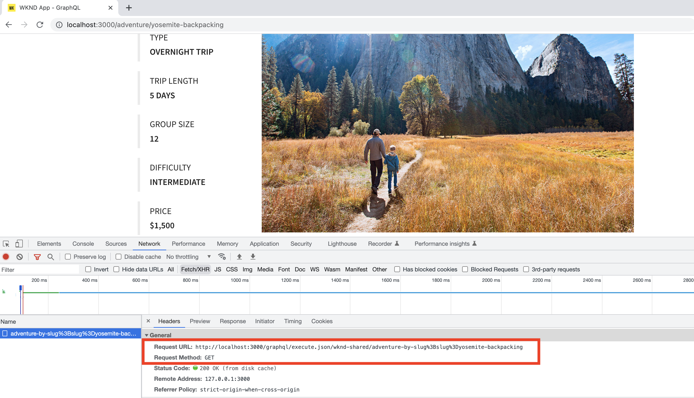

# 使用者端應用程式整合

在上一章中，您使用GraphiQL Explorer建立和更新持久查詢。

本章將逐步引導您使用現有專案中的HTTPGET要求，將持續查詢與WKND使用者端應用程式（亦稱為WKND應用程式）整合的步驟 **React元件**. 此外，您也可以選擇如何運用AEM Headless學習經驗、編碼專業知識來增強WKND使用者端應用程式。

## 必備條件 {#prerequisites}

本檔案是多部分教學課程的一部分。 在繼續本章之前，請確定已完成前面的章節。 WKND使用者端應用程式會連線至AEM發佈服務，因此您必須 **已將下列專案發佈至AEM發佈服務**.

* 專案設定
* GraphQL 端點
* 內容片段模型
* 編寫的內容片段
* GraphQL持續查詢

此 _本章中的IDE熒幕擷取畫面來自 [Visual Studio Code](https://code.visualstudio.com/)_

### 第1-4章解決方案套件（選用） {#solution-package}

可安裝的解決方案套件可完成第1-4章的AEM UI中的步驟。 此封裝為 **不需要** 前幾章是否已完成。

1. 下載 [Advanced-GraphQL-Tutorial-Solution-Package-1.2.zip](/help/headless-tutorial/graphql/advanced-graphql/assets/tutorial-files/Advanced-GraphQL-Tutorial-Solution-Package-1.2.zip).
1. 在AEM中，導覽至 **工具** > **部署** > **套件** 存取 **封裝管理員**.
1. 上傳並安裝上一步驟中下載的套件（zip檔案）。
1. 將套件復寫至AEM Publish服務

## 目標 {#objectives}

在本教學課程中，您將瞭解如何使用將持續查詢的請求整合到範例WKND GraphQL React應用程式中 [適用於JavaScript的AEM Headless使用者端](https://github.com/adobe/aem-headless-client-js).

## 複製並執行範例使用者端應用程式 {#clone-client-app}

為了加速教學課程，我們提供入門版React JS應用程式。

1. 原地複製 [adobe/aem-guides-wknd-graphql](https://github.com/adobe/aem-guides-wknd-graphql) 存放庫：

   ```shell
   $ git clone git@github.com:adobe/aem-guides-wknd-graphql.git
   ```

1. 編輯 `aem-guides-wknd-graphql/advanced-tutorial/.env.development` 檔案和集合 `REACT_APP_HOST_URI` 指向您的target AEM發佈服務。

   如果連線到作者執行個體，請更新驗證方法。

   ```plain
   # Server namespace
   REACT_APP_HOST_URI=https://publish-pxx-eyy.adobeaemcloud.com
   
   #AUTH (Choose one method)
   # Authentication methods: 'service-token', 'dev-token', 'basic' or leave blank to use no authentication
   REACT_APP_AUTH_METHOD=
   
   # For Bearer auth, use DEV token (dev-token) from Cloud console
   REACT_APP_DEV_TOKEN=
   
   # For Service toke auth, provide path to service token file (download file from Cloud console)
   REACT_APP_SERVICE_TOKEN=auth/service-token.json
   
   # For Basic auth, use AEM ['user','pass'] pair (eg for Local AEM Author instance)
   REACT_APP_BASIC_AUTH_USER=
   REACT_APP_BASIC_AUTH_PASS=
   ```

   


   >[!NOTE]
   > 
   > 上述指示是將React應用程式連線至 **AEM Publish服務**，但若要連線至 **AEM作者服務** 取得目標AEMas a Cloud Service環境的本機開發權杖。
   >
   > 也可以將應用程式連線至 [使用AEMaaCS SDK的本機作者執行個體](/help/headless-tutorial/graphql/quick-setup/local-sdk.md) 使用基本驗證。


1. 開啟終端機並執行命令：

   ```shell
   $ cd aem-guides-wknd-graphql/advanced-tutorial
   $ npm install
   $ npm start
   ```

1. 新瀏覽器視窗應載入於 [http://localhost:3000](http://localhost:3000)


1. 點選 **露營** > **Yosemite揹包** 以檢視Yosemite Backpacking冒險細節。

   

1. 開啟瀏覽器的開發人員工具並檢查 `XHR` 請求

   

   您應該會看到 `GET` GraphQL使用專案設定名稱(`wknd-shared`)，持續查詢名稱(`adventure-by-slug`)，變數名稱(`slug`)，值(`yosemite-backpacking`)和特殊字元編碼。

>[!IMPORTANT]
>
>    如果您想知道為什麼GraphQL API請求是針對 `http://localhost:3000` 且不會針對AEM Publish Service網域，請檢閱 [潛藏於引擎蓋之下](../multi-step/graphql-and-react-app.md#under-the-hood) 基本教學課程中的。


## 檢閱程式碼

在 [基本教學課程 — 建立使用AEM GraphQL API的React應用程式](https://experienceleague.adobe.com/docs/experience-manager-learn/getting-started-with-aem-headless/graphql/multi-step/graphql-and-react-app.html#review-the-aemheadless-object) 步驟我們稽核並強化了幾個重要檔案，以獲得實際操作專業知識。 增強WKND應用程式之前，請先檢閱重要檔案。

* [檢閱AEMHeadless物件](https://experienceleague.adobe.com/docs/experience-manager-learn/getting-started-with-aem-headless/graphql/multi-step/graphql-and-react-app.html#review-the-aemheadless-object)

* [實作以執行AEM GraphQL持續查詢](https://experienceleague.adobe.com/docs/experience-manager-learn/getting-started-with-aem-headless/graphql/multi-step/graphql-and-react-app.html#implement-to-run-aem-graphql-persisted-queries)

### 檢閱 `Adventures` React元件

WKND React應用程式的主要檢視是所有冒險的清單，您可以根據活動型別篩選這些冒險，例如 _露營、騎腳踏車_. 此檢視由 `Adventures` 元件。 以下是主要實作詳細資料：

* 此 `src/components/Adventures.js` 呼叫 `useAllAdventures(adventureActivity)` 鉤點及此處 `adventureActivity` 引數是活動型別。

* 此 `useAllAdventures(adventureActivity)` 勾點定義於 `src/api/usePersistedQueries.js` 檔案。 根據 `adventureActivity` 值，它決定要呼叫哪個持續查詢。 如果不是null值，則會呼叫 `wknd-shared/adventures-by-activity`，否則會取得所有可用的冒險 `wknd-shared/adventures-all`.

* 勾點使用主要 `fetchPersistedQuery(..)` 將查詢執行委派到的函式 `AEMHeadless` 透過 `aemHeadlessClient.js`.

* 此連結也只會傳回位於AEM GraphQL回應中的相關資料 `response.data?.adventureList?.items`，允許 `Adventures` React會檢視與父JSON結構無關的元件。

* 成功執行查詢後， `AdventureListItem(..)` 演算函式來源 `Adventures.js` 新增HTML元素以顯示 _影像、運送航程長度、價格和標題_ 資訊。

### 檢閱 `AdventureDetail` React元件

此 `AdventureDetail` React元件會呈現冒險的詳細資訊。 以下是主要實作詳細資料：

* 此 `src/components/AdventureDetail.js` 呼叫 `useAdventureBySlug(slug)` 鉤點及此處 `slug` 引數為查詢引數。

* 如上所示， `useAdventureBySlug(slug)` 勾點定義於 `src/api/usePersistedQueries.js` 檔案。 It呼叫 `wknd-shared/adventure-by-slug` 透過委派至的持久查詢 `AEMHeadless` 透過 `aemHeadlessClient.js`.

* 成功執行查詢後， `AdventureDetailRender(..)` 演算函式來源 `AdventureDetail.js` 新增HTML元素以顯示Adventure詳細資訊。


## 增強程式碼

### 使用 `adventure-details-by-slug` 持久查詢

在上一章中，我們建立了 `adventure-details-by-slug` 持久查詢，它提供額外的冒險資訊，例如 _位置、講師團隊和管理員_. 讓我們取代 `adventure-by-slug` 替換為 `adventure-details-by-slug` 持續查詢以呈現此額外資訊。

1. 開啟 `src/api/usePersistedQueries.js`.

1. 找到函式 `useAdventureBySlug()` 並更新查詢為

```javascript
 ...

 // Call the AEM GraphQL persisted query named "wknd-shared/adventure-details-by-slug" with parameters
 response = await fetchPersistedQuery(
 "wknd-shared/adventure-details-by-slug",
 queryParameters
 );

 ...
```

### 顯示其他資訊

1. 若要顯示其他冒險資訊，請開啟 `src/components/AdventureDetail.js`

1. 找到函式 `AdventureDetailRender(..)` 並將傳回函式更新為

   ```javascript
   ...
   
   return (<>
       <h1 className="adventure-detail-title">{title}</h1>
       <div className="adventure-detail-info">
   
           <LocationInfo {...location} />
   
           ...
   
           <Location {...location} />
   
           <Administrator {...administrator} />
   
           <InstructorTeam {...instructorTeam} />
   
       </div>
   </>); 
   
   ...
   ```

1. 同時定義對應的轉譯器函式：

   **位置資訊**

   ```javascript
   function LocationInfo({name}) {
   
       if (!name) {
           return null;
       }
   
       return (
           <>
               <div className="adventure-detail-info-label">Location</div>
               <div className="adventure-detail-info-description">{name}</div>
           </>
       );
   
   }
   ```

   **位置**

   ```javascript
   function Location({ contactInfo }) {
   
       if (!contactInfo) {
           return null;
       }
   
       return (
           <>
               <div className='adventure-detail-location'>
                   <h2>Where we meet</h2>
                   <hr />
                   <div className="adventure-detail-addtional-info">Phone:{contactInfo.phone}</div>
                   <div className="adventure-detail-addtional-info">Email:{contactInfo.email}</div>
               </div>
           </>);
   }
   ```

   **講師團隊**

   ```javascript
   function InstructorTeam({ _metadata }) {
   
       if (!_metadata) {
           return null;
       }
   
       return (
           <>
               <div className='adventure-detail-team'>
                   <h2>Instruction Team</h2>
                   <hr />
                   <div className="adventure-detail-addtional-info">Team Name: {_metadata.stringMetadata[0].value}</div>
               </div>
           </>);
   }
   ```

   **管理員**

   ```javascript
   function Administrator({ fullName, contactInfo }) {
   
       if (!fullName || !contactInfo) {
           return null;
       }
   
       return (
           <>
               <div className='adventure-detail-administrator'>
                   <h2>Administrator</h2>
                   <hr />
                   <div className="adventure-detail-addtional-info">Name: {fullName}</div>
                   <div className="adventure-detail-addtional-info">Phone: {contactInfo.phone}</div>
                   <div className="adventure-detail-addtional-info">Email: {contactInfo.email}</div>
               </div>
           </>);
   }
   ```

### 定義新樣式

1. 開啟 `src/components/AdventureDetail.scss` 並新增下列類別定義

   ```CSS
   .adventure-detail-administrator,
   .adventure-detail-team,
   .adventure-detail-location {
   margin-top: 1em;
   width: 100%;
   float: right;
   }
   
   .adventure-detail-addtional-info {
   padding: 10px 0px 5px 0px;
   text-transform: uppercase;
   }
   ```

>[!TIP]
>
>更新的檔案位於 **AEM Guides WKND - GraphQL** 專案，請參閱 [進階教學課程](https://github.com/adobe/aem-guides-wknd-graphql/tree/main/advanced-tutorial) 區段。


完成上述增強功能後，WKND應用程式如下所示，而瀏覽器的開發人員工具會顯示 `adventure-details-by-slug` 持久查詢呼叫。


## 增強功能挑戰（選購）

WKND React應用程式的主要檢視可讓您根據活動型別篩選這些冒險活動，例如 _露營、騎腳踏車_. 不過WKND業務團隊想要額外的 _位置_ 篩選功能。 需求為

* 在WKND應用程式的主檢視上，在左上角或右上角新增 _位置_ 篩選圖示。
* 按一下 _位置_ 篩選圖示應顯示位置清單。
* 從清單中按一下所需的位置選項應只會顯示相符的「冒險」。
* 如果只有一個相符的Adventure，則會顯示Adventure詳細資料檢視。

## 恭喜

恭喜！您現在已完成整合，並將持續查詢實作到範例WKND應用程式中。
