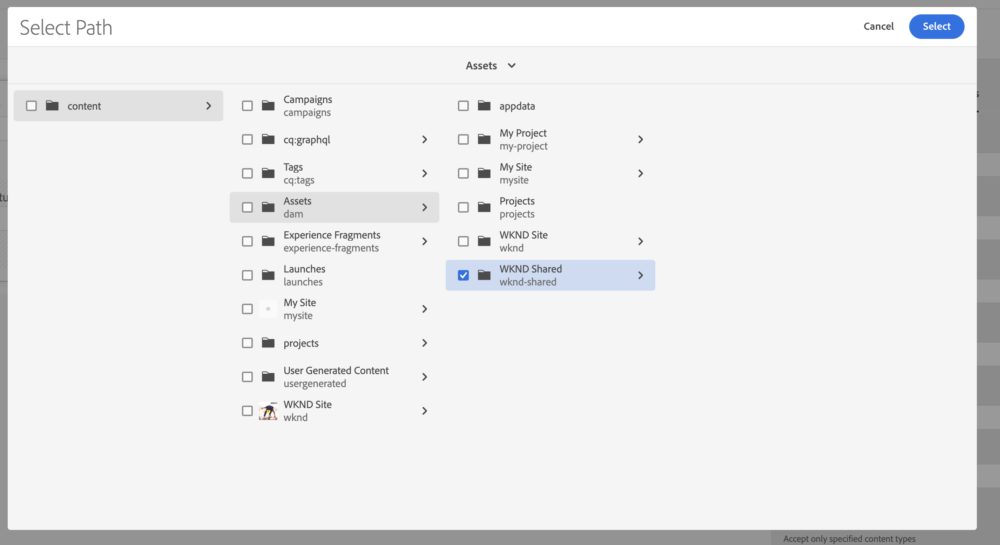
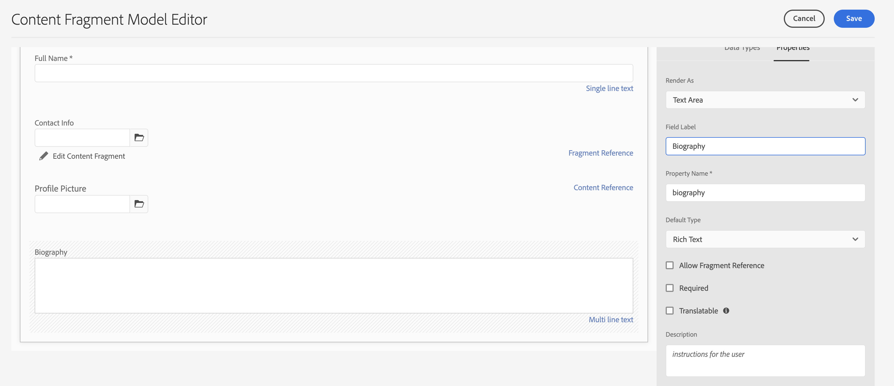

# 建立內容片段模型 {#create-content-fragment-models}

本章逐步說明建立五個內容片段模型的步驟：

* **聯絡資訊**
* **地址**
* **人員**
* **位置**
* **團隊**

內容片段模型可定義內容類型之間的關係，並持續保存如結構之類的關係。 使用巢狀片段參考、各種內容資料類型，以及可視化內容組織的索引標籤類型。 更多進階資料類型，例如索引標籤預留位置、片段參考、JSON物件，以及日期與時間資料類型。

本章還介紹如何增強內容參考（如影像）的驗證規則。

## 必備條件 {#prerequisites}

這是進階的教學課程。 繼續處理本章之前，請確保您已完成 [快速設定](../quick-setup/cloud-service.md). 請確定您也已閱讀前一個 [概述](../overview.md) 章節，以取得進階教學課程設定的詳細資訊。

## 目標 {#objectives}

* 建立內容片段模型.
* 將索引標籤預留位置、日期和時間、JSON物件、片段參考和內容參考新增至模型。
* 將驗證新增至內容參考。

## 內容片段模型概觀 {#content-fragment-model-overview}

以下影片簡要介紹內容片段模型，以及這些模型在本教學課程中的使用方式。

>[!VIDEO](https://video.tv.adobe.com/v/340037?quality=12&learn=on)

## 建立內容片段模型 {#create-models}

讓我們為WKND應用程式建立一些內容片段模型。 若需要建立內容片段模型的基本簡介，請參閱 [基本教學課程](../multi-step/content-fragment-models.md).

1. 導覽至 **工具** > **一般** > **內容片段模型**.

   

1. 選擇 **WKND共用** 檢視網站的現有內容片段模型清單。

### 聯繫資訊模型 {#contact-info-model}

接下來，建立包含人員或位置的聯繫資訊的模型。

1. 選擇 **建立** 在右上角。

1. 為模型命名為「聯繫資訊」，然後選擇 **建立**. 在顯示的成功強制回應中，選取 **開啟** 編輯新建立的模型。

1. 首先，拖曳 **單行文字** 欄位至模型。 給它一個 **欄位標籤** 在 **屬性** 標籤。 屬性名稱會自動填入為 `phone`. 選取要建立欄位的核取方塊 **必填**.

1. 導覽至 **資料類型** 標籤，然後添加 **單行文字** 欄位（在「電話」欄位下）。 給它一個 **欄位標籤** ，並將其設為 **必填**.

Adobe Experience Manager隨附一些內建驗證方法。 這些驗證方法可讓您將控管規則新增至內容片段模型中的特定欄位。 在此情況下，我們將新增驗證規則，以確保使用者在填寫此欄位時，只能輸入有效的電子郵件地址。 在 **驗證類型** 下拉式清單，選取 **電子郵件**.

您完成的內容片段模型應如下所示：

完成後，選取 **儲存** 確認變更並關閉內容片段模型編輯器。

### 地址模型 {#address-model}

接下來，為地址建立模型。

1. 從 **WKND共用**，選取 **建立** 從右上角。

1. 輸入「地址」標題，然後選擇 **建立**. 在顯示的成功強制回應中，選取 **開啟** 編輯新建立的模型。

1. 拖放 **單行文字** 欄位至模型上，並為其指定 **欄位標籤** &quot;街道地址&quot; 屬性名稱隨後會填入為 `streetAddress`. 選取 **必填** 核取方塊。

1. 重複上述步驟，並將四個「單行文本」欄位添加到模型中。 使用下列標籤：

   * 城市
   * 狀態
   * 郵遞區號
   * 國家/地區

1. 選擇 **儲存** 以保存對地址模型的更改。

   已完成的「地址」片段模型應如下所示：
   

### 人員模型 {#person-model}

接下來，建立包含人員資訊的模型。

1. 在右上角選取 **建立**.

1. 將模型的標題命名為「Person」，然後選取 **建立**. 在顯示的成功強制回應中，選取 **開啟** 編輯新建立的模型。

1. 首先，拖曳 **單行文字** 欄位至模型。 給它一個 **欄位標籤** 全名。 屬性名稱會自動填入為 `fullName`. 選取要建立欄位的核取方塊 **必填**.

   

1. 內容片段模型可在其他模型中參考。 導覽至 **資料類型** 標籤，然後拖放 **片段參考** 欄位，並為其加上「聯絡資訊」標籤。

1. 在 **屬性** 頁簽 **允許的內容片段模型** 欄位中，選擇資料夾表徵圖，然後選擇 **聯繫資訊** 先前建立的片段模型。

1. 新增 **內容參考** 欄位 **欄位標籤** 的首頁。 選取下方的資料夾圖示 **根路徑** ，開啟路徑選取強制回應視窗。 通過選擇 **內容** > **資產**，然後選取 **WKND共用**. 使用 **選擇** 按鈕，以儲存路徑。 最終文字路徑應為 `/content/dam/wknd-shared`.

   

1. 在 **僅接受指定的內容類型**，請選取「影像」。

   

1. 若要限制影像檔案大小和尺寸，我們將查看內容參考欄位的一些驗證選項。

   在 **僅接受指定的檔案大小**，請選取「小於或等於」，下方會顯示其他欄位。
   

1. 針對 **Max**，請輸入&quot;5&quot;和 **選擇設備**，選擇&quot;MB(MB)&quot;。 此驗證僅允許選擇指定大小的影像。

1. 在 **僅接受指定的影像寬度**，選擇「最大寬度」。 在 **最大（像素）** 欄位，輸入&quot;10000&quot;。 為選擇相同的選項 **僅接受指定的影像高度**.

   這些驗證可確保新增的影像不會超過指定的值。 驗證規則現在看起來應該如下：

   

1. 新增 **多行文本** 欄位 **欄位標籤** 《傳記》 保留 **預設類型** 下拉式清單，作為預設的「RTF」選項。

   

1. 導覽至 **資料類型** 標籤，然後拖曳 **枚舉** 《傳記》下方的欄位。 而非預設 **呈現為** 選項，選擇 **下拉式清單** 然後給它 **欄位標籤** 「講師經驗級別」。 輸入教師經驗級別選項，如 _專家、高級、中級_.

1. 接下來，拖動另一個 **枚舉** 欄位（在「教師體驗級別」下），並選擇 **呈現為** 選項。 給它一個 **欄位標籤** 「技能」。 進入不同的技能，如攀岩、衝浪、騎腳踏車、滑雪和背包。 選項標籤和選項值應符合如下：

   

1. 最後，使用 **多行文本** 欄位。

選擇 **儲存** 確認變更並關閉內容片段模型編輯器。

### 位置模型 {#location-model}

下一個內容片段模型描述物理位置。 此模型使用頁簽佔位符。 將內容分類後，索引標籤預留位置有助於分別在模型編輯器和片段編輯器中組織資料類型。 每個預留位置都會在「內容片段」編輯器中建立一個索引標籤，類似於網際網路瀏覽器中的索引標籤。 「位置」模型應具有兩個頁簽：位置詳細資訊和位置地址。

1. 如先前所述，請選取 **建立** 來建立其他內容片段模型。 在「模型標題」中輸入「位置」。 選擇 **建立** 後跟 **開啟** 在出現的成功模式中。

1. 新增 **標籤預留位置** 欄位至模型，並將其標示為「位置詳細資料」。

1. 拖放 **單行文字** 並標籤為「名稱」。 在此欄位標籤下方新增 **多行文本** 欄位並將其標示為「說明」。

1. 接下來，新增 **片段參考** 欄位，並將其標示為「聯絡資訊」。 在「屬性」索引標籤中， **允許的內容片段模型**，請選取 **資料夾圖示** 並選擇先前建立的「聯繫資訊」片段模型。

1. 新增 **內容參考** 欄位（在「聯繫資訊」下）。 將其標籤為「位置影像」。 此 **根路徑** 應該是 `/content/dam/wknd-shared.` 在 **僅接受指定的內容類型**，請選取「影像」。

1. 我們也新增 **JSON物件** 欄位（在「位置影像」下）。 由於此資料類型具有彈性，因此可用來顯示您要納入內容的任何資料。 在此案例中，JSON物件用於顯示天氣的相關資訊。 將JSON物件標示為「依季數的天氣」。 在 **屬性** 標籤，新增 **說明** 因此，使用者很清楚應該在此處輸入哪些資料：「關於活動位置氣候的JSON資料（依季節）（春、夏、秋、冬）。」

   

1. 要建立「位置地址」頁簽，請添加 **標籤預留位置** 欄位至模型，並將其標示為「位置地址」。

1. 拖放 **片段參考** 欄位和屬性索引標籤中，將其標示為「Address」，並在 **允許的內容片段模型**，請選取 **地址** 模型。

1. 選擇 **儲存** 確認變更並關閉內容片段模型編輯器。 已完成的位置模型應如下所示：

   

### 團隊模型 {#team-model}

最後，建立描述一組人員的模型。

1. 從 **WKND共用** 頁面，選取 **建立** 建立另一個內容片段模型。 在「模型標題」中，輸入「團隊」。 如先前所述，請選取 **建立** 後跟 **開啟** 在出現的成功模式中。

1. 新增 **多行文本** 欄位至表單。 在 **欄位標籤**，請輸入「說明」。

1. 新增 **日期和時間** 欄位至模型，並將其標示為「團隊建立日期」。 在此情況下，請保留預設值 **類型** 設為「Date」，但請注意也可以使用「Date &amp; Time」或「Time」。

   

1. 導覽至 **資料類型** 標籤。 在「團隊建立日期」下方新增 **片段參考**. 在 **呈現為** 下拉式清單，選取「多欄位」。 針對 **欄位標籤**，輸入「團隊成員」。 此欄位連結至 _人員_ 先前建立的模型。 由於資料類型是多欄位，因此可以新增多個人員片段，以建立人員團隊。

   

1. 在 **允許的內容片段模型**，請使用資料夾圖示開啟「選取路徑」強制回應視窗，然後選取 **人員** 模型。 使用 **選擇** 按鈕以儲存路徑。

   

1. 選擇 **儲存** 確認變更並關閉內容片段模型編輯器。

## 將片段參考新增至冒險模型 {#fragment-references}

與團隊模型對人員模型的片段參考類似，團隊和位置模型必須從冒險模型參考，才能在WKND應用程式中顯示這些新模型。

1. 從 **WKND共用** 頁面，選擇 **冒險** 模型，然後選取 **編輯** ，即可取得Advertising Cloud的說明。

   

1. 在表格底部的「What to Bring」下方，新增 **片段參考** 欄位。 輸入 **欄位標籤** 「位置」。 在 **允許的內容片段模型**，請選取 **位置** 模型。

   

1. 再新增一個 **片段參考** 欄位並將其標籤為「Instructor Team」。 在 **允許的內容片段模型**，請選取 **團隊** 模型。

   

1. 添加其他 **片段參考** 欄位並將其標籤為「管理員」。

   

1. 選擇 **儲存** 確認變更並關閉內容片段模型編輯器。

## 最佳做法 {#best-practices}

有幾項與建立內容片段模型相關的最佳實務：

* 建立對應至UX元件的模型。 例如，WKND應用程式具有用於歷險、文章和位置的內容片段模型。 您也可以新增標題、促銷活動或免責聲明。 這些範例會組成特定的UX元件。

* 盡可能建立最少的模型。 通過限制模型的數量，您可以最大限度地重複使用和簡化內容管理。

* 視需要深入巢狀內嵌內容片段模型，但視需要而定。 回想一下巢狀是使用片段參考或內容參考來完成。 請考慮最多5個嵌套級別。

## 恭喜！ {#congratulations}

恭喜！您現在已新增標籤、使用日期和時間和JSON物件資料類型，並深入了解片段和內容參考。 您也新增了內容參考驗證規則。

## 後續步驟 {#next-steps}

本系列的下一章將介紹 [製作內容片段](/help/headless-tutorial/graphql/advanced-graphql/author-content-fragments.md) 從本章中建立的模型。 了解如何使用本章介紹的資料類型和建立資料夾原則，以限制可在資產資料夾中建立的內容片段模型。

雖然本教學課程為選用項目，但請務必在實際生產環境中發佈所有內容。 如需AEM中製作和發佈環境的檢閱，請參閱
[AEM無頭和GraphQL影片系列](/help/headless-tutorial/graphql/video-series/author-publish-architecture.md).
