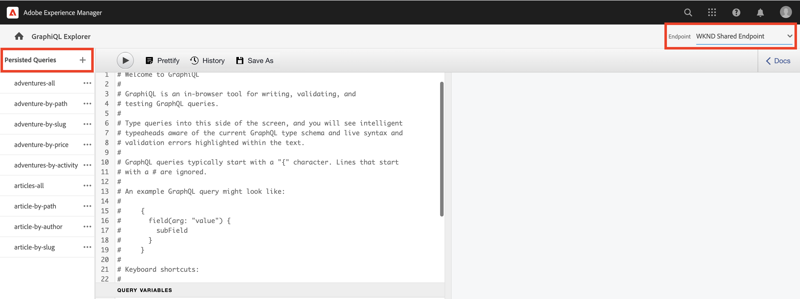

# 探索AEM GraphQL API

AEM中的GraphQL API可讓您向下游應用程式公開內容片段資料。 在基本教學課程中 [多步驟GraphQL教學課程](../multi-step/explore-graphql-api.md)，您已使用GraphiQL Explorer來測試和調整GraphQL查詢。

在本章中，您使用GraphiQL Explorer定義更進階的查詢，以收集您在中建立的內容片段的資料 [上一章](../advanced-graphql/author-content-fragments.md).

## 先決條件 {#prerequisites}

本檔案是多部分教學課程的一部分。 在繼續本章之前，請確定已完成前面的章節。

## 目標 {#objectives}

在本章中，您將學習如何：

* 使用查詢變數篩選包含參考的內容片段清單
* 篩選片段參考中的內容
* 從多行文字欄位查詢內嵌內容和片段參考
* 使用指令進行查詢
* 查詢JSON物件內容型別

## 使用GraphiQL總管


此 [GraphiQL Explorer](https://experienceleague.adobe.com/docs/experience-manager-cloud-service/content/headless/graphql-api/graphiql-ide.html) 工具可讓開發人員針對目前AEM環境中的內容建立和測試查詢。 GraphiQL工具也可讓使用者 **保留或儲存** 供生產設定中的使用者端應用程式使用的查詢。

接下來，使用內建的GraphiQL Explorer來探索AEM GraphQL API的強大功能。

1. 從AEM開始畫面，導覽至 **工具** > **一般** > **GraphQL查詢編輯器**.

   

>[!IMPORTANT]
>
>在中，有些AEM版本(6.X.X) GraphiQL Explorer （亦稱為GraphiQL IDE）工具需要手動安裝，請遵循 [從此處取得指示](../how-to/install-graphiql-aem-6-5.md).

1. 在右上角，確定「端點」已設為 **WKND共用端點**. 變更 _端點_ 這裡的下拉式清單值會顯示現有的 _持久查詢_ 左上角。

   

這會將所有查詢的範圍設定為在中建立的模型 **WKND已共用** 專案。


## 使用查詢變數篩選內容片段清單

在上一個 [多步驟GraphQL教學課程](../multi-step/explore-graphql-api.md)，您定義並使用基本的持續性查詢來取得內容片段資料。 在這裡，您可以展開此知識，並將變數傳遞至持續查詢，以篩選內容片段資料。

開發使用者端應用程式時，通常需要根據動態引數篩選內容片段。 AEM GraphQL API可讓您在查詢中將這些引數作為變數傳遞，以避免在執行階段在使用者端上建構字串。 如需GraphQL變數的詳細資訊，請參閱 [GraphQL檔案](https://graphql.org/learn/queries/#variables).

在此範例中，查詢所有具有特定技能的講師。

1. 在GraphiQL IDE中，將下列查詢貼到左側面板中：

   ```graphql
   query listPersonBySkill ($skillFilter: String!){
     personList(
       _locale: "en"
       filter: {skills: {_expressions: [{value: $skillFilter}]}}
     ) {
       items {
         fullName
         contactInfo {
           phone
           email
         }
         profilePicture {
           ... on ImageRef {
             _path
           }
         }
         biography {
           plaintext
         }
         instructorExperienceLevel
         skills
       }
     }
   }
   ```

   此 `listPersonBySkill` 上方的查詢接受一個變數(`skillFilter`)為必要欄位 `String`. 此查詢會針對所有人員內容片段執行搜尋，並根據 `skills` 欄位和傳入的字串 `skillFilter`.

   此 `listPersonBySkill` 包含 `contactInfo` 屬性，此為前幾章中定義之聯絡資訊模型的片段參照。 「聯絡資訊」模型包含 `phone` 和 `email` 欄位。 查詢中必須至少存在其中一個欄位，才能正確執行。

   ```graphql
   contactInfo {
           phone
           email
         }
   ```

1. 接下來，讓我們定義 `skillFilter` 並取得所有精通滑雪的講師。 將下列JSON字串貼到GraphiQL IDE的「查詢變數」面板中：

   ```json
   {
       "skillFilter": "Skiing"
   }
   ```

1. 執行查詢。 結果看起來應該類似下列：

   ```json
   {
     "data": {
       "personList": {
         "items": [
           {
             "fullName": "Stacey Roswells",
             "contactInfo": {
               "phone": "209-888-0011",
               "email": "sroswells@wknd.com"
             },
             "profilePicture": {
               "_path": "/content/dam/wknd-shared/en/contributors/stacey-roswells.jpg"
             },
             "biography": {
               "plaintext": "Stacey Roswells is an accomplished rock climber and alpine adventurer. Born in Baltimore, Maryland, Stacey is the youngest of six children. Stacey's father was a lieutenant colonel in the US Navy and mother was a modern dance instructor. Stacey's family moved frequently with father's duty assignments and took the first pictures when father was stationed in Thailand. This is also where Stacey learned to rock climb."
             },
             "instructorExperienceLevel": "Advanced",
             "skills": [
               "Rock Climbing",
               "Skiing",
               "Backpacking"
             ]
           }
         ]
       }
     }
   }
   ```

按下 **播放** 按鈕來執行查詢。 您應該會看到上一章內容片段的結果：


## 篩選片段參考中的內容

AEM GraphQL API可讓您查詢巢狀內容片段。 在上一章中，您為冒險內容片段新增了三個新片段參考： `location`， `instructorTeam`、和 `administrator`. 現在，讓我們針對具有特定名稱的任何管理員篩選所有冒險活動。

>[!CAUTION]
>
>僅允許一個模型作為參考，此查詢才能正確執行。

1. 在GraphiQL IDE中，將下列查詢貼到左側面板中：

   ```graphql
   query getAdventureAdministratorDetailsByAdministratorName ($name: String!){
     adventureList(
     _locale: "en"
       filter: {administrator: {fullName: {_expressions: [{value: $name}]}}}
     ) {
       items {
         title
         administrator {
           fullName
           contactInfo {
             phone
             email
           }
           administratorDetails {
             json
           }
         }
       }
     }
   }
   ```

1. 接下來，將下列JSON字串貼到「查詢變數」面板中：

   ```json
   {
       "name": "Jacob Wester"
   }
   ```

   此 `getAdventureAdministratorDetailsByAdministratorName` 查詢篩選所有冒險的任何 `administrator` 之 `fullName` 「Jacob Wester」，傳回兩個巢狀內容片段的資訊：冒險和講師。

1. 執行查詢。 結果看起來應該類似下列：

   ```json
   {
     "data": {
       "adventureList": {
         "items": [
           {
             "title": "Yosemite Backpacking",
             "administrator": {
               "fullName": "Jacob Wester",
               "contactInfo": {
                 "phone": "209-888-0000",
                 "email": "jwester@wknd.com"
               },
               "administratorDetails": {
                 "json": [
                   {
                     "nodeType": "paragraph",
                     "content": [
                       {
                         "nodeType": "text",
                         "value": "Jacob Wester has been coordinating backpacking adventures for three years."
                       }
                     ]
                   }
                 ]
               }
             }
           }
         ]
       }
     }
   }
   ```

## 從多行文字欄位查詢內嵌參考 {#query-rte-reference}

AEM GraphQL API可讓您在多行文字欄位中查詢內容和片段參考。 在上一章中，您將兩個參照型別新增到 **說明** Yosemite團隊內容片段的欄位。 現在，讓我們擷取這些參考。

1. 在GraphiQL IDE中，將下列查詢貼到左側面板中：

   ```graphql
   query getTeamByAdventurePath ($fragmentPath: String!){
     adventureByPath (_path: $fragmentPath) {
       item {
         instructorTeam {
           _metadata {
             stringMetadata {
               name
               value
             }
         }
           teamFoundingDate
           description {
             plaintext
           }
         }
       }
       _references {
         ... on ImageRef {
           __typename
           _path
         }
         ... on LocationModel {
           __typename
           _path
           name
           address {
             streetAddress
             city
             zipCode
             country
           }
           contactInfo {
             phone
             email
           }
         }
       }
     }
   }
   ```

   此 `getTeamByAdventurePath` 查詢會依路徑篩選所有冒險並傳回以下專案的資料： `instructorTeam` 特定冒險的片段參考。

   `_references` 是系統產生的欄位，用於顯示參照，包括插入多行文字欄位中的參照。

   此 `getTeamByAdventurePath` 查詢會擷取多個參考。 首先，它使用內建 `ImageRef` 物件以擷取 `_path` 和 `__typename` 插入多行文字欄位做為內容參照的影像數量。 接下來，它使用 `LocationModel` 擷取插入到相同欄位中的位置內容片段的資料。

   此查詢還包括 `_metadata` 欄位。 這可讓您擷取團隊內容片段的名稱，並稍後在WKND應用程式中顯示。

1. 接下來，將下列JSON字串貼到「查詢變數」面板中，以取得Yosemite Backpacking Adventure：

   ```json
   {
       "fragmentPath": "/content/dam/wknd-shared/en/adventures/yosemite-backpacking/yosemite-backpacking"
   }
   ```

1. 執行查詢。 結果看起來應該類似下列：

   ```json
   {
     "data": {
       "adventureByPath": {
         "item": {
           "instructorTeam": {
             "_metadata": {
               "stringMetadata": [
                 {
                   "name": "title",
                   "value": "Yosemite Team"
                 },
                 {
                   "name": "description",
                   "value": ""
                 }
               ]
             },
             "teamFoundingDate": "2016-05-24",
             "description": {
               "plaintext": "\n\nThe team of professional adventurers and hiking instructors working in Yosemite National Park.\n\nYosemite Valley Lodge"
             }
           }
         },
         "_references": [
           {
             "__typename": "LocationModel",
             "_path": "/content/dam/wknd-shared/en/adventures/locations/yosemite-valley-lodge/yosemite-valley-lodge",
             "name": "Yosemite Valley Lodge",
             "address": {
               "streetAddress": "9006 Yosemite Lodge Drive",
               "city": "Yosemite National Park",
               "zipCode": "95389",
               "country": "United States"
             },
             "contactInfo": {
               "phone": "209-992-0000",
               "email": "yosemitelodge@wknd.com"
             }
           },
           {
             "__typename": "ImageRef",
             "_path": "/content/dam/wknd-shared/en/adventures/teams/yosemite-team/team-yosemite-logo.png"
           }
         ]
       }
     }
   }
   ```

   此 `_references` 欄位會顯示標誌影像和插入的Yosemite Valley Lodge內容片段 **說明** 欄位。


## 使用指令進行查詢

有時在開發使用者端應用程式時，您需要有條件地變更查詢的結構。 在此情況下，AEM GraphQL API可讓您使用GraphQL指示，以根據提供的條件變更查詢的行為。 如需GraphQL指示詞的詳細資訊，請參閱 [GraphQL檔案](https://graphql.org/learn/queries/#directives).

在 [上一節](#query-rte-reference)，您已瞭解如何在多行文字欄位中查詢內嵌參考。 內容擷取自 `description` 已歸檔於 `plaintext` 格式。 接下來，我們將展開該查詢，並使用指示詞來有條件地擷取 `description` 在 `json` 格式化。

1. 在GraphiQL IDE中，將下列查詢貼到左側面板中：

   ```graphql
   query getTeamByAdventurePath ($fragmentPath: String!, $includeJson: Boolean!){
     adventureByPath(_path: $fragmentPath) {
       item {
         instructorTeam {
           _metadata{
             stringMetadata{
               name
               value
             }
           }
           teamFoundingDate
           description {
             plaintext
             json @include(if: $includeJson)
           }
         }
       }
       _references {
         ... on ImageRef {
           __typename
           _path
         }
         ... on LocationModel {
           __typename
           _path
           name
           address {
             streetAddress
             city
             zipCode
             country
           }
           contactInfo {
             phone
             email
           }
         }
       }
     }
   }
   ```

   上述查詢接受另一個變數(`includeJson`)為必要欄位 `Boolean`，也稱為查詢的指示詞。 指示詞可用於有條件地包含來自下列專案的資料： `description` 中的欄位 `json` 根據傳入的布林值設定格式 `includeJson`.

1. 接下來，將下列JSON字串貼到「查詢變數」面板中：

   ```json
   {
     "fragmentPath": "/content/dam/wknd-shared/en/adventures/yosemite-backpacking/yosemite-backpacking",
     "includeJson": false
   }
   ```

1. 執行查詢。 您應該會得到與上一節相同的結果， [如何查詢多行文字欄位中的內嵌參考](#query-rte-reference).

1. 更新 `includeJson` 指示給 `true` 並再次執行查詢。 結果看起來應該類似下列：

   ```json
   {
     "data": {
       "adventureByPath": {
         "item": {
           "instructorTeam": {
             "_metadata": {
               "stringMetadata": [
                 {
                   "name": "title",
                   "value": "Yosemite Team"
                 },
                 {
                   "name": "description",
                   "value": ""
                 }
               ]
             },
             "teamFoundingDate": "2016-05-24",
             "description": {
               "plaintext": "\n\nThe team of professional adventurers and hiking instructors working in Yosemite National Park.\n\nYosemite Valley Lodge",
               "json": [
                 {
                   "nodeType": "paragraph",
                   "content": [
                     {
                       "nodeType": "reference",
                       "data": {
                         "path": "/content/dam/wknd-shared/en/adventures/teams/yosemite-team/team-yosemite-logo.png",
                         "mimetype": "image/png"
                       }
                     }
                   ]
                 },
                 {
                   "nodeType": "paragraph",
                   "content": [
                     {
                       "nodeType": "text",
                       "value": "The team of professional adventurers and hiking instructors working in Yosemite National Park."
                     }
                   ]
                 },
                 {
                   "nodeType": "paragraph",
                   "content": [
                     {
                       "nodeType": "reference",
                       "data": {
                         "href": "/content/dam/wknd-shared/en/adventures/locations/yosemite-valley-lodge/yosemite-valley-lodge",
                         "type": "fragment"
                       },
                       "value": "Yosemite Valley Lodge"
                     }
                   ]
                 }
               ]
             }
           }
         },
         "_references": [
           {
             "__typename": "LocationModel",
             "_path": "/content/dam/wknd-shared/en/adventures/locations/yosemite-valley-lodge/yosemite-valley-lodge",
             "name": "Yosemite Valley Lodge",
             "address": {
               "streetAddress": "9006 Yosemite Lodge Drive",
               "city": "Yosemite National Park",
               "zipCode": "95389",
               "country": "United States"
             },
             "contactInfo": {
               "phone": "209-992-0000",
               "email": "yosemitelodge@wknd.com"
             }
           },
           {
             "__typename": "ImageRef",
             "_path": "/content/dam/wknd-shared/en/adventures/teams/yosemite-team/team-yosemite-logo.png"
           }
         ]
       }
     }
   }
   ```

## 查詢JSON物件內容型別

請記住，在先前有關編寫內容片段的章節中，您已將JSON物件新增到 **依季節的天氣** 欄位。 現在，讓我們在位置內容片段中擷取該資料。

1. 在GraphiQL IDE中，將下列查詢貼到左側面板中：

   ```graphql
   query getLocationDetailsByLocationPath ($fragmentPath: String!) {
     locationByPath(_path: $fragmentPath) {
       item {
         name
         description {
           json
         }
         contactInfo {
           phone
           email
         }
         locationImage {
           ... on ImageRef {
             _path
           }
         }
         weatherBySeason
         address {
           streetAddress
           city
           state
           zipCode
           country
         }
       }
     }
   }
   ```

1. 接下來，將下列JSON字串貼到「查詢變數」面板中：

   ```json
   {
     "fragmentPath": "/content/dam/wknd-shared/en/adventures/locations/yosemite-national-park/yosemite-national-park"
   }
   ```

1. 執行查詢。 結果看起來應該類似下列：

   ```json
   {
     "data": {
       "locationByPath": {
         "item": {
           "name": "Yosemite National Park",
           "description": {
             "json": [
               {
                 "nodeType": "paragraph",
                 "content": [
                   {
                     "nodeType": "text",
                     "value": "Yosemite National Park is in California's Sierra Nevada mountains. It's famous for its gorgeous waterfalls, giant sequoia trees, and iconic views of El Capitan and Half Dome cliffs."
                   }
                 ]
               },
               {
                 "nodeType": "paragraph",
                 "content": [
                   {
                     "nodeType": "text",
                     "value": "Hiking and camping are the best ways to experience Yosemite. Numerous trails provide endless opportunities for adventure and exploration."
                   }
                 ]
               }
             ]
           },
           "contactInfo": {
             "phone": "209-999-0000",
             "email": "yosemite@wknd.com"
           },
           "locationImage": {
             "_path": "/content/dam/wknd-shared/en/adventures/locations/yosemite-national-park/yosemite-national-park.jpeg"
           },
           "weatherBySeason": {
             "summer": "81 / 89°F",
             "fall": "56 / 83°F",
             "winter": "46 / 51°F",
             "spring": "57 / 71°F"
           },
           "address": {
             "streetAddress": "9010 Curry Village Drive",
             "city": "Yosemite Valley",
             "state": "CA",
             "zipCode": "95389",
             "country": "United States"
           }
         }
       }
     }
   }
   ```

   此 `weatherBySeason` 欄位包含在上一章新增的JSON物件。

## 一次查詢所有內容

到目前為止，已執行多個查詢來說明AEM GraphQL API的功能。

相同的資料僅能透過單一查詢擷取，此查詢稍後會用於使用者端應用程式中，以擷取其他資訊，例如位置、團隊名稱、冒險的團隊成員：

```graphql
query getAdventureDetailsBySlug($slug: String!) {
  adventureList(filter: {slug: {_expressions: [{value: $slug}]}}) {
    items {
      _path
      title
      activity
      adventureType
      price
      tripLength
      groupSize
      difficulty
      primaryImage {
        ... on ImageRef {
          _path
          mimeType
          width
          height
        }
      }
      description {
        html
        json
      }
      itinerary {
        html
        json
      }
      location {
        _path
        name
        description {
          html
          json
        }
        contactInfo {
          phone
          email
        }
        locationImage {
          ... on ImageRef {
            _path
          }
        }
        weatherBySeason
        address {
          streetAddress
          city
          state
          zipCode
          country
        }
      }
      instructorTeam {
        _metadata {
          stringMetadata {
            name
            value
          }
        }
        teamFoundingDate
        description {
          json
        }
        teamMembers {
          fullName
          contactInfo {
            phone
            email
          }
          profilePicture {
            ... on ImageRef {
              _path
            }
          }
          instructorExperienceLevel
          skills
          biography {
            html
          }
        }
      }
      administrator {
        fullName
        contactInfo {
          phone
          email
        }
        biography {
          html
        }
      }
    }
    _references {
      ... on ImageRef {
        _path
        mimeType
      }
      ... on LocationModel {
        _path
        __typename
      }
    }
  }
}


# in Query Variables
{
  "slug": "yosemite-backpacking"
}
```

## 恭喜！

恭喜！您現在已測試進階查詢，以收集您在上一章建立的內容片段資料。

## 後續步驟

在 [下一章](/help/headless-tutorial/graphql/advanced-graphql/graphql-persisted-queries.md)，您將瞭解如何保留GraphQL查詢，以及在您的應用程式中使用保留查詢是最佳實務的原因。
