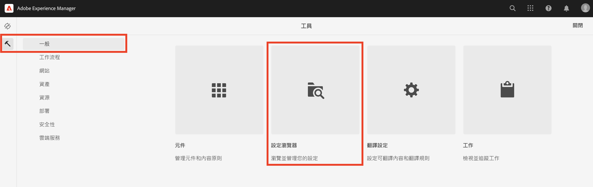
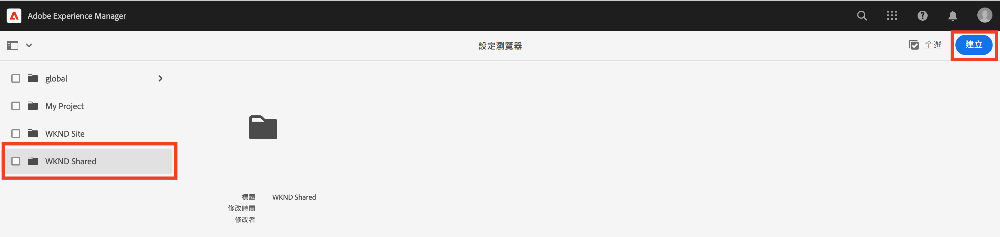
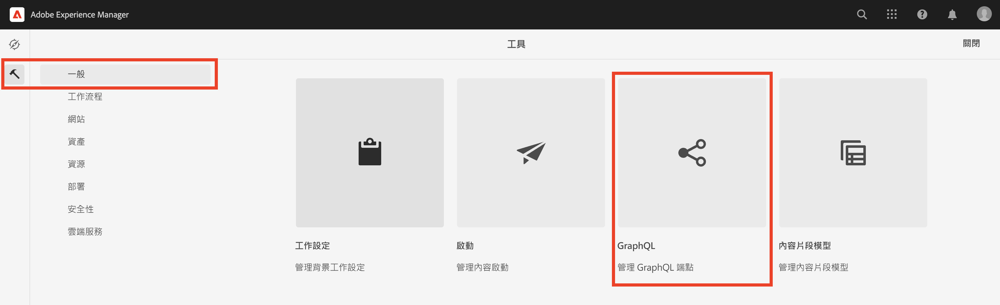
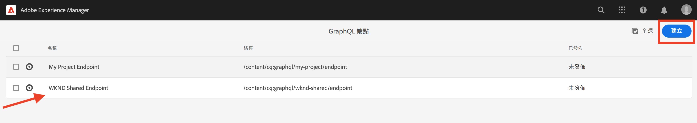
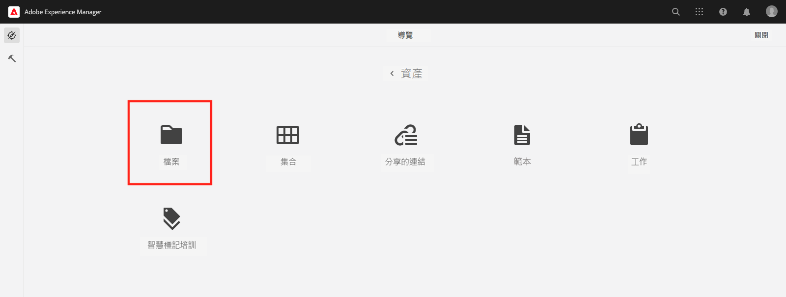
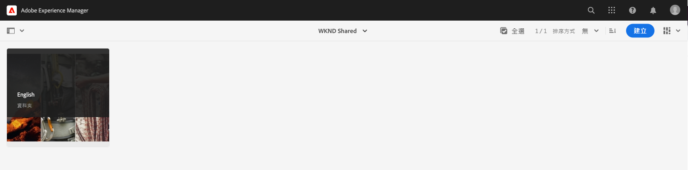
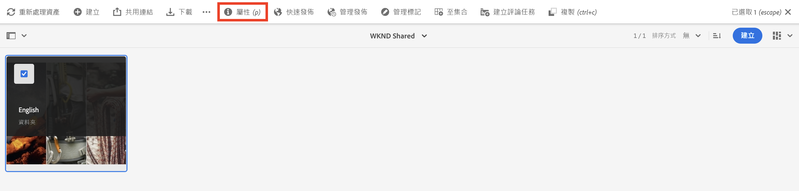
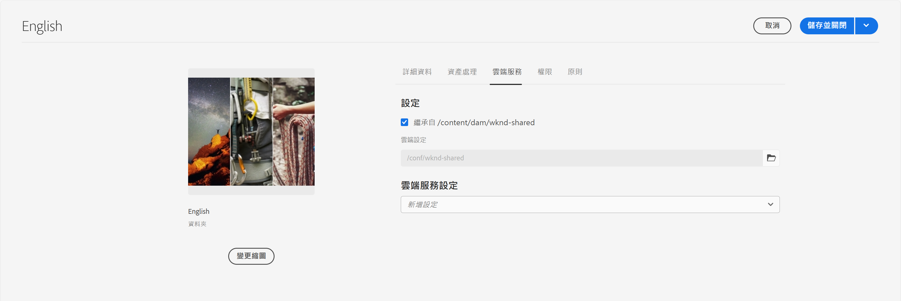

# AEM Headless的進階概念

本端對端教學課程將繼續 [基本教學課程](../multi-step/overview.md) 涵蓋Adobe Experience Manager(AEM)無周邊和GraphQL的基礎知識。 進階教學課程將深入說明如何使用內容片段模型、內容片段和AEM GraphQL持續查詢，包括在用戶端應用程式中使用GraphQL持續查詢。

## 必備條件

完成 [AEM as a Cloud Service快速設定](../quick-setup/cloud-service.md) 設定AEMas a Cloud Service環境。

強烈建議您完成上一個 [基本教學課程](../multi-step/overview.md) 和 [影片系列](../video-series/modeling-basics.md) 教學課程，再繼續執行此進階教學課程。 雖然您可以使用本機AEM環境完成本教學課程，但本教學課程僅涵蓋AEMas a Cloud Service的工作流程。

>[!CAUTION]
>
>如果您沒有AEMas a Cloud Service環境的存取權，您可以完成 [AEM使用本機SDK的無頭快速設定](https://experienceleague.adobe.com/docs/experience-manager-learn/getting-started-with-aem-headless/graphql/quick-setup/local-sdk.html). 不過，請務必注意，有些產品UI頁面（例如內容片段導覽）不同。

## 目標

本教學課程涵蓋下列主題：

* 使用驗證規則和更進階的資料類型（例如索引標籤預留位置、巢狀片段參考、JSON物件以及日期和時間資料類型），建立內容片段模型。
* 使用巢狀內容和片段參考時製作內容片段，以及設定內容片段製作控管的資料夾原則。
* 使用含變數和指令的GraphQL查詢，探索AEM GraphQL API功能。
* 在AEM中使用參數保留GraphQL查詢，並了解如何將快取控制參數與持續查詢搭配使用。
* 使用AEM無周邊JavaScript SDK將持續查詢的請求整合至範例WKND GraphQL React應用程式中。

## AEM無頭式概觀

以下影片提供本教學課程所涵蓋概念的概觀概觀。 本教學課程包括使用更進階的資料類型定義內容片段模型、巢狀內容片段，以及在AEM中保留GraphQL查詢。

>[!VIDEO](https://video.tv.adobe.com/v/340035/?quality=12&learn=on)

>[!CAUTION]
>
>此影片(2:25)提及如何透過封裝管理器安裝GraphQL查詢編輯器，以探索GraphQL查詢。 但在較新版本的AEM中，作為Cloud Service的內建 **GraphiQL資源管理器** 因此，不需要安裝包。 請參閱 [使用GraphiQL IDE](https://experienceleague.adobe.com/docs/experience-manager-cloud-service/content/headless/graphql-api/graphiql-ide.html) 以取得更多資訊。

## 專案設定

WKND Site專案擁有所有必要的設定，因此您可以在完成 [快速設定](../quick-setup/cloud-service.md). 本節僅強調建立您自己的AEM Headless專案時可使用的一些重要步驟。

### 檢閱現有設定

在AEM中啟動任何新專案的第一步，是建立其設定（以工作區的形式）和建立GraphQL API端點。 若要檢閱或建立設定，請導覽至 **工具** > **一般** > **配置瀏覽器**.

請注意， `WKND Shared` 已為教學課程建立網站設定。 若要建立專案的設定，請選取 **建立** 填入右上角的「建立設定」強制回應視窗中顯示的表單。

### 查看GraphQL API端點

接下來，您必須設定API端點以將GraphQL查詢傳送至。 若要檢閱現有端點或建立端點，請導覽至 **工具** > **一般** > **GraphQL**.

請注意， `WKND Shared Endpoint` 已建立。 若要為專案建立端點，請選取 **建立** 並遵循工作流程。

>[!NOTE]
>
> 儲存端點後，您會看到關於造訪安全性控制台的強制回應視窗，如果您想要設定端點的存取權，可讓您調整安全性設定。 不過，安全性權限本身不在本教學課程的討論範圍內。 如需詳細資訊，請參閱 [AEM檔案](https://experienceleague.adobe.com/docs/experience-manager-64/administering/security/security.html).

### 查看WKND內容結構和語言根資料夾

明確定義的內容結構是成功實作AEM無頭式內容的關鍵。 它有助於內容的可擴充性、可用性和權限管理。

語言根資料夾是一個資料夾，其名稱為EN或FR的ISO語言代碼。 AEM翻譯管理系統使用這些資料夾來定義內容的主要語言和內容翻譯的語言。

前往 **導覽** > **資產** > **檔案**.

導覽至 **WKND共用** 檔案夾。 觀察標題為「English」且名稱為「EN」的資料夾。 此資料夾是WKND站點項目的語言根資料夾。

針對您自己的專案，在設定中建立語言根資料夾。 請參閱 [建立資料夾](/help/headless-tutorial/graphql/advanced-graphql/author-content-fragments.md#create-folders) 以取得更多詳細資訊。

### 將設定指派給巢狀資料夾

最後，您必須將專案的設定指派給語言根資料夾。 此指派可讓您根據專案設定中定義的內容片段模型，來建立內容片段。

若要將語言根資料夾指派給設定，請選取資料夾，然後選取 **屬性** 的下一頁。

接下來，導覽至 **Cloud Services** ，並選取 **雲端設定** 欄位。

在顯示的強制回應視窗中，選取您先前建立的設定，以指派語言根資料夾。

### 最佳實務

在AEM中建立專案時，以下是最佳作法：

* 資料夾階層應結合本地化和翻譯來建立模型。 換言之，語言資料夾應巢狀內嵌在配置資料夾中，以便輕鬆轉譯這些配置資料夾中的內容。
* 資料夾階層應保持平直和簡單明瞭。 請避免稍後移動或重新命名資料夾和片段，尤其是發佈以供即時使用之後，因為它會變更可能影響片段參考和GraphQL查詢的路徑。

## 入門和解決方案套件

兩個AEM **套件** 可供使用，並可透過 [封裝管理員](/help/headless-tutorial/graphql/advanced-graphql/author-content-fragments.md#sample-content)

* [Advanced-GraphQL-Tutorial-Starter-Package-1.1.zip](/help/headless-tutorial/graphql/advanced-graphql/assets/tutorial-files/Advanced-GraphQL-Tutorial-Starter-Package-1.1.zip) 將在稍後的教學課程中使用，並包含範例影像和資料夾。
* [Advanced-GraphQL-Tutorial-Solution-Package-1.2.zip](/help/headless-tutorial/graphql/advanced-graphql/assets/tutorial-files/Advanced-GraphQL-Tutorial-Solution-Package-1.2.zip) 包含章節1至4的已完成解決方案，包括新的內容片段模型、內容片段和持續存在的GraphQL查詢。 適用於想直接跳至 [客戶端應用程式整合](/help/headless-tutorial/graphql/advanced-graphql/client-application-integration.md) 章節。

此 **React應用程式 — 進階教學課程 — WKND Adventures**(https://github.com/adobe/aem-guides-wknd-graphql/blob/main/advanced-tutorial/README.md)專案可供檢閱及探索範例應用程式。 此範例應用程式會叫用保存的GraphQL查詢，從AEM擷取內容，並轉譯為沈浸式體驗。

## 快速入門

若要開始使用此進階教學課程，請遵循下列步驟：

1. 使用 [AEMas a Cloud Service](../quick-setup/cloud-service.md).
1. 開始本教學課程的章節，位於 [建立內容片段模型](/help/headless-tutorial/graphql/advanced-graphql/create-content-fragment-models.md).
