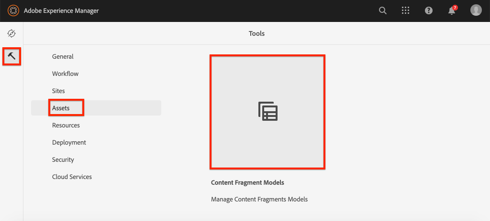

# 定義內容片段模型{#content-fragment-models}

>[!CAUTION]
>
> 內容片段傳送的AEM GraphQL API可應要求提供。
> 請聯絡Adobe支援以啟用AEM雲端服務方案的API。

在本章中，將學習如何使用&#x200B;**內容片段模型**&#x200B;來建立內容模型和架構。 您將查看現有模型並建立新模型。 您還將瞭解可用於定義模式作為模型一部分的不同資料類型。

在本章中，您將為&#x200B;**Contributor**&#x200B;建立新模型，此模型是為那些作為WKND品牌一部分製作雜誌和冒險內容的使用者建立的資料模型。

## 必備條件 {#prerequisites}

這是多部分教學課程，假定[快速設定](./setup.md)中概述的步驟已完成。

## 目標{#objectives}

* 建立新的內容片段模型。
* 識別可用的資料類型和建立模型的驗證選項。
* 瞭解內容片段模型如何定義內容片段的資料架構和製作範本&#x200B;**。**

## 內容片段模型概觀{#overview}

>[!VIDEO](https://video.tv.adobe.com/v/22452/?quality=12&learn=on)

上述影片提供使用內容片段模型的高階概觀。

## 檢視冒險內容片段模型

在上一章中，數個「冒險內容片段」已編輯並顯示在外部應用程式中。 讓我們檢視Adventure內容片段模型，以瞭解這些片段的基礎資料架構。

1. 從&#x200B;**AEM Start**&#x200B;功能表導覽至&#x200B;**Tools** > **Assets** > **Content Fragment Models**。

   

1. 導覽至&#x200B;**WKND Site**&#x200B;資料夾，並將滑鼠指標暫留在&#x200B;**Adventure**&#x200B;內容片段模型上，然後按一下&#x200B;**Edit**&#x200B;圖示（鉛筆）以開啟模型。

   

1. 這會開啟&#x200B;**內容片段模型編輯器**。 請注意，定義「冒險模型」的欄位包含不同的&#x200B;**資料類型**，例如&#x200B;**單行文字**、**多行文字**、**列舉**&#x200B;和&#x200B;**內容參考**。

1. 編輯器的右欄列出了可用的&#x200B;**資料類型**，用於定義用於編寫內容片段的表單欄位。

1. 在主面板中選擇&#x200B;**Title**&#x200B;欄位。 在右側列中，按一下&#x200B;**屬性**&#x200B;頁籤：

   

   請觀察&#x200B;**屬性名稱**&#x200B;欄位設為`adventureTitle`。 這會定義持續存留至AEM的屬性名稱。 **屬性名稱**&#x200B;還將此屬性的&#x200B;**key**&#x200B;名稱定義為資料架構的一部分。 此&#x200B;**key**&#x200B;將在內容片段資料通過GraphQL API公開時使用。

   >[!CAUTION]
   >
   > 從模型派生內容片段後，修改欄位&#x200B;**的**&#x200B;屬性名稱&#x200B;**具有下游效果。**&#x200B;現有片段中的欄位值將不再被參考，而GraphQL公開的資料架構將會變更，影響現有的應用程式。

1. 在&#x200B;**屬性**&#x200B;標籤中向下捲動並查看&#x200B;**驗證類型**&#x200B;下拉式清單。

   

   現成可用於&#x200B;**電子郵件**&#x200B;和&#x200B;**URL**&#x200B;的表單驗證。 您也可以使用規則運算式來定義&#x200B;**Custom**&#x200B;驗證。

1. 按一下&#x200B;**取消**&#x200B;關閉內容片段模型編輯器。

## 建立參與者模型

接下來，請為&#x200B;**Contributor**&#x200B;建立新模型，此模型是為那些在WKND品牌中製作雜誌和冒險內容的使用者建立的資料模型。

1. 按一下右上角的&#x200B;**建立**&#x200B;以開啟&#x200B;**建立模型**&#x200B;嚮導。
1. 對於&#x200B;**型號標題**，請輸入：**投稿人**，然後按一下&#x200B;**建立**

   

   按一下&#x200B;**開啟**&#x200B;以開啟新建的模型。

1. 將&#x200B;**單行文字**&#x200B;元素拖放至主面板。 在&#x200B;**屬性**&#x200B;標籤中輸入以下屬性：

   * **欄位標籤**: **完整名稱**
   * **屬性名稱**: `fullName`
   * 檢查&#x200B;**Required**

   

1. 按一下&#x200B;**資料類型**&#x200B;頁籤，將&#x200B;**多行文本**&#x200B;欄位拖放到&#x200B;**全名**&#x200B;欄位下。 輸入以下屬性：

   * **欄位標籤**: **生平**
   * **屬性名稱**: `biographyText`
   * **預設類型**: **Rich Text**

1. 按一下&#x200B;**資料類型**&#x200B;頁籤並拖放&#x200B;**內容參考**&#x200B;欄位。 輸入以下屬性：

   * **欄位標籤**: **圖片參考**
   * **屬性名稱**: `pictureReference`
   * **根路徑**: `/content/dam/wknd`

   在配置&#x200B;**根路徑**&#x200B;時，可以按一下&#x200B;**資料夾**&#x200B;表徵圖以開啟模式來選擇路徑。 這將限製作者可以使用哪些資料夾填充路徑。

   

1. 在&#x200B;**圖片參考**&#x200B;中新增驗證，以便只能使用&#x200B;**影像**&#x200B;的內容類型填入欄位。

   

1. 按一下&#x200B;**資料類型**&#x200B;頁籤，將&#x200B;**枚舉**&#x200B;資料類型拖放到&#x200B;**圖片參考**&#x200B;欄位下。 輸入以下屬性：

   * **欄位標籤**: **職業**
   * **屬性名稱**: `occupation`

1. 使用&#x200B;**新增選項**&#x200B;按鈕新增數個&#x200B;**選項**。 對&#x200B;**選項標籤**&#x200B;和&#x200B;**選項值**&#x200B;使用相同的值：

   **藝術家** **Artist** Influencer **, Traveller Photographer**, Traveller **Writer** **** **Truber, YouTruber Yous**

   

1. 最終的&#x200B;**Contributor**&#x200B;模型應如下所示：

   

1. 按一下&#x200B;**保存**&#x200B;保存更改。

## 啟用參與者模型

內容片段模型在首次建立時預設為&#x200B;**Draft**&#x200B;狀態。 這可讓使用者在&#x200B;**之前調整內容片段模型**，讓作者使用它。 請記住，修改模型中某個欄位的&#x200B;**屬性名稱**&#x200B;會更改基礎資料模式，並且對現有片段和外部應用程式有顯著的下游影響。 建議謹慎規劃用於&#x200B;**欄位屬性名稱**&#x200B;的命名慣例。

1. 請注意，**Contributor**&#x200B;模型目前處於&#x200B;**Draft**&#x200B;狀態。

1. 將滑鼠指標暫留在卡片上，然後按一下「啟用&#x200B;****」圖示，以啟用&#x200B;**Contributor Model**:

   

## 恭喜！{#congratulations}

恭喜，您剛建立了第一個內容片段模型！

## 後續步驟{#next-steps}

在下一章[編寫內容片段模型](author-content-fragments.md)中，您將根據內容片段模型建立並編輯新的內容片段。 您也將學習如何建立內容片段的變體。