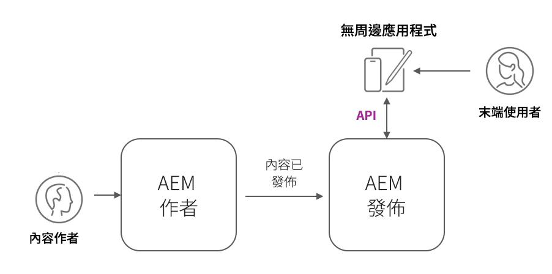

# AEM Headless部署

AEM Headless使用者端部署有多種形式；AEM託管的SPA、外部SPA、網站、行動應用程式，甚至伺服器對伺服器程式。

根據使用者端和部署方式，AEM Headless部署有不同的考量因素。

## AEM服務架構

在探索部署考量之前，您必須瞭解AEM邏輯架構，以及AEMas a Cloud Service服務層的分離和角色。 AEMas a Cloud Service由兩個邏輯服務組成：

+ __AEM作者__ 是團隊建立、共同作業和發佈內容片段（和其他資產）的服務。
+ __AEM發佈__ 是已發佈的內容片段（和其他資產）已復寫以供一般使用的服務。
+ __AEM預覽__ 此服務會模擬AEM Publish的行為，但發佈內容給它，以供預覽或檢閱。 AEM預覽適用於內部對象，而非一般內容傳送。 根據所需的工作流程，AEM預覽的使用是選用的。

典型AEMas a Cloud Service無周邊部署架構_

以生產產能作業的AEM Headless使用者端通常會與AEM Publish （其中包含已核准的已發佈內容）互動。 與AEM Author互動的使用者端需要特別小心，因為AEM Author預設是安全的，所有請求都需要授權，並且可能還包含進行中的工作或未核准的內容。

## Headless客戶端部署

    <!-- Single-page App (SPA) -->
    

       

           

               <figure class="image is-16by9">
                   
               </figure>
           

           

               

                   
<a href="./spa.md" title="單頁應用程式(SPA)">單頁應用程式(SPA)</a>

                   
瞭解單頁應用程式(SPA)的部署考量事項。

                   <a href="./spa.md" class="spectrum-Button spectrum-Button--outline spectrum-Button--primary spectrum-Button--sizeM">
                       瞭解
                   </a>
               

           

       

    

<!-- Web component/JS -->

   

       

           <figure class="image is-16by9">
               
           </figure>
       

       

           

               
<a href="./web-component.md" title="Web元件/JS">Web元件/JS</a>

               
瞭解Web元件和瀏覽器型JavaScript Headless使用者的部署考量事項。

               <a href="./web-component.md" class="spectrum-Button spectrum-Button--outline spectrum-Button--primary spectrum-Button--sizeM">
                   瞭解
               </a>
           

       

   

<!-- Mobile apps -->

   

       

           <figure class="image is-16by9">
               
           </figure>
       

       

           

               
<a href="./mobile.md" title="行動應用程式">行動應用程式</a>

               
瞭解行動應用程式的部署考量事項。

               <a href="./mobile.md" class="spectrum-Button spectrum-Button--outline spectrum-Button--primary spectrum-Button--sizeM">
                   瞭解
               </a>
           

       

   

<!-- Server-to-server apps -->

   

       

           <figure class="image is-16by9">
               
           </figure>
       

       

           

               
<a href="./server-to-server.md" title="伺服器對伺服器應用程式">伺服器對伺服器應用程式</a>

               
瞭解伺服器對伺服器應用程式的部署考量

               <a href="./server-to-server.md" class="spectrum-Button spectrum-Button--outline spectrum-Button--primary spectrum-Button--sizeM">
                   瞭解
               </a>
           

       

   

