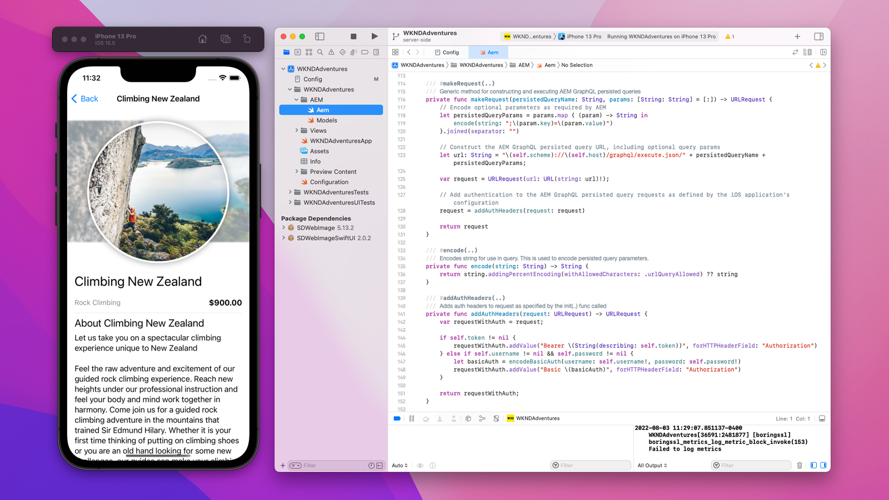

# AEM Headless 部署

AEM Headless 用戶端部署有多種形式；AEM 託管的 SPA、外部 SPA、網站、行動應用程式，甚至伺服器對伺服器的流程。

根據用戶端及其部署方式，AEM Headless 部署有不同的考量。

## AEM 服務架構

在探討部署考量之前，必須先了解 AEM 的邏輯架構，以及 AEM as a Cloud Service 服務層級的功能區隔和角色。AEM as a Cloud Service 由兩項邏輯服務組成：

+ __AEM Author__ 是團隊建立、協作和發佈內容片段 (及其他資產) 的服務。
+ __AEM Publish__ 是複製已發佈的內容片段 (及其他資產) 以供一般使用的服務。
+ __AEM Preview__ 是模仿 AEM Publish 之行為的服務，但發佈內容至 Preview 是為了預覽或檢閱。AEM Preview 以內部對象為目標，不適用於一般內容傳遞。可以根據所需的工作流程決定是否選用 AEM Preview。

典型的 AEM as a Cloud Service 無周邊部署架構_

以生產環境中運作的 AEM Headless 用戶端通常會與 AEM Publish 互動，而 AEM Publish 中包含已核准、已發佈的內容。與 AEM Author 互動的用戶端需要特別小心，因為 AEM Author 預設具有安全性，所有要求都需要授權，且可能包含進行中的工作或尚未核准的內容。

## 無周邊用戶端部署

    <!-- Single-page App (SPA) -->
    

       

           

               <figure class="image is-16by9">
                   
               </figure>
           

           

               

                   
<a href="./spa.md" title="單頁應用程式 (SPA)">單頁應用程式 (SPA)</a>

                   
了解單頁應用程式 (SPA) 的部署考量。

                   <a href="./spa.md" class="spectrum-Button spectrum-Button--outline spectrum-Button--primary spectrum-Button--sizeM">
                       了解更多
                   </a>
               

           

       

    

<!-- Web component/JS -->

   

       

           <figure class="image is-16by9">
               
           </figure>
       

       

           

               
<a href="./web-component.md" title="網頁元件/JS">網頁元件/JS</a>

               
了解網頁元件和瀏覽器型 JavaScript 無周邊使用者的部署考量。

               <a href="./web-component.md" class="spectrum-Button spectrum-Button--outline spectrum-Button--primary spectrum-Button--sizeM">
                   了解更多
               </a>
           

       

   

<!-- Mobile apps -->

   

       

           <figure class="image is-16by9">
               
           </figure>
       

       

           

               
<a href="./mobile.md" title="行動應用程式">行動應用程式</a>

               
了解行動應用程式的部署考量。

               <a href="./mobile.md" class="spectrum-Button spectrum-Button--outline spectrum-Button--primary spectrum-Button--sizeM">
                   了解更多
               </a>
           

       

   

<!-- Server-to-server apps -->

   

       

           <figure class="image is-16by9">
               
           </figure>
       

       

           

               
<a href="./server-to-server.md" title="伺服器對伺服器應用程式">伺服器對伺服器應用程式</a>

               
了解伺服器對伺服器應用程式的部署考量

               <a href="./server-to-server.md" class="spectrum-Button spectrum-Button--outline spectrum-Button--primary spectrum-Button--sizeM">
                   了解更多
               </a>
           

       

   

