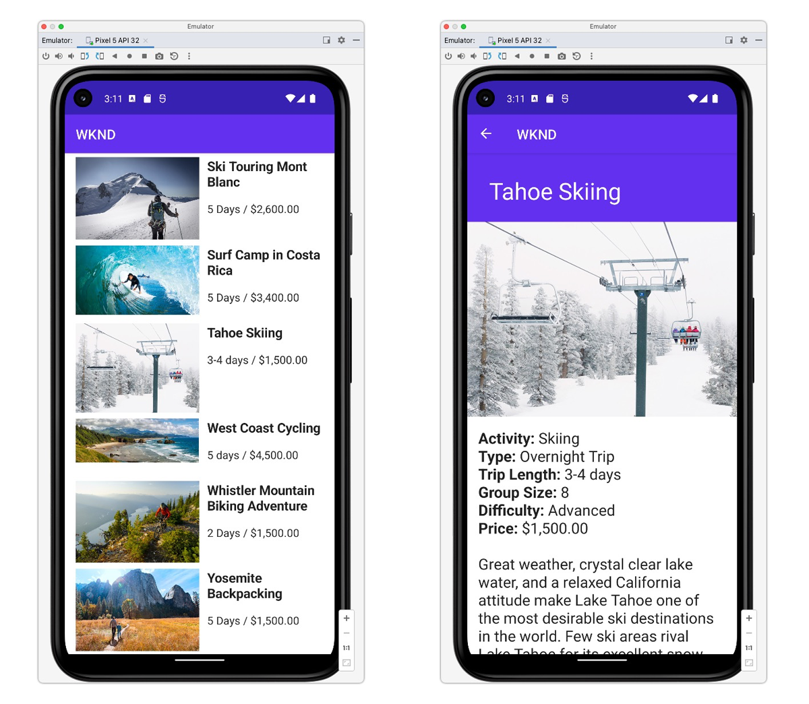

# Android應用程式

範例應用程式是探索Adobe Experience Manager (AEM)無頭式功能的絕佳方式。 此Android應用程式示範了如何使用AEM的GraphQL API來查詢內容。 適用於Java[&#128279;](https://github.com/adobe/aem-headless-client-java)的AEM Headless Client用於執行GraphQL查詢，並將資料對應至Java物件以支援應用程式。

使用AEM Headless的


在GitHub[&#128279;](https://github.com/adobe/aem-guides-wknd-graphql/tree/main/android-app)上檢視原始程式碼

## 先決條件 {#prerequisites}

下列工具應在本機安裝：

+ [Android Studio](https://developer.android.com/studio)
+ [Git](https://git-scm.com/)

## AEM需求

Android應用程式可與下列AEM部署選項搭配使用。 所有部署都需要安裝[WKND網站v3.0.0+](https://github.com/adobe/aem-guides-wknd/releases/latest)。

+ [AEM as a Cloud Service](https://experienceleague.adobe.com/docs/experience-manager-cloud-service/content/implementing/deploying/overview.html)

Android應用程式設計來連線至&#x200B;__AEM Publish__&#x200B;環境，不過，如果Android應用程式的設定中有提供驗證，則可以從AEM Author取得內容。

## 使用方式

1. 複製`adobe/aem-guides-wknd-graphql`存放庫：

   ```shell
   $ git clone git@github.com:adobe/aem-guides-wknd-graphql.git
   ```

1. 開啟[Android Studio](https://developer.android.com/studio)並開啟資料夾`android-app`
1. 在`app/src/main/assets/config.properties`修改檔案`config.properties`並更新`contentApi.endpoint`以符合您的目標AEM環境：

   ```plain
   contentApi.endpoint=https://publish-p123-e456.adobeaemcloud.com
   ```

   __基本驗證__

   `contentApi.user`和`contentApi.password`會驗證可存取WKND GraphQL內容的本機AEM使用者。

   ```plain
   contentApi.endpoint=https://author-p123-e456.adobeaemcloud.com
   contentApi.user=my-special-android-app-user
   contentApi.password=password123
   ```

1. 下載[Android虛擬裝置](https://developer.android.com/studio/run/managing-avds) （最低API 28）。
1. 使用Android模擬器建置和部署應用程式。


### 連線到AEM環境

如果連線到AEM作者環境，則需要[授權](https://github.com/adobe/aem-headless-client-java#using-authorization)。 [AEMHeadlessClientBuilder](https://github.com/adobe/aem-headless-client-java/blob/main/client/src/main/java/com/adobe/aem/graphql/client/AEMHeadlessClientBuilder.java)提供使用[權杖式驗證](https://experienceleague.adobe.com/docs/experience-manager-learn/getting-started-with-aem-headless/authentication/overview.html)的功能。 若要在`AdventureLoader.java`和`AdventuresLoader.java`中使用權杖式驗證更新使用者端產生器：

```java
/* Comment out basicAuth
 if (user != null && password != null) {
   builder.basicAuth(user, password);
 }
*/

// use token-authentication where `token` is a String representing the token
builder.tokenAuth(token)
```

## 程式碼

以下是用來啟動應用程式的重要檔案和程式碼的簡短摘要。 您可以在[GitHub](https://github.com/adobe/aem-guides-wknd-graphql/tree/main/android-app)上找到完整程式碼。

### 持久查詢

依照AEM Headless最佳實務，iOS應用程式會使用AEM GraphQL持續性查詢來查詢冒險資料。 應用程式使用兩個持續查詢：

+ `wknd/adventures-all`持續查詢，此查詢會傳回AEM中所有冒險的摘要。 此持續查詢會驅動初始檢視的冒險清單。

```
# Retrieves a list of all adventures
{
    adventureList {
        items {
            _path
            slug
            title
            price
            tripLength
            primaryImage {
                ... on ImageRef {
                _dynamicUrl
                _path
                }
            }
        }
    }
}
```

+ `wknd/adventure-by-slug`持續查詢，會傳回`slug`的單一冒險（唯一識別冒險的自訂屬性）和完整屬性集。 此持續性查詢可為冒險詳細資料檢視提供支援。

```
# Retrieves an adventure Content Fragment based on it's slug
# Example query variables: 
# {"slug": "bali-surf-camp"} 
# Technically returns an adventure list but since the the slug 
# property is set to be unique in the CF Model, only a single CF is expected

query($slug: String!) {
  adventureList(filter: {
        slug: {
          _expressions: [ { value: $slug } ]
        }
      }) {
    items {
      _path
      title
      slug
      activity
      adventureType
      price
      tripLength
      groupSize
      difficulty
      price
      primaryImage {
        ... on ImageRef {
          _dynamicUrl
          _path
        }
      }
      description {
        json
        plaintext
      }
      itinerary {
        json
        plaintext
      }
    }
    _references {
      ...on AdventureModel {
        _path
        slug
        title
        price
        __typename
      }
    }
  }
}
```

### 執行GraphQL持久查詢

AEM的持久查詢會透過HTTP GET執行，因此，適用於Java的[AEM Headless使用者端](https://github.com/adobe/aem-headless-client-java)是用來對AEM執行持續的GraphQL查詢，並將冒險內容載入應用程式。

每個持續查詢都有對應的「載入器」類別，可非同步呼叫AEM HTTP GET端點，並使用自訂定義的[資料模型](#data-models)傳回冒險資料。

+ `loader/AdventuresLoader.java`

  使用`wknd-shared/adventures-all`持續查詢在應用程式的主畫面上擷取Adventures清單。

+ `loader/AdventureLoader.java`

  擷取單一冒險透過`slug`引數使用`wknd-shared/adventure-by-slug`持續查詢來選取它。

```java
//AdventuresLoader.java

public static final String PERSISTED_QUERY_NAME = "/wknd-shared/adventures-all";
...
AEMHeadlessClientBuilder builder = AEMHeadlessClient.builder().endpoint(config.getContentApiEndpoint());

// Optional authentication for basic auth
String user = config.getContentApiUser();
String password = config.getContentApiPassword();

if (user != null && password != null) {
    builder.basicAuth(user, password);
}

AEMHeadlessClient client = builder.build();
// run a persistent query and get a response
GraphQlResponse response = client.runPersistedQuery(PERSISTED_QUERY_NAME);
```

### GraphQL回應資料模型{#data-models}

`Adventure.java`是Java POJO，已使用GraphQL要求中的JSON資料初始化，並為Android應用程式的檢視中使用的冒險建立模型。

### 檢視

Android應用程式使用兩個檢視，在行動體驗中呈現冒險資料。

+ `AdventureListFragment.java`

  叫用`AdventuresLoader`並在清單中顯示傳回的冒險。

+ `AdventureDetailFragment.java`

  使用透過`AdventureListFragment`檢視上的冒險選項傳入的`slug`引數叫用`AdventureLoader`，並顯示單一冒險的詳細資料。

### 遠端影像

`loader/RemoteImagesCache.java`是公用程式類別，可協助準備快取中的遠端影像，以便與Android UI元素搭配使用。 冒險內容透過URL參考AEM Assets中的影像，此類別用於顯示該內容。

## 其他資源

+ [AEM Headless快速入門 — GraphQL教學課程](https://experienceleague.adobe.com/docs/experience-manager-learn/getting-started-with-aem-headless/graphql/multi-step/overview.html)
+ [適用於Java的AEM Headless使用者端](https://github.com/adobe/aem-headless-client-java)
