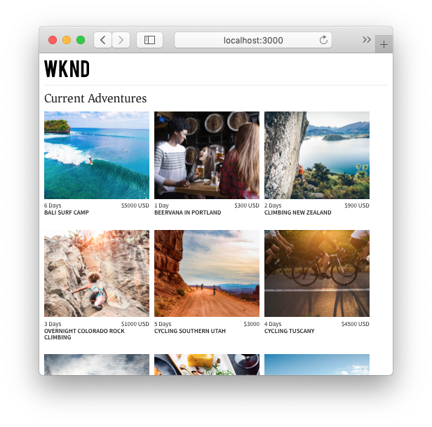

# React應用程式

範例應用程式是探索Adobe Experience Manager(AEM)無頭功能的絕佳方式。 提供的React應用程式示範如何使用AEM的GraphQL API來查詢內容。 適用於JavaScript的AEM無周邊用戶端可用來執行為應用程式提供動力的GraphQL查詢。

檢視 [GitHub原始碼](https://github.com/adobe/aem-guides-wknd-graphql/tree/main/react-app)



提供完整的逐步教學課程 [此處](https://experienceleague.adobe.com/docs/experience-manager-learn/getting-started-with-aem-headless/graphql/multi-step/overview.html).

## 必備條件 {#prerequisites}

應在本機安裝下列工具：

* [JDK 11](https://experience.adobe.com/#/downloads/content/software-distribution/en/general.html?1_group.propertyvalues.property=.%2Fjcr%3Acontent%2Fmetadata%2Fdc%3AsoftwareType&amp;1_group.propertyvalues.operation=equals&amp;1_group.propertyvalues.0_values=software-type%3Atoling&amp;fulltext=Oracle%7E+JDK%7E+11%7E&amp;orderby=%40jcr%3Cont%2Fjcr%3Alast&amp;modified by.sort=dest&amp;p.st=dest&amp;p.llep.p.p=14)
* [Node.js v10+](https://nodejs.org/en/)
* [npm 6+](https://www.npmjs.com/)
* [Git](https://git-scm.com/)

## AEM需求

應用程式的設計目的是連線至AEM **作者** 或 **發佈** 環境，與 [WKND參考網站](https://github.com/adobe/aem-guides-wknd/releases/latest) 已安裝。

* [AEM as a Cloud Service ](https://experienceleague.adobe.com/docs/experience-manager-cloud-service/overview/introduction.html)
* [AEM 6.5.10+](https://experienceleague.adobe.com/docs/experience-manager-65/release-notes/service-pack/new-features-latest-service-pack.html?lang=zh-Hant)

建議 [將WKND參考站點部署到Cloud Service環境](https://experienceleague.adobe.com/docs/experience-manager-cloud-service/implementing/deploying/overview.html#coding-against-the-right-aem-version). 使用 [AEM Cloud Service SDK](https://experienceleague.adobe.com/docs/experience-manager-learn/cloud-service/local-development-environment-set-up/overview.html) 或 [AEM 6.5 QuickStart Jar](https://experienceleague.adobe.com/docs/experience-manager-learn/foundation/development/set-up-a-local-aem-development-environment.html?lang=en#install-local-aem-instances) 也可使用。

## 如何使用

1. 複製 `aem-guides-wknd-graphql` 存放庫：

   ```shell
   git clone git@github.com:adobe/aem-guides-wknd-graphql.git
   ```

1. 編輯 `aem-guides-wknd/react-app/.env.development` 檔案，並確保 `REACT_APP_HOST_URI` 指向您的target AEM例項。 更新驗證方法（如果連線至製作例項）。

   ```plain
   # Server namespace
   REACT_APP_HOST_URI=http://localhost:4503
   REACT_APP_GRAPHQL_ENDPOINT=/content/graphql/global/endpoint.json
   #AUTH (Choose one method)
   # Authentication methods: 'service-token', 'dev-token', 'basic' or leave blank to use no authentication
   ...
   ```

1. 開啟終端機並執行命令：

   ```shell
   $ cd aem-guides-wknd-graphql/react-app
   $ npm install
   $ npm start
   ```
1. 新瀏覽器視窗應載入 [http://localhost:3000](http://localhost:3000)
1. 應用程式中應顯示來自WKND參考網站的歷險清單。

## 程式碼

以下是用於支援應用程式的重要檔案和代碼的簡要摘要。 您可以在上找到完整的程式碼 [GitHub](https://github.com/adobe/aem-guides-wknd-graphql).

### AEM Headless Client for JavaScript

此 [AEM無頭用戶端](https://github.com/adobe/aem-headless-client-js) 用於執行GraphQL查詢。 AEM無頭式用戶端提供兩種執行查詢的方法， [`runQuery`](https://github.com/adobe/aem-headless-client-js/blob/main/api-reference.md#aemheadlessrunqueryquery-options--promiseany) 和 [`runPersistedQuery`](https://github.com/adobe/aem-headless-client-js/blob/main/api-reference.md#aemheadlessrunpersistedquerypath-variables-options--promiseany).

`runQuery` 會針對AEM內容執行標準GraphQL查詢，這是最常見的查詢執行類型。

[持續查詢](https://experienceleague.adobe.com/docs/experience-manager-learn/getting-started-with-aem-headless/graphql/video-series/graphql-persisted-queries.html) 是AEM中的一項功能，可快取GraphQL查詢的結果，然後讓結果可供GET使用。 持續查詢應用於將不斷執行的通用查詢。 在此應用程式中，歷險記清單是在主畫面上執行的第一個查詢。 此查詢將非常受歡迎，因此應使用持續查詢。 `runPersistedQuery` 對持續查詢端點執行要求。

`src/api/useGraphQL.js` 是 [反應效果鈎](https://reactjs.org/docs/hooks-overview.html#effect-hook) 會監聽參數的變更 `query` 和 `path`. 若 `query` 空白，則會根據 `path`. 這是建構AEM無頭式用戶端並用來擷取資料的位置。

```js
function useGraphQL(query, path) {
    let [data, setData] = useState(null);
    let [errorMessage, setErrors] = useState(null);

    useEffect(() => {
      // construct a new AEMHeadless client based on the graphQL endpoint
      const sdk = new AEMHeadless({ endpoint: REACT_APP_GRAPHQL_ENDPOINT })

      // if query is not null runQuery otherwise fall back to runPersistedQuery
      const request = query ? sdk.runQuery.bind(sdk) : sdk.runPersistedQuery.bind(sdk);

      request(query || path)
        .then(({ data, errors }) => {
          //If there are errors in the response set the error message
          if(errors) {
            setErrors(mapErrors(errors));
          }
          //If data in the response set the data as the results
          if(data) {
            setData(data);
          }
        })
        .catch((error) => {
          setErrors(error);
        });
    }, [query, path]);

    return {data, errorMessage}
}
```

### 冒險內容

應用程式主要會顯示歷險記清單，並提供使用者點選以進入歷險記詳細資訊的選項。

`Adventures.js`  — 顯示歷險記的卡片清單。  初始狀態會使用 [持續查詢](https://experienceleague.adobe.com/docs/experience-manager-learn/getting-started-with-aem-headless/graphql/video-series/graphql-persisted-queries.html) whis&#39; [預封裝](https://github.com/adobe/aem-guides-wknd/tree/master/ui.content/src/main/content/jcr_root/conf/wknd/settings/graphql/persistentQueries/adventures-all/_jcr_content) 與WKND參考網站。 端點為 `/wknd/adventures-all`. 有數個按鈕可讓使用者根據活動來試驗篩選結果：

```javascript
function filterQuery(activity) {
  return `
    {
      adventureList (filter: {
        adventureActivity: {
          _expressions: [
            {
              value: "${activity}"
            }
          ]
        }
      }){
        items {
          _path
        adventureTitle
        adventurePrice
        adventureTripLength
        adventurePrimaryImage {
          ... on ImageRef {
            _path
            mimeType
            width
            height
          }
        }
      }
    }
  }
  `;
}
```

`AdventureDetail.js`  — 顯示「冒險」的詳細視圖。 根據從url剖析的探險程式路徑，進行graphQL查詢：

```javascript
//parse the content fragment from the url
const contentFragmentPath = props.location.pathname.substring(props.match.url.length);
...
function adventureDetailQuery(_path) {
  return `{
    adventureByPath (_path: "${_path}") {
      item {
        _path
          adventureTitle
          adventureActivity
          adventureType
          adventurePrice
          adventureTripLength
          adventureGroupSize
          adventureDifficulty
          adventurePrice
          adventurePrimaryImage {
            ... on ImageRef {
              _path
              mimeType
              width
              height
            }
          }
          adventureDescription {
            html
          }
          adventureItinerary {
            html
          }
      }
    }
  }
  `;
}
```

### 環境變數

數個 [環境變數](https://create-react-app.dev/docs/adding-custom-environment-variables) 供本專案用來連線至AEM環境。 預設會連線至執行中的AEM製作環境： http://localhost:4502。 如果您想要變更此行為，請更新 `.env.development` 檔案：

* `REACT_APP_HOST_URI=http://localhost:4502`  — 設為AEM目標主機
* `REACT_APP_GRAPHQL_ENDPOINT=/content/graphql/global/endpoint.json`  — 設定GraphQL端點路徑
* `REACT_APP_AUTH_METHOD=`  — 偏好的驗證方法。 選用，依預設不使用驗證。
   * `service-token`  — 使用雲端環境PROD的服務代號交換
   * `dev-token`  — 搭配雲端環境，將開發代號用於本機開發
   * `basic`  — 透過本機作者環境，在本機開發時使用使用者/傳遞
   * 保留為空，不使用驗證方法
* `REACT_APP_AUTHORIZATION=admin:admin`  — 設定連線至AEM製作環境時要使用的基本驗證憑證（僅限開發）。 如果連線至發佈環境，則不需要此設定。
* `REACT_APP_DEV_TOKEN`  — 開發代號字串。 若要連線至遠端執行個體，除了基本驗證(user:pass)之外，您還可以透過雲端主控台，將承載驗證與DEV代號搭配使用
* `REACT_APP_SERVICE_TOKEN`  — 服務令牌檔案的路徑。 若要連線至遠端執行個體，也可使用服務代號（從雲端主控台下載檔案）進行驗證

### 代理API請求

使用Webpack開發伺服器時(`npm start`)專案需仰賴 [代理設定](https://create-react-app.dev/docs/proxying-api-requests-in-development/#configuring-the-proxy-manually) 使用 `http-proxy-middleware`. 檔案的設定位置為 [src/setupProxy.js](https://github.com/adobe/aem-guides-wknd-graphql/blob/main/react-app/src/setupProxy.js) 並需仰賴設定於的數個自訂環境變數 `.env` 和 `.env.development`.

如果連線至AEM製作環境，則需要設定對應的驗證方法。

### CORS — 跨原始資源共用

此專案仰賴在目標AEM環境上執行的CORS設定，並假設應用程式在開發模式中於http://localhost:3000上執行。 此 [COR配置](https://github.com/adobe/aem-guides-wknd/blob/master/ui.config/src/main/content/jcr_root/apps/wknd/osgiconfig/config.author/com.adobe.granite.cors.impl.CORSPolicyImpl~wknd-graphql.cfg.json) 是 [WKND參考網站](https://github.com/adobe/aem-guides-wknd).


*製作環境的範例CORS設定*