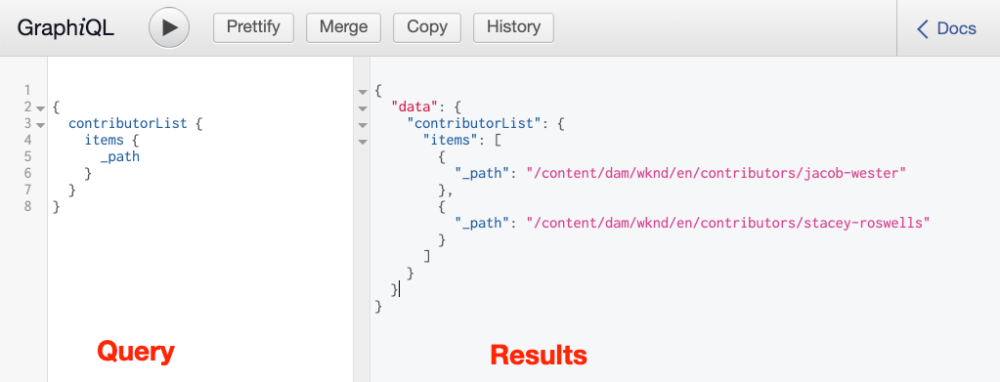

# 探索GraphQL API {#explore-graphql-apis}

AEM的GraphQL API提供功能強大的查詢語言，可將內容片段的資料公開至下游應用程式。 內容片段模型定義內容片段所使用的資料架構。 每當建立或更新內容片段模型時，會將架構轉譯並新增至組成GraphQL API的「圖形」。

在本章中，我們將探索一些常用的GraphQL查詢以收集內容。 AEM內建一個名為[GraphiQL](https://github.com/graphql/graphiql)的IDE。 GraphiQL IDE允許您快速測試和細化返回的查詢和資料。 GraphiQL還提供了對文檔的輕鬆訪問，使您能夠輕鬆瞭解和瞭解可用的方法。

## 必備條件 {#prerequisites}

本教學課程包含多部分，假設[編寫內容片段](./author-content-fragments.md)中概述的步驟已完成。

## 目標{#objectives}

* 瞭解如何使用GraphQL工具使用GraphQL語法構建查詢。
* 瞭解如何查詢內容片段和單一內容片段的清單。
* 瞭解如何篩選及請求特定資料屬性。
* 瞭解如何查詢內容片段的變數。
* 瞭解如何加入多個內容片段模型的查詢

## 查詢內容片段清單{#query-list-cf}

常見的要求是查詢多個內容片段。

1. 導航到位於[http://localhost:4502/content/graphiql.html](http://localhost:4502/content/graphiql.html)的GraphiQL IDE。
1. 將下列查詢貼入左側面板（在注釋清單下方）:

   ```graphql
   {
     contributorList {
       items {
           _path
         }
     }
   }
   ```

1. 按頂部菜單中的&#x200B;**播放**&#x200B;按鈕以執行查詢。 您應該會看到上一章中「參與者」內容片段的結果：

   

1. 將游標置於`_path`文字下方，然後輸入&#x200B;**CTRL+Space**&#x200B;以觸發程式碼提示。 將`fullName`和`occupation`新增至查詢。

   

1. 按&#x200B;**播放**&#x200B;按鈕再次執行查詢，您應看到結果包括`fullName`和`occupation`的其他屬性。

   

   `fullName` 屬 `occupation` 於簡單屬性。從[定義內容片段模型](./content-fragment-models.md)一章中，請回顧`fullName`和`occupation`是定義各個欄位的&#x200B;**屬性名稱**&#x200B;時使用的值。

1. `pictureReference` 並且 `biographyText` 表示更複雜的欄位。使用下列更新查詢，以傳回有關`pictureReference`和`biographyText`欄位的資料。

   ```graphql
   {
   contributorList {
       items {
         _path
         fullName
         occupation
         biographyText {
           html
         }
         pictureReference {
           ... on ImageRef {
               _path
               width
               height
               }
           }
       }
     }
   }
   ```

   `biographyText` 是多行文字欄位，而GraphQL API可讓我們為結果選擇多種格 `html`式 `markdown`, `json` 例如 `plaintext`。

   `pictureReference` 是內容參考，而且預期是影像，因此會使用內 `ImageRef` 建物件。這可讓我們要求有關參考影像的其他資料，例如`width`和`height`。

1. 接下來，嘗試查詢&#x200B;**Adventures**&#x200B;的清單。 執行下列查詢：

   ```graphql
   {
     adventureList {
       items {
         adventureTitle
         adventureType
         adventurePrimaryImage {
           ...on ImageRef {
             _path
             mimeType
           }
         }
       }
     }
   }
   ```

   您應該會看到傳回的&#x200B;**Adventures**&#x200B;清單。 在查詢中新增其他欄位，讓您可以嘗試。

## 篩選內容片段清單{#filter-list-cf}

接下來，讓我們看看如何根據屬性值將結果篩選為內容片段的子集。

1. 在GraphiQL UI中輸入以下查詢：

   ```graphql
   {
   contributorList(filter: {
     occupation: {
       _expressions: {
         value: "Photographer"
         }
       }
     }) {
       items {
         _path
         fullName
         occupation
       }
     }
   }
   ```

   上述查詢會對系統中的所有參與者執行搜索。 新增的篩選至查詢開頭，將對`occupation`欄位和字串&quot;**Photographer**&quot;執行比較。

1. 執行查詢時，預期只會傳回單一&#x200B;**Contributor**。
1. 輸入以下查詢以查詢&#x200B;**Adventures**&#x200B;的清單，其中`adventureActivity`**not**&#x200B;等於&#x200B;**&quot;Surfing&quot;**:

   ```graphql
   {
     adventureList(filter: {
       adventureActivity: {
           _expressions: {
               _operator: EQUALS_NOT
               value: "Surfing"
           }
       }
   }) {
       items {
       _path
       adventureTitle
       adventureActivity
       }
     }
   }
   ```

1. 執行查詢並檢查結果。 請注意，所有結果中均不包含等於&#x200B;**&quot;Surfing&quot;**&#x200B;的`adventureType`。

篩選和建立複雜查詢還有其他許多選項，以上只是幾個範例。

## 查詢單一內容片段{#query-single-cf}

您也可以直接查詢單一內容片段。 AEM中的內容以階層式方式儲存，而片段的唯一識別碼是以片段的路徑為基礎。 如果目標是傳回有關單一片段的資料，則偏好使用路徑並直接查詢模型。 使用此語法表示查詢複雜度將非常低，並產生更快的結果。

1. 在GraphiQL編輯器中輸入以下查詢：

   ```graphql
   {
    contributorByPath(_path: "/content/dam/wknd/en/contributors/stacey-roswells") {
       item {
         _path
         fullName
         biography {
           html
         }
       }
     }
   }
   ```

1. 執行查詢並觀察&#x200B;**Stacey Roswells**&#x200B;片段的單一結果已傳回。

   在上一練習中，您使用篩選器來縮小結果清單。 您可使用類似的語法來依路徑篩選，但是基於效能原因，上述語法較為偏好。

1. 在[編寫內容片段](./author-content-fragments.md)章中，請回顧&#x200B;**摘要**&#x200B;變數是為&#x200B;**Stacey Roswells**&#x200B;所建立。 更新查詢以返回&#x200B;**Summary**&#x200B;變化：

   ```graphql
   {
   contributorByPath
   (
       _path: "/content/dam/wknd/en/contributors/stacey-roswells"
       variation: "summary"
   ) {
       item {
         _path
         fullName
         biography {
           html
         }
       }
     }
   }
   ```

   即使變化名為&#x200B;**Summary**，變化仍以小寫保存，因此使用`summary`。

1. 執行查詢並觀察`biography`欄位包含的`html`結果要短得多。

## 查詢多個內容片段模型{#query-multiple-models}

您也可以將個別查詢合併為單一查詢。 這對於將應用程式所需的HTTP請求數減到最少非常有用。 例如，應用程式的&#x200B;*首頁*&#x200B;檢視可根據&#x200B;**兩個**&#x200B;不同的內容片段模型來顯示內容。 我們可以將查詢合併為單個請求，而不是執行&#x200B;**兩個**&#x200B;單獨的查詢。

1. 在GraphiQL編輯器中輸入以下查詢：

   ```graphql
   {
     adventureList {
       items {
         _path
         adventureTitle
       }
     }
     contributorList {
       items {
         _path
         fullName
       }
     }
   }
   ```

1. 執行查詢並觀察結果集包含&#x200B;**Adventures**&#x200B;和&#x200B;**Contributors**&#x200B;的資料：

```json
{
  "data": {
    "adventureList": {
      "items": [
        {
          "_path": "/content/dam/wknd/en/adventures/bali-surf-camp/bali-surf-camp",
          "adventureTitle": "Bali Surf Camp"
        },
        {
          "_path": "/content/dam/wknd/en/adventures/beervana-portland/beervana-in-portland",
          "adventureTitle": "Beervana in Portland"
        },
        ...
      ]
    },
    "contributorList": {
      "items": [
        {
          "_path": "/content/dam/wknd/en/contributors/jacob-wester",
          "fullName": "Jacob Wester"
        },
        {
          "_path": "/content/dam/wknd/en/contributors/stacey-roswells",
          "fullName": "Stacey Roswells"
        }
      ]
    }
  }
}
```

## 其他資源

有關GraphQL查詢的更多示例，請參見：[學習搭配使用GraphQL與AEM —— 範例內容與查詢](https://experienceleague.adobe.com/docs/experience-manager-cloud-service/assets/admin/content-fragments-graphql-samples.html)。

## 恭喜！{#congratulations}

恭喜您，您剛建立並執行了多個GraphQL查詢！

## 後續步驟{#next-steps}

在下一章[「從React app](./graphql-and-external-app.md)查詢AEM」中，您將探索外部應用程式如何查詢AEM的GraphQL端點。 修改範例WKND GraphQL React應用程式以新增篩選GraphQL查詢的外部應用程式，讓應用程式的使用者可依活動來篩選歷險。 您也會被介紹到一些基本的錯誤處理。
