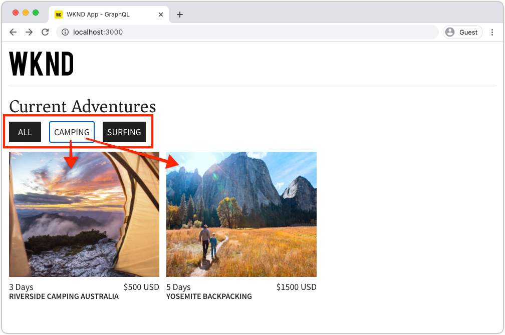

# 從外部應用程式使用GraphQL查詢AEM

>[!CAUTION]
>
> AEM GraphQL API的內容片段傳送將於2021年初發行。
> 相關檔案可供預覽使用。

在本章中，我們將探討如何使用AEM的GraphQL API來推動外部應用程式的使用體驗。

本教學課程使用簡單的React應用程式來查詢和顯示AEM的GraphQL API所公開的Adventure內容。 React的使用基本上不重要，而耗用的外部應用程式可以在任何平台的架構中編寫。

## 必備條件

這是多部分教學課程，並假設先前各部分中概述的步驟已完成。

_本章中的IDE螢幕截圖來自 [Visual Studio代碼](https://code.visualstudio.com/)_

或者，安裝瀏覽器擴展（如[GraphQL Network](https://chrome.google.com/webstore/detail/graphql-network/igbmhmnkobkjalekgiehijefpkdemocm)），以便能夠查看有關GraphQL查詢的更多詳細資訊。

## 目標

在本章中，我們將學習如何：

* 開始並瞭解React範例應用程式的功能
* 探索如何從外部應用程式對AEM的GraphQL端點進行呼叫
* 定義GraphQL查詢，以依活動篩選歷險記內容片段清單
* 更新React應用程式，提供控制項以透過GraphQL進行篩選，GraphQL是依活動列出的探險清單

## 啟動React應用程式

由於本章著重於開發客戶端以使用GraphQL上的內容片段，因此必須下載WKND GraphQL React應用程式原始碼範例，並在您的本機電腦上設定[，而](./setup.md#react-app)AEM SDK則以](./setup.md#aem-sdk)範例WKND的Author service[的方式執行已安裝站點[。](./setup.md#wknd-site)

在[Quick Setup](./setup.md)一章中，將更詳細地列出啟動React應用程式，但可遵循以下節略說明：

1. 如果您尚未從[Github.com](https://github.com/adobe/aem-guides-wknd-graphql)複製範例WKND GraphQL React應用程式

   ```shell
   $ git clone --branch tutorial/react git@github.com:adobe/aem-guides-wknd-graphql.git
   ```

1. 在IDE中開啟WKND GraphQL React應用程式

   

1. 從命令行中，導航到`react-app`資料夾
1. 通過從項目根目錄（`react-app`資料夾）執行以下命令，啟動WKND GraphQL React應用程式

   ```shell
   $ cd aem-guides-wknd-graphql/react-app
   $ npm start
   ```

1. 請至[http://localhost:3000/](http://localhost:3000/)檢閱應用程式。 範例React應用程式包含兩個主要部分：

   * 家庭體驗是WKND Adventures的索引，但是使用GraphQL查詢AEM中的&#x200B;__Adventure__&#x200B;內容片段。 在本章中，我們將修改此視圖，以支援按活動篩選冒險。

      

   * 冒險詳細體驗，使用GraphQL查詢特定&#x200B;__Adventure__&#x200B;內容片段，並顯示更多資料點。

      

1. 使用瀏覽器的開發工具和瀏覽器擴充功能（例如[GraphQL Network](https://chrome.google.com/webstore/detail/graphql-network/igbmhmnkobkjalekgiehijefpkdemocm)）來檢查傳送至AEM的GraphQL查詢及其JSON回應。 此方法可用於監控GraphQL請求和響應，以確保它們得到正確表述，並且其響應如預期。

   

   *從React應用程式傳送至AEM的GraphQL查詢*

   

   *AEM對React應用程式的JSON回應*

   查詢和響應應與GraphiQL IDE中顯示的內容相匹配。

   >[!NOTE]
   >
   > 在開發期間，React應用程式會設定為透過網頁套件開發伺服器將HTTP要求代理至AEM。 React應用程式會向`http://localhost:3000`提出要求，讓`http://localhost:4502`上執行的AEM Author服務代理這些要求。 查看檔案`src/setupProxy.js`和`env.development`以瞭解詳細資訊。
   >
   > 在非開發案例中，React應用程式會設定為直接向AEM提出請求。

## 探索應用程式的GraphQL程式碼

1. 在IDE中開啟檔案`src/api/useGraphQL.js`。

   這是[ React Effect Hook](https://reactjs.org/docs/hooks-overview.html#effect-hook)，會監聽應用程式的`query`變更，變更時會對AEM GraphQL端點提出HTTP POST要求，並傳回JSON回應至應用程式。

   只要React應用程式需要進行GraphQL查詢，就會叫用此自訂`useGraphQL(query)`掛接，並傳入GraphQL以傳送至AEM。

   此掛接使用簡單的`fetch`模組來發出HTTP POST GraphQL請求，但其他模組（如[Apollo GraphQL客戶端](https://www.apollographql.com/docs/react/)）可以使用類似的模組。

1. 在IDE中開啟`src/components/Adventures.js`，該&lt;a0/>負責主視圖的冒險清單，並查看`useGraphQL`掛接的調用。

   此代碼將預設`query`設定為`allAdventuresQuery`，如此檔案下定義的。

   ```javascript
   const [query, setQuery] = useState(allAdventuresQuery);
   ```

   ...而且，只要`query`變數變更，就會呼叫`useGraphQL`掛接，接著針對AEM執行GraphQL查詢，將JSON傳回至`data`變數，然後用於轉譯冒險清單。

   ```javascript
   const { data, errorMessage } = useGraphQL(query);
   ```

   `allAdventuresQuery`是在檔案中定義的常數GraphQL查詢，可查詢所有Adventure Content Fragments片段，不需進行任何篩選，並只傳回需要轉換首頁檢視的資料點。

   ```javascript
   const allAdventuresQuery = `
   {
       adventureList {
         items {
           _path
           adventureTitle
           adventurePrice
           adventureTripLength
           adventurePrimaryImage {
           ... on ImageRef {
               _path
               mimeType
               width
               height
             }
           }
         }
     }
   }
   `;
   ```

1. 開啟`src/components/AdventureDetail.js`，負責顯示冒險詳細體驗的React元件。 此檢視會要求特定的內容片段，使用其JCR路徑作為其唯一ID，並轉譯提供的詳細資訊。

   與`Adventures.js`類似，自訂`useGraphQL` React Hook會重新用於對AEM執行GraphQL查詢。

   內容片段的路徑是從元件的`props`頂端收集，用來指定要查詢的內容片段。

   ```javascript
   const contentFragmentPath = props.location.pathname.substring(props.match.url.length);
   ```

   ...而GraphQL參數化查詢是使用`adventureDetailQuery(..)`函式來建構，並傳遞至`useGraphQL(query)`，該&lt;a1/>會針對AEM執行GraphQL查詢並將結果傳回至`data`變數。

   ```javascript
   const { data, errorMessage } = useGraphQL(adventureDetailQuery(contentFragmentPath));
   ```

   `adventureDetailQuery(..)`函式只會包住篩選GraphQL查詢，此查詢使用AEM的`<modelName>ByPath`語法來查詢由其JCR路徑識別的單一內容片段，並傳回轉譯冒險的詳細資料所需的所有指定資料點。

   ```javascript
   function adventureDetailQuery(_path) {
   return `{
       adventureByPath (_path: "${_path}") {
         item {
           _path
           adventureTitle
           adventureActivity
           adventureType
           adventurePrice
           adventureTripLength
           adventureGroupSize
           adventureDifficulty
           adventurePrice
           adventurePrimaryImage {
               ... on ImageRef {
               _path
               mimeType
               width
               height
               }
           }
           adventureDescription {
               html
           }
           adventureItinerary {
               html
           }
         }
       }
   }
   `;
   }
   ```

## 建立參數化GraphQL查詢

接下來，讓我們修改React應用程式，以執行參數化、篩選GraphQL查詢，這些查詢會依探險活動限制首頁檢視。

1. 在IDE中，開啟檔案：`src/components/Adventures.js`。 此檔案代表家庭體驗的歷險元件，可查詢並顯示「歷險」卡片。
1. 檢查未使用的函式`filterQuery(activity)`，但已準備好制定GraphQL查詢，該查詢按`activity`過濾歷險。

   請注意，參數`activity`會作為`adventureActivity`欄位中`filter`的一部分插入GraphQL查詢，要求該欄位的值與參數的值相符。

   ```javascript
   function filterQuery(activity) {
       return `
           {
           adventures (filter: {
               adventureActivity: {
               _expressions: [
                   {
                   value: "${activity}"
                   }
                 ]
               }
           }){
               items {
               _path
               adventureTitle
               adventurePrice
               adventureTripLength
               adventurePrimaryImage {
               ... on ImageRef {
                   _path
                   mimeType
                   width
                   height
               }
               }
             }
         }
       }
       `;
   }
   ```

1. 更新React Adventures元件的`return`陳述式，以新增呼叫新參數化`filterQuery(activity)`的按鈕，提供要列出的冒險。

   ```javascript
   function Adventures() {
       ...
       return (
           <div className="adventures">
   
           {/* Add these three new buttons that set the GraphQL query accordingly */}
   
           {/* The first button uses the default `allAdventuresQuery` */}
           <button onClick={() => setQuery(allAdventuresQuery)}>All</button>
   
           {/* The 2nd and 3rd button use the `filterQuery(..)` to filter by activity */}
           <button onClick={() => setQuery(filterQuery('Camping'))}>Camping</button>
           <button onClick={() => setQuery(filterQuery('Surfing'))}>Surfing</button>
   
           <ul className="adventure-items">
           ...
       )
   }
   ```

1. 儲存變更並在網頁瀏覽器中重新載入React應用程式。 三個新按鈕會顯示在頂端，按一下按鈕會自動以相符的活動重新查詢AEM的「冒險內容片段」。

   

1. 嘗試為活動新增更多篩選按鈕：`Rock Climbing`、`Cycling`和`Skiing`

## 處理圖形QL錯誤

GraphQL是強式類型，因此，如果查詢無效，可以傳回有用的錯誤訊息。 接下來，讓我們模擬錯誤的查詢，以查看返回的錯誤消息。

1. 重新開啟檔案`src/api/useGraphQL.js`。 檢查下列程式碼片段以查看錯誤處理：

   ```javascript
   //useGraphQL.js
   .then(({data, errors}) => {
           //If there are errors in the response set the error message
           if(errors) {
               setErrors(mapErrors(errors));
           }
           //Otherwise if data in the response set the data as the results
           if(data) {
               setData(data);
           }
       })
       .catch((error) => {
           setErrors(error);
       });
   ```

   檢查響應以查看其是否包含`errors`對象。 如果GraphQL查詢有問題（例如基於架構的未定義欄位）,`errors`物件將由AEM傳送。 如果沒有`errors`對象，則設定並返回`data`。

   `window.fetch`包含`.catch`陳述式，用於&#x200B;*catch*&#x200B;任何常見錯誤，例如無效的HTTP請求，或是無法與伺服器連線。

1. 開啟檔案`src/components/Adventures.js`。
1. 修改`allAdventuresQuery`以包含無效屬性`adventurePetPolicy`:

   ```javascript
   /**
    * Query for all Adventures
    * adventurePetPolicy has been added beneath items
   */
   const allAdventuresQuery = `
   {
       adventureList {
         items {
           adventurePetPolicy
           _path
           adventureTitle
           adventurePrice
           adventureTripLength
           adventurePrimaryImage {
           ... on ImageRef {
               _path
               mimeType
               width
               height
           }
           }
         }
       }
   }
   `;
   ```

   我們知道`adventurePetPolicy`不屬於Adventure模型，因此這應會觸發錯誤。

1. 儲存變更並返回瀏覽器。 您應該會看到如下的錯誤訊息：

   

   GraphQL API檢測到`adventurePetPolicy`在`AdventureModel`中未定義，並返回相應的錯誤消息。

1. 使用瀏覽器的開發人員工具檢查來自AEM的回應，以檢視`errors` JSON物件：

   

   `errors`物件是詳細的，包含錯誤查詢位置和錯誤分類的相關資訊。

1. 返回`Adventures.js`並回複查詢變更，將應用程式傳回至正確狀態。

## 恭喜！{#congratulations}

恭喜！ 您已成功探索範例WKND GraphQL React應用程式的程式碼，並將它更新為使用參數化、篩選GraphQL查詢，以依活動列出歷險！ 您也可以探索一些基本的錯誤處理方式。

## 後續步驟{#next-steps}

在下一章中，[使用片段參考的進階資料模型](./fragment-references.md)將學習如何使用片段參考功能來建立兩個不同內容片段之間的關係。 您還將學習如何修改GraphQL查詢以包括引用模型中的欄位。
