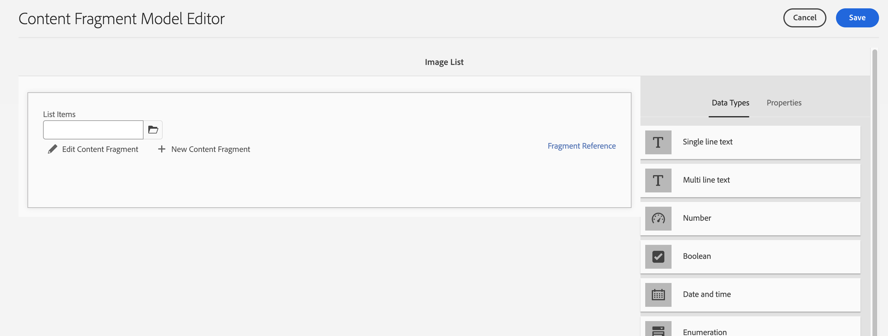
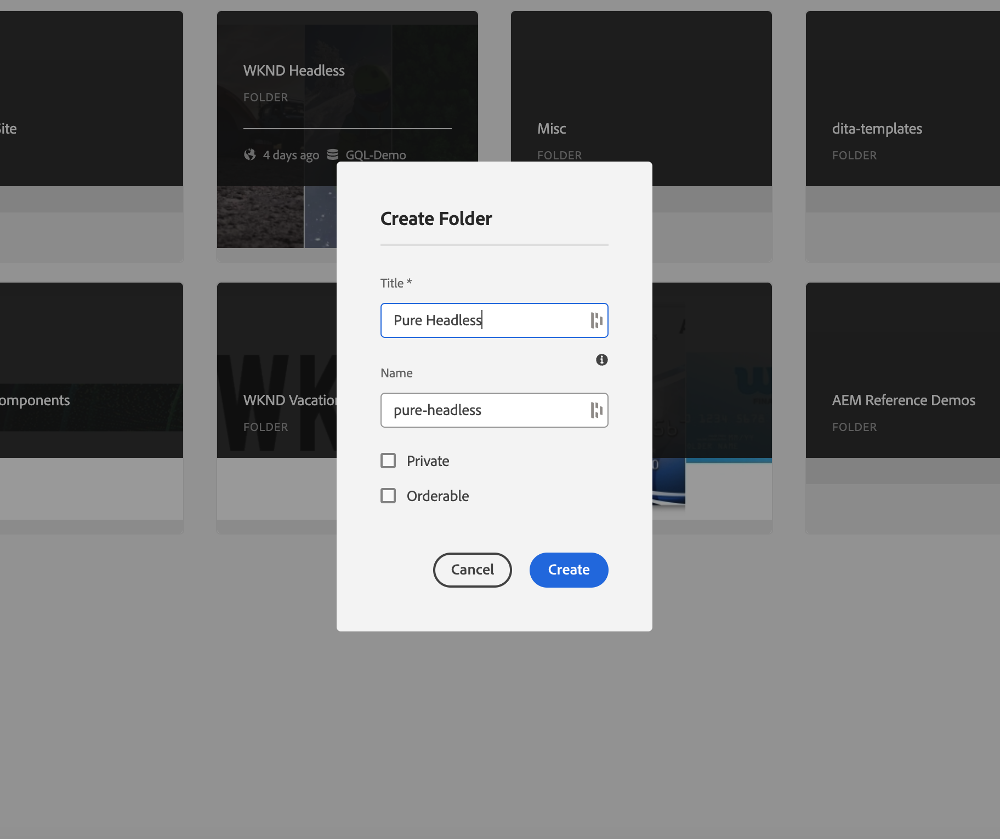

# 內容模式

歡迎使用有關Adobe Experience Manager (AEM)中的內容片段和GraphQL端點的教學課程章節。 我們將介紹如何運用內容片段、建立片段模型，以及在AEM中使用GraphQL端點。

內容片段提供結構化方法來管理跨管道的內容，提供彈性和可重複使用性。 在AEM中啟用內容片段可建立模組化內容，加強一致性和適應性。

首先，我們將引導您啟用AEM中的內容片段，涵蓋無縫整合的必要設定和設定。

接下來，我們將介紹如何建立片段模型，這些模型會定義結構和屬性。 瞭解如何根據您的內容需求設計模型，並有效管理模型。

接著，我們會示範如何從模型建立內容片段，提供製作和發佈的逐步指引。

此外，我們也會探索如何定義AEM GraphQL端點。 GraphQL會有效率地從AEM擷取資料，我們將設定並設定端點以公開所需的資料。 持久查詢將最佳化效能和快取。

在本教學課程中，我們將提供說明、程式碼範例和實用秘訣。 到最後，您將具備啟用內容片段、建立片段模型、產生片段，以及定義AEM GraphQL端點和持續查詢的技能。 讓我們開始吧！

## 內容感知設定

1. 瀏覽至 __「工具>設定瀏覽器」__ 建立Headless體驗的設定。

   

   提供 __標題__ 和 __名稱__，並勾選 __GraphQL持續查詢__ 和 __內容片段模型__.


## 內容片段模型

1. 瀏覽至 __「工具>內容片段模型」__ 並選取具有在步驟1中建立的設定名稱的資料夾。

   

1. 在資料夾內，選取 __建立__ 並為模型命名 __Teaser__. 將下列資料型別新增至 __Teaser__ 模型。

   | 資料型別 | 名稱 | 必填 | 選項 |
   |----------|------|----------|---------|
   | 內容參考 | 資產 | 是 | 您可視需要新增預設影像。 例如： /content/dam/wknd-headless/assets/AdobeStock_307513975.mp4 |
   | 單行文字 | 標題 | 是 |
   | 單行文字 | 前置標題 | 否 |
   | 多行文字 | 說明 | 否 | 確定預設型別為RTF文字 |
   | 列舉 | 樣式 | 是 | 呈現為下拉式清單。 選項包括Hero ->Hero和Featured ->精選 |

   

1. 在資料夾內，建立名為的第二個模型 __選件__. 按一下「建立」並為模型命名「選件」，然後新增下列資料型別：

   | 資料型別 | 名稱 | 必填 | 選項 |
   |----------|------|----------|---------|
   | 內容參考 | 資產 | 是 | 新增預設影像。 例如： `/content/dam/wknd-headless/assets/AdobeStock_238607111.jpeg` |
   | 多行文字 | 說明 | 否 |  |
   | 多行文字 | 文章 | 否 |  |

   

1. 在資料夾內，建立名為的第三個模型 __影像清單__. 按一下「建立」並將模型命名為「影像清單」，然後新增以下資料型別：

   | 資料型別 | 名稱 | 必填 | 選項 |
   |----------|------|----------|---------|
   | 片段參考 | 清單項目 | 是 | 呈現為多個欄位。 允許的內容片段模型為選件。 |

   

## 內容片段

1. 現在導覽至「資產」 ，並為新網站建立資料夾。 按一下「建立」並為資料夾命名。

   

1. 建立資料夾後，請選取資料夾並開啟其 __屬性__.
1. 在資料夾的 __雲端設定__ 索引標籤中，選取設定 [建立時間較早](#enable-content-fragments-and-graphql).

   

   按一下新資料夾並建立Teaser。 按一下 __建立__ 和 __內容片段__ 並選取 __Teaser__ 模型。 為模型命名 __Hero__ 並按一下 __建立__.

   | 名稱 | 附註 |
   |----------|------|
   | 資產 | 保留為預設值，或選擇其他資產（視訊或影像） |
   | 標題 | `Explore. Discover. Live.` |
   | 前置標題 | `Join use for your next adventure.` |
   | 說明 | 留空 |
   | 樣式 | `Hero` |

   

## GraphQL 端點

1. 瀏覽至 __「工具> GraphQL」__

   

1. 按一下 __建立__ 並為新端點命名，然後選擇新建立的設定。

   

## GraphQL 持續性查詢

1. 讓我們測試新端點。 瀏覽至 __「工具> GraphQL查詢編輯器」__ 並從視窗右上方的下拉式清單中選擇我們的端點。

1. 在查詢編輯器中，建立一些不同的查詢。


   ```graphql
   {
       teaserList {
           items {
           title
           }
       }
   }
   ```

   您應該會獲得包含已建立單一片段的清單 [以上](#create-content).

   針對此練習，建立AEM Headless應用程式使用的完整查詢。 建立依路徑傳回單一Teaser的查詢。 在查詢編輯器中，輸入以下查詢：

   ```graphql
   query TeaserByPath($path: String!) {
   component: teaserByPath(_path: $path) {
       item {
       __typename
       _path
       _metadata {
           stringMetadata {
           name
           value
           }
       }
       title
       preTitle
       style
       asset {
           ... on MultimediaRef {
           __typename
           _authorUrl
           _publishUrl
           format
           }
           ... on ImageRef {
           __typename
           _authorUrl
           _publishUrl
           mimeType
           width
           height
           }
       }
       description {
           html
           plaintext
       }
       }
   }
   }
   ```

   在 __查詢變數__ 在底部輸入，輸入：

   ```json
   {
       "path": "/content/dam/pure-headless/hero"
   }
   ```

   >[!NOTE]
   >
   > 您可能需要調整查詢變數 `path` 根據資料夾和片段名稱。


   執行查詢以接收先前建立的內容片段的結果。

1. 按一下 __儲存__  以保留（儲存）查詢並命名查詢 __Teaser__. 這可讓我們在應用程式中依名稱參照查詢。

## 後續步驟

恭喜！您已成功設定AEMas a Cloud Service以允許建立內容片段和GraphQL端點。 您也可以建立內容片段模型和內容片段，並定義GraphQL端點與持續查詢。 您現在已準備好進入下一個教學課程章節，您將瞭解如何建立AEM Headless React應用程式，該應用程式會使用您在本章中建立的內容片段和GraphQL端點。

[下一章：AEM Headless APIs和React](./2-aem-headless-apis-and-react.md)
