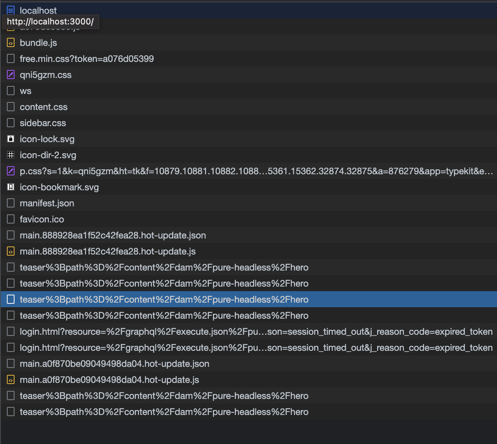

# AEM無頭API與React

歡迎使用本教學課程章節，探討如何設定React應用程式以使用AEM Headless SDK連線Adobe Experience Manager(AEM)Headless API。 我們將說明如何從AEM GraphQL API擷取內容片段資料，並在React應用程式中顯示該資料。

AEM無頭API可從任何用戶端應用程式存取AEM內容。 我們會引導您完成React應用程式的設定，以使用AEM Headless SDK連線至AEM Headless API。 此設定會在React應用程式和AEM之間建立可重複使用的通訊通道。

接下來，我們將使用AEM Headless SDK從AEM GraphQL API擷取內容片段資料。 AEM中的內容片段提供結構化的內容管理。 利用AEM無頭式SDK，您可以使用GraphQL輕鬆查詢及擷取內容片段資料。

取得內容片段資料後，我們就會將其整合至您的React應用程式。 您將學習如何以吸引人的方式格式化和顯示資料。 我們將介紹在React元件中處理和轉譯內容片段資料的最佳實務，確保與應用程式的UI順暢整合。

在本教學課程中，我們將提供說明、程式碼範例和實用秘訣。 最後，您將能設定您的React應用程式以連線至AEM無頭API、使用AEM無頭SDK擷取內容片段資料，並順暢地在您的React應用程式中顯示。 開始吧！


## 複製React應用程式

1. 從複製應用程式 [Github](https://github.com/lamontacrook/headless-first/tree/main) 在命令行上執行以下命令。

   ```
   $ git clone git@github.com:lamontacrook/headless-first.git
   ```

1. 變更為 `headless-first` 目錄，並安裝相依性。

   ```
   $ cd headless-first
   $ npm ci
   ```

## 設定React應用程式

1. 建立名為 `.env` 位於專案的根目錄。 在 `.env` 設定下列值：

   ```
   REACT_APP_AEM=<URL of the AEM instance>
   REACT_APP_ENDPOINT=<the name of the endpoint>
   REACT_APP_PROJECT=<the name of the folder with Content Fragments>
   REACT_APP_TOKEN=<developer token>
   ```

1. 您可以在Cloud Manager中擷取開發人員代號。 登入 [AdobeCloud Manager](https://experience.adobe.com/). 按一下 __Experience Manager> Cloud Manager__. 選擇適當的程式，然後按一下「環境」旁的點。

   

   1. 按一下 __整合__ 標籤
   1. 按一下 __本機代號標籤與取得本機開發代號__ 按鈕
   1. 複製未結報價之後開始到結束報價之前的存取權杖。
   1. 將複製的Token貼上為 `REACT_APP_TOKEN` 在 `.env` 檔案。
   1. 現在，讓我們透過執行 `npm ci` 在命令行上。
   1. 現在啟動React應用程式並執行 `npm run start` 在命令行上。
   1. 在 [./src/utils](https://github.com/lamontacrook/headless-first/tree/main/src/utils) 檔案名為 `context.js`  包含用來設定 `.env` 檔案移至應用程式的內容中。

## 執行React應用程式

1. 執行以啟動React應用程式 `npm run start` 在命令行上。

   ```
   $ npm run start
   ```

   React應用程式將啟動並開啟瀏覽器視窗，以 `http://localhost:3000`. 對React應用程式的變更會自動在瀏覽器中重新載入。

## 連線至AEM Headless API

1. 若要將React應用程式連線至AEMas a Cloud Service，請新增一些項目至 `App.js`. 在 `React` 匯入，新增 `useContext`.

   ```javascript
   import React, {useContext} from 'react';
   ```

   匯入 `AppContext` 從 `context.js` 檔案。

   ```javascript
   import { AppContext } from './utils/context';
   ```

   現在，在應用程式程式碼中定義內容變數。

   ```javascript
   const context = useContext(AppContext);
   ```

   最後，將傳回的程式碼包裝在 `<AppContext.Provider> ... </AppContext.Provider>`.

   ```javascript
   ...
   return(<div className='App'>
       <AppContext.Provider value={context}>
           ...
       </AppContext.Provider>
   </div>);
   ```

   若要參考， `App.js` 現在應該是這樣。

   ```javascript
   import React, {useContext} from 'react';
   import './App.css';
   import { BrowserRouter, Routes, Route } from 'react-router-dom';
   import Home from './screens/home/home';
   import { AppContext } from './utils/context';
   
   const App = () => {
   const context = useContext(AppContext);
   return (
       <div className='App'>
       <AppContext.Provider value={context}>
           <BrowserRouter>
           <Routes>
               <Route exact={true} path={'/'} element={<Home />} />
           </Routes>
           </BrowserRouter>
       </AppContext.Provider>
       </div>
   );
   };
   
   export default App;
   ```

1. 匯入 `AEMHeadless` SDK. 此SDK是應用程式用來與AEM Headless API互動的協助程式庫。

   將此匯入陳述式新增至 `home.js`.

   ```javascript
   import AEMHeadless from '@adobe/aem-headless-client-js';
   ```

   新增下列項目 `{ useContext, useEffect, useState }` 到` React` 導入語句。

   ```javascript
   import React, { useContext, useEffect, useState } from 'react';
   ```

   匯入 `AppContext`.

   ```javascript
   import { AppContext } from '../../utils/context';
   ```

   內 `Home` 元件，獲取 `context` 變數 `AppContext`.

   ```javascript
   const Home = () => {
   const context = useContext(AppContext);
   ...
   }
   ```

1. 在內初始化AEM Headless SDK  `useEffect()`，因為AEM Headless SDK必須在  `context` 變數變更。

   ```javascript
   useEffect(() => {
   const sdk = new AEMHeadless({
       serviceURL: context.url,
       endpoint: context.endpoint,
       auth: context.token
   });
   }, [context]);  
   ```

   >[!NOTE]
   >
   > 有 `context.js` 檔案 `/utils` 就是從 `.env` 檔案。 若要參考， `context.url` 是AEMas a Cloud Service環境的URL。 此 `context.endpoint` 是上一課中建立的端點完整路徑。 最後， `context.token` 是開發人員代號。


1. 建立會公開來自AEM Headless SDK內容的React狀態。

   ```javascript
   const Home = () => {
   const [content, setContent] = useState({});
   ...
   }
   ```

1. 將應用程式連線至AEM。 使用在上一課中建立的持續查詢。 我們將下列程式碼新增至 `useEffect` AEM Headless SDK初始化後。 讓 `useEffect` 取決於  `context` 變數，如下所示。


   ```javascript
   useEffect(() => {
   ...
   sdk.runPersistedQuery('<name of the endpoint>/<name of the persisted query>', { path: `/content/dam/${context.project}/<name of the teaser fragment>` })
       .then(({ data }) => {
       if (data) {
           setContent(data);
       }
       })
       .catch((error) => {
       console.log(`Error with pure-headless/teaser. ${error.message}`);
       });
   }, [context]);
   ```

1. 開啟開發人員工具的網路檢視，以檢閱GraphQL請求。

   `<url to environment>/graphql/execute.json/pure-headless/teaser%3Bpath%3D%2Fcontent%2Fdam%2Fpure-headless%2Fhero`

   

   AEM Headless SDK會對GraphQL的要求進行編碼，並新增提供的參數。 您可以在瀏覽器中開啟請求。

   >[!NOTE]
   >
   > 由於要求會前往製作環境，因此您必須登入相同瀏覽器的其他索引標籤中的環境。


## 轉譯內容片段內容

1. 顯示應用程式中的內容片段。 傳回 `<div>` 和宣傳員的名字。

   ```javascript
   return (
   <div className='main-body'>
       <div>{content.component && (content.component.item.title)}</div>
   </div>
   );
   ```

   您應該會在畫面上看到預告的標題欄位。

1. 最後一個步驟是將預告新增至頁面。 套件中包含React預告元件。 首先，請將匯入納入。 在 `home.js` 檔案中，添加行：

   `import Teaser from '../../components/teaser/teaser';`

   更新返回語句：

   ```javascript
   return (
   <div className='main-body'>
       <div>{content.component && <Teaser content={content.component.item} />}</div>
   </div>
   );
   ```

   您現在應該會看到內容包含在片段中的預告。


## 後續步驟

恭喜！您已成功更新React應用程式，以使用AEM Headless SDK與AEM Headless API整合！

接下來，我們將建立更複雜的影像清單元件，以從AEM動態轉譯參考的內容片段。

[下一章：建立影像清單元件](./3-complex-components.md)