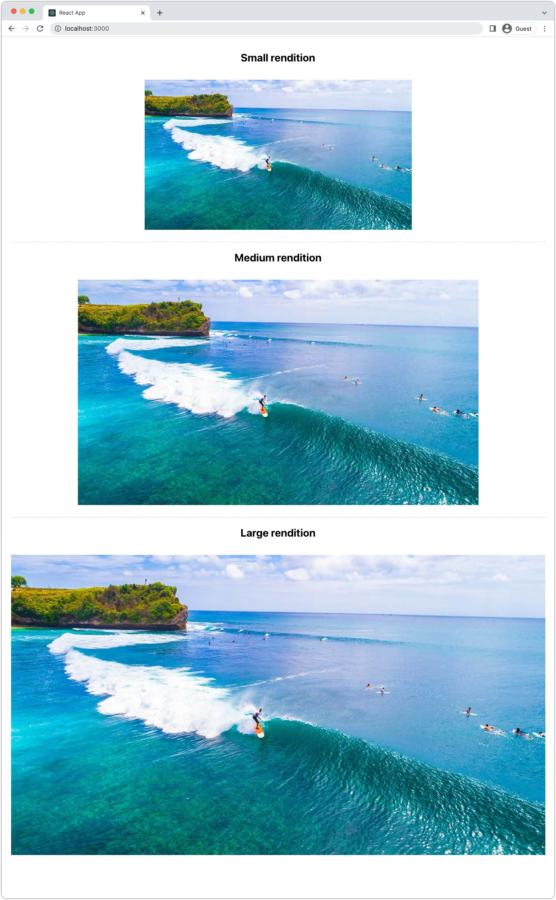

# 影像與 AEM Headless {#images-with-aem-headless}

影像是 [開發豐富、引人入勝的AEM無頭體驗](https://experienceleague.adobe.com/docs/experience-manager-learn/getting-started-with-aem-headless/graphql/multi-step/overview.html). AEM Headless支援影像資產的管理及其最佳化傳送。

AEM無頭內容模型中使用的內容片段，通常會參考用於無頭體驗中顯示的影像資產。 AEM GraphQL查詢可以撰寫，以根據影像參考的位置，提供影像的URL。

此 `ImageRef` 類型有三個內容參考的URL選項：

+ `_path` 是AEM中的參考路徑，且不包含AEM來源（主機名稱）
+ `_authorUrl` 是AEM Author上影像資產的完整URL
   + [AEM作者](https://experienceleague.adobe.com/docs/experience-manager-learn/cloud-service/underlying-technology/introduction-author-publish.html) 可用來提供無頭應用程式的預覽體驗。
+ `_publishUrl` 是AEM發佈上影像資產的完整URL
   + [AEM發佈](https://experienceleague.adobe.com/docs/experience-manager-learn/cloud-service/underlying-technology/introduction-author-publish.html) 通常是無頭應用程式的生產部署顯示影像的位置。

根據下列條件，最好使用欄位：

| ImageRef欄位 | 由AEM提供的用戶端網頁應用程式 | 用戶端應用程式查詢AEM作者 | 用戶端應用程式查詢AEM發佈 |
|--------------------|:------------------------------:|:-----------------------------:|:------------------------------:|
| `_path` | ✔ | ✔（應用必須在URL中指定主機） | ✔（應用必須在URL中指定主機） |
| `_authorUrl` | ✘ | ✔ | ✘ |
| `_publishUrl` | ✘ | ✘ | ✔ |

使用 `_authorUrl` 和 `_publishUrl` 應與用來來源GraphQL回應的AEM GraphQL端點一致。

>[!CONTEXTUALHELP]
>id="aemcloud_learn_headless_graphql_images"
>title="影像與 AEM Headless"
>abstract="了解 AEM Headless 如何支援影像資產的管理及其最佳化傳遞。"

## 內容片段模型

確保包含影像參考的「內容片段」欄位為 __內容參考__ 資料類型。

欄位類型會在 [內容片段模型](https://experienceleague.adobe.com/docs/experience-manager-cloud-service/content/assets/content-fragments/content-fragments-models.html)，方法是選取欄位並檢查 __屬性__ 標籤。


## GraphQL持續查詢

在GraphQL查詢中，將欄位傳回為 `ImageRef` 類型，並請求適當的欄位 `_path`, `_authorUrl`，或 `_publishUrl` 應用程式所需。 例如，在 [WKND Site項目](https://github.com/adobe/aem-guides-wknd) 並在其中納入影像資產參考的影像URL `primaryImage` 欄位，可使用新的持續查詢完成 `wknd-shared/adventure-image-by-path` 定義為：

```graphql
query ($path: String!) {
  adventureByPath(_path: $path) {
    item {
      title,
      primaryImage {
        ... on ImageRef {
          _path
          _authorUrl
          _publishUrl
        }
      }
    }
  }
}
```

此 `$path` 變數 `_path` 篩選器需要內容片段的完整路徑(例如 `/content/dam/wknd-shared/en/adventures/bali-surf-camp/bali-surf-camp`)。

## GraphQL回應

產生的JSON回應包含要求的欄位，其中包含影像資產的URL。

```json
{
  "data": {
    "adventureByPath": {
      "item": {
        "adventurePrimaryImage": {
          "_path": "/content/dam/wknd-shared/en/adventures/bali-surf-camp/adobestock-175749320.jpg",
          "_authorUrl": "https://author-p123-e456.adobeaemcloud.com/content/dam/wknd-shared/en/adventures/bali-surf-camp/adobestock-175749320.jpg",
          "_publishUrl": "https://publish-p123-e789.adobeaemcloud.com/content/dam/wknd-shared/en/adventures/bali-surf-camp/adobestock-175749320.jpg"
        }
      }
    }
  }
}
```

若要在您的應用程式中載入參考的影像，請使用適當欄位， `_path`, `_authorUrl`，或 `_publishUrl` 的 `adventurePrimaryImage` 作為影像的來源URL。

的網域 `_authorUrl` 和 `_publishUrl` 由AEMas a Cloud Service自動定義，使用 [外置器](https://experienceleague.adobe.com/docs/experience-manager-cloud-service/content/implementing/developer-tools/externalizer.html).

在React中，顯示AEM Publish的影像看起來類似：

```html

```

## 影像轉譯

影像資產支援可自訂 [轉譯](../../../assets/authoring/renditions.md)，為原始資產的替代表示法。 自訂轉譯有助於最佳化無頭式體驗。 無頭應用程式可以請求最佳化的轉譯，而不是請求原始影像資產（通常是大型高解析度檔案）。

### 建立轉譯

AEM Assets管理員會使用處理設定檔來定義自訂轉譯。 接著，處理設定檔便可直接套用至特定資料夾樹狀結構或資產，以產生這些資產的轉譯。

#### 處理設定檔

資產轉譯規格定義於 [處理設定檔](../../../assets/configuring/processing-profiles.md) 由AEM Assets管理員撰寫。

建立或更新處理設定檔，並為無頭應用程式所需的影像大小新增轉譯定義。 轉譯可以命名任何名稱，但應在語義上命名。


在此範例中，會建立三個轉譯：

| 轉譯名稱 | 副檔名 | 最大寬度 |
|-----------------------|:---------:|----------:|
| web優化 — large | webp | 1200 px |
| web優化媒體 | webp | 900 px |
| web優化 — 小 | webp | 600 px |

上表中調出的屬性非常重要：

+ __轉譯名稱__ 用於要求轉譯。
+ __擴充功能__ 是用來要求 __轉譯名稱__. 偏好 `webp` 轉譯，如此會針對網頁傳送最佳化。
+ __最大寬度__ 會用來通知開發人員應根據其在無頭應用程式中的使用，來使用哪個轉譯。

轉譯定義視無頭式應用程式的需求而定，因此請務必為使用案例定義最佳轉譯集，並在語義上為其命名，以說明其使用方式。

#### 重新處理資產{#reprocess-assets}

在建立（或更新）「處理設定檔」後，重新處理資產以產生「處理設定檔」中定義的新轉譯。 在使用處理設定檔處理資產之前，新轉譯不存在。

+ 最好， [將處理設定檔指派給資料夾](../../../assets/configuring//processing-profiles.md) 因此，任何上傳至該資料夾的新資產都會自動產生轉譯。 必須使用下方的臨時方法重新處理現有資產。

+ 或者，您可以隨選選取資料夾或資產，然後選取 __重新處理資產__，並選取新的處理設定檔名稱。

   

#### 檢閱轉譯

轉譯可透過驗證 [開啟資產的轉譯檢視](../../../assets/authoring/renditions.md)，以及選取新轉譯以在轉譯邊欄中預覽。 如果缺少轉譯， [確保資產是使用處理設定檔進行處理](#reprocess-assets).


#### 發佈資產

確認含有新轉譯的資產為 [（重新發佈）](../../../assets/sharing/publish.md) 以便在AEM Publish上存取新轉譯。

### 存取轉譯

轉譯可透過附加 __轉譯名稱__ 和 __轉譯擴充功能__ 在處理設定檔中定義至資產的URL。

| 資產網址 | 轉譯子路徑 | 轉譯名稱 | 轉譯擴充功能 |  | 轉譯URL |
|-----------|:------------------:|:--------------:|--------------------:|:--:|---|
| https://publish-p123-e789.adobeaemcloud.com/content/dam/example.jpeg | /_jcr_content/renditions/ | web優化 — large | .webp | → | https://publish-p123-e789.adobeaemcloud.com/content/dam/example.jpeg/_jcr_content/renditions/web-optimized-large.webp |
| https://publish-p123-e789.adobeaemcloud.com/content/dam/example.jpeg | /_jcr_content/renditions/ | web優化媒體 | .webp | → | https://publish-p123-e789.adobeaemcloud.com/content/dam/example.jpeg/_jcr_content/renditions/web-optimized-medium.webp |
| https://publish-p123-e789.adobeaemcloud.com/content/dam/example.jpeg | /_jcr_content/renditions/ | web優化 — 小 | .webp | → | https://publish-p123-e789.adobeaemcloud.com/content/dam/example.jpeg/_jcr_content/renditions/web-optimized-small.webp |

{style="table-layout:auto"}

### GraphQL查詢{#renditions-graphl-query}

AEM GraphQL要求影像轉譯時不需要額外語法。 而是 [查詢影像](#images-graphql-query) 以通常的方式，並以程式碼指定所需的轉譯。 這很重要 [確保無頭應用程式使用的影像資產具有相同名稱的轉譯](#reprocess-assets).

### React範例

讓我們建立一個簡單的React應用程式，顯示單一影像資產的三種轉譯項目：Web最佳化 — 小型、Web最佳化 — 中型和Web最佳化 — 大型。



#### 建立影像元件{#react-example-image-component}

建立可轉譯影像的React元件。 此元件接受四個屬性：

+ `assetUrl`:透過GraphQL查詢的回應提供的影像資產URL。
+ `renditionName`:要載入的轉譯名稱。
+ `renditionExtension`:要載入的轉譯擴充功能。
+ `alt`:影像的替代文字；無障礙非常重要！

此元件構建 [格式副本URL，使用 __存取轉譯__](#access-renditions). 安 `onError` 處理常式設為在遺失轉譯時顯示原始資產。

此範例使用原始資產URL做為 `onError` 處理常式中，會遺失轉譯。

```javascript
// src/Image.js

export default function Image({ assetUrl, renditionName, renditionExtension, alt }) {
  // Construct the rendition Url in the format:
  //   <ASSET URL>/_jcr_content/renditions<RENDITION NAME>.<RENDITION EXTENSION>
  const renditionUrl = `${assetUrl}/_jcr_content/renditions/${renditionName}.${renditionExtension}`;

  // Load the original image asset in the event the named rendition is missing
  const handleOnError = (e) => { e.target.src = assetUrl; }

  return (
    <>
      
    </>
  );
}
```

#### 定義 `App.js`{#app-js}

這個簡單 `App.js` 查詢AEM以取得冒險影像，然後顯示該影像的三個轉譯：web優化 — 小型、web優化 — 中型和web優化 — 大型。

在自訂React鈎點中執行AEM查詢 [使用AEM Headless SDK的useAdventureByPath](./aem-headless-sdk.md#graphql-persisted-queries).

查詢的結果和特定的轉譯參數會傳遞至 [影像React元件](#react-example-image-component).

```javascript
// src/App.js

import "./App.css";
import { useAdventureByPath } from './api/persistedQueries'
import Image from "./Image";

function App() {

  // Get data from AEM using GraphQL persisted query as defined above 
  // The details of defining a React useEffect hook are explored in How to > AEM Headless SDK
  let { data, error } = useAdventureByPath("/content/dam/wknd-shared/en/adventures/bali-surf-camp/bali-surf-camp");

  // Wait for GraphQL to provide data
  if (!data) { return <></> }

  return (
    <div className="app">
      
      <h2>Small rendition</h2>
      {/* Render the web-optimized-small rendition for the Adventure Primary Image */}
      <Image
        assetUrl={data.adventureByPath.item.primaryImage._publishUrl}
        renditionName="web-optimized-small"
        renditionExtension="webp"
        alt={data.adventureByPath.item.title}
      />

      <hr />

      <h2>Medium rendition</h2>
      {/* Render the web-optimized-medium rendition for the Adventure Primary Image */}
      <Image
        assetUrl={data.adventureByPath.item.primaryImage._publishUrl}
        renditionName="web-optimized-medium"
        renditionExtension="webp"
        alt={data.adventureByPath.item.title}
      />

      <hr />

      <h2>Large rendition</h2>
      {/* Render the web-optimized-large rendition for the Adventure Primary Image */}
      <Image
        assetUrl={data.adventureByPath.item.primaryImage._publishUrl}
        renditionName="web-optimized-large"
        renditionExtension="webp"
        alt={data.adventureByPath.item.title}
      />
    </div>
  );
}

export default App;
```
