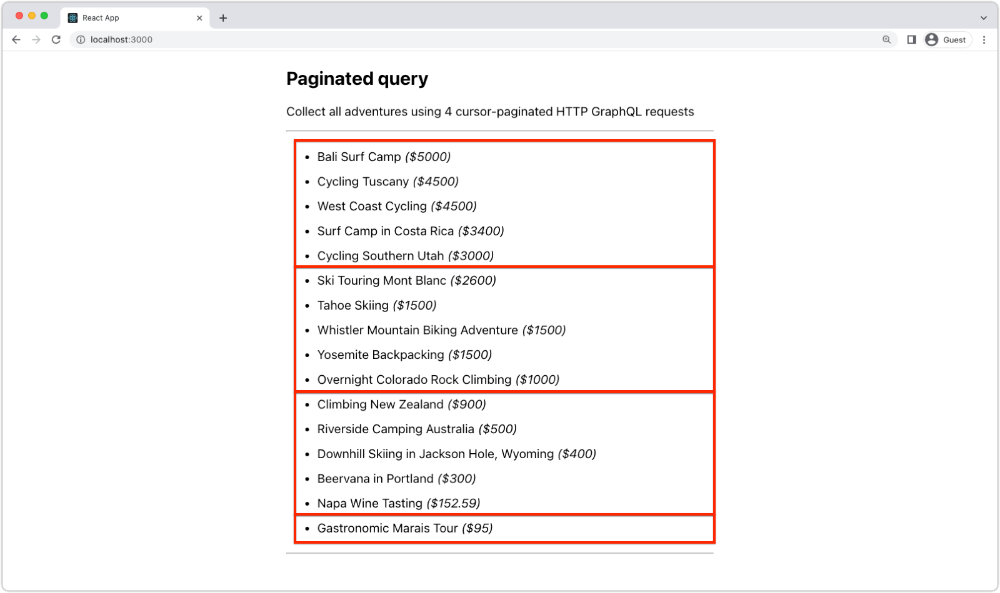

# AEM無頭中的大結果集

AEM無頭GraphQL查詢可傳回大結果。 本文說明如何在AEM Headless中處理大結果，以確保應用程式的最佳效能。

AEM Headless支援 [偏移/限制](#list-query) 和 [游標分頁](#paginated-query) 查詢到較大結果集的較小子集。 可以提出多個請求，以收集所需數量的結果。

以下範例使用少量結果子集（每個請求4條記錄）來演示技術。 在實際應用程式中，您會針對每個請求使用更多記錄來改善效能。 每個請求50筆記錄是理想的基準。

## 內容片段模型

分頁和排序可用於任何內容片段模型。

## GraphQL持續查詢

使用大型資料集時，可使用偏移和限制以及以游標為基礎的分頁功能來擷取資料的特定子集。 但是，這兩種技術之間有一些差異，在某些情況下，它們可能使一種更合適。

### 清單查詢

清單查詢，使用 `limit` 和 `offset` 提供簡單明瞭的方法，指定起點(`offset`)和要擷取的記錄數(`limit`)。 此方法允許從完整結果集內的任何位置選擇結果子集，例如跳到特定結果頁。 雖然易於實施，但在處理大結果時可能會很慢而且效率低下，因為檢索許多記錄需要掃描以前的所有記錄。 此方法在偏移值較高時也可能導致效能問題，因為可能需要擷取和捨棄許多結果。

```graphql
# Retrieves a list of Adventures sorted price descending, and title ascending if there is the prices are the same.
query adventuresByOffetAndLimit($offset:Int!, $limit:Int) {
    adventureList(offset: $offset, limit: $limit, sort: "price DESC, title ASC", ) {
      items {
        _path
        title
        price
      }
    }
  }
```

#### 查詢變數

```json
{
  "offset": 1,
  "limit": 4
}
```

### 清單回應

產生的JSON回應包含第2、第3、第4和第5個最昂貴的歷險。 結果中的前兩次冒險價格相同(`4500` 所以 [清單查詢](#list-queries) 指定價格相同的冒險，然後按標題升序排序。)

```json
{
  "data": {
    "adventureList": {
      "items": [
        {
          "_path": "/content/dam/wknd-shared/en/adventures/cycling-tuscany/cycling-tuscany",
          "title": "Cycling Tuscany",
          "price": 4500
        },
        {
          "_path": "/content/dam/wknd-shared/en/adventures/west-coast-cycling/west-coast-cycling",
          "title": "West Coast Cycling",
          "price": 4500
        },
        {
          "_path": "/content/dam/wknd-shared/en/adventures/surf-camp-in-costa-rica/surf-camp-costa-rica",
          "title": "Surf Camp in Costa Rica",
          "price": 3400
        },
        {
          "_path": "/content/dam/wknd-shared/en/adventures/cycling-southern-utah/cycling-southern-utah",
          "title": "Cycling Southern Utah",
          "price": 3000
        }
      ]
    }
  }
}
```

### 編頁查詢

基於游標的分頁在編頁查詢中可用，涉及使用游標（對特定記錄的引用）來檢索下一組結果。 此方法更有效率，因為它避免了掃描所有先前記錄以擷取所需資料子集的需要。 編頁查詢非常適合於從開始、到中間的某個點或到結尾的大結果集迭代。 清單查詢，使用 `limit` 和 `offset` 提供簡單明瞭的方法，指定起點(`offset`)和要擷取的記錄數(`limit`)。 此方法允許從完整結果集內的任何位置選擇結果子集，例如跳到特定結果頁。 雖然易於實施，但在處理大結果時可能會很慢而且效率低下，因為檢索許多記錄需要掃描以前的所有記錄。 此方法在偏移值較高時也可能導致效能問題，因為可能需要擷取和捨棄許多結果。


```graphql
# Retrieves the most expensive Adventures (sorted by title ascending if there is the prices are the same)
query adventuresByPaginated($first:Int!, $after:String) {
 adventurePaginated(first: $first, after: $after, sort: "price DESC, title ASC") {
       edges {
          cursor
          node {
            _path
            title
            price
          }
        }
        pageInfo {
          endCursor
          hasNextPage
        }
    }
  }
```

#### 查詢變數

```json
{
  "first": 3
}
```

### 編頁回應

產生的JSON回應包含第2、第3、第4和第5個最昂貴的歷險。 結果中的前兩次冒險價格相同(`4500` 所以 [清單查詢](#list-queries) 指定價格相同的冒險，然後按標題升序排序。)

```json
{
  "data": {
    "adventurePaginated": {
      "edges": [
        {
          "cursor": "NTAwMC4...Dg0ZTUwN2FkOA==",
          "node": {
            "_path": "/content/dam/wknd-shared/en/adventures/bali-surf-camp/bali-surf-camp",
            "title": "Bali Surf Camp",
            "price": 5000
          }
        },
        {
          "cursor": "SFNDUwMC4wC...gyNWUyMWQ5M2Q=",
          "node": {
            "_path": "/content/dam/wknd-shared/en/adventures/cycling-tuscany/cycling-tuscany",
            "title": "Cycling Tuscany",
            "price": 4500
          }
        },
        {
          "cursor": "AVUwMC4w...0ZTYzMjkwMzE5Njc=",
          "node": {
            "_path": "/content/dam/wknd-shared/en/adventures/west-coast-cycling/west-coast-cycling",
            "title": "West Coast Cycling",
            "price": 4500
          }
        }
      ],
      "pageInfo": {
        "endCursor": "NDUwMC4w...kwMzE5Njc=",
        "hasNextPage": true
      }
    }
  }
}
```

### 下一組編頁結果

下一組結果可使用 `after` 參數和 `endCursor` 值。 如果沒有其他要擷取的結果， `hasNextPage` is `false`.

#### 查詢變數

```json
{
  "first": 3,
  "after": "NDUwMC4w...kwMzE5Njc="
}
```

## React範例

以下是示範如何使用的React範例 [偏移和限制](#offset-and-limit) 和 [游標分頁](#cursor-based-pagination) 方法。 每個請求的結果數通常較多，但就這些範例而言，上限設為5。

### 偏移和限制範例

>[!VIDEO](https://video.tv.adobe.com/v/3418381/?quality=12&learn=on)

使用偏移和限制，可以容易地檢索和顯示結果子集。

#### useEffect鈎子

此 `useEffect` 掛接調用持續查詢(`adventures-by-offset-and-limit`)，以擷取歷險。 查詢會使用 `offset` 和 `limit` 參數，以指定要檢索的起始點和結果數。 此 `useEffect` 當 `page` 值會變更。


```javascript
import { useState, useEffect } from "react";
import AEMHeadless from "@adobe/aem-headless-client-js";
...
export function useOffsetLimitAdventures(page, limit) {
    const [adventures, setAdventures] = useState([]);
    const [hasMore, setHasMore] = useState(true);

    useEffect(() => {
      async function fetchData() {
        const queryParameters = {
          offset: page * limit, // Calculate the offset based on the current page and the limit
          limit: limit + 1,     // Add 1 to the limit to determine if there are more adventures to fetch
        };

        // Invoke the persisted query with the offset and limit parameters
        const response = await aemHeadlessClient.runPersistedQuery(
          "wknd-shared/adventures-by-offset-and-limit",
          queryParameters
        );        
        const data = response?.data;

        if (data?.adventureList?.items?.length > 0) {
          // Collect the adventures - slice off the last item since the last item is used to determine if there are more adventures to fetch
          setAdventures([...data.adventureList.items].slice(0, limit));
          // Determine if there are more adventures to fetch
          setHasMore(data.adventureList.items.length > limit);
        } else {
          setHasMore(false);
        }
      }
      fetchData();
    }, [page]);

    return { adventures, hasMore };
}
```

#### Component

元件使用 `useOffsetLimitAdventures` 勾選，以擷取歷險。 此 `page` 值會遞增和遞減，以擷取下一組和上一組結果。 此 `hasMore` 值可用來判斷是否應啟用下一頁按鈕。

```javascript
import { useState } from "react";
import { useOffsetLimitAdventures } from "./api/persistedQueries";

export default function OffsetLimitAdventures() {
  const LIMIT = 5;
  const [page, setPage] = useState(0);

  let { adventures, hasMore } = useOffsetLimitAdventures(page, LIMIT);

  return (
    <section className="offsetLimit">
      <h2>Offset/limit query</h2>
      <p>Collect sub-sets of adventures using offset and limit.</p>

      <h4>Page: {page + 1}</h4>
      <p>
        Query variables:
        <em>
          <code>
            &#123; offset: {page * LIMIT}, limit: {LIMIT} &#125;
          </code>
        </em>
      </p>

      <hr />

      <ul className="adventures">
        {adventures?.map((adventure) => {
          return (
            <li key={adventure._path}>
              {adventure.title} <em>(${adventure.price})</em>
            </li>
          );
        })}
      </ul>

      <hr />

      <ul className="buttons">
        <li>
          <button disabled={page === 0} onClick={() => setPage(page - 1)}>
            Previous
          </button>
        </li>
        <li>
          <button disabled={!hasMore} onClick={() => setPage(page + 1)}>
            Next
          </button>
        </li>
      </ul>
    </section>
  );
}
```

### 編頁範例



_每個紅色方塊代表獨立的編頁HTTP GraphQL查詢。_

使用基於游標的分頁，通過增量收集結果並將結果串聯到現有結果，可以輕鬆地檢索和顯示大型結果集。


#### UseEffect鈎

此 `useEffect` 掛接調用持續查詢(`adventures-by-paginated`)，以擷取歷險。 查詢會使用 `first` 和 `after` 要指定檢索的結果數和要啟動的游標的參數。 `fetchData` 持續循環，收集下一組已編頁的結果，直到沒有其他可擷取的結果為止。

```javascript
import { useState, useEffect } from "react";
import AEMHeadless from "@adobe/aem-headless-client-js";
...
export function usePaginatedAdventures() {
    const LIMIT = 5;
    const [adventures, setAdventures] = useState([]);
    const [queryCount, setQueryCount] = useState(0);

    useEffect(() => {
      async function fetchData() {
        let paginatedAdventures = [];
        let paginatedCount = 0;
        let hasMore = false;
        let after = null;
        
        do {
          const response = await aemHeadlessClient.runPersistedQuery(
            "wknd-shared/adventures-by-paginated",
            {
                first: LIMIT,
                after: after
            }
          );
          // The GraphQL data is stored on the response's data field
          const data = response?.data;

          paginatedCount = paginatedCount + 1;

          if (data?.adventurePaginated?.edges?.length > 0) {
            // Add the next set page of adventures to full list of adventures
            paginatedAdventures = [...paginatedAdventures, ...data.adventurePaginated.edges];
          }

          // If there are more adventures, set the state to fetch them
          hasMore = data.adventurePaginated?.pageInfo?.hasNextPage;
          after = data.adventurePaginated.pageInfo.endCursor;

        } while (hasMore);

        setQueryCount(paginatedCount);
        setAdventures(paginatedAdventures);
      }

      fetchData();
    }, []);

    return { adventures, queryCount };
}
```

#### Component

元件使用 `usePaginatedAdventures` 勾選，以擷取歷險。 此 `queryCount` 值可用來顯示為擷取歷險記清單而發出的HTTP請求數。

```javascript
import { useState } from "react";
import { usePaginatedAdventures } from "./api/persistedQueries";
...
export default function PaginatedAdventures() {
  let { adventures, queryCount } = usePaginatedAdventures();

  return (
    <section className="paginated">
      <h2>Paginated query</h2>
      <p>Collect all adventures using {queryCount} cursor-paginated HTTP GraphQL requests</p>

      <hr/>
      <ul className="adventures">
        {adventures?.map((adventure) => {
          return (
            <li key={adventure.node._path}>
              {adventure.node.title} <em>(${adventure.node.price})</em>
            </li>
          );
        })}
      </ul>
      <hr/>
    </section>
  );
}
```
