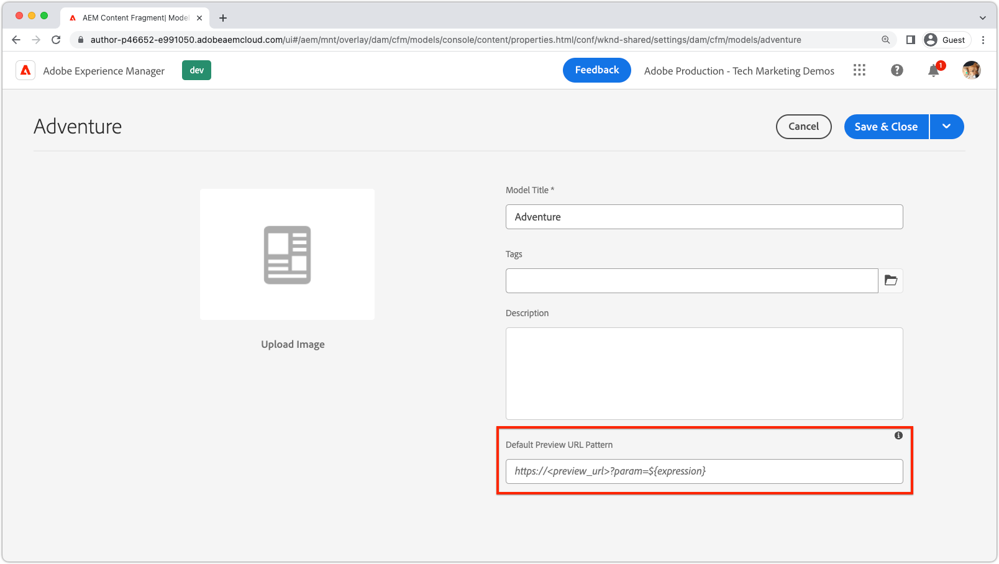

# 內容片段預覽

AEM Headless應用程式支援整合式撰寫預覽。 預覽體驗會連結AEM作者的內容片段編輯器與您的自訂應用程式（可透過HTTP定址），允許應用程式的深層連結，以產生正在預覽的內容片段。

>[!VIDEO](https://video.tv.adobe.com/v/3416906?quality=12&learn=on)

若要使用內容片段預覽，必須符合數個條件：

1. 應用程式必須部署至作者可存取的URL
1. 應用程式必須設定為連線至AEM作者服務(而非AEM發佈服務)
1. 應用程式必須設計有可使用[內容片段路徑或ID](#url-expressions)的URL或路由，以選取要顯示在應用程式體驗中預覽的內容片段。

## 預覽URL

在內容片段模型的屬性上設定使用[URL運算式](#url-expressions)的預覽URL。



1. 以管理員身分登入AEM作者服務
1. 導覽至&#x200B;__工具>一般>內容片段模型__
1. 選取&#x200B;__內容片段模型__，並從上方動作列選取&#x200B;__屬性__。
1. 使用[URL運算式](#url-expressions)輸入內容片段模型的預覽URL
   + 預覽URL必須指向連線至AEM作者服務的應用程式部署。

### URL運算式

每個內容片段模式都可以設定預覽URL。 您可以使用下表列出的URL運算式，為每個內容片段引數化預覽URL。 可在單一預覽URL中使用多個URL運算式。

|                                         | URL運算式 | 值 |
| --------------------------------------- | ----------------------------------- | ----------- |
| 內容片段路徑 | `${contentFragment.path}` | `/content/dam/wknd-shared/en/adventures/surf-camp-bali/surf-camp-bali` |
| 內容片段ID | `${contentFragment.id}` | `12c34567-8901-2aa3-45b6-d7890aa1c23c` |
| 內容片段變數 | `${contentFragment.variation}` | `main` |
| 內容片段模型路徑 | `${contentFragment.model.path}` | `/conf/wknd-shared/settings/dam/cfm/models/adventure` |
| 內容片段模型名稱 | `${contentFragment.model.name}` | `adventure` |

預覽URL範例：

+ __冒險活動__&#x200B;模型上的預覽URL看起來可能類似於`https://preview.app.wknd.site/adventure${contentFragment.path}`，解析成`https://preview.app.wknd.site/adventure/content/dam/wknd-shared/en/adventures/surf-camp-bali/surf-camp-bali`
+ __Article__&#x200B;模型上的預覽URL看起來可能像`https://preview.news.wknd.site/${contentFragment.model.name}/${contentFragment.id}.html?variation=${contentFragment.variation}`解析的`https://preview.news.wknd.site/article/99c34317-1901-2ab3-35b6-d7890aa1c23c.html?variation=main`

## 應用程式內預覽

任何使用已設定內容片段模型的內容片段都會有預覽按鈕。 預覽按鈕會開啟內容片段模型的預覽URL，並將開啟的內容片段的值插入[URL運算式](#url-expressions)。


預覽應用程式中的內容片段變更時，執行硬式重新整理（清除瀏覽器的本機快取）。

## React範例

讓我們來探索WKND應用程式，這是一個簡單的React應用程式，可顯示使用AEM Headless GraphQL API的AEM冒險。

範常式式碼可在[Github.com](https://github.com/adobe/aem-guides-wknd-graphql/tree/main/preview-tutorial)上取得。

## URL和路由

用來預覽內容片段的URL或路由必須可以使用[URL運算式](#url-expressions)來撰寫。 在這個啟用預覽的WKND應用程式版本中，冒險內容片段會透過繫結至路由`AdventureDetail`的`/adventure<CONTENT FRAGMENT PATH>`元件顯示。 因此，WKND Adventure模型的預覽URL必須設定為`https://preview.app.wknd.site:3000/adventure${contentFragment.path}`才能解析為此路由。

只有當應用程式具有可定址的路由時，內容片段預覽才有作用，該路由可以填入[URL運算式](#url-expressions)，該運算式會以可預覽的方式在應用程式中呈現該內容片段。

+ `src/App.js`

```javascript
...
function App() {
  return (
    <Router>
      <div className="App">
        <header>
            <Link to={"/"}>
                
            </Link>        
            <hr />
        </header>
        <Routes>
          {/* The route's path must match the Adventure Model's Preview URL expression. In React since the path has `/` you must use wildcards to match instead of the usual `:path` */}
          <Route path='/adventure/*' element={<AdventureDetail />}/>
          <Route path="/" element={<Home />}/>
        </Routes>
      </div>
    </Router>
  );
}

export default App;
```

### 顯示編寫的內容

`AdventureDetail`元件僅會剖析內容片段路徑，從路由URL透過`${contentFragment.path}` [URL運算式](#url-expressions)插入預覽URL中，並使用它來收集和轉譯WKND Adventure。

+ `src/components/AdventureDetail.js`

```javascript
...
function AdventureDetail() {

    // Read the `path` value which is the parameter used to query for the adventure's details
    // since the params value captures the `*` wildcard in `/adventure/*`, or everything after the first `/` in the Content Fragment path.
    const params = useParams();
    const pathParam = params["*"];

    // Add the leading '/' back on 
    const path = '/' + pathParam;
    
    // Query AEM for the Adventures's details, using the Content Fragment's `path`
    const { adventure, references, error } = useAdventureByPath(path);

    // Handle error and loading conditions
    if (error) {
        return <Error errorMessage={error} />;
    } else if (!adventure) {
        return <Loading />;
    }

    return (<div className="adventure-detail">
        ...
        <AdventureDetailRender {...adventure} references={references} />
    </div>);
}
...
```
