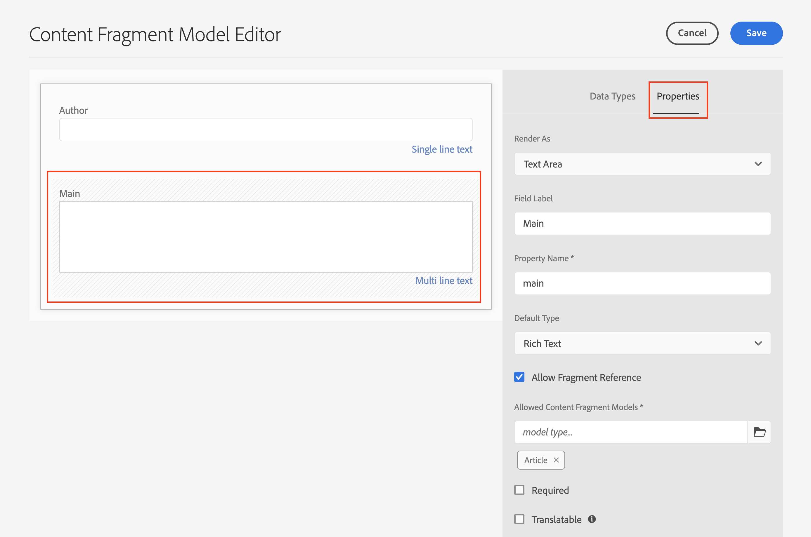

# RTF文字與AEM Headless

多行文字欄位是內容片段的資料型別，可讓作者建立RTF文字內容。 對其他內容（例如影像或其他內容片段）的參考可動態插入文字流程的內嵌中。 單行文字欄位是另一個應用於簡單文字元素的內容片段資料型別。

AEM GraphQL API提供強大的功能，可將RTF文字傳回HTML、純文字或純JSON。 JSON呈現方式功能強大，因為可讓使用者端應用程式完全掌控內容的呈現方式。

## 多行編輯器

>[!VIDEO](https://video.tv.adobe.com/v/342104?quality=12&learn=on)

在內容片段編輯器中，多行文字欄位的選單列為作者提供標準的RTF格式功能，例如 **粗體**， *斜體*，並加上底線。 以全熒幕模式開啟多行欄位會啟用 [其他格式設定工具，例如「段落文字」、「尋找和取代」、「拼字檢查」等](https://experienceleague.adobe.com/docs/experience-manager-cloud-service/content/assets/content-fragments/content-fragments-variations.html).

>[!NOTE]
>
> 無法自訂多行編輯器中的RTF外掛程式。

## 多行文字資料型別 {#multi-line-data-type}

使用 **多行文字** 定義您的內容片段模式以啟用RTF編寫時的資料型別。



可以設定多行欄位的幾個屬性。

此 **呈現為** 屬性可設為：

* 文字區域 — 呈現單一多行欄位
* 多個欄位 — 呈現多個多行欄位


此 **預設型別** 可設為：

* RTF
* Markdown
* 純文字

此 **預設型別** 選項會直接影響編輯體驗，並決定RTF工具是否存在。

您也可以 [啟用內嵌參考](#insert-fragment-references) 至其他內容片段，方法是檢查 **允許片段參考** 並設定 **允許的內容片段模型**.

檢查 **可翻譯** 方塊（如果要將內容本地化）。 只能本地化RTF和純文字。 另請參閱 [使用當地語系化內容以取得詳細資訊](./localized-content.md).

## GraphQL API的RTF回應

建立GraphQL查詢時，開發人員可以從中選擇不同的回應型別 `html`， `plaintext`， `markdown`、和 `json` 來自多行欄位。

開發人員可使用 [JSON預覽](https://experienceleague.adobe.com/docs/experience-manager-cloud-service/content/assets/content-fragments/content-fragments-json-preview.html) 在內容片段編輯器中，顯示可使用GraphQL API傳回之目前內容片段的所有值。

## GraphQL持續查詢

選取 `json` 多行欄位的回應格式在使用RTF文字內容時可提供最大的彈性。 RTF內容以JSON節點型別陣列的形式傳送，可根據使用者端平台唯一處理。

以下是名為的多行欄位的JSON回應型別 `main` 內含段落的檔案： 」*此段落包含&#x200B;**重要**內容。*&quot;其中，&quot;important&quot;標示為 **粗體**.

```graphql
query ($path: String!) {
  articleByPath(_path: $path)
  {
    item {
      _path
      main {
        json
      }
    }
  }
}
```

此 `$path` 變數用於 `_path` 篩選器需要內容片段的完整路徑(例如 `/content/dam/wknd/en/magazine/sample-article`)。

**GraphQL回應：**

```json
{
  "data": {
    "articleByPath": {
      "item": {
        "_path": "/content/dam/wknd/en/magazine/sample-article",
        "main": {
          "json": [
            {
              "nodeType": "paragraph",
              "content": [
                {
                  "nodeType": "text",
                  "value": "This is a paragraph that includes "
                },
                {
                  "nodeType": "text",
                  "value": "important",
                  "format": {
                    "variants": [
                      "bold"
                    ]
                  }
                },
                {
                  "nodeType": "text",
                  "value": " content. "
                }
              ]
            }
          ]
        }
      }
    }
  }
}
```

### 其他範例

以下是名為的多行欄位的幾個回應型別範例 `main` 包含段落的檔案：「這是一個包含下列內容的段落： **重要** 內容。」 其中「重要」標示為 **粗體**.

+++HTML範例

**GraphQL持續查詢：**

```graphql
query ($path: String!) {
  articleByPath(_path: $path)
  {
    item {
      _path
      main {
        html
      }
    }
  }
}
```

**GraphQL回應：**

```json
{
  "data": {
    "articleByPath": {
      "item": {
        "_path": "/content/dam/wknd/en/magazine/sample-article",
        "main": {
            "html": "<p>This is a paragraph that includes <b>important</b> content.&nbsp;</p>\n"
        }
      }
    }
  }
}
```

+++

+++Markdown範例

**GraphQL持續查詢：**

```graphql
query ($path: String!) {
  articleByPath(_path: $path)
  {
    item {
      _path
      main {
        markdown
      }
    }
  }
}
```

**GraphQL回應：**

```json
{
  "data": {
    "articleByPath": {
      "item": {
        "_path": "/content/dam/wknd/en/magazine/sample-article",
        "main": {
            "markdown": "This is a paragraph that includes **important** content. \n\n ",
        }
      }
    }
  }
}
```

+++

+++純文字範例

**GraphQL持續查詢：**

```graphql
query ($path: String!) {
  articleByPath(_path: $path)
  {
    item {
      _path
      main {
        plaintext
      }
    }
  }
}
```

**GraphQL回應：**

```json
{
  "data": {
    "articleByPath": {
      "item": {
        "_path": "/content/dam/wknd/en/magazine/sample-article",
        "main": {
            "plaintext": "This is a paragraph that includes important content. ",
        }
      }
    }
  }
}
```

此 `plaintext` 演算選項會去除任何格式。

+++


## 呈現RTF文字JSON回應 {#render-multiline-json-richtext}

多行欄位的RTF文字JSON回應會結構化為階層式樹狀結構。 每個物件或節點代表RTF文字的不同HTML區塊。

以下是多行文字欄位的JSON回應範例。 請注意，每個物件或節點都包含 `nodeType` 代表RTF中的HTML區塊，例如 `paragraph`， `link`、和 `text`. 每個節點可選擇性包含 `content` 該子陣列包含目前節點的任何子節點。

```json
"json": [// root "content" or child nodes
            {
                "nodeType": "paragraph", // node for a paragraph
                "content": [ // children of current node
                {
                    "nodeType": "text", // node for a text
                    "value": "This is the first paragraph. "
                },
                {
                    "nodeType": "link",
                    "data": {
                        "href": "http://www.adobe.com"
                    },
                    "value": "An external link"
                }
                ],
            },
            {
                "nodeType": "paragraph",
                "content": [
                {
                    "nodeType": "text",
                    "value": "This is the second paragraph."
                },
                ],
            },
]
```

呈現多行文字的最簡單方式 `json` 回應是處理回應中的每個物件或節點，然後處理目前節點的任何子系。 遞回函式可用於周遊JSON樹狀結構。

以下是說明遞回周遊方法的範常式式碼。 範例以JavaScript為基礎，並使用React的 [JSX](https://reactjs.org/docs/introducing-jsx.html)不過，程式設計概念可套用至任何語言。

```javascript
// renderNodeList - renders a list of nodes
function renderNodeList(childNodes) {
    
    if(!childNodes) {
        // null check
        return null;
    }

    return childNodes.map(node, index) => {
        return renderNode(node);
    }
}
```

`renderNodeList` 是遞回函式，接受陣列 `childNodes`. 然後陣列中的每個節點都會傳遞至函式 `renderNode`，接著會呼叫 `renderNodeList` 如果節點具有子系。

```javascript
// renderNode - renders an individual node
function renderNode(node) {

    // if the current node has children, recursively process them
    const children = node.content ? renderNodeList(node.content) : null;

    // use a map to render the current node based on its nodeType
    return nodeMap[node.nodeType]?.(node, children);
}
```

此 `renderNode` 函式預期單一物件，名為 `node`. 節點可以有子節點，子節點會使用 `renderNodeList` 函式說明。 最後， `nodeMap` 用於根據節點的內容 `nodeType`.

```javascript
// nodeMap - object literal that maps a JSX response based on a given key (nodeType)
const nodeMap = {
    'paragraph': (node, children) => <p>{children}</p>,
    'link': node => <a href={node.data.href} target={node.data.target}>{node.value}</a>,
    'text': node => node.value,
    'unordered-list': (node, children) => <ul>{children}</ul>,
    'ordered-list': (node, children) => <ol>{children}</ol>,
    'list-item': (node, children) => <li>{children}</li>,
    ...
}
```

此 `nodeMap` 是用作地圖的JavaScript物件常值。 每個「金鑰」代表不同的 `nodeType`. 引數： `node` 和 `children` 可傳遞至產生節點之函式。 此範例中使用的傳回型別是JSX，但方法可調整為建置表示HTML內容的字串常值。

### 完整程式碼範例

可重複使用的RTF轉譯公用程式可在 [WKND GraphQL React範例](https://github.com/adobe/aem-guides-wknd-graphql/tree/main/react-app).

* [renderRichText.js](https://github.com/adobe/aem-guides-wknd-graphql/blob/main/react-app/src/utils/renderRichText.js)  — 公開函式的可重複使用公用程式 `mapJsonRichText`. 元件可使用此公用程式將RTF文字JSON回應轉譯為React JSX。
* [AdventureDetail.js](https://github.com/adobe/aem-guides-wknd-graphql/blob/main/react-app/src/components/AdventureDetail.js)  — 發出包含RTF文字的GraphQL請求的元件範例。 元件使用 `mapJsonRichText` 用於呈現RTF文字和任何參考的公用程式。


## 新增內嵌參考至RTF文字 {#insert-fragment-references}

「多行」欄位可讓作者在RTF文字流中插入AEM Assets的影像或其他數位資產。


上述熒幕擷圖描繪了使用插入多行欄位中的影像。 **插入資產** 按鈕。

對其他內容片段的參考也可以使用 **插入內容片段** 按鈕。


上面的熒幕擷圖描繪了插入多行欄位中的另一個內容片段，洛杉磯滑板公園終極指南。 可插入欄位中的內容片段型別由控制 **允許的內容片段模型** 中的設定 [多行資料型別](#multi-line-data-type) 在內容片段模式中。

## 使用GraphQL查詢內嵌參考

GraphQL API可讓開發人員建立查詢，查詢中包含有關插入多行欄位中的任何參考的其他屬性。 JSON回應包含個別的 `_references` 列出這些額外屬性的物件。 JSON回應可讓開發人員完全掌控如何呈現參考資料或連結，而不必處理教條式HTML。

例如，您可能想要：

* 包含自訂路由邏輯，可在實作單頁應用程式（例如使用React Router或Next.js）時管理其他內容片段的連結
* 使用指向AEM Publish環境的絕對路徑作為呈現內嵌影像 `src` 值。
* 決定如何使用其他自訂屬性呈現對其他內容片段的嵌入參考。

使用 `json` 傳回型別並包含 `_references` 物件(建構GraphQL查詢時)：

**GraphQL持續查詢：**

```graphql
query ($path: String!) {
  articleByPath(_path: $path, _assetTransform: { format: JPG, preferWebp: true })
  {
    item {
      _path
      main {
        json
      }
    }
    _references {
      ...on ImageRef {
        _dynamicUrl
        __typename
      }
      ...on ArticleModel {
        _path
        author
        __typename
      }  
    }
  }
}
```

在上述查詢中， `main` 欄位會以JSON傳回。 此 `_references` 物件包含片段，用於處理任何型別的參考 `ImageRef` 或型別 `ArticleModel`.

**JSON回應：**

```json
{
  "data": {
    "articleByPath": {
      "item": {
        "_path": "/content/dam/wknd/en/magazine/sample-article",
        "main": {
          "json": [
            {
              "nodeType": "paragraph",
              "content": [
                {
                  "nodeType": "text",
                  "value": "This is a paragraph that includes "
                },
                {
                  "nodeType": "text",
                  "value": "important",
                  "format": {
                    "variants": [
                      "bold"
                    ]
                  }
                },
                {
                  "nodeType": "text",
                  "value": " content. "
                }
              ]
            },
            {
              "nodeType": "paragraph",
              "content": [
                {
                  "nodeType": "reference",
                  "data": {
                    "path": "/content/dam/wknd/en/activities/climbing/sport-climbing.jpg",
                    "mimetype": "image/jpeg"
                  }
                }
              ]
            },
            {
              "nodeType": "paragraph",
              "content": [
                {
                  "nodeType": "text",
                  "value": "Reference another Content Fragment: "
                },
                {
                  "nodeType": "reference",
                  "data": {
                    "href": "/content/dam/wknd/en/magazine/la-skateparks/ultimate-guide-to-la-skateparks",
                    "type": "fragment"
                  },
                  "value": "Ultimate Guide to LA Skateparks"
                }
              ]
            }
          ]
        }
      },
      "_references": [
        {
          "_dynamicUrl": "/adobe/dynamicmedia/deliver/dm-aid--dd42d814-88ec-4c4d-b5ef-e3dc4bc0cb42/sport-climbing.jpg?preferwebp=true",
          "__typename": "ImageRef"
        },
        {
          "_path": "/content/dam/wknd/en/magazine/la-skateparks/ultimate-guide-to-la-skateparks",
          "author": "Stacey Roswells",
          "__typename": "ArticleModel"
        }
      ]
    }
  }
}
```

JSON回應包含參考插入RTF文字的位置，並附上 `"nodeType": "reference"`. 此 `_references` 然後物件會包含每個參考。

## 以RTF文字呈現內嵌參考

若要呈現內嵌參照，請依照下列說明使用遞回方法： [呈現多行JSON回應](#render-multiline-json-richtext) 可展開。

位置 `nodeMap` 是轉譯JSON節點的地圖。

```javascript
const nodeMap = {
        'reference': (node, children) => {

            // variable for reference in _references object
            let reference;
            
            // asset reference
            if (node.data.path) {
                // find reference based on path
                reference = references.find( ref => ref._path === node.data.path);
            }
            // Fragment Reference
            if (node.data.href) {
                // find in-line reference within _references array based on href and _path properties
                reference = references.find( ref => ref._path === node.data.href);
            }

            // if reference found, merge properties of reference and current node, then return render method of it using __typename property
            return reference ? renderReference[reference.__typename]({...reference, ...node}) : null;
        }
    }
```

高階方法是指每當發生下列情況時進行檢查 `nodeType` 等於 `reference` Multi Line JSON回應中的。 接著，即可呼叫自訂演算函式，並包含 `_references` GraphQL回應中傳回的物件。

然後可以將內嵌參照路徑與 `_references` 物件與另一個自訂地圖 `renderReference` 可呼叫。

```javascript
const renderReference = {
    // node contains merged properties of the in-line reference and _references object
    'ImageRef': (node) => {
        // when __typename === ImageRef
        return  
    },
    'ArticleModel': (node) => {
        // when __typename === ArticleModel
        return <Link to={`/article:${node._path}`}>{`${node.value}`}</Link>;
    }
    ...
}
```

此 `__typename` 的 `_references` 物件可用來將不同的參考型別對應至不同的轉譯器函式。

### 完整程式碼範例

寫入自訂參考轉譯器的完整範例可在以下網址找到： [AdventureDetail.js](https://github.com/adobe/aem-guides-wknd-graphql/blob/main/react-app/src/components/AdventureDetail.js) 作為 [WKND GraphQL React範例](https://github.com/adobe/aem-guides-wknd-graphql/tree/main/react-app).

## 端對端範例

>[!VIDEO](https://video.tv.adobe.com/v/342105?quality=12&learn=on)

>[!NOTE]
>
> 上述影片使用 `_publishUrl` 以轉譯影像參考。 相反地，偏好 `_dynamicUrl` 如 [網頁最佳化的影像做法](./images.md)；


前文影片顯示端對端範例：

1. 更新內容片段模型的多行文字欄位以允許片段參考
2. 使用內容片段編輯器在多行文字欄位中包含影像和對另一個片段的引用。
3. 建立GraphQL查詢，其中包含多行文字回應，如JSON和任何 `_references` 已使用。
4. 撰寫可呈現RTF回應內嵌參考的React SPA。
