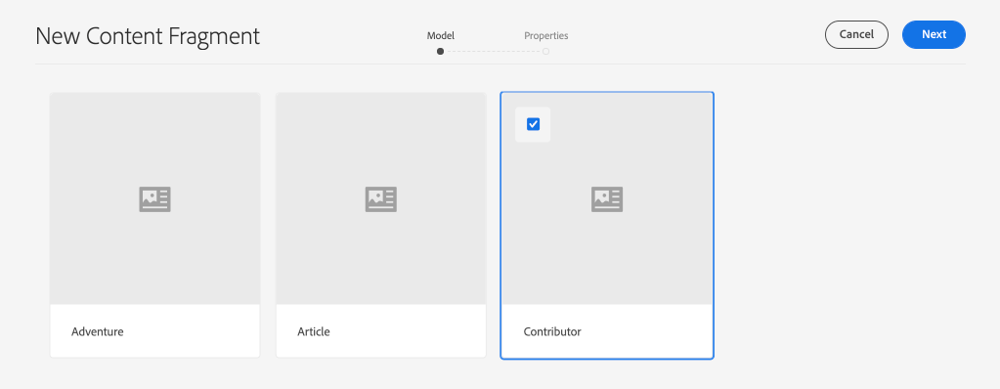
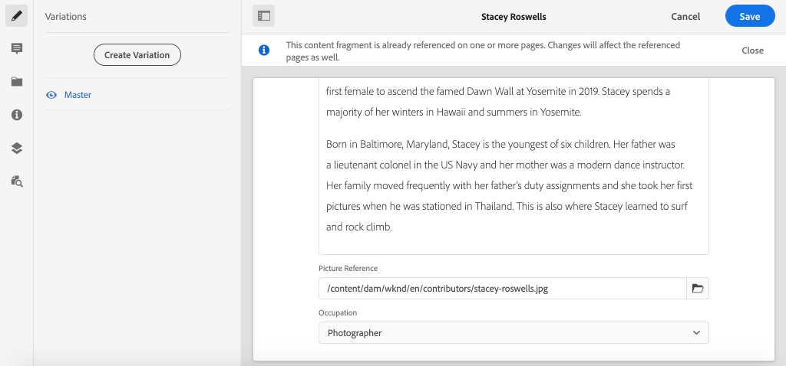

# 編寫內容片段{#authoring-content-fragments}

在本章中，您將根據[新定義的參與者內容片段模型](./content-fragment-models.md)來建立和編輯新的內容片段。 您也將學習如何建立內容片段的變體。

## 必備條件 {#prerequisites}

這是多部分教學課程，假定[定義內容片段模型](./content-fragment-models.md)中概述的步驟已完成。

## 目標{#objectives}

* 基於內容片段模型製作內容片段
* 建立內容片段變數

## 內容片段製作概述{#overview}

>[!VIDEO](https://video.tv.adobe.com/v/22451/?quality=12&learn=on)

上述影片提供製作內容片段的高階概觀。

## 建立內容片段{#create-content-fragment}

在上一章[定義內容片段模型](./content-fragment-models.md)中，建立了&#x200B;**貢獻者**&#x200B;模型。 使用此模型製作新的內容片段。

1. 從&#x200B;**開始AEM**&#x200B;功能表導覽至&#x200B;**資產** > **檔案**。
1. 按一下資料夾以導航至&#x200B;**WKND站點** > **英文** > **參與者**。 此資料夾包含WKND品牌「投稿者」的頭照清單。

1. 按一下右上角的&#x200B;**建立**&#x200B;並選擇&#x200B;**內容片段**:

   

1. 選擇&#x200B;**Contributor**&#x200B;型號，然後按一下&#x200B;**Next**。

   

   這與前一章中建立的&#x200B;**Contributor**&#x200B;模型相同。

1. 輸入&#x200B;**Stacey Roswells**&#x200B;作為標題，然後按一下&#x200B;**Create**。
1. 在&#x200B;**Success**&#x200B;對話方塊中按一下&#x200B;**Open**，以開啟新建立的片段。

   

   請注意，模型定義的欄位現在可用來製作此內容片段例項。

1. 對於&#x200B;**全名**，請輸入：**Stacey Roswells**。
1. 對於&#x200B;**傳記**，請輸入簡短的傳記。 需要靈感嗎？ 您可以重新使用此[文字檔](assets/author-content-fragments/stacey-roswells-bio.txt)。
1. 對於&#x200B;**圖片參考**，按一下&#x200B;**資料夾**&#x200B;表徵圖並瀏覽至&#x200B;**WKND站點** > **英文** > **參與者** > **stacey-roswells.jpg**... 這將評估路徑：`/content/dam/wknd/en/contributors/stacey-roswells.jpg`。
1. 對於&#x200B;**佔領**&#x200B;選擇&#x200B;**攝影師**。

   

1. 按一下&#x200B;**保存**&#x200B;保存更改。

## 建立內容片段變數

所有內容片段都以&#x200B;**Master**&#x200B;變數開頭。 **Master**&#x200B;變化可視為片段的&#x200B;*default*&#x200B;內容，當內容透過GraphQL API公開時自動使用。 您也可以建立內容片段的變體。 此功能提供設計實作的額外彈性。

變數可用來定位特定渠道。 例如，可建立包含較少文字量或參考頻道特定影像的&#x200B;**mobile**&#x200B;變數。 變數的使用方式完全取決於實作。 和任何功能一樣，使用前應先謹慎規劃。

接下來，請建立新的變數，以瞭解可用的功能。

1. 重新開啟&#x200B;**Stacey Roswells**&#x200B;內容片段。
1. 在左側導軌中，按一下「建立變化」(Create Variation)**。**
1. 在&#x200B;**New Variation**&#x200B;模式中，輸入&#x200B;**Summary**&#x200B;的標題。

   

1. 按一下&#x200B;**Briemion**&#x200B;多行欄位，然後按一下&#x200B;**Expand**&#x200B;按鈕，輸入多行欄位的全屏視圖。

   

1. 按一下右上角菜單中的「摘要文本」。****

1. 輸入&#x200B;**** 50 **字的Target**，然後按一下&#x200B;**開始**。

   

   這將開啟一個總結預覽。 機AEM器語言處理器會嘗試根據目標字數來摘要文字。 您也可以選取要移除的不同句子。

1. 當您對總結感到滿意時，按一下&#x200B;**摘要**。 按一下多行文本欄位並切換&#x200B;**展開**&#x200B;按鈕以返回主視圖。

1. 按一下&#x200B;**保存**&#x200B;保存更改。

## 建立其他內容片段

重複[建立內容片段](#create-content-fragment)中所述的步驟，以建立額外的&#x200B;**貢獻者**。 下一章將會使用此功能，作為如何查詢多個片段的範例。

1. 在&#x200B;**Contributors**&#x200B;資料夾中，按一下右上角的&#x200B;**Create**，然後選取&#x200B;**Content Fragment**:
1. 選擇&#x200B;**Contributor**&#x200B;型號，然後按一下&#x200B;**Next**。
1. 輸入&#x200B;**Jacob Wester**&#x200B;作為標題，然後按一下&#x200B;**Create**。
1. 在&#x200B;**Success**&#x200B;對話方塊中按一下&#x200B;**Open**，以開啟新建立的片段。
1. 對於&#x200B;**全名**，請輸入：**Jacob Wester**。
1. 對於&#x200B;**傳記**，請輸入簡短的傳記。 需要靈感嗎？ 您可以重新使用此[文字檔](assets/author-content-fragments/jacob-wester.txt)。
1. 對於&#x200B;**圖片參考**，按一下&#x200B;**資料夾**&#x200B;表徵圖並瀏覽至&#x200B;**WKND站點** > **英文** > **參與者** > **jacob_wester.jpg**。 這將評估路徑：`/content/dam/wknd/en/contributors/jacob_wester.jpg`。
1. 對於&#x200B;**佔領**，選擇&#x200B;**寫入器**。
1. 按一下&#x200B;**保存**&#x200B;保存更改。 除非您想要，否則不需要建立變數！

   

   您現在應該有兩個&#x200B;**貢獻者**&#x200B;片段。

## 恭喜！{#congratulations}

恭喜您，您剛編寫了多個內容片段並建立了變數。

## 後續步驟{#next-steps}

在下一章[「探索GraphQL API ](explore-graphql-api.md)」中，您將使用內置的GrapiQL工具AEM來探索GraphQL API。 瞭解如AEM何根據內容片段模型自動生成GraphQL模式。 您將嘗試使用GraphQL語法來構建基本查詢。