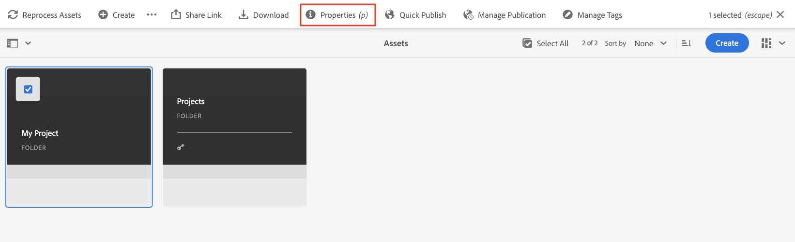
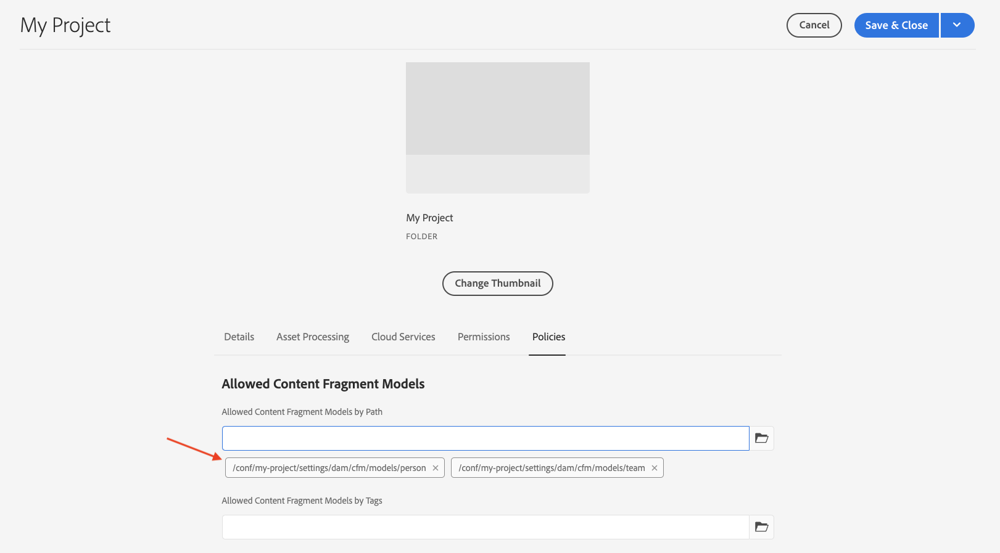

# 創作內容片段 {#authoring-content-fragments}

在本章中，您將根據 [新定義的內容片段模型](./content-fragment-models.md)。 您還將學習如何建立內容片段的變體。

## 必備條件 {#prerequisites}

這是一個多部分教程，並假定在 [定義內容片段模型](./content-fragment-models.md) 已完成。

## 目標 {#objectives}

* 基於內容片段模型編寫內容片段
* 建立內容片段變體

## 建立資產資料夾

內容片段儲存在AEM Assets的資料夾中。 要從上一章中建立的模型建立內容片段，必須建立一個資料夾來儲存它們。 資料夾上需要配置才能從特定模型建立片段。

1. 從「開始AEM」螢幕導航到 **資產** > **檔案**。

   

1. 點擊 **建立** 在右上角點擊 **資料夾**。 在生成的對話框中，輸入：

   * 標題*: **我的項目**
   * 名稱： **我的項目**

   

1. 選擇 **我的資料夾** 資料夾和點擊 **屬性**。

   

1. 點擊 **Cloud Services** 頁籤。 在「雲配置」頁籤下，使用路徑查找器選擇 **我的項目** 配置。 值應為 `/conf/my-project`。

   

   通過設定此屬性，可以使用在上一章中建立的模型建立內容片段。

1. 點擊 **策略** 頁籤 **允許的內容片段模型** 欄位使用路徑查找器選擇 **人員** 和 **團隊** 模型建立時間。

   

   這些策略由任何子資料夾自動繼承，並且可以覆蓋。 您還可以按標籤允許模型，或從其他項目配置中啟用模型。 此機制提供了管理內容層次結構的強大方法。

1. 點擊 **保存並關閉** 的子菜單。

1. 在 **我的項目** 的子菜單。

1. 建立具有以下值的另一個資料夾：

   * 標題*: **英語**
   * 名稱： **恩**

   最佳做法是設定多語言支援項目。 請參閱 [有關詳細資訊，請瀏覽以下文檔頁面](https://experienceleague.adobe.com/docs/experience-manager-cloud-service/content/assets/admin/translate-assets.html)。

## 建立內容片段 {#create-content-fragment}

接下來，將根據 **團隊** 和 **人員** 模型。

1. 從「Start(AEM開始)」螢幕，點擊 **內容片段** 開啟內容片段UI。

   

1. 在左滑軌中，展開 **我的項目** 點擊 **英語**。
1. 點擊 **建立** 提到 **新內容片段** 對話框並輸入以下值：

   * 位置: `/content/dam/my-project/en`
   * 內容片段模型： **人員**
   * 標題： **無名氏**
   * 名稱: `john-doe`

   
1. 點擊 **建立**。
1. 重複上述步驟以建立表示 **艾莉森·史密斯**:

   * 位置: `/content/dam/my-project/en`
   * 內容片段模型： **人員**
   * 標題： **艾莉森·史密斯**
   * 名稱: `alison-smith`

   點擊 **建立** 建立「人員」片段。

1. 接下來，重複步驟以建立 **團隊** 片段 **阿爾法隊**:

   * 位置: `/content/dam/my-project/en`
   * 內容片段模型： **團隊**
   * 標題： **阿爾法隊**
   * 名稱: `team-alpha`

   點擊 **建立** 建立團隊片段。

1. 下面應該有三個內容片段 **我的項目** > **英語**:

   

## 編輯人員內容片段 {#edit-person-content-fragments}

接下來，使用資料填充新建立的片段。

1. 按一下旁邊的複選框 **無名氏** 點擊 **開啟**。

   

1. 內容片段編輯器包含基於內容片段模型的表單。 填寫各個欄位以將內容添加到 **無名氏** 碎片。 對於配置檔案圖片，將您自己的影像上傳到AEM Assets。

   

1. 點擊 **保存並關閉** 保存對無名氏碎片的更改。
1. 返回內容片段UI並開啟 **艾莉森·史密斯** 檔案。
1. 重複上述步驟以填充 **艾莉森·史密斯** 內容碎片。

## 編輯團隊內容片段 {#edit-team-content-fragment}

1. 開啟 **阿爾法隊** 使用內容片段UI的內容片段。
1. 填寫 **標題**。 **短名稱**, **說明**。
1. 選擇 **無名氏** 和 **艾莉森·史密斯** 要填充的內容片段 **團隊成員** 欄位：

   

   >[!NOTE]
   >
   >也可以使用 **新內容片段** 按鈕

1. 點擊 **保存並關閉** 以保存對Team Alpha片段所做的更改。

## 發佈內容片段

在審閱和驗證後，發佈已創作的 `Content Fragments`

1. 從「Start(AEM開始)」螢幕，點擊 **內容片段** 開啟內容片段UI。

1. 在左滑軌中，展開 **我的項目** 點擊 **英語**。

1. 點擊內容片段旁邊的複選框，然後點擊 **發佈**。
   

## 恭喜！ {#congratulations}

恭喜您創作了多個內容片段並建立了變體。

## 後續步驟 {#next-steps}

在下一章， [瀏覽GraphQLAPI](explore-graphql-api.md)，您將使AEM用內置的GrapiQL工具瀏覽GraphQLAPI。 瞭解如AEM何基於內容片段模型自動生成GraphQL架構。 您將嘗試使用GraphQL語法構建基本查詢。

## 相關文檔

* [管理內容片段](https://experienceleague.adobe.com/docs/experience-manager-cloud-service/content/assets/content-fragments/content-fragments-managing.html)
* [變化 - 編寫片段內容](https://experienceleague.adobe.com/docs/experience-manager-cloud-service/content/assets/content-fragments/content-fragments-variations.html)
