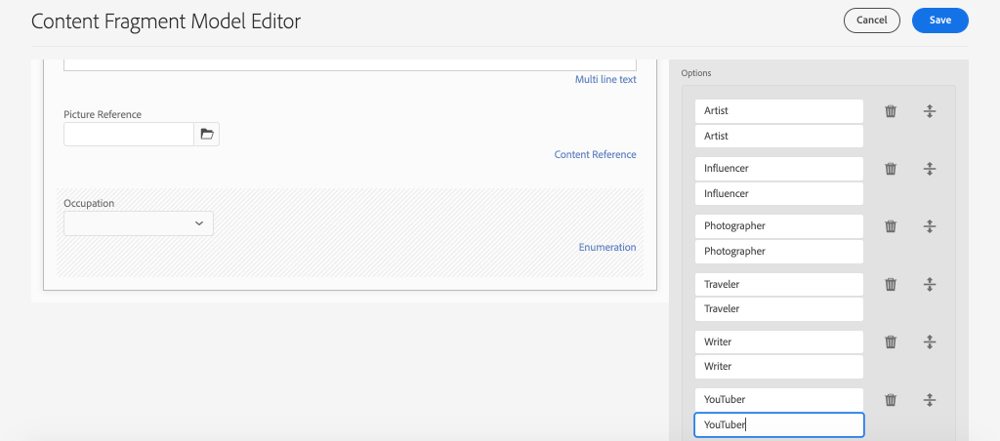

# 定義內容片段模型 {#content-fragment-models}

本章說明如何建立內容模型，並使用&#x200B;**內容片段模型**&#x200B;建立架構。 將審閱現有模型並建立新模型。 您也將了解可用來定義模型中結構的不同資料類型。

在本章中，您將為&#x200B;**貢獻者**&#x200B;建立新模型，這是那些將雜誌和冒險內容作為WKND品牌一部分的用戶的資料模型。

## 必備條件 {#prerequisites}

本教學課程分為多部分，假設已完成[快速設定](./setup.md)中概述的步驟。

## 目標 {#objectives}

* 建立新的內容片段模型。
* 識別可用的資料類型和建立模型的驗證選項。
* 了解內容片段模型如何定義內容片段的資料架構和製作範本&#x200B;**兩者**。

## 內容片段模型概觀 {#overview}

>[!VIDEO](https://video.tv.adobe.com/v/22452/?quality=12&learn=on)

上述影片提供使用內容片段模型的概觀。

>[!CAUTION]
>
> 以上影片顯示以`Contributors`名稱建立&#x200B;**貢獻者**&#x200B;模型的過程。 在您自己的環境中執行步驟時，請確定標題使用單一形式：`Contributor`，不含&#x200B;**s**。 內容片段模型的命名會驅動GraphQL API呼叫，此呼叫將在稍後的教學課程中執行。

## Inspect冒險內容片段模型

在前一章中，數個歷險內容片段經過編輯，並顯示在外部應用程式上。 讓我們檢查探險內容片段模型，了解這些片段的基礎資料結構。

1. 從&#x200B;**AEM開始**&#x200B;功能表導覽至&#x200B;**工具** > **資產** > **內容片段模型**。

   

1. 導覽至&#x200B;**WKND Site**&#x200B;資料夾，並暫留在&#x200B;**Adventure**&#x200B;內容片段模型上，然後按一下&#x200B;**Edit**&#x200B;圖示（鉛筆）以開啟模型。

   

1. 這會開啟&#x200B;**內容片段模型編輯器**。 請注意，定義「探險」模型的欄位包含不同的&#x200B;**資料類型**，例如&#x200B;**單行文字**、**多行文字**、**枚舉**&#x200B;和&#x200B;**內容參考**。

1. 編輯器的右側欄列出可用的&#x200B;**資料類型**，定義用於編寫內容片段的表單欄位。

1. 在主面板中選擇&#x200B;**Title**&#x200B;欄位。 在右側欄中，按一下「**屬性** 」標籤：

   

   觀察&#x200B;**屬性名稱**&#x200B;欄位已設為`adventureTitle`。 這會定義持續存在AEM的屬性名稱。 **屬性名稱**&#x200B;還將此屬性的&#x200B;**鍵**&#x200B;名稱定義為資料架構的一部分。 透過GraphQL API公開內容片段資料時，將會使用此&#x200B;**索引鍵**。

   >[!CAUTION]
   >
   > 從模型衍生出內容片段後，修改欄位&#x200B;**的**&#x200B;屬性名稱&#x200B;**具有下游效果。**&#x200B;現有片段中的欄位值將不再被參考，GraphQL公開的資料架構將會變更，影響現有應用程式。

1. 向下捲動&#x200B;**Properties**&#x200B;標籤，並檢視&#x200B;**Validation Type**&#x200B;下拉式清單。

   

   可用於&#x200B;**電子郵件**&#x200B;和&#x200B;**URL**&#x200B;的現成表單驗證。 您也可以使用規則運算式來定義&#x200B;**Custom**&#x200B;驗證。

1. 按一下「**取消**」以關閉「內容片段模型編輯器」。

## 建立貢獻者模型

接下來，為&#x200B;**貢獻者**&#x200B;建立新模型，這是那些將雜誌和冒險內容作為WKND品牌一部分的用戶的資料模型。

1. 按一下右上角的&#x200B;**建立**&#x200B;以開啟&#x200B;**建立模型**&#x200B;精靈。
1. 對於&#x200B;**模型標題**，請輸入：**貢獻者**&#x200B;並按一下&#x200B;**建立**

   

   按一下&#x200B;**開啟**&#x200B;以開啟新建立的模型。

1. 將&#x200B;**單行文字**&#x200B;元素拖放至主面板。 在&#x200B;**Properties**&#x200B;標籤上輸入以下屬性：

   * **欄位標籤**: **完整名稱**
   * **屬性名稱**: `fullName`
   * 檢查&#x200B;**必要**

   

1. 按一下&#x200B;**資料類型**&#x200B;標籤，並將&#x200B;**多行文本**&#x200B;欄位拖放到&#x200B;**全名**&#x200B;欄位下。 輸入以下屬性：

   * **欄位標籤**: **傳記**
   * **屬性名稱**: `biographyText`
   * **預設類型**: **RTF**

1. 按一下&#x200B;**資料類型**&#x200B;標籤，並拖放&#x200B;**內容參考**&#x200B;欄位。 輸入以下屬性：

   * **欄位標籤**: **圖片參考**
   * **屬性名稱**: `pictureReference`
   * **根路徑**: `/content/dam/wknd`

   設定&#x200B;**根路徑**&#x200B;時，您可以按一下&#x200B;**資料夾**&#x200B;圖示，以開啟模組來選取路徑。 這將限製作者可用來填入路徑的資料夾。

   

1. 將驗證新增至&#x200B;**圖片參考**，以便只能使用&#x200B;**影像**&#x200B;的內容類型來填入欄位。

   

1. 按一下&#x200B;**資料類型**&#x200B;標籤，並將&#x200B;**枚舉**&#x200B;資料類型拖放到&#x200B;**圖片引用**&#x200B;欄位下。 輸入以下屬性：

   * **欄位標籤**: **職業**
   * **屬性名稱**: `occupation`

1. 使用&#x200B;**新增選項**&#x200B;按鈕，新增數個&#x200B;**選項**。 對&#x200B;**選項標籤**&#x200B;和&#x200B;**選項值**&#x200B;使用相同的值：

   **藝術家**、 **影響者**、 **攝影師**、 **旅行者**、 **作家**、 **YouTube**

   

1. 最終的&#x200B;**貢獻者**&#x200B;模型應如下所示：

   

1. 按一下&#x200B;**儲存**&#x200B;以儲存變更。

## 啟用貢獻者模型

內容片段模型必須為&#x200B;**啟用**，內容作者才能使用它。 您可以&#x200B;**停用**&#x200B;內容片段模型，因此禁止作者使用。 回想一下，修改模型中欄位的&#x200B;**屬性名稱**&#x200B;會更改基礎資料架構，並可能對現有片段和外部應用程式產生顯著的下游影響。 建議您先謹慎規劃用於欄位&#x200B;**屬性名稱**&#x200B;的命名慣例，再為使用者啟用內容片段模型。

1. 確保&#x200B;**貢獻者**&#x200B;模型目前處於&#x200B;**啟用**&#x200B;狀態。

   

   將滑鼠指標暫留在卡片上，按一下&#x200B;**Disable** / **Enable**&#x200B;圖示，即可切換內容片段模型的狀態。

## 恭喜！ {#congratulations}

恭喜，您剛建立了第一個內容片段模型！

## 後續步驟 {#next-steps}

在下一章[製作內容片段模型](author-content-fragments.md)中，您將根據內容片段模型建立和編輯新的內容片段。 您也會學習如何建立內容片段的變體。
