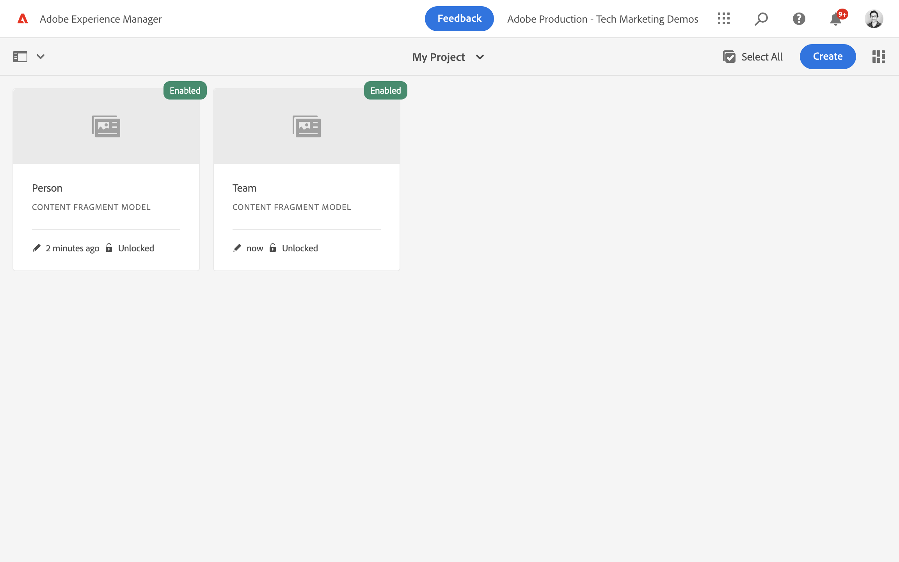

# 定義內容片段模型 {#content-fragment-models}

在本章中，了解如何建立內容模型，並使用 **內容片段模型**. 您可以了解可用來定義模型中結構的不同資料類型。

我們建立了兩個簡單的模型， **團隊** 和 **人員**. 此 **團隊** 資料模型有名稱、短名稱和說明，並且引用 **人員** 資料模型，包含全名、簡歷詳細資訊、個人資料圖片和職業清單。

您也可以依照基本步驟建立自己的模型，並調整個別步驟，例如GraphQL查詢和React應用程式程式碼，或只是遵循這些章節中概述的步驟。

## 必備條件 {#prerequisites}

此為多部分教學課程，假設 [AEM製作環境可供使用](./overview.md#prerequisites).

## 目標 {#objectives}

* 建立內容片段模型。
* 識別可用的資料類型和建立模型的驗證選項。
* 了解內容片段模型如何定義 **both** 內容片段的資料結構和製作範本。

## 建立專案設定

專案設定包含與特定專案相關聯的所有內容片段模型，並提供組織模型的方法。 至少必須建立一個項目 **befor** 建立內容片段模型。

1. 登入AEM **作者** 環境(例如 `https://author-pYYYY-eXXXX.adobeaemcloud.com/`)
1. 從AEM開始畫面導覽至 **工具** > **一般** > **配置瀏覽器**.

   
1. 按一下 **建立**，位於右上角
1. 在產生的對話方塊中，輸入：

   * 標題*: **我的專案**
   * 名稱*: **my-project** (使用連字型大小來分隔字詞時，請使用全部小寫。 此字串會影響客戶端應用程式執行請求的唯一GraphQL端點。)
   * 檢查 **內容片段模型**
   * 檢查 **GraphQL持久查詢**

   

## 建立內容片段模型

接下來，為 **團隊** 和 **人員**.

### 建立人員模型

為 **人員**，此資料模型代表屬於團隊的人員。

1. 從AEM開始畫面導覽至 **工具** > **一般** > **內容片段模型**.

   

1. 導覽至 **我的專案** 檔案夾。
1. 點選 **建立** 在右上角 **建立模型** 嚮導。
1. 在 **模型標題** 欄位，輸入 **人員** 點選 **建立**. 在產生的對話方塊中，點選 **開啟**，以建立模型。

1. 拖放 **單行文字** 元素。 在 **屬性** 標籤：

   * **欄位標籤**: **完整名稱**
   * **屬性名稱**: `fullName`
   * 檢查 **必填**

   

   此 **屬性名稱** 定義持續存在AEM的屬性名稱。 此 **屬性名稱** 也會定義 **key** 資料架構中此屬性的名稱。 此 **key** 會在透過GraphQL API公開內容片段資料時使用。

1. 點選 **資料類型** 標籤並拖放 **多行文本** 欄位 **完整名稱** 欄位。 輸入以下屬性：

   * **欄位標籤**: **傳記**
   * **屬性名稱**: `biographyText`
   * **預設類型**: **RTF**

1. 按一下 **資料類型** 標籤並拖放 **內容參考** 欄位。 輸入以下屬性：

   * **欄位標籤**: **個人資料圖片**
   * **屬性名稱**: `profilePicture`
   * **根路徑**: `/content/dam`

   設定 **根路徑**，您可以按一下 **資料夾** 圖示來開啟強制回應視窗以選取路徑。 這會限製作者可使用哪些資料夾來填入路徑。 `/content/dam` 是儲存所有AEM Assets（影像、視訊、其他內容片段）的根目錄。

1. 新增驗證至 **圖片參考** 這樣，只有內容類型 **影像** 可用來填入欄位。

   

1. 按一下 **資料類型** 標籤並拖放 **枚舉**  資料類型 **圖片參考** 欄位。 輸入以下屬性：

   * **呈現為**: **複選框**
   * **欄位標籤**: **職業**
   * **屬性名稱**: `occupation`

1. 新增數個 **選項** 使用 **新增選項** 按鈕。 請對 **選項標籤** 和 **選項值**:

   **藝術家**, **影響者**, **攝影師**, **旅行者**, **作者**, **YouTube**

1. 最後 **人員** 模型應如下所示：

   

1. 按一下 **儲存** 以儲存變更。

### 建立團隊模型

為 **團隊**，即一組人員的資料模型。 「團隊」模型會參考「人員」模型來表示團隊的成員。

1. 在 **我的專案** 資料夾，點選 **建立** 在右上角 **建立模型** 嚮導。
1. 在 **模型標題** 欄位，輸入 **團隊** 點選 **建立**.

   點選 **開啟** 在產生的對話方塊中，開啟新建立的模型。

1. 拖放 **單行文字** 元素。 在 **屬性** 標籤：

   * **欄位標籤**: **標題**
   * **屬性名稱**: `title`
   * 檢查 **必填**

1. 點選 **資料類型** 標籤並拖放 **單行文字** 元素。 在 **屬性** 標籤：

   * **欄位標籤**: **簡稱**
   * **屬性名稱**: `shortName`
   * 檢查 **必填**
   * 檢查 **不重複**
   * 在下， **驗證類型** >選擇 **自訂**
   * 在下， **自訂驗證Regex** >輸入 `^[a-z0-9\-_]{5,40}$`  — 這可確保只能輸入小寫的英數字元值和5到40個字元的破折號。

   此 `shortName` 屬性可讓我們根據縮短的路徑查詢個別團隊。 此 **不重複** 設定可確保值在此模型的每個內容片段中一律唯一。

1. 點選 **資料類型** 標籤並拖放 **多行文本** 欄位 **簡稱** 欄位。 輸入以下屬性：

   * **欄位標籤**: **說明**
   * **屬性名稱**: `description`
   * **預設類型**: **RTF**

1. 按一下 **資料類型** 標籤並拖放 **片段參考** 欄位。 輸入以下屬性：

   * **呈現為**: **多欄位**
   * **欄位標籤**: **團隊成員**
   * **屬性名稱**: `teamMembers`
   * **允許的內容片段模型**:使用資料夾圖示來選取 **人員** 模型。

1. 最後 **團隊** 模型應如下所示：

   

1. 按一下 **儲存** 以儲存變更。

1. 您現在應該有兩個模型可供使用：

   

## 發佈專案組態和內容片段模型

審核後，發佈 `Project Configuration` &amp; `Content Fragment Model`

1. 從AEM開始畫面導覽至 **工具** > **一般** > **配置瀏覽器**.

1. 點選旁邊的核取方塊 **我的專案** 點選 **發佈**

   

1. 從AEM開始畫面導覽至 **工具** > **一般** > **內容片段模型**.

1. 導覽至 **我的專案** 檔案夾。

1. 點選 **人員** 和 **團隊** 模型和點選 **發佈**

   

## 恭喜！ {#congratulations}

恭喜，您剛剛建立了第一個內容片段模型！

## 後續步驟 {#next-steps}

在下一章中， [製作內容片段模型](author-content-fragments.md)，您可以根據內容片段模型建立和編輯新內容片段。 您也了解如何建立內容片段的變體。

## 相關檔案

* [內容片段模型](https://experienceleague.adobe.com/docs/experience-manager-cloud-service/content/assets/content-fragments/content-fragments-models.html)

