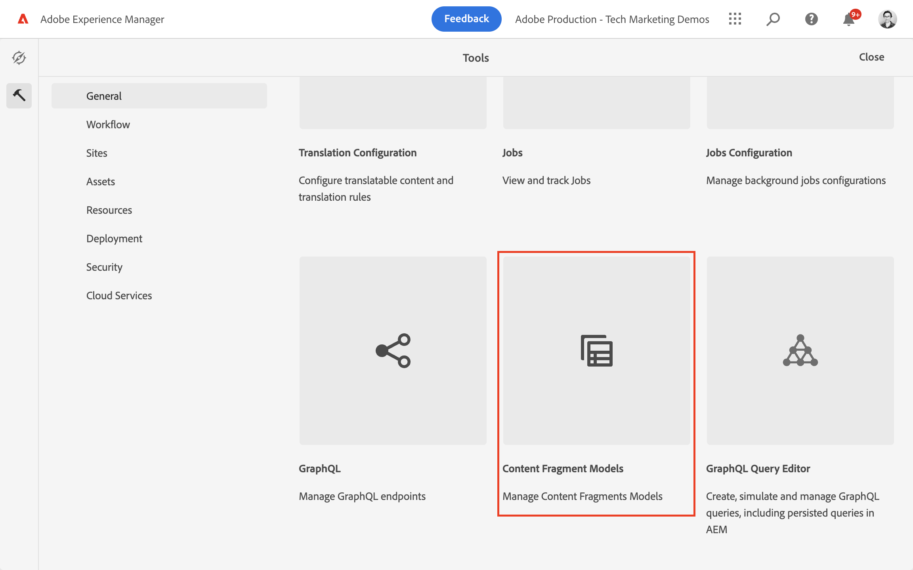
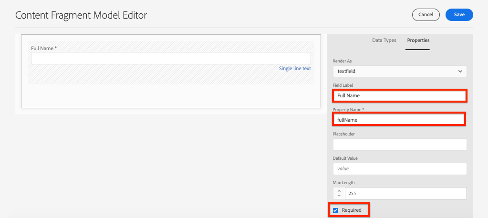
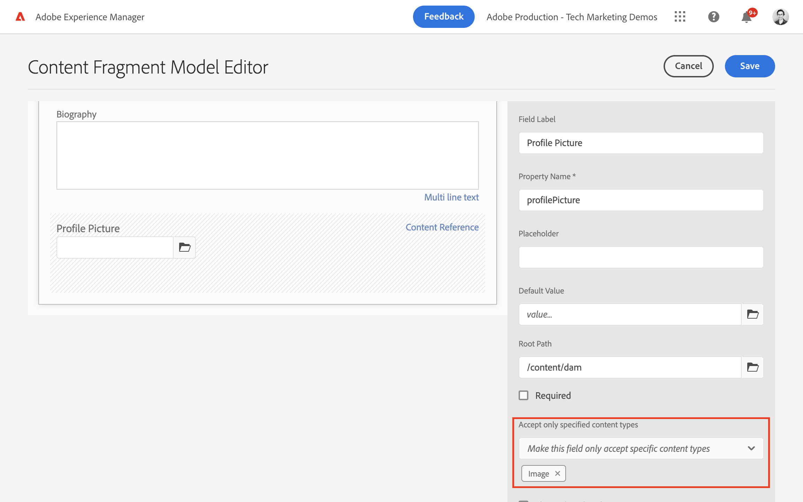

# 定義內容片段模型 {#content-fragment-models}

在本章中，瞭解如何使用&#x200B;**內容片段模型**&#x200B;來建立內容模型並建置結構描述。 您會瞭解可用來將結構描述定義為模型一部分的不同資料型別。

我們建立了兩個簡單模型，**團隊**&#x200B;和&#x200B;**人員**。 **團隊**&#x200B;資料模型具有名稱、簡短名稱和說明，並參考&#x200B;**人員**&#x200B;資料模型，其中包含全名、個人簡歷、個人資料圖片和職業清單。

您也可以按照基本步驟建立自己的模型，並調整相關步驟，例如GraphQL查詢和React應用程式程式碼，或只是按照這些章節中概述的步驟進行。

## 先決條件 {#prerequisites}

此教學課程包含多個部分，並假設有[AEM作者環境可用](./overview.md#prerequisites)。

## 目標 {#objectives}

* 建立內容片段模型。
* 識別建立模型的可用資料型別和驗證選項。
* 瞭解內容片段模型如何定義&#x200B;**資料結構描述以及內容片段的編寫範本**。

## 建立專案設定

專案設定包含與特定專案關聯的所有內容片段模式，並提供組織模式的方法。 至少必須在&#x200B;**之前**&#x200B;建立一個專案，才能建立內容片段模型。

1. 登入AEM **作者**&#x200B;環境（例如`https://author-pYYYY-eXXXX.adobeaemcloud.com/`）
1. 從AEM開始畫面瀏覽至&#x200B;**工具** > **一般** > **設定瀏覽器**。

   
1. 按一下右上角的&#x200B;**建立**
1. 在產生的對話方塊中，輸入：

   * 標題*： **我的專案**
   * 名稱*： **my-project** (偏好使用所有小寫字母並使用連字型大小來分隔單字。 此字串會影響使用者端應用程式執行要求的唯一GraphQL端點。)
   * 檢查&#x200B;**內容片段模型**
   * 檢查&#x200B;**GraphQL持續查詢**

   

## 建立內容片段模型

接下來，為&#x200B;**團隊**&#x200B;和&#x200B;**人員**&#x200B;建立兩個模型。

### 建立人員模型

建立&#x200B;**人員**&#x200B;的模型，此資料模型代表屬於團隊的人員。

1. 從AEM開始畫面，瀏覽至&#x200B;**工具** > **一般** > **內容片段模式**。

   

1. 導覽至&#x200B;**我的專案**&#x200B;資料夾。
1. 點選右上角的&#x200B;**建立**&#x200B;以開啟&#x200B;**建立模型**&#x200B;精靈。
1. 在&#x200B;**模型標題**&#x200B;欄位中，輸入&#x200B;**人員**&#x200B;並點選&#x200B;**建立**。 在產生的對話方塊中，點選&#x200B;**開啟**&#x200B;以建立模型。

1. 將&#x200B;**單行文字**&#x200B;元素拖放到主面板。 在&#x200B;**屬性**&#x200B;標籤上輸入下列屬性：

   * **欄位標籤**： **完整名稱**
   * **屬性名稱**： `fullName`
   * 檢查&#x200B;**必要**

   

   **屬性名稱**&#x200B;定義儲存到AEM的屬性名稱。 **屬性名稱**&#x200B;也會將此屬性的&#x200B;**機碼**&#x200B;名稱定義為資料結構描述的一部分。 透過GraphQL API公開內容片段資料時，會使用此&#x200B;**索引鍵**。

1. 點選&#x200B;**資料型別**&#x200B;索引標籤，並將&#x200B;**多行文字**&#x200B;欄位拖放到&#x200B;**全名**&#x200B;欄位下方。 輸入下列屬性：

   * **欄位標籤**： **傳記**
   * **屬性名稱**： `biographyText`
   * **預設型別**： **RTF格式**

1. 按一下&#x200B;**資料型別**&#x200B;索引標籤，然後拖放&#x200B;**內容參考**&#x200B;欄位。 輸入下列屬性：

   * **欄位標籤**： **個人資料圖片**
   * **屬性名稱**： `profilePicture`
   * **根路徑**： `/content/dam`

   設定&#x200B;**根路徑**&#x200B;時，您可以按一下&#x200B;**資料夾**&#x200B;圖示以開啟強制回應視窗來選取路徑。 這會限製作者用來填入路徑的資料夾。 `/content/dam`是所有AEM Assets （影像、影片、其他內容片段）儲存的根目錄。

1. 將驗證新增至&#x200B;**圖片參考**，以便只有&#x200B;**影像**&#x200B;的內容型別可以用來填入欄位。

   

1. 按一下&#x200B;**資料型別**&#x200B;索引標籤，並將&#x200B;**列舉**&#x200B;資料型別拖放到&#x200B;**圖片參考**&#x200B;欄位下方。 輸入下列屬性：

   * **呈現為**： **核取方塊**
   * **欄位標籤**： **職業**
   * **屬性名稱**： `occupation`

1. 使用&#x200B;**新增選項**&#x200B;按鈕新增多個&#x200B;**選項**。 對&#x200B;**選項標籤**&#x200B;和&#x200B;**選項值**&#x200B;使用相同的值：

   **藝人**，**影響者**，**攝影師**，**旅行者**，**作者**，**YouTuber**

1. 最後的&#x200B;**人員**&#x200B;模型應如下所示：

   

1. 按一下[儲存]儲存變更。****

### 建立團隊模型

建立&#x200B;**團隊**&#x200B;的模型，這是人員團隊的資料模型。 「專案團隊」模型會參考「人員」模型來代表專案團隊成員。

1. 在&#x200B;**我的專案**&#x200B;資料夾中，點選右上角的&#x200B;**建立**&#x200B;以開啟&#x200B;**建立模型**&#x200B;精靈。
1. 在&#x200B;**模型標題**&#x200B;欄位中，輸入&#x200B;**團隊**&#x200B;並點選&#x200B;**建立**。

   在產生的對話方塊中點選「**開啟**」，以開啟新建立的模型。

1. 將&#x200B;**單行文字**&#x200B;元素拖放到主面板。 在&#x200B;**屬性**&#x200B;標籤上輸入下列屬性：

   * **欄位標籤**： **標題**
   * **屬性名稱**： `title`
   * 檢查&#x200B;**必要**

1. 點選「**資料型別**」標籤，並將&#x200B;**單行文字**&#x200B;元素拖放至主面板。 在&#x200B;**屬性**&#x200B;標籤上輸入下列屬性：

   * **欄位標籤**： **簡短名稱**
   * **屬性名稱**： `shortName`
   * 檢查&#x200B;**必要**
   * 檢查&#x200B;**唯一**
   * 在&#x200B;**驗證型別** >選擇&#x200B;**自訂**&#x200B;下
   * 在底下，**自訂驗證規則運算式** >輸入`^[a-z0-9\-_]{5,40}$` — 這可確保只能輸入小寫字母數字值和5到40個字元的破折號。

   `shortName`屬性可讓我們根據縮短的路徑來查詢個別團隊。 **Unique**&#x200B;設定可確保此模型中每個內容片段的值永遠都是唯一的。

1. 點選&#x200B;**資料型別**&#x200B;索引標籤，並將&#x200B;**多行文字**&#x200B;欄位拖放到&#x200B;**簡短名稱**&#x200B;欄位下方。 輸入下列屬性：

   * **欄位標籤**： **描述**
   * **屬性名稱**： `description`
   * **預設型別**： **RTF格式**

1. 按一下&#x200B;**資料型別**&#x200B;索引標籤，然後拖放&#x200B;**片段參考**&#x200B;欄位。 輸入下列屬性：

   * **呈現為**： **多個欄位**
   * **欄位標籤**： **團隊成員**
   * **屬性名稱**： `teamMembers`
   * **允許的內容片段模型**：使用資料夾圖示來選取&#x200B;**Person**&#x200B;模型。

1. 最終的&#x200B;**團隊**&#x200B;模型應如下所示：

   

1. 按一下[儲存]儲存變更。****

1. 您現在應該可以從以下兩種模式運作：

   

## Publish專案設定和內容片段模型

檢閱和驗證後，發佈`Project Configuration`和`Content Fragment Model`

1. 從AEM開始畫面瀏覽至&#x200B;**工具** > **一般** > **設定瀏覽器**。

1. 點選「**我的專案**」旁的核取方塊，然後點選「**Publish**」

   

1. 從AEM開始畫面，瀏覽至&#x200B;**工具** > **一般** > **內容片段模式**。

1. 導覽至&#x200B;**我的專案**&#x200B;資料夾。

1. 點選&#x200B;**人員**&#x200B;和&#x200B;**團隊**&#x200B;模型，然後點選&#x200B;**Publish**

   

## 恭喜！ {#congratulations}

恭喜，您剛才已建立第一個內容片段模型！

## 後續步驟 {#next-steps}

在下一章[編寫內容片段模型](author-content-fragments.md)中，您將根據內容片段模型建立和編輯新的內容片段。 您也會瞭解如何建立內容片段的變體。

## 相關檔案

* [內容片段模型](https://experienceleague.adobe.com/docs/experience-manager-cloud-service/content/assets/content-fragments/content-fragments-models.html)

