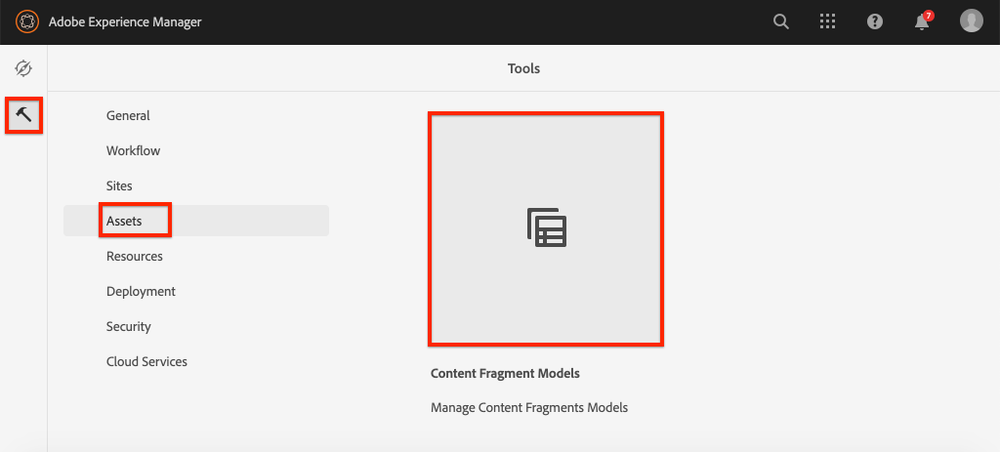

# Defining Content Fragment Models {#content-fragment-models}

在本章中，了解如何建立內容模型，以及使用 **內容片段模型**. 將審閱現有模型並建立新模型。 您也將了解可用來定義模型中結構的不同資料類型。

在本章中，您將為 **貢獻者**，此資料模型適用於製作雜誌和冒險內容，作為WKND品牌一部分的使用者。

## 必備條件 {#prerequisites}

此為多部分教學課程，假設要執行 [快速設定](../quick-setup/local-sdk.md) 已完成。

## 目標 {#objectives}

* 建立新的內容片段模型。
* 識別可用的資料類型和建立模型的驗證選項。
* 了解內容片段模型如何定義 **both** 內容片段的資料結構和製作範本。

## 內容片段模型概觀 {#overview}

>[!VIDEO](https://video.tv.adobe.com/v/22452/?quality=12&learn=on)

上述影片提供使用內容片段模型的概觀。

>[!CAUTION]
>
> 上述影片顯示 **貢獻者** 名稱為的模型 `Contributors`. 在您自己的環境中執行步驟時，請確定標題使用單一形式： `Contributor` 沒有 **s**. The naming of the Content Fragment Model drives the GraphQL API calls that will be performed later in the tutorial.

## Inspect冒險內容片段模型

在前一章中，數個歷險內容片段經過編輯，並顯示在外部應用程式上。 讓我們檢查探險內容片段模型，了解這些片段的基礎資料結構。

1. 從 **AEM開始** 功能表導覽至 **工具** > **資產** > **內容片段模型**.

   

1. 導覽至 **WKND站點** 資料夾和暫留在 **冒險** 內容片段模型，然後按一下 **編輯** 表徵圖（鉛筆）開啟模型。

   

1. 這會開啟 **內容片段模型編輯器**. 請注意，欄位定義探險模型包含不同 **資料類型** like **單行文字**, **多行文本**, **枚舉**，和 **內容參考**.

1. 編輯器的右側欄列出可用 **資料類型** 定義用於編寫內容片段的表單欄位。

1. Select the **Title** field in the main panel. 在右側欄中，按一下 **屬性** 標籤：

   

   觀察 **屬性名稱** 欄位設為 `adventureTitle`. 這會定義持續存在AEM的屬性名稱。 此 **屬性名稱** 也會定義 **key** 資料架構中此屬性的名稱。 This **key** will be used when the Content Fragment data is exposed via GraphQL APIs.

   >[!CAUTION]
   >
   > 修改 **屬性名稱** 欄位 **after** 內容片段衍生自模型，具有下游效果。 現有片段中的欄位值將不再被參考，GraphQL公開的資料架構將會變更，影響現有應用程式。

1. 向下捲動 **屬性** 標籤並檢視 **驗證類型** 下拉式清單。

   

   可用的現成表單驗證 **電子郵件** 和 **URL**. 您也可以定義 **自訂** 使用規則運算式進行驗證。

1. 按一下 **取消** 來關閉內容片段模型編輯器。

## Create a Contributor Model

接下來，為 **貢獻者**，此資料模型適用於製作雜誌和冒險內容，作為WKND品牌一部分的使用者。

1. 按一下 **建立** 在右上角 **建立模型** 嚮導。
1. 針對 **模型標題** 輸入： **貢獻者** 按一下 **建立**

   

   按一下 **開啟** 開啟新建立的模型。

1. 拖放 **單行文字** 元素。 Enter the following properties on the **Properties** tab:

   * **Field Label**: **Full Name**
   * **屬性名稱**: `fullName`
   * 檢查 **必填**

   

1. 按一下 **資料類型** 標籤並拖放 **多行文本** 欄位 **完整名稱** 欄位。 輸入以下屬性：

   * **欄位標籤**: **傳記**
   * **屬性名稱**: `biographyText`
   * **預設類型**: **RTF**

1. 按一下 **資料類型** 標籤並拖放 **內容參考** 欄位。 輸入以下屬性：

   * **欄位標籤**: **圖片參考**
   * **屬性名稱**: `pictureReference`
   * **根路徑**: `/content/dam/wknd`

   設定 **根路徑** 您可以按一下 **資料夾** 圖示來開啟強制回應視窗以選取路徑。 這將限製作者可用來填入路徑的資料夾。

   

1. 新增驗證至 **圖片參考** 這樣，只有內容類型 **影像** 可用來填入欄位。

   

1. Click the **Data Types** tab and drag and drop an **Enumeration**  data type beneath the **Picture Reference** field. 輸入以下屬性：

   * **欄位標籤**: **職業**
   * **屬性名稱**: `occupation`

1. 新增數個 **選項** 使用 **新增選項** 按鈕。 請對 **選項標籤** 和 **選項值**:

   **藝術家**, **影響者**, **攝影師**, **旅行者**, **作者**, **YouTube**

   

1. 最後 **貢獻者** 模型應如下所示：

   

1. 按一下 **儲存** 以儲存變更。

## 啟用貢獻者模型

內容片段模型必須 **已啟用** 讓內容作者使用。 可以 **停用** 內容片段模型，因此作者無法使用。 請記得修改 **屬性名稱** 模型中欄位的變更基礎資料結構，且對現有片段和外部應用程式可產生顯著的下游影響。 建議您謹慎規劃用於 **屬性名稱** 欄位，然後為使用者啟用內容片段模型。

1. 確保 **貢獻者** 模型目前位於 **已啟用** 狀態。

   

   您可以將游標移至卡片上並按一下 **停用** / **啟用** 表徵圖。

## 恭喜！ {#congratulations}

恭喜，您剛剛建立了第一個內容片段模型！

## 後續步驟 {#next-steps}

In the next chapter, [Authoring Content Fragment Models](author-content-fragments.md), you will create and edit a new Content Fragment based on a Content Fragment Model. 您也會學習如何建立內容片段的變體。
