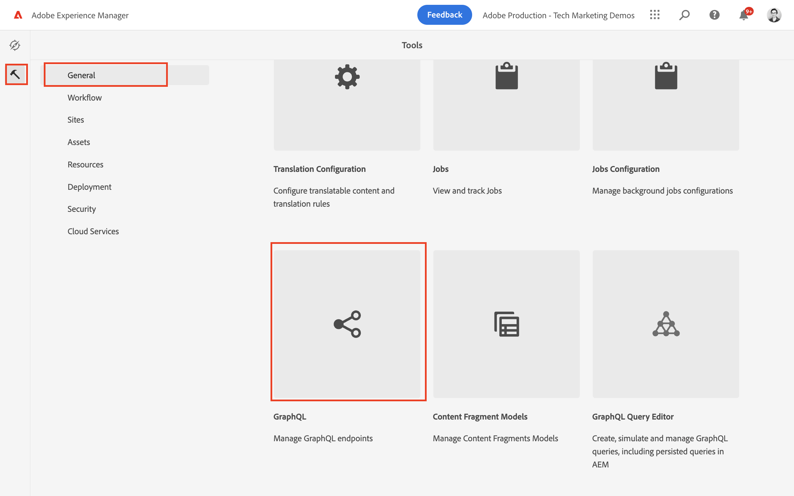
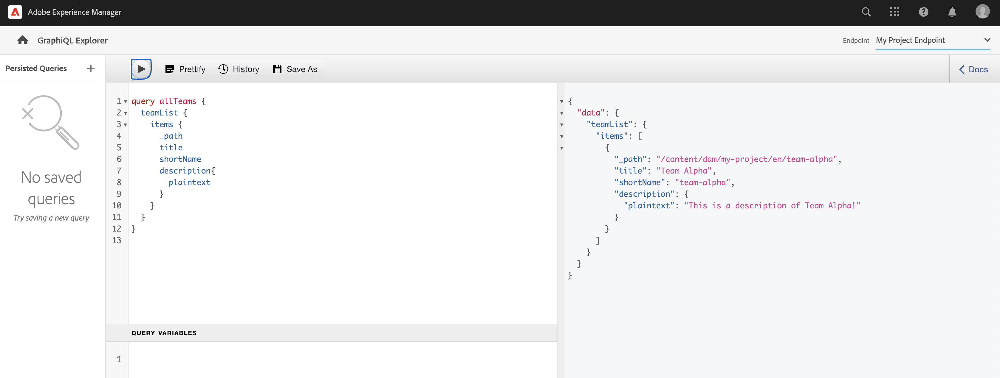

# 了解GraphQL API {#explore-graphql-apis}

AEM的GraphQL API提供強大的查詢語言，可將內容片段的資料公開給下游應用程式。 內容片段模型會定義內容片段所使用的資料結構。 每當建立或更新內容片段模型時，架構就會轉譯並新增至組成GraphQL API的「圖表」中。

在本章中，我們將探索一些常見的GraphQL查詢，以使用名為的IDE收集內容 [GraphiQL](https://github.com/graphql/graphiql). GraphiQL IDE允許您快速測試和調整返回的查詢和資料。 GraphiQL還可輕鬆存取說明檔案，讓您輕鬆了解和了解可用的方法。

## 必備條件 {#prerequisites}

此為多部分教學課程，假設要執行 [製作內容片段](./author-content-fragments.md) 已完成。

## 目標 {#objectives}

* 了解如何使用GraphiQL工具，使用GraphQL語法來建構查詢。
* 了解如何查詢內容片段和單一內容片段清單。
* 了解如何篩選及要求特定資料屬性。
* 了解如何加入多個內容片段模型的查詢
* 了解如何保留GraphQL查詢。

## 啟用GraphQL端點 {#enable-graphql-endpoint}

需要配置GraphQL端點，以啟用內容片段的GraphQL API查詢。

1. 從AEM開始畫面導覽至 **工具** > **一般** > **GraphQL**.

   

1. 點選 **建立** 在右上角。 在對話方塊中輸入下列值：

   * 名稱*: **我的專案端點**.
   * 使用…… *提供的GraphQL架構： **我的專案**

   

   點選 **建立** 來儲存端點。

   根據項目配置建立的GraphQL端點將僅對屬於該項目的模型啟用查詢。 在此案例中， **人員** 和 **團隊** 可使用模型。

   >[!NOTE]
   >
   > 也可以建立全局端點，以啟用對多個配置中的模型的查詢。 這項操作應謹慎使用，因為它可能會使環境暴露於其他安全漏洞，並增加管理AEM的整體複雜性。

1. 您現在應該會看到環境中已啟用一個GraphQL端點。

   

## 使用GraphiQL IDE

此 [GraphiQL工具](https://experienceleague.adobe.com/docs/experience-manager-cloud-service/content/headless/graphql-api/graphiql-ide.html) 可讓開發人員針對目前AEM環境中的內容建立和測試查詢。 GraphiQL工具還使用戶能夠 **保留** 或保存要由客戶端應用程式在生產設定中使用的查詢。

接下來，使用內建的GraphiQL IDE，探索AEM GraphQL API的強大功能。

1. 從AEM開始畫面導覽至 **工具** > **一般** > **GraphQL查詢編輯器**.

   

   >[!NOTE]
   >
   > 對於較舊的AEM版本，可能不內置GraphiQL IDE。 可依照下列步驟手動安裝 [說明](#install-graphiql).

1. 在右上角確定 **端點** 設為 **我的專案端點**.

   

這會將所有查詢範圍限定為 **我的專案** 專案。

### 查詢內容片段清單 {#query-list-cf}

常見的需求是查詢多個內容片段。

1. 將下列查詢貼入主面板（取代註解清單）:

   ```graphql
   query allTeams {
     teamList {
       items {
         _path
         title
       }
     }
   } 
   ```

1. 按下 **播放** 按鈕，執行查詢。 您應該會看到上一章內容片段的結果：

   

1. 將游標置於 `title` 文字並輸入 **CTRL+空格鍵** 觸發程式碼提示。 新增 `shortname` 和 `description` 的URL。

   

1. 按 **播放** 按鈕，您應該會看到結果包含 `shortname` 和 `description`.

   

   此 `shortname` 是簡單的屬性， `description` 是多行文本欄位，而GraphQL API允許我們為結果選擇多種格式，例如 `html`, `markdown`, `json` 或 `plaintext`.

### 查詢巢狀片段

接下來，查詢實驗是擷取巢狀片段，並回想 **團隊** 模型參考 **人員** 模型。

1. 更新查詢以包括 `teamMembers` 屬性。 回想一下，這是 **片段參考** 欄位至人員模型。 可以返回人員模型的屬性：

   ```graphql
   query allTeams {
       teamList {
           items {
               _path
               title
               shortName
               description {
                   plaintext
               }
               teamMembers {
                   fullName
                   occupation
               }
           }
       }
   }
   ```

   JSON回應：

   ```json
   {
       "data": {
           "teamList": {
           "items": [
               {
               "_path": "/content/dam/my-project/en/team-alpha",
               "title": "Team Alpha",
               "shortName": "team-alpha",
               "description": {
                   "plaintext": "This is a description of Team Alpha!"
               },
               "teamMembers": [
                   {
                   "fullName": "John Doe",
                   "occupation": [
                       "Artist",
                       "Influencer"
                   ]
                   },
                   {
                   "fullName": "Alison Smith",
                   "occupation": [
                       "Photographer"
                   ]
                   }
                 ]
           }
           ]
           }
       }
   }
   ```

   AEM GraphQL API提供強大的功能，可針對巢狀片段進行查詢。 在這個簡單示例中，嵌套只深於兩個層。 然而，它可能會進一步巢狀內嵌片段。 例如，如果 **地址** 與 **人員** 可以在單一查詢中傳回所有三個模型的資料。

### 篩選內容片段清單 {#filter-list-cf}

接下來，我們將探討如何根據屬性值將結果篩選為內容片段的子集。

1. 在GraphiQL UI中輸入以下查詢：

   ```graphql
   query personByName($name:String!){
     personList(
       filter:{
         fullName:{
           _expressions:[{
             value:$name
             _operator:EQUALS
           }]
         }
       }
     ){
       items{
         _path
         fullName
         occupation
       }
     }
   }  
   ```

   上述查詢會對系統中的所有人員片段執行搜尋。 新增的篩選器至查詢開頭，將對 `name` 欄位和變數字串 `$name`.

1. 在 **查詢變數** 面板輸入下列內容：

   ```json
   {"name": "John Doe"}
   ```

1. 執行查詢，應僅 **人員** 傳回的值為「John Doe」。

   

   篩選和建立複雜查詢有許多其他選項，請參閱 [學習如何搭配AEM使用GraphQL — 範例內容與查詢](https://experienceleague.adobe.com/docs/experience-manager-cloud-service/assets/admin/content-fragments-graphql-samples.html).

1. 增強上述查詢以擷取設定檔圖片

   ```graphql
   query personByName($name:String!){
     personList(
       filter:{
         fullName:{
           _expressions:[{
             value:$name
             _operator:EQUALS
           }]
         }
       }
     ){
       items{  
         _path
         fullName
         occupation
         profilePicture{
           ... on ImageRef{
             _path
             _authorUrl
             _publishUrl
             height
             width
   
           }
         }
       }
     }
   } 
   ```

   此 `profilePicture` 是內容參考，且預期為影像，因此內建 `ImageRef` 物件。 這可讓我們要求有關要參考之影像的其他資料，例如 `width` 和 `height`.

### 查詢單一內容片段 {#query-single-cf}

您也可以直接查詢單一內容片段。 AEM中的內容以分層方式儲存，而片段的唯一識別碼基於片段的路徑。

1. 在GraphiQL編輯器中輸入以下查詢：

   ```graphql
   query personByPath($path: String!) {
       personByPath(_path: $path) {
           item {
           fullName
           occupation
           }
       }
   }
   ```

1. 為 **查詢變數**:

   ```json
   {"path": "/content/dam/my-project/en/alison-smith"}
   ```

1. 執行查詢，並觀察是否傳回單一結果。

## 保留查詢 {#persist-queries}

一旦開發人員對查詢和傳回的資料感到滿意，下一步就是儲存或保留查詢至AEM。 [持續查詢](https://experienceleague.adobe.com/docs/experience-manager-cloud-service/content/headless/graphql-api/persisted-queries.html) 是向用戶端應用程式公開GraphQL API的偏好機制。 在保存查詢後，就可以使用GET請求來請求查詢，並在Dispatcher和CDN層快取查詢。 持續查詢的效能要好得多。 除了效能優勢外，持續查詢可確保不會意外向客戶端應用程式洩露額外資料。 有關的更多詳細資訊 [可在此處找到保留的查詢](https://experienceleague.adobe.com/docs/experience-manager-cloud-service/content/headless/graphql-api/persisted-queries.html).

接下來，保留兩個簡單查詢，它們用於下一章。

1. 在GraphiQL IDE中，輸入以下查詢：

   ```graphql
   query allTeams {
       teamList {
           items {
               _path
               title
               shortName
               description {
                   plaintext
               }
               teamMembers {
                   fullName
                   occupation
               }
           }
       }
   }
   ```

   驗證查詢是否有效。

1. 下一點 **另存新檔** 輸入 `all-teams` 作為 **查詢名稱**.

   查詢現在應顯示於 **持續查詢** 在左側邊欄。

   
1. 下一步點選省略符號 **...** 並點選「 」 **複製URL** 將路徑複製到剪貼簿。

   

1. 開啟新索引標籤，並將複製的路徑貼到您的瀏覽器中：

   ```plain
   https://$YOUR-AEMasCS-INSTANCEID$.adobeaemcloud.com/graphql/execute.json/my-project/all-teams
   ```

   看起來應類似於上述路徑。 您應該會看到傳回的查詢JSON結果。

   劃分URL:

   | 名稱 | 說明 |
   | ---------|---------- |
   | `/graphql/execute.json` | 永久查詢端點 |
   | `/my-project` | 項目配置 `/conf/my-project` |
   | `/all-teams` | 權限查詢的名稱 |

1. 返回GraphiQL IDE並使用加號按鈕 **+** 要刪除NEW查詢

   ```graphql
   query personByName($name: String!) {
     personList(
       filter: {
         fullName:{
           _expressions: [{
             value: $name
             _operator:EQUALS
           }]
         }
       }){
       items {
         _path
         fullName
         occupation
         biographyText {
           json
         }
         profilePicture {
           ... on ImageRef {
             _path
             _authorUrl
             _publishUrl
             width
             height
           }
         }
       }
     }
   }
   ```

1. 將查詢另存為： **個人姓名**.
1. 應保存2個持續查詢：

   


## 發佈GraphQL端點和持續查詢

審核後，發佈 `GraphQL Endpoint` &amp; `Persisted Queries`

1. 從AEM開始畫面導覽至 **工具** > **一般** > **GraphQL**.

1. 點選旁邊的核取方塊 **我的專案端點** 點選 **發佈**

   

1. 從AEM開始畫面導覽至 **工具** > **一般** > **GraphQL查詢編輯器**

1. 點選 *所有團隊* 從「保存的查詢」面板，然後點選 **發佈**

   

1. 對 `person-by-name` 查詢

## 解決方案檔案 {#solution-files}

下載在前三個章節中建立的內容、模型及持續查詢： [tutorial-solution-content-zip](assets/explore-graphql-api/tutorial-solution-content.zip)

## 其他資源

如需更多GraphQL查詢的範例，請參閱： [學習如何搭配AEM使用GraphQL — 範例內容與查詢](https://experienceleague.adobe.com/docs/experience-manager-cloud-service/assets/admin/content-fragments-graphql-samples.html).

## 恭喜！ {#congratulations}

恭喜，您剛剛建立並執行了多個GraphQL查詢！

## 後續步驟 {#next-steps}

在下一章中， [建置React應用程式](./graphql-and-react-app.md)，您將探索外部應用程式如何查詢AEM GraphQL端點，並運用這兩個持續的查詢。 您也將了解一些基本的錯誤處理。

## 安裝GraphiQL工具（可選） {#install-graphiql}

對於某些版本的AEM，需要手動安裝GraphiQL IDE工具。 請依照下列指示手動安裝：

1. 導覽至 **[Software Distribution入口網站](https://experience.adobe.com/#/downloads/content/software-distribution/en/aemcloud.html)** > **AEMas a Cloud Service**.
1. 搜尋「GraphiQL」(請務必包含 **i** in **GraphiQL**.
1. 下載最新 **GraphiQL內容包v.x.x.x**

   

   zip檔案是可直接安裝的AEM套件。

1. 從 **AEM開始** 功能表導覽至 **工具** > **部署** > **套件**.
1. 按一下 **上傳套件** 並選擇在上一步下載的包。 按一下 **安裝** 安裝套件。

   
