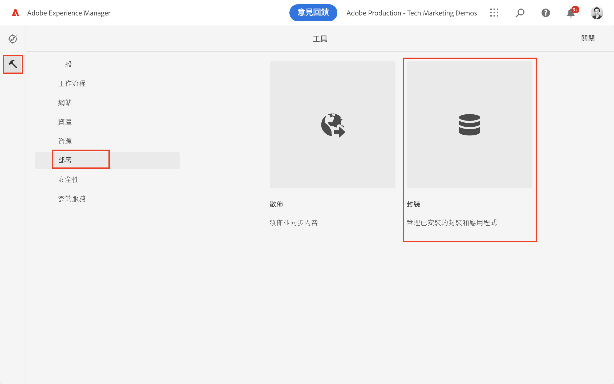
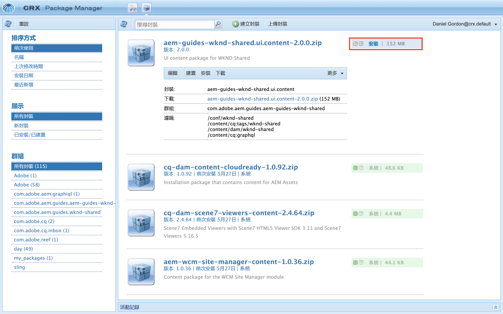

# 無頭入門AEM- GraphQL

一個端到端教程，演示如何在無頭CMS方案中使用AEMGraphQL API構建和公開內容，並由外部應用使用。

本教程探AEM討如何使用GraphQL API和無頭功能來為在外部應用中呈現的體驗提供動力。

本教程將介紹以下主題：

* 新建項目配置
* 建立新內容片段模型以對資料建模
* 根據先前製作的模型建立新內容片段。
* 瞭解如何使用整合AEM的GraphiQL開發工具查詢中的內容片段。
* 將GraphQL查詢儲存或保留到
* 從示例React應用中使用永續GraphQL查詢

## 必備條件 {#prerequisites}

以下內容需要學習本教程：

* 基本HTML和JavaScript技能
* 必須本地安裝以下工具：
   * [Node.js v10+](https://nodejs.org/en/)
   * [npm 6+](https://www.npmjs.com/)
   * [蠢貨](https://git-scm.com/)
   * IDE(例如， [Microsoft® Visual Studio代碼](https://code.visualstudio.com/))

### 環AEM境

完成本教程需要Adobe Experience Manager環境。 可以使用下列任一項(螢幕截圖從as a Cloud Service環境AEM中記錄):

* AEMas a Cloud Service環境：
   * [訪問AEMas a Cloud Service和雲管理器](/help/cloud-service/accessing/overview.md)
      * **管AEM理員** 訪問AEMas a Cloud Service
      * **雲管理器 — 開發人員** 訪問雲管理器
* [本地AEMas a Cloud Service快速啟動SDK](/help/cloud-service/local-development-environment/aem-runtime.md)。
* [AEM6.5.13](https://experienceleague.adobe.com/docs/experience-manager-65/release-notes/release-notes.html)

### 安裝示例內容 {#install-sample-content}

在環境中已提供樣本內容AEM作為參考會很有幫助。

1. 導航到 [WKND共AEM享項目](https://github.com/adobe/aem-guides-wknd-shared/releases)。
1. 下載最新發佈的資產： `aem-guides-wknd-shared.ui.content-x.x.x.zip`。
1. 登錄到AEM要用於本教程的作者環境。
1. 從開始AEM螢幕，導航到 **工具** > **部署** > **包**:

   
1. 點擊 **上載包** 選擇 `aem-guides-wknd-shared.ui.content-x.x.x.zip` 檔案已先前下載。 點擊 **確定** 上載。
1. 包上載完後，點擊 **安裝** 來安裝內容。

   

1. 將安裝示例內容片段、內容片段模型、影像等，以用於虛擬 [WKND品牌](https://wknd.site/)。 示例內容將在本教程的稍後部分引用。

## 開始吧！

1. 開始教程 [定義內容片段模型](content-fragment-models.md)。

## GitHub項目

原始碼和內容包在 [參考AEM線 — WKND GraphQL GitHub項目](https://github.com/adobe/aem-guides-wknd-graphql)。

如果您發現教程或代碼有問題，請留下 [GitHub問題](https://github.com/adobe/aem-guides-wknd-graphql/issues)。

在中可找到示例內容片段、模型和查詢 [WKND共AEM享項目](https://github.com/adobe/aem-guides-wknd-shared)
