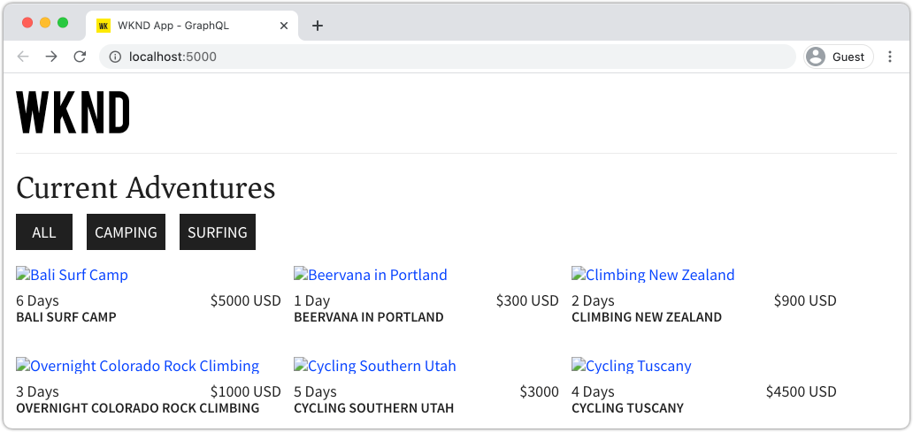

# 使用AEM Publish服務進行生產部署

在本教學課程中，您將設定本機環境，以模擬從製作例項發佈到發佈例項的內容。 您也會使用GraphQL API從AEM發佈環境中產生React應用程式的生產組建，並設定為使用內容。 在過程中，您將學習如何有效使用環境變數，以及如何更新AEM CORS設定。

## 必備條件

本教學課程是多部分教學課程的一部分。 假定已完成前幾部分中概述的步驟。

## 目標

了解如何：

* 了解AEM製作和發佈架構。
* 了解管理環境變數的最佳實務。
* 了解如何正確設定AEM以進行跨原始資源共用(CORS)。

## 製作發佈部署模式{#deployment-pattern}

完整的AEM環境由製作、發佈和Dispatcher組成。 內部使用者可在「作者」服務建立、管理和預覽內容。 發佈服務會視為「即時」環境，且通常是使用者與之互動的環境。 內容在Author服務上經過編輯和核准後，會分發至Publish服務。

AEM無頭式應用程式最常見的部署模式是讓生產版本的應用程式連線至AEM發佈服務。


上圖描述了此通用部署模式。

1. **內容作者**&#x200B;使用AEM作者服務來建立、編輯及管理內容。
2. **內容作者**&#x200B;和其他內部使用者可直接在作者服務上預覽內容。 可設定應用程式的預覽版本，以連線至製作服務。
3. 內容一經核准後，即可&#x200B;**已發佈**&#x200B;至AEM Publish服務。
4. **最終** 用戶與應用程式的生產版本交互。生產應用程式會連線至發佈服務，並使用GraphQL API來請求和使用內容。

本教學課程會將AEM Publish例項新增至目前的設定，以模擬上述部署。 在舊版章節中， React應用程式會直接連線至Author例項，以作為預覽。 React應用程式的生產組建會部署至連接至新發佈執行個體的靜態Node.js伺服器。

最後，將運行三台本地伺服器：

* http://localhost:4502 — 製作例項
* http://localhost:4503 — 發佈例項
* http://localhost:5000 — 在生產模式中連線至發佈執行個體的React App 。

## 安裝AEM SDK — 發佈模式{#aem-sdk-publish}

目前我們有執行中的SDK例項，位於&#x200B;**Author**&#x200B;模式。 SDK也可以在&#x200B;**Publish**&#x200B;模式中啟動，以模擬AEM Publish環境。

若需設定本機開發環境[的更詳細指南，請前往](https://experienceleague.adobe.com/docs/experience-manager-learn/cloud-service/local-development-environment-set-up/overview.html?lang=en#local-development-environment-set-up)。

1. 在您的本機檔案系統上，建立專用資料夾以安裝Publish執行個體，即`~/aem-sdk/publish`。
1. 複製前幾章中用於製作執行個體的Quickstart jar檔案，並貼到`publish`目錄中。 或者，導覽至[軟體發佈入口網站](https://experience.adobe.com/#/downloads/content/software-distribution/en/aemcloud.html)並下載最新SDK並解壓Quickstart jar檔案。
1. 將jar檔案更名為`aem-publish-p4503.jar`。

   `publish`字串指定Quickstart Jar以「發佈」模式啟動。 `p4503`指定Quickstart伺服器在埠4503上運行。

1. 開啟新的終端機視窗，並導覽至包含jar檔案的資料夾。 安裝並啟動AEM執行個體：

   ```shell
   $ cd ~/aem-sdk/publish
   $ java -jar aem-publish-p4503.jar
   ```

1. 提供管理員密碼作為`admin`。 任何管理員密碼都是可接受的，但建議將預設密碼用於本機開發，以避免額外的設定。
1. 當AEM執行個體完成安裝時，會在[http://localhost:4503/content.html](http://localhost:4503/content.html)開啟新的瀏覽器視窗

   預計會傳回404找不到頁面。 這是全新的AEM例項，尚未安裝任何內容。

## 安裝示例內容和GraphQL終結點{#wknd-site-content-endpoints}

就像在製作執行個體上一樣，發佈執行個體需要啟用GraphQL端點，且需要範例內容。 接下來，在發佈執行個體上安裝WKND參考網站。

1. 下載WKND站點的最新編譯AEM包：[aem-guides-wknd.all-x.x.x.zip](https://github.com/adobe/aem-guides-wknd/releases/latest)。

   >[!NOTE]
   >
   > 請務必下載與AEM as aCloud Service相容的標準版本，而&#x200B;**不**`classic`版本。

1. 直接導覽至：[http://localhost:4503/libs/granite/core/content/login.html](http://localhost:4503/libs/granite/core/content/login.html)，用戶名`admin`，密碼`admin`。
1. 接下來，導覽至封裝管理器，網址為[http://localhost:4503/crx/packmgr/index.jsp](http://localhost:4503/crx/packmgr/index.jsp)。
1. 按一下「**上傳套件**」 ，然後選擇上一步驟中下載的WKND套件。 按一下&#x200B;**Install**&#x200B;以安裝軟體包。
1. 安裝套件後，WKND參考網站現在可於[http://localhost:4503/content/wknd/us/en.html](http://localhost:4503/content/wknd/us/en.html)取得。
1. 按一下功能表列中的「登出」按鈕，登出為`admin`使用者。

   

   與AEM Author例項不同，AEM Publish例項預設為匿名唯讀存取。 我們希望模擬匿名用戶在運行React應用程式時的體驗。

## 更新環境變數以指向發佈執行個體{#react-app-publish}

接下來，更新React應用程式使用的環境變數，以指向Publish例項。 React應用程式應&#x200B;**only**&#x200B;以生產模式連線至Publish執行個體。

接下來，新增新檔案`.env.production.local`以模擬生產體驗。

1. 在IDE中開啟WKND GraphQL React應用程式。

1. 在`aem-guides-wknd-graphql/react-app`下，添加名為`.env.production.local`的檔案。
1. 將以下內容填入`.env.production.local`:

   ```plain
   REACT_APP_HOST_URI=http://localhost:4503
   REACT_APP_GRAPHQL_ENDPOINT=/content/graphql/global/endpoint.json
   ```

   

   使用環境變數可讓您輕鬆在製作或發佈環境之間切換GraphQL端點，而無須在應用程式程式碼中新增額外的邏輯。 如需React的[自訂環境變數的詳細資訊，請參閱此處](https://create-react-app.dev/docs/adding-custom-environment-variables)。

   >[!NOTE]
   >
   > 請注意，由於「發佈」環境預設會提供匿名內容存取權，因此未包含驗證資訊。

## 部署靜態節點伺服器{#static-server}

React應用程式可透過Webpack伺服器啟動，但僅供開發使用。 接下來，使用[serve](https://github.com/vercel/serve)模擬生產部署，使用Node.js托管React應用程式的生產組建。

1. 開啟新的終端機視窗，並導覽至`aem-guides-wknd-graphql/react-app`目錄

   ```shell
   $ cd aem-guides-wknd-graphql/react-app
   ```

1. 使用以下命令安裝[serve](https://github.com/vercel/serve):

   ```shell
   $ npm install serve --save-dev
   ```

1. 在`react-app/package.json`開啟檔案`package.json`。 添加名為`serve`的指令碼：

   ```diff
    "scripts": {
       "start": "react-scripts start",
       "build": "react-scripts build",
       "test": "react-scripts test",
       "eject": "react-scripts eject",
   +   "serve": "npm run build && serve -s build"
   },
   ```

   `serve`指令碼執行兩個操作。 首先，產生React應用程式的生產組建。 接著， Node.js伺服器會啟動並使用生產組建。

1. 返回到終端，然後輸入命令以啟動靜態伺服器：

   ```shell
   $ npm run serve
   
   ┌────────────────────────────────────────────────────┐
   │                                                    │
   │   Serving!                                         │
   │                                                    │
   │   - Local:            http://localhost:5000        │
   │   - On Your Network:  http://192.168.86.111:5000   │
   │                                                    │
   │   Copied local address to clipboard!               │
   │                                                    │
   └────────────────────────────────────────────────────┘
   ```

1. 開啟新瀏覽器並導覽至[http://localhost:5000/](http://localhost:5000/)。 您應會看到React應用程式正在提供。

   

   請注意，GraphQL查詢在首頁上運作。 Inspect使用您的開發人員工具，提出&#x200B;**XHR**&#x200B;要求。 請注意，GraphQLPOST位於`http://localhost:4503/content/graphql/global/endpoint.json`的Publish執行個體。

   不過，首頁上的所有影像都損毀！

1. 按一下其中一個「冒險詳細資訊」頁面。

   

   請注意，系統為`adventureContributor`擲回GraphQL錯誤。 在下個練習中，已修正損壞的影像和`adventureContributor`問題。

## 絕對影像引用{#absolute-image-references}

影像似乎損毀，因為``標籤時參照`_publishUrl`而非`_path`屬性：

   ```diff
   - 
   + 
   ```

1. 在`react-app/src/components/AdventureDetail.js`開啟檔案`AdventureDetail.js`。
1. 重複相同步驟以修改GraphQL查詢，並為Adventure添加`_publishUrl`屬性

   ```diff
    adventureByPath (_path: "${_path}") {
       item {
           _path
           adventureTitle
           adventureActivity
           adventureType
           adventurePrice
           adventureTripLength
           adventureGroupSize
           adventureDifficulty
           adventurePrice
           adventurePrimaryImage {
               ... on ImageRef {
               _path
   +           _publishUrl
               mimeType
               width
               height
               }
           }
           adventureDescription {
               html
           }
           adventureItinerary {
               html
           }
           adventureContributor {
               fullName
               occupation
               pictureReference {
                   ...on ImageRef {
                       _path
   +                   _publishUrl
                   }
               }
           }
       }
       }
   } 
   ```

1. 修改`AdventureDetail.js`中「探險主影像」和「貢獻者圖片」參考的兩個``標籤：

   ```diff
   /* AdventureDetail.js */
   ...
   
   ...
   pictureReference =  
   ```

1. 返回終端並啟動靜態伺服器：

   ```shell
   $ npm run serve
   ```

1. 導覽至[http://localhost:5000/](http://localhost:5000/)並觀察影像是否出現，以及``屬性是否指向`http://localhost:4503`。

   

## 模擬內容發佈{#content-publish}

回想一下，當請求「探險詳細資訊」頁面時，系統為`adventureContributor`擲回GraphQL錯誤。 **貢獻者**&#x200B;內容片段模型尚未存在於發佈執行個體上。 對&#x200B;**冒險**&#x200B;內容片段模型所做的更新也不適用於發佈執行個體。 這些變更會直接對製作例項進行，且需分發至發佈例項。

對仰賴內容片段或內容片段模型更新的應用程式推出新更新時，請考量這點。

接下來，可模擬本機「製作」和「發佈」例項之間的內容發佈。

1. 啟動Author例項（如果尚未啟動），並導覽至封裝管理器，網址為[http://localhost:4502/crx/packmgr/index.jsp](http://localhost:4502/crx/packmgr/index.jsp)
1. 下載包[EnableReplicationAgent.zip](./assets/publish-deployment/EnableReplicationAgent.zip)，然後使用包管理器進行安裝。

   此套件會安裝組態，讓製作執行個體可將內容發佈至發佈執行個體。 若需[此設定的手動步驟，請前往此處](https://experienceleague.adobe.com/docs/experience-manager-learn/cloud-service/local-development-environment-set-up/aem-runtime.html?lang=en#content-distribution)。

   >[!NOTE]
   >
   > 在AEM as aCloud Service環境中，製作層級會自動設定為將內容發佈至發佈層級。

1. 從&#x200B;**AEM開始**&#x200B;功能表，導覽至&#x200B;**工具** > **資產** > **內容片段模型**。

1. 按一下&#x200B;**WKND Site**&#x200B;資料夾。

1. 選擇所有三個模型，然後按一下&#x200B;**Publish**:

   

   出現確認對話框，按一下&#x200B;**Publish**。

1. 導覽至[http://localhost:4502/editor.html/content/dam/wknd/en/adventures/bali-surf-camp/bali-surf-camp](http://localhost:4502/editor.html/content/dam/wknd/en/adventures/bali-surf-camp/bali-surf-camp)的Bali衝浪訓練營內容片段。

1. 按一下頂端功能表列的&#x200B;**發佈**&#x200B;按鈕。

   

1. 「發佈」精靈會顯示應發佈的任何相依資產。 在此情況下，列出了引用的片段&#x200B;**stacey-roswells**，並且還引用了多個影像。 參照的資產會與片段一併發佈。

   

   再按一下&#x200B;**Publish**&#x200B;按鈕以發佈內容片段和相依資產。

1. 返回[http://localhost:5000/](http://localhost:5000/)執行的React應用程式。 您現在可以按一下巴釐島衝浪營，查看冒險活動的詳細資訊。

1. 切換回[http://localhost:4502/editor.html/content/dam/wknd/en/adventures/bali-surf-camp/bali-surf-camp](http://localhost:4502/editor.html/content/dam/wknd/en/adventures/bali-surf-camp/bali-surf-camp)的AEM Author例項，並更新片段的&#x200B;**Title**。 **儲存並** 關閉片段。然後&#x200B;**publish**&#x200B;片段。
1. 返回[http://localhost:5000/adventure:/content/dam/wknd/en/adventures/bali-surf-camp/bali-surf-camp](http://localhost:5000/adventure:/content/dam/wknd/en/adventures/bali-surf-camp/bali-surf-camp)並觀察已發佈的變更。

   

## 更新COR配置

AEM預設為安全，不允許非AEM Web屬性進行用戶端呼叫。 AEM跨原始資源共用(CORS)設定可允許特定網域對AEM進行呼叫。

接下來，試用AEM Publish例項的CORS設定。

1. 返回使用`npm run serve`命令運行React應用的終端窗口：

   ```shell
   ┌────────────────────────────────────────────────────┐
   │                                                    │
   │   Serving!                                         │
   │                                                    │
   │   - Local:            http://localhost:5000        │
   │   - On Your Network:  http://192.168.86.205:5000   │
   │                                                    │
   │   Copied local address to clipboard!               │
   │                                                    │
   └────────────────────────────────────────────────────┘
   ```

   請注意，已提供兩個URL。 一個使用`localhost`，另一個使用本地網路IP地址。

1. 導覽至以[http://192.168.86.XXX:5000](http://192.168.86.XXX:5000)開頭的地址。 每個本地電腦的地址將稍有不同。 請注意，擷取資料時發生CORS錯誤。 這是因為目前的CORS設定僅允許來自`localhost`的請求。

   

   接下來，更新AEM發佈CORS設定，以允許來自網路IP位址的請求。

1. 導覽至[http://localhost:4503/content/wknd/us/en/errors/sign-in.html](http://localhost:4503/content/wknd/us/en/errors/sign-in.html)並使用使用者名稱`admin`和密碼`admin`登入。

1. 導覽至[http://localhost:4503/system/console/configMgr](http://localhost:4503/system/console/configMgr)，並在`com.adobe.granite.cors.impl.CORSPolicyImpl~wknd-graphql`處找到WKND GraphQL配置。

1. 更新&#x200B;**允許的原始項**&#x200B;欄位以包含網路IP地址：

   

   您也可以包含規則運算式，以允許來自特定子網域的所有請求。 儲存變更。

1. 搜尋&#x200B;**Apache Sling Referrer Filter**&#x200B;並檢閱設定。 還需要&#x200B;**允許空**&#x200B;配置，才能從外部域啟用GraphQL請求。

   

   這些檔案已配置為WKND參考站點的一部分。 您可以透過[ GitHub存放庫](https://github.com/adobe/aem-guides-wknd/tree/master/ui.config/src/main/content/jcr_root/apps/wknd/osgiconfig)檢視完整的OSGi設定集。

   >[!NOTE]
   >
   > OSGi設定在提交至原始碼控制的AEM專案中進行管理。 AEM專案可使用Cloud Manager部署至AEM作為Cloud Service環境。 [AEM專案原型](https://github.com/adobe/aem-project-archetype)可協助產生特定實作的專案。

1. 從[http://192.168.86.XXX:5000](http://192.168.86.XXX:5000)開始返回React應用程式，並觀察應用程式不再擲回CORS錯誤。

   

## 恭喜！ {#congratulations}

恭喜！ 您現在已使用AEM發佈環境模擬完整的生產部署。 您也學會了如何在AEM中使用CORS設定。

## 其他資源

如需內容片段和GraphQL的詳細資訊，請參閱下列資源：

* [使用內容片段搭配GraphQL的無周邊內容傳送](https://experienceleague.adobe.com/docs/experience-manager-cloud-service/assets/content-fragments/content-fragments-graphql.html)
* [AEM GraphQL API以搭配內容片段使用](https://experienceleague.adobe.com/docs/experience-manager-cloud-service/assets/admin/graphql-api-content-fragments.html)
* [權杖式驗證](https://experienceleague.adobe.com/docs/experience-manager-learn/getting-started-with-aem-headless/authentication/overview.html?lang=en#authentication)
* [將程式碼部署至AEM as aCloud Service](https://experienceleague.adobe.com/docs/experience-manager-learn/cloud-service/cloud-manager/devops/deploy-code.html?lang=en#cloud-manager)
