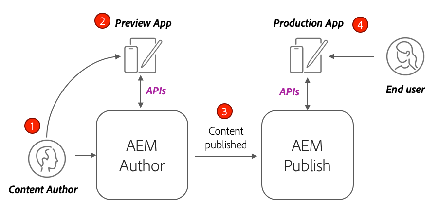

# 生產部署搭配AEM Publish服務

在本教學課程中，您將設定本機環境以模擬從Author例項散發到Publish例項的內容。 您也會產生React應用程式的生產組建，該應用程式已設定為透過GraphQL API使用AEM Publish環境中的內容。 在此過程中，您將瞭解如何有效地使用環境變數以及如何更新AEM CORS設定。

## 先決條件

本教學課程是多部分教學課程的一部分。 假設前幾個部分中概述的步驟已經完成。

## 目標

瞭解如何：

* 瞭解AEM作者和發佈架構。
* 瞭解管理環境變數的最佳實務。
* 瞭解如何正確設定AEM以進行跨原始資源共用(CORS)。

## 作者發佈部署模式 {#deployment-pattern}

完整的 AEM 環境由編寫、發佈和 Dispatcher 組成。編寫服務是內部使用者建立、管理和預覽內容的地方。Publish服務會視為「即時」環境，通常是使用者與之互動的對象。 內容在編寫服務上經編輯和核准後，將傳遞到發佈服務。

AEM Headless 應用程式最常見的部署模式是讓應用程式的生產版本連接到 AEM Publish 服務。



上圖描述了這種常見的部署模式。

1. A **內容作者** 使用AEM作者服務來建立、編輯及管理內容。
2. **內容作者**&#x200B;和其他內部使用者可以直在作者服務預覽內容。可以設定連接到作者服務的應用程式預覽版本。
3. 內容獲得核准後，就可以 **已發佈** 至AEM Publish服務。
4. **一般使用者是與應用程式生產版本互動。**&#x200B;生產應用程式會連線至發佈服務，並使用GraphQL API來請求和使用內容。

本教學課程會將AEM Publish例項新增至目前的設定，以模擬上述部署。 在之前的章節中，React應用程式會直接連線至Author例項，以作為預覽。 React應用程式的生產組建會部署至連線到新發佈執行個體的靜態Node.js伺服器。

最後，有三部本機伺服器在執行中：

* http://localhost:4502 — 作者例項
* http://localhost:4503 — 發佈執行個體
* http://localhost:5000 — 生產模式中的React應用程式，連線至發佈執行個體。

## 安裝AEM SDK — 發佈模式 {#aem-sdk-publish}

我們目前在中有一個SDK執行個體 **作者** 模式。 您也可以在以下位置啟動SDK： **發佈** 模式，以模擬AEM發佈環境。

有關設定本機開發環境的更詳細指南 [可在此處找到](https://experienceleague.adobe.com/docs/experience-manager-learn/cloud-service/local-development-environment-set-up/overview.html?lang=en#local-development-environment-set-up).

1. 在本機檔案系統上，建立專用資料夾以安裝發佈執行個體，即 `~/aem-sdk/publish`.
1. 複製前幾章中用於「作者」執行個體的「快速入門」Jar檔案，並將其貼到 `publish` 目錄。 或者，導覽至 [軟體發佈入口網站](https://experience.adobe.com/#/downloads/content/software-distribution/en/aemcloud.html) 並下載最新SDK以及解壓縮Quickstart jar檔案。
1. 將jar檔案重新命名為 `aem-publish-p4503.jar`.

   此 `publish` string指定Quickstart jar以發佈模式啟動。 此 `p4503` 指定Quickstart伺服器會在連線埠4503上執行。

1. 開啟新的終端機視窗，並瀏覽到包含jar檔案的資料夾。 安裝並啟動AEM執行個體：

   ```shell
   $ cd ~/aem-sdk/publish
   $ java -jar aem-publish-p4503.jar
   ```

1. 提供管理員密碼作為 `admin`. 可接受任何管理員密碼，但建議使用預設的本機開發以避免額外的設定。
1. 當AEM執行個體完成安裝時，會在開啟新的瀏覽器視窗： [http://localhost:4503/content.html](http://localhost:4503/content.html)

   應該會傳回404 「找不到」頁面。 這是全新的AEM例項，尚未安裝任何內容。

## 安裝範例內容和GraphQL端點 {#wknd-site-content-endpoints}

就像在Author例項上一樣，Publish例項需要啟用GraphQL端點，並需要範例內容。 接下來，在發佈執行個體上安裝WKND參考網站。

1. 下載適用於WKND網站的最新編譯的AEM套件： [aem-guides-wknd.all-x.x.x.zip](https://github.com/adobe/aem-guides-wknd/releases/latest).

   >[!NOTE]
   >
   > 請務必下載與AEMas a Cloud Service相容的標準版本，並 **非** 此 `classic` 版本。

1. 直接導覽至以下位置，登入發佈執行個體： [http://localhost:4503/libs/granite/core/content/login.html](http://localhost:4503/libs/granite/core/content/login.html) 使用者名稱 `admin` 和密碼 `admin`.
1. 接下來，瀏覽至「封裝管理員」，位於 [http://localhost:4503/crx/packmgr/index.jsp](http://localhost:4503/crx/packmgr/index.jsp).
1. 按一下 **上傳套裝** 並選擇在先前步驟中下載的WKND套件。 按一下 **安裝** 以安裝套件。
1. 安裝套件後，WKND參考網站現在位於 [http://localhost:4503/content/wknd/us/en.html](http://localhost:4503/content/wknd/us/en.html).
1. 登出為 `admin` 使用者，方法是按一下功能表列中的「登出」按鈕。

   

   與AEM Author例項不同，AEM Publish例項預設為匿名唯讀存取。 我們希望在執行React應用程式時模擬匿名使用者的體驗。

## 更新環境變數以指向發佈執行個體 {#react-app-publish}

接下來，更新React應用程式使用的環境變數，以指向發佈執行個體。 React應用程式應該 **僅限** 連線至生產模式中的發佈執行個體。

接下來，新增檔案 `.env.production.local` 以模擬生產體驗。

1. 在IDE中開啟WKND GraphQL React應用程式。

1. 下 `aem-guides-wknd-graphql/react-app`，新增檔案 `.env.production.local`.
1. 填入 `.env.production.local` ，其功能如下：

   ```plain
   REACT_APP_HOST_URI=http://localhost:4503
   REACT_APP_GRAPHQL_ENDPOINT=/content/graphql/global/endpoint.json
   ```

   

   使用環境變數可讓您輕鬆在製作或發佈環境之間切換GraphQL端點，而不需在應用程式程式碼內新增額外邏輯。 更多關於 [React的自訂環境變數可在此處找到](https://create-react-app.dev/docs/adding-custom-environment-variables).

   >[!NOTE]
   >
   > 請注意，由於發佈環境預設會提供匿名內容存取權，因此不會包含驗證資訊。

## 部署靜態節點伺服器 {#static-server}

React應用程式可使用webpack伺服器啟動，但這僅適用於開發。 接下來，使用來模擬生產部署 [服務](https://github.com/vercel/serve) 使用Node.js主控React應用程式的生產組建。

1. 開啟新的終端機視窗並導覽至 `aem-guides-wknd-graphql/react-app` 目錄

   ```shell
   $ cd aem-guides-wknd-graphql/react-app
   ```

1. 安裝 [服務](https://github.com/vercel/serve) 使用下列指令：

   ```shell
   $ npm install serve --save-dev
   ```

1. 開啟檔案 `package.json` 在 `react-app/package.json`. 新增名為的指令碼 `serve`：

   ```diff
    "scripts": {
       "start": "react-scripts start",
       "build": "react-scripts build",
       "test": "react-scripts test",
       "eject": "react-scripts eject",
   +   "serve": "npm run build && serve -s build"
   },
   ```

   此 `serve` 指令碼會執行兩個動作。 首先，產生React應用程式的生產組建。 接著，Node.js伺服器啟動並使用生產組建。

1. 返回終端機並輸入啟動靜態伺服器的命令：

   ```shell
   $ npm run serve
   
   ┌────────────────────────────────────────────────────┐
   │                                                    │
   │   Serving!                                         │
   │                                                    │
   │   - Local:            http://localhost:5000        │
   │   - On Your Network:  http://192.168.86.111:5000   │
   │                                                    │
   │   Copied local address to clipboard!               │
   │                                                    │
   └────────────────────────────────────────────────────┘
   ```

1. 開啟新瀏覽器並導覽至 [http://localhost:5000/](http://localhost:5000/). 您應該會看到系統提供React應用程式。

   

   請注意，首頁上正在進行GraphQL查詢。 Inspect **XHR** 使用您的開發人員工具請求。 請注意，GraphQLPOST會前往位於的發佈執行個體 `http://localhost:4503/content/graphql/global/endpoint.json`.

   不過，首頁上的所有影像都會損毀！

1. 按一下進入其中一個Adventure Detail頁面。

   

   觀察系統擲回GraphQL錯誤 `adventureContributor`. 在下個練習中，中斷的影像和 `adventureContributor` 問題已修正。

## 絕對影像參照 {#absolute-image-references}

影像似乎已損毀，因為 `` 標籤：

   ```diff
   - 
   + 
   ```

1. 開啟檔案 `AdventureDetail.js` 在 `react-app/src/components/AdventureDetail.js`.
1. 重複相同的步驟以修改GraphQL查詢並新增 `_publishUrl` 探險用屬性

   ```diff
    adventureByPath (_path: "${_path}") {
       item {
           _path
           adventureTitle
           adventureActivity
           adventureType
           adventurePrice
           adventureTripLength
           adventureGroupSize
           adventureDifficulty
           adventurePrice
           adventurePrimaryImage {
               ... on ImageRef {
               _path
   +           _publishUrl
               mimeType
               width
               height
               }
           }
           adventureDescription {
               html
           }
           adventureItinerary {
               html
           }
           adventureContributor {
               fullName
               occupation
               pictureReference {
                   ...on ImageRef {
                       _path
   +                   _publishUrl
                   }
               }
           }
       }
       }
   } 
   ```

1. 修改兩者 `` 中的冒險主要影像和投稿人圖片參考的標籤 `AdventureDetail.js`：

   ```diff
   /* AdventureDetail.js */
   ...
   
   ...
   pictureReference =  
   ```

1. 返回終端機並啟動靜態伺服器：

   ```shell
   $ npm run serve
   ```

1. 瀏覽至 [http://localhost:5000/](http://localhost:5000/) 並觀察影像是否出現，以及 `` 屬性指向 `http://localhost:4503`.

   

## 模擬內容發佈 {#content-publish}

回想一下，擲回GraphQL錯誤 `adventureContributor` 何時請求「冒險詳細資訊」頁面。 此 **投稿人** 發佈執行個體上尚未存在內容片段模型。 對進行更新 **冒險** 發佈例項上也不提供內容片段模型。 這些變更是直接對作者執行個體所進行，需要分發到發佈執行個體。

向依賴內容片段更新或內容片段模式的應用程式推出新更新時，需要考量這一點。

接下來，可模擬本機製作和發佈執行個體之間的內容發佈。

1. 啟動作者執行個體（如果尚未啟動），並瀏覽至封裝管理員，位於 [http://localhost:4502/crx/packmgr/index.jsp](http://localhost:4502/crx/packmgr/index.jsp)
1. 下載套件 [EnableReplicationAgent.zip](./assets/publish-deployment/EnableReplicationAgent.zip) 並使用封裝管理員進行安裝。

   此套件會安裝可讓作者執行個體將內容發佈到發佈執行個體的設定。 手動步驟 [您可以在此處找到此設定](https://experienceleague.adobe.com/docs/experience-manager-learn/cloud-service/local-development-environment-set-up/aem-runtime.html?lang=en#content-distribution).

   >[!NOTE]
   >
   > 在AEMas a Cloud Service環境中，製作層級會自動設定為將內容發佈至發佈層級。

1. 從 **AEM開始** 功能表，導覽至 **工具** > **資產** > **內容片段模型**.

1. 按一下 **WKND網站** 資料夾。

1. 選取所有三個模型，然後按一下 **發佈**：

   

   確認對話方塊出現，按一下 **發佈**.

1. 導覽至Bali Surf Camp內容片段，網址為 [http://localhost:4502/editor.html/content/dam/wknd/en/adventures/bali-surf-camp/bali-surf-camp](http://localhost:4502/editor.html/content/dam/wknd/en/adventures/bali-surf-camp/bali-surf-camp).

1. 按一下 **發佈** 按鈕。

   

1. 發佈精靈會顯示應發佈的任何相依資產。 在此案例中，參照的片段 **stacey-roswells** 會列出，並且也會參考數個影像。 引用的資產會與片段一起發佈。

   

   按一下 **發佈** 按鈕來發佈內容片段和相依資產。

1. 返回於執行的React應用程式 [http://localhost:5000/](http://localhost:5000/). 您現在可以按一下Bali Surf Camp檢視冒險細節。

1. 切換回AEM Author例項，位於 [http://localhost:4502/editor.html/content/dam/wknd/en/adventures/bali-surf-camp/bali-surf-camp](http://localhost:4502/editor.html/content/dam/wknd/en/adventures/bali-surf-camp/bali-surf-camp) 並更新 **標題** 片段。 **儲存並關閉** 片段。 則 **發佈** 片段。
1. 返回至 [http://localhost:5000/adventure:/content/dam/wknd/en/adventures/bali-surf-camp/bali-surf-camp](http://localhost:5000/adventure:/content/dam/wknd/en/adventures/bali-surf-camp/bali-surf-camp) 並觀察已發佈的變更。

   

## 更新COR設定

AEM預設為安全，不允許非AEM Web屬性進行使用者端呼叫。 AEM跨原始資源共用(CORS)設定可允許特定網域呼叫AEM。

接下來，實驗AEM Publish執行個體的CORS設定。

1. 返回終端機視窗，其中React應用程式會使用命令執行 `npm run serve`：

   ```shell
   ┌────────────────────────────────────────────────────┐
   │                                                    │
   │   Serving!                                         │
   │                                                    │
   │   - Local:            http://localhost:5000        │
   │   - On Your Network:  http://192.168.86.205:5000   │
   │                                                    │
   │   Copied local address to clipboard!               │
   │                                                    │
   └────────────────────────────────────────────────────┘
   ```

   請注意，系統已提供兩個URL。 一個使用 `localhost` 另一個則使用本機網路IP位址。

1. 導覽至開頭為的地址 [http://192.168.86.XXX:5000](http://192.168.86.XXX:5000). 每個本機電腦的位址稍有不同。 請注意，擷取資料時發生CORS錯誤。 這是因為目前的CORS設定僅允許來自下列專案的請求： `localhost`.

   

   接下來，更新AEM發佈CORS設定，以允許來自網路IP位址的請求。

1. 瀏覽至 [http://localhost:4503/content/wknd/us/en/errors/sign-in.html](http://localhost:4503/content/wknd/us/en/errors/sign-in.html) 並使用使用者名稱登入 `admin` 和密碼 `admin`.

1. 瀏覽至 [http://localhost:4503/system/console/configMgr](http://localhost:4503/system/console/configMgr) 並找到WKND GraphQL設定，位於 `com.adobe.granite.cors.impl.CORSPolicyImpl~wknd-graphql`.

1. 更新 **允許的原始項** 要包含網路IP位址的欄位：

   

   也可以包含規則運算式，以允許來自特定子網域的所有請求。 儲存變更。

1. 搜尋 **Apache Sling查閱者篩選器** 並檢閱設定。 此 **允許空白** 啟用來自外部網域的GraphQL請求也需要設定。

   

   這些內容已設定為WKND參考網站的一部分。 您可以透過以下方式檢視完整的OSGi設定集 [GitHub存放庫](https://github.com/adobe/aem-guides-wknd/tree/master/ui.config/src/main/content/jcr_root/apps/wknd/osgiconfig).

   >[!NOTE]
   >
   > OSGi設定是在認可給原始檔控制的AEM專案中進行管理。 AEM專案可以使用Cloud Manager部署到AEM作為Cloud Service環境。 此 [AEM專案原型](https://github.com/adobe/aem-project-archetype) 可協助產生特定實作的專案。

1. 以開頭返回React應用程式 [http://192.168.86.XXX:5000](http://192.168.86.XXX:5000) 並觀察到應用程式不再擲回CORS錯誤。

   

## 恭喜！ {#congratulations}

恭喜！您現在已使用AEM Publish環境模擬完整生產部署。 您也學習了如何在AEM中使用CORS設定。

## 其他資源

如需內容片段和GraphQL的詳細資訊，請參閱下列資源：

* [搭配GraphQL使用內容片段的Headless內容傳送](https://experienceleague.adobe.com/docs/experience-manager-cloud-service/assets/content-fragments/content-fragments-graphql.html)
* [與內容片段搭配使用的 AEM GraphQL API](https://experienceleague.adobe.com/docs/experience-manager-cloud-service/assets/admin/graphql-api-content-fragments.html)
* [權杖型驗證](https://experienceleague.adobe.com/docs/experience-manager-learn/getting-started-with-aem-headless/authentication/overview.html?lang=en#authentication)
* [將程式碼部署至AEMas a Cloud Service](https://experienceleague.adobe.com/docs/experience-manager-learn/cloud-service/cloud-manager/devops/deploy-code.html?lang=en#cloud-manager)
