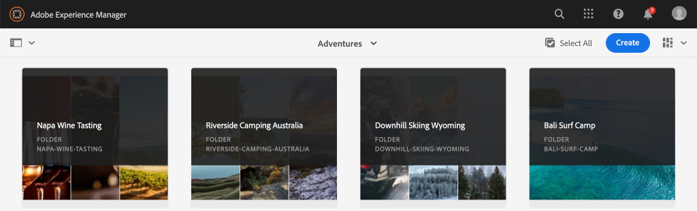

# 快速設定 {#setup}

本章提供本機環境的快速設定，以便查看外部應用程式使用AEM GraphQL API從AEM使用內容。 教學課程的後續章節將以此設定為基礎。

## 必備條件 {#prerequisites}

應在本機安裝下列工具：

* [JDK 11](https://experience.adobe.com/#/downloads/content/software-distribution/en/general.html?1_group.propertyvalues.property=.%2Fjcr%3Acontent%2Fmetadata%2Fdc%3AsoftwareType&amp;1_group.propertyvalues.operation=equals&amp;1_group.propertyvalues.0_values=software-type%3Atoling&amp;fulltext=Oracle%7E+JDK%7E+11%7E&amp;orderby=%40jcr%3Cont%2Fjcr%3Alast&amp;modified by.sort=dest&amp;p.st=dest&amp;p.llep.p.p=14)
* [Node.js v10+](https://nodejs.org/en/)
* [npm 6+](https://www.npmjs.com/)
* [Git](https://git-scm.com/)

## 目標 {#objectives}

1. 下載並安裝AEM SDK。
1. 從WKND參考網站下載並安裝範例內容。
1. 下載並安裝範例應用程式，以使用GraphQL API來使用內容。

## 安裝AEM SDK {#aem-sdk}

本教學課程使用 [AEMas a Cloud ServiceSDK](https://experienceleague.adobe.com/docs/experience-manager-cloud-service/implementing/developing/aem-as-a-cloud-service-sdk.html?lang=en#aem-as-a-cloud-service-sdk) 以探索AEM GraphQL API。 本節提供安裝AEM SDK並以製作模式執行的快速指南。 設定本機開發環境的更詳細指南 [可在此處找到](https://experienceleague.adobe.com/docs/experience-manager-learn/cloud-service/local-development-environment-set-up/overview.html?lang=en#local-development-environment-set-up).

>[!NOTE]
>
> 您也可以透過AEMas a Cloud Service環境，遵循本教學課程。 使用雲端環境的其他附註會納入整個教學課程中。

1. 導覽至 **[Software Distribution入口網站](https://experience.adobe.com/#/downloads/content/software-distribution/en/aemcloud.html)** > **AEMas a Cloud Service** 並下載 **AEM SDK**.

   

   >[!CAUTION]
   >
   > GraphQL功能預設僅在2021-02-04（含）以上版本的AEM SDK上啟用。

1. 解壓縮下載並複製Quickstart Jar(`aem-sdk-quickstart-XXX.jar`)，即 `~/aem-sdk/author`.
1. 將jar檔案重新命名為 `aem-author-p4502.jar`.

   此 `author` 名稱指定Quickstart jar將以「製作」模式啟動。 此 `p4502` 指定Quickstart伺服器將在埠4502上運行。

1. 開啟新的終端機視窗，並導覽至包含jar檔案的資料夾。 執行下列命令以安裝並啟動AEM執行個體：

   ```shell
   $ cd ~/aem-sdk/author
   $ java -jar aem-author-p4502.jar
   ```

1. 提供管理員密碼作為 `admin`. 任何管理員密碼都是可接受的，但建議使用 `admin` 以減少重新設定的需求。
1. 幾分鐘後，AEM執行個體將完成安裝，而新的瀏覽器視窗應會在 [http://localhost:4502](http://localhost:4502).
1. 使用使用者名稱登入 `admin` 和在AEM初始啟動期間選取的密碼(通常 `admin`)。

## 安裝範例內容和GraphQL端點 {#wknd-site-content-endpoints}

範例內容，來自 **WKND參考網站** 將安裝以加速本教學課程。 WKND是虛構的生活風格品牌，通常與AEM訓練搭配使用。

WKND參考網站包含公開 [GraphQL端點](https://experienceleague.adobe.com/docs/experience-manager-cloud-service/assets/admin/graphql-api-content-fragments.html?lang=en#graphql-aem-endpoint). 在實際實作中，請依照 [包括GraphQL端點](https://experienceleague.adobe.com/docs/experience-manager-cloud-service/assets/admin/graphql-api-content-fragments.html?lang=en#graphql-aem-endpoint) 在您的客戶專案中。 A [CORS](#cors-config) 也作為WKND站點的一部分包裝。 需要CORS設定才能授與外部應用程式的存取權，此為關於 [CORS](#cors-config) 可在下方找到。

1. 下載WKND站點的最新編譯AEM包： [aem-guides-wknd.all-x.x.x.zip](https://github.com/adobe/aem-guides-wknd/releases/latest).

   >[!NOTE]
   >
   > 請務必下載與AEMas a Cloud Service相容的標準版本，以及 **not** the `classic` 版本。

1. 從 **AEM開始** 功能表導覽至 **工具** > **部署** > **套件**.

   

1. 按一下 **上傳套件** 並選擇在前一步中下載的WKND包。 按一下 **安裝** 以安裝套件。

1. 從 **AEM開始** 功能表導覽至 **資產** > **檔案**.
1. 按一下資料夾以導覽至 **WKND站點** > **英文** > **冒險**.

   

   此資料夾包含WKND品牌所推廣之各種歷險項目的所有資產。 這包括傳統媒體類型，例如影像和視訊，以及AEM專用的媒體，如 **內容片段**.

1. 按一下 **懷俄明州下山滑雪** ，然後按一下 **懷俄明州下山滑雪內容片段** 卡片：

   

1. 內容片段編輯器UI將開啟，供Sowking Wyoming滑坡探險之用。

   

   請注意， **標題**, **說明**，和 **活動** 定義片段。

   **內容片段** 是在AEM中管理內容的其中一種方式。 內容片段是可重複使用且不受展示的內容，由結構化資料元素（例如文字、RTF、日期或其他內容片段的參考）組成。 稍後的教學課程將會詳細說明內容片段。

1. 按一下 **取消** 來關閉片段。 您可以導覽至其他資料夾，並探索其他Adventure內容。

>[!NOTE]
>
> 若使用Cloud Service環境，請參閱相關檔案，了解如何 [將程式碼基底（如WKND參考網站）部署至Cloud Service環境](https://experienceleague.adobe.com/docs/experience-manager-cloud-service/implementing/deploying/overview.html?lang=en#coding-against-the-right-aem-version).

## 安裝範例應用程式{#sample-app}

本教學課程的其中一個目標是說明如何使用GraphQL API從外部應用程式使用AEM內容。 本教學課程使用已部分完成的React應用程式範例來加速本教學課程。 以iOS、Android或任何其他平台建立的應用程式也適用相同的課程和概念。 React應用程式刻意簡單，以避免不必要的複雜性；這不是參考實作。

1. 開啟新的終端機視窗，並使用Git複製教學課程啟動器分支：

   ```shell
   $ git clone --branch tutorial/react git@github.com:adobe/aem-guides-wknd-graphql.git
   ```

1. 在您選擇的IDE中開啟檔案 `.env.development` at `aem-guides-wknd-graphql/react-app/.env.development`. 確認 `REACT_APP_AUTHORIZATION` 行未加註，檔案如下所示：

   ```plain
   REACT_APP_HOST_URI=http://localhost:4502
   REACT_APP_GRAPHQL_ENDPOINT=/content/graphql/global/endpoint.json
   # Use Authorization when connecting to an AEM Author environment
   REACT_APP_AUTHORIZATION=admin:admin
   ```

   確保 `React_APP_HOST_URI` 符合您的本機AEM例項。 在本章中，我們將直接將React應用程式連結至AEM **作者** 環境。 **作者** 依預設，環境需要驗證，因此我們的應用程式會以 `admin` 使用者。 這是開發期間的常見作法，因為它可讓我們快速變更AEM環境，並立即在應用程式中反映。

   >[!NOTE]
   >
   > 在生產案例中，應用程式會連線至AEM **發佈** 環境。 這在 [生產部署](production-deployment.md) 章節。

1. 導覽至 `aem-guides-wknd-graphql/react-app` 檔案夾。 安裝並啟動應用程式：

   ```shell
   $ cd aem-guides-wknd-graphql/react-app
   $ npm install
   $ npm start
   ```

1. 新的瀏覽器視窗應會自動在 [http://localhost:3000](http://localhost:3000).

   

   應會顯示來自AEM的目前「探險」內容清單。

1. 按一下其中一個冒險影像，查看冒險詳細資訊。 系統會向AEM要求，傳回冒險的詳細資訊。

   

1. 使用瀏覽器的開發人員工具來檢查 **網路** 要求。 檢視 **XHR** 要求並觀察多個POST要求 `/content/graphql/global/endpoint.json`，即為AEM配置的GraphQL端點。

   

1. 您也可以檢查網路要求，以檢視參數和JSON回應。 安裝瀏覽器擴充功能(例如 [GraphQL網路檢查器](https://chrome.google.com/webstore/detail/graphql-network-inspector/ndlbedplllcgconngcnfmkadhokfaaln) 讓Chrome更清楚了解查詢和回應。

## 修改內容片段

現在React應用程式正在執行，請更新AEM中的內容，並查看應用程式中反映的變更。

1. 導覽至AEM [http://localhost:4502](http://localhost:4502).
1. 導覽至 **資產** > **檔案** > **WKND站點** > **英文** > **冒險** > **[巴釐島衝浪營](http://localhost:4502/assets.html/content/dam/wknd/en/adventures/bali-surf-camp)**.

   

1. 按一下 **巴釐島衝浪營** 內容片段，以開啟內容片段編輯器。
1. 修改 **標題** 和 **說明** 冒險

   

1. 按一下 **儲存** 以儲存變更。
1. 導覽回React應用程式，網址為 [http://localhost:3000](http://localhost:3000) 並重新整理，查看您的變更：

   

## 安裝GraphiQL工具 {#install-graphiql}

[GraphiQL](https://github.com/graphql/graphiql) 是開發工具，僅需用於開發或本機執行個體等較低層級環境。 GraphiQL IDE允許您快速測試和調整返回的查詢和資料。 GraphiQL還可輕鬆存取說明檔案，讓您輕鬆了解和了解可用的方法。

1. 導覽至 **[Software Distribution入口網站](https://experience.adobe.com/#/downloads/content/software-distribution/en/aemcloud.html)** > **AEMas a Cloud Service**.
1. 搜尋「GraphiQL」(請務必包含 **i** in **GraphiQL**.
1. 下載最新 **GraphiQL內容包v.x.x.x**

   

   zip檔案是可直接安裝的AEM套件。

1. 從 **AEM開始** 功能表導覽至 **工具** > **部署** > **套件**.
1. 按一下 **上傳套件** 並選擇在上一步下載的包。 按一下 **安裝** 以安裝套件。

   
1. 導航到GraphiQL IDE，位置為 [http://localhost:4502/content/graphiql.html](http://localhost:4502/content/graphiql.html) 並開始探索GraphQL API。

   >[!NOTE]
   >
   > GraphiQL工具和GraphQL API是 [稍後在教學課程中詳細探討](./explore-graphql-api.md).

## 恭喜！ {#congratulations}

恭喜，您現在有外部應用程式使用GraphQL的AEM內容。 歡迎在React應用程式中檢查程式碼，並繼續嘗試修改現有內容片段。

## 後續步驟 {#next-steps}

在下一章中， [定義內容片段模型](content-fragment-models.md)，了解如何建立內容模型，以及使用 **內容片段模型**. 將審閱現有模型並建立新模型。 您也將了解可用來定義模型中結構的不同資料類型。

## （額外）CORS設定 {#cors-config}

AEM預設為安全，會封鎖跨原始請求，防止未經授權的應用程式連線及呈現其內容。

為了允許本教學課程的React應用程式與AEM GraphQL API端點互動，WKND網站參考專案中已定義跨原始資源共用設定。


要查看已部署的配置，請執行以下操作：

1. 導覽至AEM SDK的Web主控台，網址為 [http://localhost:4502/system/console](http://localhost:4502/system/console).

   >[!NOTE]
   >
   > Web主控台僅可在SDK上使用。 在AEMas a Cloud Service環境中，可透過 [開發人員控制台](https://experienceleague.adobe.com/docs/experience-manager-learn/cloud-service/debugging/debugging-aem-as-a-cloud-service/developer-console.html).

1. 在頂端功能表中按一下 **OSGI** > **設定** 把所有的 [OSGi配置](http://localhost:4502/system/console/configMgr).
1. 向下捲動頁面 **AdobeGranite跨原始資源共用**.
1. 按一下 `com.adobe.granite.cors.impl.CORSPolicyImpl~wknd-graphql`.
1. 已更新下列欄位：
   * 允許的原始項(Regex): `http://localhost:.*`
      * 允許所有本地主機連接。
   * 允許的路徑: `/content/graphql/global/endpoint.json`
      * 這是當前配置的唯一GraphQL終結點。 作為最佳做法，變革和組織振興方案的配置應盡可能限制。
   * 允許的方法： `GET`, `HEAD`, `POST`
      * 僅 `POST` 是GraphQL的必要項目，但其他方法在以無周邊方式與AEM互動時可能相當實用。
   * 支援的標題： **授權** 已新增，以傳遞至製作環境的基本驗證。
   * 支援憑據： `Yes`
      * 這是必要操作，因為我們的React應用程式會與AEM製作服務上受保護的GraphQL端點通訊。

此配置和GraphQL端點是AEM WKND項目的一部分。 您可以檢視 [此處為OSGi配置](https://github.com/adobe/aem-guides-wknd/tree/master/ui.config/src/main/content/jcr_root/apps/wknd/osgiconfig).
