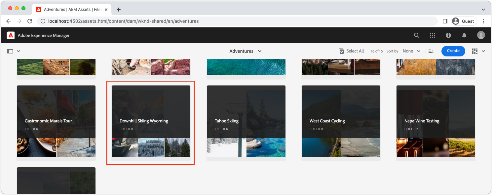

# AEM使用本機SDK的無頭快速設定 {#setup}

AEM Headless快速設定可讓您使用WKND Site範例專案中的內容，以及透過AEM Headless GraphQL API取用內容的範例React應用程式(SPA)，來與AEM Headless進行實際操作。 本指南使用 [AEMas a Cloud ServiceSDK](https://experienceleague.adobe.com/docs/experience-manager-cloud-service/content/implementing/developing/aem-as-a-cloud-service-sdk.html).

## 必備條件 {#prerequisites}

應在本機安裝下列工具：

* [JDK 11](https://experience.adobe.com/#/downloads/content/software-distribution/en/general.html?1_group.propertyvalues.property=.%2Fjcr%3Acontent%2Fmetadata%2Fdc%3AsoftwareType&amp;1_group.propertyvalues.operation=equals&amp;1_group.propertyvalues.0_values=software-type%3Atoling&amp;fulltext=Oracle%7E+JDK%7E+11%7E&amp;orderby=%40jcr%3Cont%2Fjcr%3Alast&amp;modified by.sort=dest&amp;p.st=dest&amp;p.llep.p.p=14)
* [Node.js v14.x](https://nodejs.org/en/)
* [Git](https://git-scm.com/)

## 1.安裝AEM SDK {#aem-sdk}

此設定會使用 [AEMas a Cloud ServiceSDK](https://experienceleague.adobe.com/docs/experience-manager-cloud-service/implementing/developing/aem-as-a-cloud-service-sdk.html?#aem-as-a-cloud-service-sdk) 探索AEM GraphQL API。 本節提供安裝AEM SDK並以製作模式執行的快速指南。 設定本機開發環境的更詳細指南 [可在此處找到](https://experienceleague.adobe.com/docs/experience-manager-learn/cloud-service/local-development-environment-set-up/overview.html#local-development-environment-set-up).

>[!NOTE]
>
> 您也可以依照本教學課程，使用 [AEMas a Cloud Service環境](./cloud-service.md). 使用雲端環境的其他附註會納入整個教學課程中。

1. 導覽至 **[Software Distribution入口網站](https://experience.adobe.com/#/downloads/content/software-distribution/en/aemcloud.html?fulltext=AEM*+SDK*&amp;orderby=%40jcr%3Acontent%2Fjcr%3AlastModified&amp;orderby.sort=desc&amp;layout=list&amp;p.offset=0&amp;p.limit=1)** > **AEMas a Cloud Service** 並下載 **AEM SDK**.

   

1. 解壓縮下載並複製Quickstart Jar(`aem-sdk-quickstart-XXX.jar`)，即 `~/aem-sdk/author`.
1. 將jar檔案重新命名為 `aem-author-p4502.jar`.

   此 `author` 名稱指定Quickstart jar以「製作」模式啟動。 此 `p4502` 指定在埠4502上運行的快速啟動。

1. 若要安裝並啟動AEM執行個體，請在包含jar檔案的資料夾中開啟命令提示，然後執行下列命令：

   ```shell
   $ cd ~/aem-sdk/author
   $ java -jar aem-author-p4502.jar
   ```

1. 提供管理員密碼作為 `admin`. 任何管理員密碼都是可接受的，但建議您使用 `admin` 以減少重新配置的需求。
1. 當AEM服務完成安裝時，新的瀏覽器視窗應該會在 [http://localhost:4502](http://localhost:4502).
1. 使用使用者名稱登入 `admin` 和在AEM初始啟動期間選取的密碼(通常 `admin`)。

## 2.安裝範例內容 {#install-sample-content}

範例內容，來自 **WKND參考網站** 可加速教學課程。 WKND是虛構的生活風格品牌，通常與AEM訓練搭配使用。

WKND站點包括公開 [GraphQL端點](https://experienceleague.adobe.com/docs/experience-manager-cloud-service/content/headless/graphql-api/content-fragments.html). 在實際實作中，請遵循以下檔案說明的步驟： [包含GraphQL端點](https://experienceleague.adobe.com/docs/experience-manager-cloud-service/content/headless/graphql-api/content-fragments.html) 在您的客戶專案中。 A [CORS](#cors-config) 也作為WKND站點的一部分包裝。 需要CORS設定才能授與外部應用程式的存取權，此為關於 [CORS](#cors-config) 可在下方找到。

1. 下載WKND站點的最新編譯AEM包： [aem-guides-wknd.all-x.x.x.zip](https://github.com/adobe/aem-guides-wknd/releases/latest).

   >[!NOTE]
   >
   > 請務必下載與AEMas a Cloud Service相容的標準版本，以及 **not** the `classic` 版本。

1. 從 **AEM開始** ，導航 **工具** > **部署** > **套件**.

   

1. 按一下 **上傳套件** 並選擇在前一步中下載的WKND包。 按一下 **安裝** 安裝套件。

1. 從 **AEM開始** ，導航 **資產** > **檔案** > **WKND共用** > **英文** > **冒險**.

   

   此資料夾包含WKND品牌所推廣之各種歷險項目的所有資產。 這包括傳統媒體類型，例如影像和視訊，以及AEM專用的媒體，如 **內容片段**.

1. 按一下 **懷俄明州下山滑雪** ，然後按一下 **懷俄明州下山滑雪內容片段** 卡片：

   

1. 內容片段編輯器隨即開啟，供您參加懷俄明州下山滑雪探險之旅。

   

   請注意， **標題**, **說明**，和 **活動** 定義片段。

   **內容片段** 是在AEM中管理內容的其中一種方式。 內容片段是可重複使用且不受展示的內容，由結構化資料元素（例如文字、RTF、日期或其他內容片段的參考）組成。 稍後，您會透過快速設定，更詳細地探索內容片段。

1. 按一下 **取消** 來關閉片段。 您可以導覽至其他資料夾，並探索其他Adventure內容。

>[!NOTE]
>
> 若使用Cloud Service環境，請參閱相關檔案，了解如何 [將程式碼基底（如WKND參考網站）部署至Cloud Service環境](https://experienceleague.adobe.com/docs/experience-manager-cloud-service/implementing/deploying/overview.html#coding-against-the-right-aem-version).

## 3.下載並運行WKND React應用 {#sample-app}

本教學課程的其中一個目標，是說明如何使用GraphQL API從外部應用程式使用AEM內容。 本教學課程使用範例React應用程式。 React應用程式刻意簡單，著重於與AEM GraphQL API的整合。

1. 開啟新的命令提示字元，然後從GitHub複製範例React應用程式：

   ```shell
   $ git clone git@github.com:adobe/aem-guides-wknd-graphql.git
   $ cd aem-guides-wknd-graphql/react-app
   ```

1. 在中開啟React應用程式 `aem-guides-wknd-graphql/react-app` 在您選擇的IDE中。
1. 在IDE中，開啟檔案 `.env.development` at `/.env.development`. 驗證 `REACT_APP_AUTHORIZATION` 行將被取消注釋，檔案將聲明以下變數：

   ```plain
   REACT_APP_HOST_URI=http://localhost:4502
   REACT_APP_GRAPHQL_ENDPOINT=/content/graphql/global/endpoint.json
   # Use Authorization when connecting to an AEM Author environment
   REACT_APP_AUTHORIZATION=admin:admin
   ```

   確保 `REACT_APP_HOST_URI` 指向您本機的AEM SDK。 為方便起見，此快速入門將React應用程式連線至  **AEM作者**. **作者** 服務需要驗證，因此應用程式會使用 `admin` 用戶建立其連接。 將應用程式連結至AEM Author是開發期間的常見作法，因為此方法有助於快速反覆處理內容，而無須發佈變更。

   >[!NOTE]
   >
   > 在生產案例中，應用程式會連線至AEM **發佈** 環境。 這在 _生產部署_ 區段。


1. 安裝並啟動React應用程式：

   ```shell
   $ cd aem-guides-wknd-graphql/react-app
   $ npm install
   $ npm start
   ```

1. 新的瀏覽器視窗會自動開啟應用程式 [http://localhost:3000](http://localhost:3000).

   

   隨即顯示來自AEM的探險內容清單。

1. 按一下其中一個冒險影像，查看冒險詳細資訊。 系統會向AEM要求，傳回冒險的詳細資訊。

   

1. 使用瀏覽器的開發人員工具來檢查 **網路** 要求。 檢視 **XHR** 要求並觀察多個GET要求 `/graphql/execute.json/...`. 此路徑前置詞會叫用AEM持續查詢端點，使用名稱選取要執行的持續查詢，並在前置詞後面加上編碼參數。

   

## 4.編輯AEM中的內容

在React應用程式執行時，請更新AEM中的內容，並查看應用程式中反映的變更。

1. 導覽至AEM [http://localhost:4502](http://localhost:4502).
1. 導覽至 **資產** > **檔案** > **WKND共用** > **英文** > **冒險** > **[巴釐島衝浪營](http://localhost:4502/assets.html/content/dam/wknd-shared/en/adventures/bali-surf-camp)**.

   

1. 按一下 **巴釐島衝浪營** 內容片段，以開啟內容片段編輯器。
1. 修改 **標題** 和 **說明** 冒險。

   

1. 按一下 **儲存** 以儲存變更。
1. 在重新整理React應用程式 [http://localhost:3000](http://localhost:3000) 若要查看變更：

   

## 5.了解GraphiQL {#graphiql}

1. 開啟 [GraphiQL](http://localhost:4502/aem/graphiql.html) 瀏覽至 **工具** > **一般** > **GraphQL查詢編輯器**
1. 在左側選取現有的持續查詢，然後執行這些查詢以查看結果。

   >[!NOTE]
   >
   > GraphiQL工具和GraphQL API為 [稍後在教學課程中詳細探討](../multi-step/explore-graphql-api.md).

## 恭喜！{#congratulations}

恭喜，您現在有外部應用程式使用AEM內容與GraphQL。 歡迎在React應用程式中檢查程式碼，並繼續嘗試修改現有內容片段。

### 後續步驟

* [啟動AEM Headless教學課程](../multi-step/overview.md)
