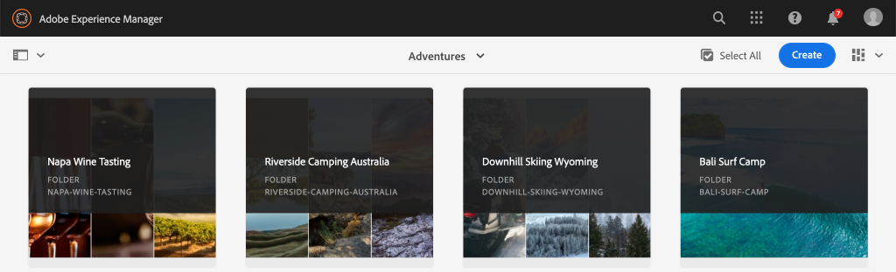

# 使用AEM本地SDK進行無頭快速設定 {#setup}

「AEM無頭」快速設定可讓您使用WKND站點示例項目中的內容與AEMHeadless進行操作，並提供一個示例反應應用(aSPA)，該應用會通過無頭圖形QL APIAEM來消耗內容。 本指南使用 [AEMas a Cloud ServiceSDK](https://experienceleague.adobe.com/docs/experience-manager-cloud-service/implementing/developing/aem-as-a-cloud-service-sdk.html?lang=en#aem-as-a-cloud-service-sdk)。

## 必備條件 {#prerequisites}

應在本地安裝以下工具：

* [JDK 11](https://experience.adobe.com/#/downloads/content/software-distribution/en/general.html?1_group.propertyvalues.property=.%2Fjcr%3內容%2Fmetadata%2Fdc%3SoftwareType&amp;1_group.propertyvalues.operation=等於&amp;1_group.propertyvalues.0_values=軟體類型%3Atoling&amp;fulltext=Oracle%7E+JDK%7E+11%7E&amp;order=%40jcr%3內容%2Fjcr%3AlastModified&amp;orderby.sort=desc&amp;layout=list&amp;p.offset=0&amp;p.limit=14)
* [Node.js v10+](https://nodejs.org/en/)
* [npm 6+](https://www.npmjs.com/)
* [蠢貨](https://git-scm.com/)

## 1。安裝AEMSDK {#aem-sdk}

此安裝程式使用 [AEMas a Cloud ServiceSDK](https://experienceleague.adobe.com/docs/experience-manager-cloud-service/implementing/developing/aem-as-a-cloud-service-sdk.html?lang=en#aem-as-a-cloud-service-sdk) 瀏覽AEMGraphQL API。 本節提供了安裝SDK並在「作者」AEM模式下運行SDK的快速指南。 設定本地開發環境的更詳細指南 [可在此處找到](https://experienceleague.adobe.com/docs/experience-manager-learn/cloud-service/local-development-environment-set-up/overview.html?lang=en#local-development-environment-set-up)。

>[!NOTE]
>
> 也可以在本教程中 [AEMas a Cloud Service](./cloud-service.md)。 在本教程中，還包括有關使用雲環境的其他說明。

1. 導航到 **[軟體分發門戶](https://experience.adobe.com/#/downloads/content/software-distribution/en/aemcloud.html)** > **AEMas a Cloud Service** 下載 **SDKAEM**。

   

   >[!CAUTION]
   >
   > 預設情況下，僅在2021-02-04或更AEM新版本的SDK上啟用GraphQL功能。

1. 解壓縮下載並複製快速啟動jar(`aem-sdk-quickstart-XXX.jar`)到專用資料夾，即 `~/aem-sdk/author`。
1. 將jar檔案重新命名為 `aem-author-p4502.jar`。

   的 `author` name指定快速啟動jar將以「作者」模式啟動。 的 `p4502` 指定Quickstart伺服器將在埠4502上運行。

1. 開啟新的終端窗口並導航到包含jar檔案的資料夾。 運行以下命令以安裝和啟AEM動實例：

   ```shell
   $ cd ~/aem-sdk/author
   $ java -jar aem-author-p4502.jar
   ```

1. 提供管理員密碼 `admin`。 任何管理員密碼都可接受，但建議使用 `admin` 用於本地開發以減少重新配置的需要。
1. 幾分鐘後，實AEM例將完成安裝，新瀏覽器窗口應在 [http://localhost:4502](http://localhost:4502)。
1. 使用用戶名登錄 `admin` 和初始啟動時AEM選擇的密碼(通常 `admin`)。

## 2.安裝示例WKND內容 {#wknd-site-content}

示例內容 **WKND參考站點** 將安裝以加速本教程。 WKND是一個虛構的生活風格品牌，經常與培訓結AEM合使用。

WKND參考站點包括公開 [GraphQL終結點](https://experienceleague.adobe.com/docs/experience-manager-cloud-service/assets/admin/graphql-api-content-fragments.html?lang=en#graphql-aem-endpoint)。 在實際實施中，請遵循記錄的步驟 [包括GraphQL端點](https://experienceleague.adobe.com/docs/experience-manager-cloud-service/assets/admin/graphql-api-content-fragments.html?lang=en#graphql-aem-endpoint) 在客戶項目中。 A [CORS](#cors-config) 已打包為WKND站點的一部分。 需要CORS配置來授予對外部應用程式的訪問權限，有關 [CORS](#cors-config) 的下界。

1. 下載WKND站AEM點的最新編譯包： [aem輔助線 — wknd.all-x.x.x.zip](https://github.com/adobe/aem-guides-wknd/releases/latest)。

   >[!NOTE]
   >
   > 確保下載與AEMas a Cloud Service相容的 **不** 這樣 `classic` 。

1. 從 **開AEM始** 菜單導航 **工具** > **部署** > **包**。

   

1. 按一下 **上載包** 選擇上一步下載的WKND包。 按一下 **安裝** 安裝軟體包。

1. 從 **開AEM始** 菜單導航 **資產** > **檔案**。
1. 按一下瀏覽資料夾以導航到 **WKND站點** > **英語** > **冒險**。

   

   這是WKND品牌推廣的各種冒險活動的所有資產的資料夾。 這包括傳統媒體類型，如影像和視頻，以及特定於AEM的 **內容片段**。

1. 按一下 **懷俄明州高山滑雪** 資料夾，然後按一下 **懷俄明州高山滑雪內容片段** 卡：

   

1. 內容片段編輯器UI將開啟，用於Xowning Skiing Wyoming的探險。

   

   觀察各個領域，如 **標題**。 **說明**, **活動** 定義片段。

   **內容片段** 是管理內容的一種方AEM式。 內容片段是可重用的、不受演示形式限制的內容，由結構化資料元素組成，如文本、富格文本、日期或對其他內容片段的引用。 在本教程的後半部分，將更詳細地探討內容片段。

1. 按一下 **取消** 來關閉碎片。 您可以輕鬆瀏覽其他資料夾並瀏覽其他Adventure內容。

>[!NOTE]
>
> 如果使用Cloud Service環境，請參閱有關如何 [將代碼庫（如WKND引用站點）部署到Cloud Service環境](https://experienceleague.adobe.com/docs/experience-manager-cloud-service/implementing/deploying/overview.html?lang=en#coding-against-the-right-aem-version)。

## 3.下載並運行WKND React應用 {#sample-app}

本教程的目標之一是說明如何使用AEMGraphQL API從外部應用程式中使用內容。 本教程使用一個已部分完成的React App示例來加速本教程。 同樣的經驗和概念也適用於iOS、安卓或任何其他平台所構建的應用。 React應用程式故意簡單，以避免不必要的複雜性；它不是一個參考實施。

1. 使用Git開啟新的終端窗口和克隆教程啟動器分支：

   ```shell
   $ git clone --branch tutorial/react git@github.com:adobe/aem-guides-wknd-graphql.git
   ```

1. 在您選擇的IDE中，開啟檔案 `.env.development` 在 `aem-guides-wknd-graphql/react-app/.env.development`。 驗證 `REACT_APP_AUTHORIZATION` 行未被注釋，並且該檔案如下所示：

   ```plain
   REACT_APP_HOST_URI=http://localhost:4502
   REACT_APP_GRAPHQL_ENDPOINT=/content/graphql/global/endpoint.json
   # Use Authorization when connecting to an AEM Author environment
   REACT_APP_AUTHORIZATION=admin:admin
   ```

   確保 `React_APP_HOST_URI` 與本地實AEM例匹配。 在本章中，我們將直接將React App連接到 **作者** 環境。 **作者** 預設情況下，需要進行身份驗證，因此我們的應用程式將作為 `admin` 。 這是開發過程中的常見做法，因為它允許我們快速對環境進行更改AEM，並立即在應用程式中看到這些更改。

   >[!NOTE]
   >
   > 在生產方案中，應用程式將連接到AEM **發佈** 環境。 在 _生產部署_ 的子菜單。

1. 導航到 `aem-guides-wknd-graphql/react-app` 的子菜單。 安裝並啟動應用：

   ```shell
   $ cd aem-guides-wknd-graphql/react-app
   $ npm install
   $ npm start
   ```

1. 新瀏覽器窗口應自動在 [http://localhost:3000](http://localhost:3000)。

   

   應顯示當前Adventure內容AEM的清單。

1. 按一下其中一張冒險影像，查看冒險詳細資訊。 請求返AEM回探險的細節。

   

1. 使用瀏覽器的開發人員工具檢查 **網路** 請求。 查看 **XHR** 請求並觀察多個POST請求 `/content/graphql/global/endpoint.json`，為配置的GraphQL終結點AEM。

   

1. 您還可以通過檢查網路請求來查看參數和JSON響應。 安裝瀏覽器擴展(如 [GraphQL網路檢查器](https://chrome.google.com/webstore/detail/graphql-network-inspector/ndlbedplllcgconngcnfmkadhokfaaln) 讓Chrome更好地瞭解查詢和響應。

## 4.編輯內AEM容

現在React應用正在運行，請更新中的內容AEM，並查看應用中反映的更改。

1. 導航至AEM [http://localhost:4502](http://localhost:4502)。
1. 導航到 **資產** > **檔案** > **WKND站點** > **英語** > **冒險** > **[巴釐島衝浪營](http://localhost:4502/assets.html/content/dam/wknd/en/adventures/bali-surf-camp)**。

   

1. 按一下 **巴釐島衝浪營** 內容片段以開啟內容片段編輯器。
1. 修改 **標題** 和 **說明** 探險

   

1. 按一下 **保存** 的子菜單。
1. 導航回React應用，地址為 [http://localhost:3000](http://localhost:3000) 並刷新以查看您的更改：

   

## 5.安裝GraphiQL工具 {#install-graphiql}

[圖形QL](https://github.com/graphql/graphiql) 是開發工具，僅在較低級別環境（如開發或本地實例）中需要。 GraphiQL IDE允許您快速test和細化返回的查詢和資料。 GraphiQL還提供了對文檔的輕鬆訪問，使您能夠輕鬆瞭解和瞭解可用的方法。

1. 導航到 **[軟體分發門戶](https://experience.adobe.com/#/downloads/content/software-distribution/en/aemcloud.html)** > **AEMas a Cloud Service**。
1. 搜索「GraphiQL」(請務必包括 **我** 在 **圖形QL**。
1. 下載最新 **GraphiQL內容包v.x.x.x**

   

   zip檔案是可直AEM接安裝的軟體包。

1. 從 **開AEM始** 菜單導航 **工具** > **部署** > **包**。
1. 按一下 **上載包** 選擇上一步下載的包。 按一下 **安裝** 安裝軟體包。

   
1. 導航至GraphiQL IDE（位於） [http://localhost:4502/content/graphiql.html](http://localhost:4502/content/graphiql.html) 並開始探索GraphQL API。

   >[!NOTE]
   >
   > GraphiQL工具和GraphQL API [在本教程的後面更詳細地探討](../multi-step/explore-graphql-api.md)。

## 恭喜！ {#congratulations}

祝賀您，您現在有一個使用GraphQL的外AEM部應用程式正在使用內容。 您可以隨意檢查React應用程式中的代碼，並繼續嘗試修改現有內容片段。

### 後續步驟

* [啟動無AEM頭教程](../multi-step/overview.md)

## （附加）CORS配置 {#cors-config}

在默AEM認情況下，為安全起見，會阻止跨源請求，從而防止未經授權的應用程式連接到並呈現其內容。

為了允許本教程的React應用與AEMGraphQL API端點進行交互，已在WKND站點引用項目中定義了跨源資源共用配置。


要查看已部署的配置，請執行以下操作：

1. 導航至AEMSDK的Web控制台，位於 [http://localhost:4502/system/console](http://localhost:4502/system/console)。

   >[!NOTE]
   >
   > Web控制台僅在SDK上可用。 在as a Cloud ServiceAEM環境中，可通過 [開發人員控制台](https://experienceleague.adobe.com/docs/experience-manager-learn/cloud-service/debugging/debugging-aem-as-a-cloud-service/developer-console.html)。

1. 在頂部菜單中按一下 **奧斯吉** > **配置** 把所有 [OSGi配置](http://localhost:4502/system/console/configMgr)。
1. 向下滾動頁面 **Adobe花崗岩跨源資源共用**。
1. 按一下的配置 `com.adobe.granite.cors.impl.CORSPolicyImpl~wknd-graphql`。
1. 以下欄位已更新：
   * 允許的來源(Regex): `http://localhost:.*`
      * 允許所有本地主機連接。
   * 允許的路徑: `/content/graphql/global/endpoint.json`
      * 這是當前配置的唯一GraphQL終結點。 作為最佳做法，變革和組織方案的配置應盡可能嚴格。
   * 允許的方法： `GET`。 `HEAD`。 `POST`
      * 僅 `POST` 對於GraphQL是必需的，但是其它方法在以無頭方式與AEM交互時非常有用。
   * 支援的標頭： **授權** 已添加到作者環境中的基本身份驗證中。
   * 支援憑據： `Yes`
      * 這是必需的，因為我們的React應用程式將與AEM Author服務上受保護的GraphQL端點通信。

此配置和GraphQL端點是WKND項AEM目的一部分。 您可以查看 [此處的OSGi配置](https://github.com/adobe/aem-guides-wknd/tree/master/ui.config/src/main/content/jcr_root/apps/wknd/osgiconfig)。
