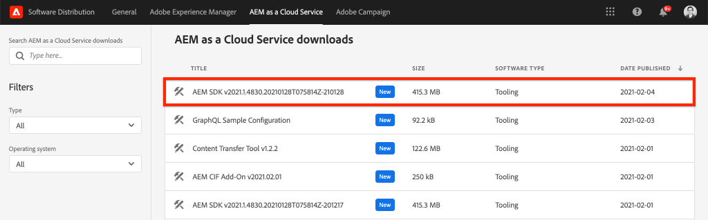
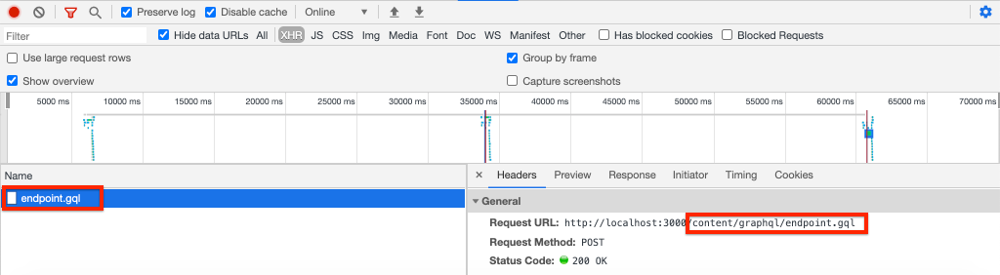

# 快速設定{#setup}

本章提供本機環境的快速設定，以檢視外部應用程式使用AEM的GraphQL API使用AEM的內容。 本教學課程的後續章節將建立此設定。

## 必備條件 {#prerequisites}

本機應安裝下列工具：

* [JDK 11](https://experience.adobe.com/#/downloads/content/software-distribution/en/general.html?1_group.propertyvalues.property=.%2Fjcr%3Acontent%2Fmetadata%2Fdc%3AsoftwareType&amp;1_group.propertyvalues.operation=equals&amp;1_group.propertyvalues.0_values=software-type%3Atoling&amp;fulltext=Oracle%7E+JDK%7E+111%7E&amp;orderby=%40jcry%3E&amp;orderby=%40jcr%3Econtent%2Fjcr%3AlastModified&amp;orderby.sort=desc&amp;layout=list&amp;p.offset=0&amp;p.limit=14)
* [Node.js v10+](https://nodejs.org/en/)
* [npm 6+](https://www.npmjs.com/)
* [Git](https://git-scm.com/)

## 目標{#objectives}

1. 下載並安裝AEM SDK。
1. 從WKND參考網站下載並安裝範例內容。
1. 下載並安裝範例應用程式，以使用GraphQL API來使用內容。

## 安裝AEM SDK {#aem-sdk}

本教學課程使用[AEM做為雲端服務SDK](https://experienceleague.adobe.com/docs/experience-manager-cloud-service/implementing/developing/aem-as-a-cloud-service-sdk.html?lang=en#aem-as-a-cloud-service-sdk)來探索AEM的GraphQL API。 本節提供安裝AEM SDK並在「作者」模式中執行AEM SDK的快速指南。 有關設定本地開發環境[的更詳細指南，請參閱](https://experienceleague.adobe.com/docs/experience-manager-learn/cloud-service/local-development-environment-set-up/overview.html?lang=en#local-development-environment-set-up)。

>[!NOTE]
>
> 您也可以隨附AEM作為雲端服務環境的教學課程。 教學課程中包含使用雲端環境的其他注意事項。

1. 導覽至&#x200B;**[軟體散發入口網站](https://experience.adobe.com/#/downloads/content/software-distribution/en/aemcloud.html)** > **AEM做為雲端服務**，並下載最新版的&#x200B;**AEM SDK**。

   

   >[!CAUTION]
   >
   > GraphQL功能預設僅在2021-02-04或更新版本的AEM SDK上啟用。

1. 解壓縮下載並將快速啟動jar(`aem-sdk-quickstart-XXX.jar`)複製到專用資料夾，即`~/aem-sdk/author`。
1. 將jar檔案重新命名為`aem-author-p4502.jar`。

   `author`名稱指定Quickstartjar將以「作者」模式啟動。 `p4502`指定Quickstart伺服器將在埠4502上運行。

1. 開啟新的終端窗口並導航到包含jar檔案的資料夾。 執行下列命令以安裝並啟動AEM例項：

   ```shell
   $ cd ~/aem-sdk/author
   $ java -jar aem-author-p4502.jar
   ```

1. 提供管理員密碼作為`admin`。 任何管理員密碼都可接受，但建議使用本端開發的預設密碼，以減少重新設定的需要。
1. 幾分鐘後，AEM實例將完成安裝，而新的瀏覽器視窗應會在[http://localhost:4502](http://localhost:4502)開啟。
1. 使用用戶名`admin`和密碼`admin`登錄。

## 安裝示例內容和GraphQL端點{#wknd-site-content-endpoints}

將安裝&#x200B;**WKND參考站點**&#x200B;中的示例內容以加速教程。 WKND是虛構的生活風格品牌，常與AEM訓練搭配使用。

WKND參考站點包括公開[GraphQL端點](https://experienceleague.adobe.com/docs/experience-manager-cloud-service/assets/admin/graphql-api-content-fragments.html?lang=en#graphql-aem-endpoint)所需的配置。 在實際實施中，請遵循記錄的步驟，將GraphQL端點](https://experienceleague.adobe.com/docs/experience-manager-cloud-service/assets/admin/graphql-api-content-fragments.html?lang=en#graphql-aem-endpoint)納入您的客戶項目中。 [[CORS](#cors-config)也已封裝為WKND網站的一部分。 需要CORS組態才能授與外部應用程式的存取權，有關[CORS](#cors-config)的更多資訊，請參閱以下。

1. 下載最新編譯的WKND網站AEM套件：[aem-guides-wknd.all-x.x.x.zip](https://github.com/adobe/aem-guides-wknd/releases/latest)。

   >[!NOTE]
   >
   > 請確定下載與AEM相容的標準版為雲端服務，**不是**`classic`版本。

1. 從&#x200B;**AEM Start**&#x200B;功能表導覽至&#x200B;**Tools** > **Deployment** > **Packages**。

   

1. 按一下&#x200B;**Upload Package** ，然後選擇在上一步中下載的WKND包。 按一下&#x200B;**Install**&#x200B;安裝軟體包。

1. 從&#x200B;**AEM Start**&#x200B;功能表導覽至&#x200B;**Assets** > **Files**。
1. 按一下資料夾以導航至&#x200B;**WKND站點** > **英文** > **冒險**。

   

   這是WKND品牌所推廣的各種Adventures所有資產的資料夾。 這包括傳統媒體類型，例如影像和視訊，以及AEM專用的媒體，例如&#x200B;**內容片段**。

1. 按一下&#x200B;**Shounding Skiing Wyoming**&#x200B;資料夾，然後按一下&#x200B;**Shounding Skiiing Wyoming Content Fragment**&#x200B;卡：

   

1. 內容片段編輯器UI將開放，供您進行Sowning Skiing Wyoming山下滑雪探險。

   

   請注意，**Title**、**Description**&#x200B;和&#x200B;**Activity**&#x200B;等各種欄位定義片段。

   **內容** 片段是在AEM中管理內容的其中一種方式。內容片段是可重複使用、不受表現形式限制的內容，由結構化資料元素（例如文字、豐富式文字、日期或其他內容片段的參考）組成。 在教學課程的稍後部分，將會更詳細地探索內容片段。

1. 按一下&#x200B;**Cancel**&#x200B;關閉片段。 您可以隨意瀏覽至其他部分資料夾，並探索其他Adventure內容。

>[!NOTE]
>
> 如果使用雲服務環境，請參閱如何[將WKND參考網站等程式碼庫部署至雲服務環境的檔案](https://experienceleague.adobe.com/docs/experience-manager-cloud-service/implementing/deploying/overview.html?lang=en#deploying)。

## 安裝範例應用程式{#sample-app}

本教學課程的目標之一，是示範如何使用GraphQL API，從外部應用程式使用AEM內容。 本教學課程使用已部分完成的React App範例來加速教學課程。 同樣的課程和概念也適用於使用iOS、Android或任何其他平台建立的應用程式。 React應用程式有意簡單，以避免不必要的複雜性；它不是指參照實施。

1. 使用Git開啟新的終端機視窗並複製教學課程入門分支：

   ```shell
   $ git clone --branch tutorial/react git@github.com:adobe/aem-guides-wknd-graphql.git
   ```

1. 在您選擇的IDE中，開啟`.env.development`檔案（位於`aem-guides-wknd-graphql/react-app/.env.development`）。 取消對`REACT_APP_AUTHORIZATION`行的注釋，使檔案看起來如下：

   ```plain
   REACT_APP_HOST_URI=http://localhost:4502
   REACT_APP_GRAPHQL_ENDPOINT=/content/graphql/global/endpoint.json
   REACT_APP_AUTHORIZATION=admin:admin
   ```

   請確定`React_APP_HOST_URI`符合您的本機AEM例項。 在本章中，我們將直接將React App連接到AEM **Author**&#x200B;環境。 **依預** 設，授權需要驗證，因此我們的應用程式會以使用者身分 `admin` 連線。這是開發期間的常見做法，因為它可讓我們快速變更AEM環境，並立即在應用程式中反映。

   >[!NOTE]
   >
   > 在生產案例中，應用程式會連線至AEM **Publish**&#x200B;環境。 本教學課程稍後將詳細介紹此內容。

1. 導覽至`aem-guides-wknd-graphql/react-app`資料夾。 安裝並啟動應用程式：

   ```shell
   $ cd aem-guides-wknd-graphql/react-app
   $ npm install
   $ npm start
   ```

1. 新的瀏覽器視窗應會自動啟動位於[http://localhost:3000](http://localhost:3000)的應用程式。

   

   應顯示目前來自AEM的「冒險」內容清單。

1. 按一下其中一張冒險影像，即可檢視探險細節。 系統會要求AEM傳回冒險的詳細資訊。

   

1. 使用瀏覽器的開發人員工具來檢查&#x200B;**Network**&#x200B;請求。 檢視&#x200B;**XHR**&#x200B;請求，並觀察對`/content/graphql/global/endpoint.json`（為AEM設定的GraphQL端點）的多個POST請求。

   

1. 您也可以檢查網路要求，以檢視參數和JSON回應。 如果安裝[GraphQL Network](https://chrome.google.com/webstore/detail/graphql-network/igbmhmnkobkjalekgiehijefpkdemocm) for Chrome等瀏覽器擴充功能，將有助於您進一步瞭解查詢和回應。

   

   *使用Chrome擴充功能GraphQL網路*

## 修改內容片段

現在React應用程式已執行，請對AEM中的內容進行更新，然後查看應用程式中反映的變更。

1. 導覽至AEM [http://localhost:4502](http://localhost:4502)。
1. 導覽至&#x200B;**Assets** > **Files** > **WKND Site** > **English** Adventures **>**[ Bali Surf Camp](http://localhost:4502/assets.html/content/dam/wknd/en/adventures/bali-surf-camp)**。**

   

1. 按一下&#x200B;**Bali Surf Camp**&#x200B;內容片段，以開啟內容片段編輯器。
1. 修改&#x200B;**Title**&#x200B;和&#x200B;**Description**&#x200B;冒險

   

1. 按一下&#x200B;**保存**&#x200B;保存更改。
1. 導覽回至位於[http://localhost:3000](http://localhost:3000)的React應用程式，然後重新整理以檢視您的變更：

   

## 安裝GraphiQL工具{#install-graphiql}

[GraphiQL](https://github.com/graphql/graphiql) 是開發工具，僅在低級環境（如開發或本地實例）上需要。GraphiQL IDE允許您快速測試和細化返回的查詢和資料。 GraphiQL還提供了對文檔的輕鬆訪問，使您能夠輕鬆瞭解和瞭解可用的方法。

1. 導覽至&#x200B;**[軟體散發入口網站](https://experience.adobe.com/#/downloads/content/software-distribution/en/aemcloud.html)** > **AEM作為雲端服務**。
1. 搜索「GraphiQL」(請務必在&#x200B;**GraphiQL**&#x200B;中包含&#x200B;**i**。
1. 下載最新的&#x200B;**GraphiQL內容包v.x.x.x**

   

   zip檔案是可直接安裝的AEM套件。

1. 從&#x200B;**AEM Start**&#x200B;功能表導覽至&#x200B;**Tools** > **Deployment** > **Packages**。
1. 按一下&#x200B;**上傳包**&#x200B;並選擇在上一步中下載的包。 按一下&#x200B;**Install**&#x200B;安裝軟體包。

   
1. 導覽至位於[http://localhost:4502/content/graphiql.html](http://localhost:4502/content/graphiql.html)的GraphiQL IDE，並開始探索GraphQL API。

   >[!NOTE]
   >
   > 在教程](./explore-graphql-api.md)的後面，對GraphiQL工具和GraphQL API進行了更詳細的介紹。[

## 恭喜！{#congratulations}

恭喜您，您現在有外部應用程式使用GraphQL的AEM內容。 在React應用程式中檢查程式碼，並繼續嘗試修改現有的內容片段。

## 後續步驟{#next-steps}

在下一章[定義內容片段模型](content-fragment-models.md)中，瞭解如何建立內容模型，並使用&#x200B;**內容片段模型**&#x200B;建立架構。 您將查看現有模型並建立新模型。 您還將瞭解可用於定義模式作為模型一部分的不同資料類型。

## （額外）CORS設定{#cors-config}

AEM依預設是安全的，會封鎖跨原始碼要求，防止未授權的應用程式連線及呈現其內容。

為了讓本教學課程的React應用程式與AEM的GraphQL API端點互動，WKND網站參考專案中已定義跨來源資源共用設定。


要查看已部署的配置：

1. 導覽至AEM SDK的Web Console，網址為[http://localhost:4502/system/console](http://localhost:4502/system/console)。

   >[!NOTE]
   >
   > Web Console僅適用於SDK。 在AEM做為雲端服務環境中，您可透過[開發人員主控台](https://experienceleague.adobe.com/docs/experience-manager-learn/cloud-service/debugging/debugging-aem-as-a-cloud-service/developer-console.html)檢視此資訊。

1. 在頂部菜單中，按一下「**OSGI** > **配置**」以開啟所有「[OSGi配置](http://localhost:4502/system/console/configMgr)」。
1. 向下捲動頁面&#x200B;**Adobe Granite跨原始資源共用**。
1. 按一下`com.adobe.granite.cors.impl.CORSPolicyImpl~wknd-graphql`的配置。
1. 下列欄位已更新：
   * 允許的來源(Regex):`http://localhost:.*`
      * 允許所有本地主機連接。
   * 允許的路徑: `/content/graphql/global/endpoint.json`
      * 這是當前唯一配置的GraphQL端點。 作為最佳做法，COR的配置應盡可能嚴格。
   * 允許的方法：`GET`、`HEAD`、`POST`
      * GraphQL只需要`POST`，但是其他方法在以無頭方式與AEM互動時可能很有用。
   * 支援的標題：**authorization**&#x200B;已新增，以傳入作者環境的基本驗證。
   * 支援憑據：`Yes`
      * 當我們的React應用程式將與AEM Author服務上受保護的GraphQL端點通訊時，這是必要項。

此配置和GraphQL端點是AEM WKND專案的一部分。 您可以在此處查看所有[OSGi配置](https://github.com/adobe/aem-guides-wknd/tree/master/ui.config/src/main/content/jcr_root/apps/wknd/osgiconfig)。
