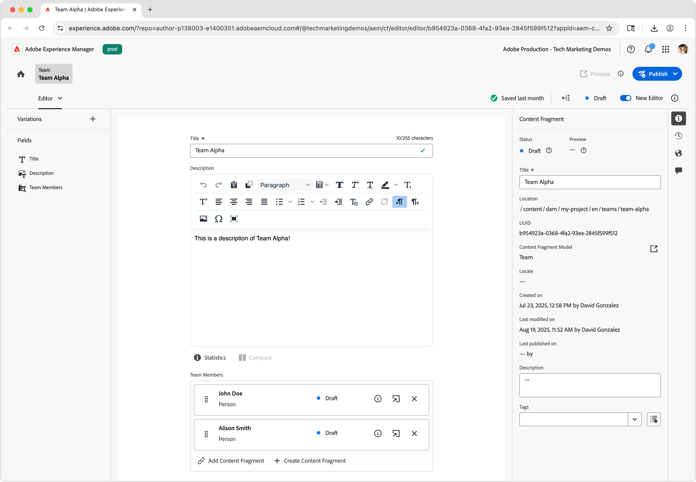

# 作者內容片段

在本章中，您將根據[團隊和人員內容片段模型](./1-content-fragment-models.md)來建立和編輯新內容片段。 這些內容片段將會是React應用程式使用搭配OpenAPI的AEM內容片段傳送來使用的內容。

## 先決條件

此教學課程包含多個部分，並假設已完成[定義內容片段模式](./1-content-fragment-models.md)中概述的步驟。

## 目標

* 根據內容片段模型建立內容片段。
* 創作內容片段。
* 發佈內容片段。

## 為內容片段建立資產資料夾

內容片段儲存在AEM Assets的資料夾中。 若要使用上一章建立的內容片段模型建立內容片段，必須存在資料夾才能儲存。 需要資料夾上的設定才能從特定內容片段模式建立內容片段。

AEM支援「平面」資料夾組織，這表示不同內容片段模型的內容片段會混合在單一資料夾中。 不過，在本教學課程中，部分使用了與內容片段模型一致的資料夾結構來探索&#x200B;**下一章**&#x200B;中的[依資料夾](./3-explore-openapis.md) API列出所有內容片段。 在決定您的內容片段組織時，請考量您想要如何編寫和管理您的內容片段，以及如何透過OpenAPI的AEM內容片段傳送來傳送和使用這些片段。

1. 從AEM開始畫面，瀏覽至&#x200B;**Assets** > **檔案**。
1. 選取右上角的&#x200B;**建立**，然後選取&#x200B;**資料夾**。 輸入：

   * 標題： **我的專案**
   * 名稱： **my-project**

   選取&#x200B;**建立**&#x200B;以建立資料夾。

1. 開啟新的&#x200B;**我的專案**&#x200B;資料夾，並在新的&#x200B;**我的專案**&#x200B;資料夾下建立子資料夾，其值如下：

   * 標題： **英文**
   * 名稱： **en**

   系統會建立根語言資料夾，放置專案以支援AEM的原生本地化功能。 即使您目前不需要本地化，最佳實務還是要設定專案以提供多語言支援。 如需詳細資訊，請參閱[下列檔案頁面](https://experienceleague.adobe.com/docs/experience-manager-cloud-service/content/assets/admin/translate-assets.html)。

1. 在新的&#x200B;**我的專案>英文**&#x200B;資料夾下建立兩個子資料夾，其值如下：

   包含`teams`團隊&#x200B;**內容片段的**&#x200B;資料夾

   * 標題： **團隊**
   * 名稱： **團隊**

   ...和包含`people`人員&#x200B;**內容片段的**&#x200B;資料夾。

   * 標題： **人員**
   * 名稱： **人員**

1. 導覽回&#x200B;**我的專案>英文**&#x200B;資料夾，並確定已建立兩個新資料夾。
1. 選取&#x200B;**團隊**&#x200B;資料夾，然後在頂端動作列中選取&#x200B;**屬性**。
1. 選取「**原則**」標籤，並取消勾選「**繼承自`/content/dam/my-project`**」。
1. 在&#x200B;**原則**&#x200B;標籤上，選取&#x200B;**依路徑**&#x200B;允許的內容片段模型&#x200B;**團隊**&#x200B;內容片段模型。

   

   子資料夾會自動繼承這些原則，但可加以覆寫。 標籤可以允許內容片段模型，或從其他專案設定啟用內容片段模型。 此機制提供管理內容階層的強大方式。

1. 選取&#x200B;**儲存並關閉**&#x200B;以儲存資料夾屬性的變更。
1. 以相同方式更新&#x200B;**人員**&#x200B;資料夾的&#x200B;**原則**，但請改為選取&#x200B;**人員**&#x200B;內容片段模型。

## 建立個人內容片段

根據&#x200B;**我的專案>英文>人員**&#x200B;資料夾中的&#x200B;**人員**&#x200B;內容片段模型建立內容片段。

1. 從AEM開始畫面中，選取&#x200B;**內容片段**&#x200B;以開啟內容片段主控台。
1. 選取&#x200B;**顯示資料夾**&#x200B;按鈕以開啟資料夾瀏覽器。
1. 選取&#x200B;**我的專案>英文>人員**&#x200B;資料夾。
1. 選取&#x200B;**建立>內容片段**&#x200B;並輸入下列值：

   * 位置： `/content/dam/my-project/en/people`
   * 內容片段模型： **人員**
   * 標題： **John Doe**
   * 名稱：`john-doe`

   請記住，**新內容片段**&#x200B;對話方塊中的這些&#x200B;**標題**、**名稱**&#x200B;和&#x200B;**描述**&#x200B;欄位儲存為內容片段的中繼資料，而不是內容片段資料的一部分。

   

1. 選取「**建立並開啟**」。
1. 填寫&#x200B;**John Doe**&#x200B;片段的欄位：

   * 全名： **John Doe**
   * 傳記： **John Doe喜愛社群媒體和旅遊愛好者。**
   * 設定檔圖片：從`/content/dam`選取影像或上傳新影像。
   * 職業： **影響者**，**旅行者**

   這些欄位和值會定義將透過OpenAPI的AEM內容片段傳送使用之內容片段的內容。

   

1. 內容片段變更會自動儲存，因此沒有「**儲存**」按鈕。
1. 返回內容片段主控台，然後選取「**我的專案>英文>人員**」以檢視您的新內容片段。

### 建立其他人員內容片段

重複上述步驟以建立其他&#x200B;**人員**&#x200B;片段。

1. 使用下列屬性為&#x200B;**Alison Smith**&#x200B;建立人員內容片段：

   * 位置： `/content/dam/my-project/en/people`
   * 內容片段模型： **人員**
   * 標題： **Alison Smith**
   * 名稱：`alison-smith`

   選取&#x200B;**建立並開啟**，並編寫下列值：

   * 全名： **Alison Smith**
   * 傳記： **Alison是一位攝影師，她很喜歡寫她的旅行。**
   * 設定檔圖片：從`/content/dam`選取影像或上傳新影像。
   * 職業： **攝影師**，**旅行者**，**作者**。

您現在應該在&#x200B;**我的專案>英文>人員**&#x200B;資料夾中有兩個內容片段：

您可以選擇製作多個人員內容片段來代表其他人員。

## 建立團隊內容片段

使用相同的方法，在&#x200B;**我的專案>英文>團隊**&#x200B;資料夾中根據&#x200B;**團隊**&#x200B;內容片段模型建立&#x200B;**團隊**&#x200B;片段。

1. 使用下列屬性建立代表&#x200B;**團隊Alpha**&#x200B;的&#x200B;**團隊**&#x200B;片段：

   * 位置： `/content/dam/my-project/en`
   * 內容片段模型： **團隊**
   * 標題： **Alpha團隊**
   * 名稱：`team-alpha`

   選取&#x200B;**建立並開啟**，並編寫下列值：

   * 標題： **Alpha團隊**
   * 說明： **Alpha團隊是旅遊內容團隊，擅長攝影和旅遊寫作。**
   * **團隊成員**：選取&#x200B;**John Doe**&#x200B;和&#x200B;**Alison Smith**&#x200B;內容片段，以填入&#x200B;**團隊成員**&#x200B;欄位。

   

1. 選取&#x200B;**建立並開啟**&#x200B;以建立團隊內容片段
1. **我的專案>英文>團隊**&#x200B;下應該有一個內容片段：

您現在應該在&#x200B;**我的專案>英文>團隊**&#x200B;資料夾中擁有&#x200B;**團隊Alpha**&#x200B;內容片段：

選擇性地建立具有不同人員集的&#x200B;**團隊Omega**。

## 發佈內容片段

若要透過OpenAPI提供內容片段，請發佈。 發佈可透過以下方式存取內容片段：

* **發佈服務** — 為生產應用程式提供內容
* **預覽服務** — 提供內容以預覽應用程式

通常內容會先發佈到&#x200B;**預覽服務**，並在發佈到&#x200B;**發佈服務**&#x200B;之前在預覽應用程式上檢閱。 發佈至&#x200B;**發佈服務**&#x200B;並不會同時發佈至&#x200B;**預覽服務**。 您必須分別發佈至&#x200B;**預覽服務**。

在本教學課程中，我們將發佈至AEM Publish服務，但使用AEM Preview服務如同在React應用程式[中變更](./4-react-app.md)AEM服務的URL一樣簡單

1. 在內容片段主控台中，找到&#x200B;**我的專案>英文**&#x200B;資料夾。
1. 選取&#x200B;**英文**&#x200B;資料夾（顯示所有子資料夾中的所有內容片段）中的所有內容片段，並從頂端動作列選取&#x200B;**發佈>立即**。

   

1. 選取&#x200B;**發佈服務**，在&#x200B;**包含所有參考**&#x200B;下選取&#x200B;**已取消發佈**&#x200B;和&#x200B;**已修改**，然後選取&#x200B;**發佈**。

   

現在，內容片段、團隊內容片段參考的所有人員內容片段以及任何參考的資產已發佈至&#x200B;**發佈服務**。

您可以用相同方式發佈至&#x200B;**預覽服務**。

## 恭喜！

恭喜，您已根據AEM中的內容片段模型成功編寫內容片段。 您已建立&#x200B;**Person**&#x200B;內容片段模型、編寫了數個&#x200B;**Person**&#x200B;內容片段，並建立參照多個&#x200B;**Person**&#x200B;內容片段的&#x200B;**團隊**&#x200B;內容片段。

發佈內容片段後，您現在可以透過OpenAPI的AEM內容片段傳送存取這些片段。

## 後續步驟

在下一章[探索OpenAPI](3-explore-openapis.md)中，您將使用API檔案中內建的&#x200B;**嘗試它**&#x200B;功能，探索具有OpenAPI API的AEM內容片段傳送。

