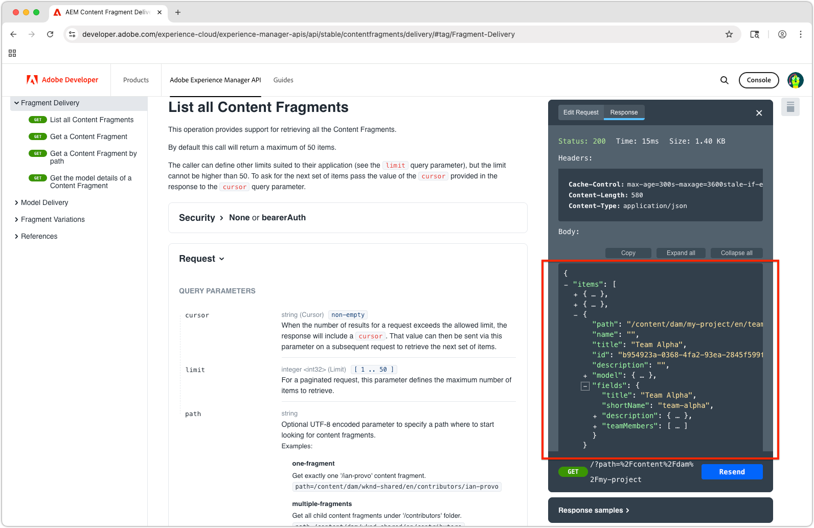

# 探索AEM OpenAPI型內容片段傳送API

AEM中採用OpenAPI API的[AEM內容片段傳送](https://developer.adobe.com/experience-cloud/experience-manager-apis/api/stable/contentfragments/delivery/)提供強大的方式，可將結構化內容傳送至任何應用程式或頻道。 在本章中，我們探索如何使用OpenAPI透過檔案的&#x200B;**嘗試使用**&#x200B;功能來擷取內容片段。

## 先決條件 {#prerequisites}

此教學課程包含多個部分，並假設[編寫內容片段](./2-author-content-fragments.md)中概述的步驟已完成。

請確定您擁有下列專案：

* 已將`https://publish-<PROGRAM_ID>-e<ENVIRONMENT_ID >.adobeaemcloud.com/`內容片段發佈至[的AEM發佈服務主機名稱（例如](./2-author-content-fragments.md#publish-content-fragments)）。 如果您要發佈AEM預覽服務，請使用該主機名稱（例如`https://preview-<PROGRAM_ID>-e<ENVIRONMENT_ID>.adobeaemcloud.com/`）。

## 目標 {#objectives}

* 熟悉OpenAPI API [的](https://developer.adobe.com/experience-cloud/experience-manager-apis/api/stable/contentfragments/delivery/)AEM內容片段傳送。
* 使用API檔案叫用API **嘗試它**&#x200B;功能。

## 傳遞 API

使用OpenAPI的AEM內容片段傳送提供RESTful介面以擷取內容片段。 本教學課程中討論的API只能在AEM發佈和預覽服務中使用，而不能在Author服務中使用。 [與AEM Author服務](https://developer.adobe.com/experience-cloud/experience-manager-apis/api/stable/sites/)上的內容片段互動時存在其他OpenAPI。

## 探索API

[使用OpenAPI的AEM內容片段傳送API檔案](https://developer.adobe.com/experience-cloud/experience-manager-apis/api/stable/contentfragments/delivery/)提供「試用」功能，可讓您探索API並直接從瀏覽器測試它們。 這是熟悉API端點及其功能的絕佳方法。

在瀏覽器中開啟[AEM Sites API檔案](https://developer.adobe.com/experience-cloud/experience-manager-apis/api/stable/contentfragments/delivery/)。

API列在左側導覽的&#x200B;**片段傳送**&#x200B;區段下。 您可以展開本區段以檢視可用的API。 選取API會在主面板中顯示API詳細資料，而右邊欄中會顯示&#x200B;**試用**&#x200B;區段，讓您直接從瀏覽器測試及探索API。


## 列出內容片段

1. 在瀏覽器中使用OpenAPI開發人員檔案[開啟](https://developer.adobe.com/experience-cloud/experience-manager-apis/api/stable/contentfragments/delivery/)AEM內容片段傳送。
1. 在左側導覽中，展開&#x200B;**片段傳送**&#x200B;區段，然後選取&#x200B;**列出所有內容片段** API

此API可讓您依資料夾從AEM擷取所有內容片段的分頁清單。 使用此API最簡單的方式是提供包含內容片段的資料夾路徑。

1. 在右邊欄頂端選取&#x200B;**試用**。
1. 輸入API將連線到的AEM服務的識別碼，以擷取內容片段。 貯體是AEM發佈（或預覽）服務URL的第一個部分，通常格式為： `publish-p<PROGRAM_ID>-e<ENVIRONMENT_ID>`或`preview-p<PROGRAM_ID>-e<ENVIRONMENT_ID>`。

由於我們使用AEM Publish服務，請將貯體設定為AEM Publish服務識別碼。 例如：

* **貯體**： `publish-p138003-e1400351`


設定貯體後，**Target伺服器**&#x200B;欄位會自動更新為AEM Publish服務的完整API URL，例如： `https://publish-p138003-e1400351.adobeaemcloud.com/adobe/contentFragments`

1. 展開&#x200B;**安全性**&#x200B;區段，並將&#x200B;**安全性配置**&#x200B;設定為&#x200B;**無**。 這是因為AEM Publish服務（和預覽服務）不需要使用OpenAPI驗證AEM內容片段傳送。

1. 展開&#x200B;**引數**&#x200B;區段以提供要取得之內容片段的詳細資料。

* **cursor**：留空，這會用於分頁，而且是初始要求。
* **limit**：留空，這會用來限制每頁結果所傳回的結果數目。
* **路徑**： `/content/dam/my-project/en`

  >[!TIP]
  > 輸入路徑時，請確定其前置詞為`/content/dam/`，且&#x200B;**不**&#x200B;結尾是尾隨斜線`/`。

  

1. 選取&#x200B;**傳送**&#x200B;按鈕以執行API呼叫。
1. 在&#x200B;**嘗試它**&#x200B;面板的&#x200B;**回應**&#x200B;標籤中，您應該會看到包含指定資料夾中內容片段清單的JSON回應。 回應將與以下內容類似：

   

1. 回應包含`path`引數的`/content/dam/my-project`資料夾下的所有內容片段，包括子資料夾，包括&#x200B;**人員**&#x200B;和&#x200B;**團隊**&#x200B;內容片段。
1. 按一下`items`陣列並找到`Team Alpha`專案的`id`值。 此ID用於下一節以擷取單一內容片段的詳細資訊。
1. 選取&#x200B;**嘗試它**&#x200B;面板頂端的&#x200B;**編輯要求**&#x200B;以及API呼叫中的各種引數，以檢視回應如何變更。 例如，您可以將路徑變更為包含內容片段的其他資料夾，或新增查詢引數以篩選結果。 例如，將`path`引數變更為`/content/dam/my-project/teams`以僅顯示該資料夾（和子資料夾）中的內容片段。

## 取得內容片段詳細資料

與&#x200B;**列出所有內容片段** API類似，**取得內容片段** API會根據其ID以及任何選擇性參考來擷取單一內容片段。 若要探索此API，我們將要求參考數個人員內容片段的團隊內容片段。

1. 展開左側邊欄中的&#x200B;**片段傳送**&#x200B;區段，然後選取&#x200B;**取得內容片段** API。
1. 在右邊欄頂端選取&#x200B;**試用**。
1. 驗證`bucket`指向您的AEM as a Cloud Service發佈或預覽服務。
1. 展開&#x200B;**安全性**&#x200B;區段，並將&#x200B;**安全性配置**&#x200B;設定為&#x200B;**無**。 這是因為AEM發佈服務不需要使用OpenAPI驗證AEM內容片段傳送。
1. 展開&#x200B;**引數**&#x200B;區段以提供要取得之內容片段的詳細資料：

在此範例中，會使用上一節中擷取的團隊內容片段的ID。 例如，對於&#x200B;**列出所有內容片段**&#x200B;中的此內容片段回應，請使用`id`之`b954923a-0368-4fa2-93ea-2845f599f512`欄位中的值。 （您的`id`將與教學課程中使用的值不同。）

```json
{
    "path": "/content/dam/my-project/teams/team-alpha",
    "name": "",
    "title": "Team Alpha",
    "id": "50f28a14-fec7-4783-a18f-2ce2dc017f55", // This is the Content Fragment ID
    "description": "",
    "model": {},
    "fields": {} 
}
```

* **fragmentId**： `50f28a14-fec7-4783-a18f-2ce2dc017f55`
* **個參考**： `none`
* **depth**：留空，**references**&#x200B;引數將指定參考片段的深度。
* **水合**：留空，**references**&#x200B;引數將指定參考片段的水合。
* **If-None-Match**：留空

1. 選取&#x200B;**傳送**&#x200B;按鈕以執行API呼叫。
1. 檢閱&#x200B;**Try It**&#x200B;面板中&#x200B;**回應**&#x200B;索引標籤中的回應。 您應該會看到包含內容片段詳細資訊的JSON回應，包括其屬性和任何參考。
1. 在&#x200B;**嘗試它**&#x200B;面板頂端選取&#x200B;**編輯要求**，並在&#x200B;**引數**&#x200B;區段中，將`references`引數調整為`all-hydrated`，將所有參考的內容片段內容包含在API呼叫中。

   * **fragmentId**： `50f28a14-fec7-4783-a18f-2ce2dc017f55`
   * **個參考**： `all-hydrated`
   * **depth**：留空，**references**&#x200B;引數將指定參考片段的深度。
   * **水合**：留空，**references**&#x200B;引數將指定參考片段的水合。
   * **If-None-Match**：留空

1. 選取&#x200B;**重新傳送**&#x200B;按鈕以再次執行API呼叫。
1. 檢閱&#x200B;**Try It**&#x200B;面板中&#x200B;**回應**&#x200B;索引標籤中的回應。 您應該會看到包含內容片段詳細資訊的JSON回應，包括其屬性和參照的人員內容片段的屬性。

請注意，`teamMembers`陣列現在包含參考之人員內容片段的詳細資料。 水合參考可讓您擷取單一API呼叫中的所有必要資料，這對減少使用者端應用程式提出的請求數特別有用。

## 恭喜！

恭喜，您已使用AEM檔案的「**試用**」功能，使用OpenAPI API呼叫建立並執行數個AEM內容片段傳送。

## 後續步驟

在下一章[建置React應用程式](./4-react-app.md)中，您會探索外部應用程式如何使用OpenAPI API與AEM內容片段傳送互動。

