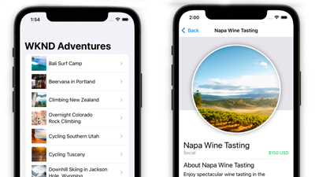

# AEM Headless教學課程

Adobe Experience Manager(AEM)有多個選項，可定義無頭端點並將其內容傳送為JSON。 使用實作教學課程，探索如何使用各種選項，並選擇適合您的選項。

>[!TIP]
>
>本教學課程系列專為偏好使用 **學習**. 如果您偏好從頭開始學習概念，請查看 [AEM Headless Developer Journey](https://experienceleague.adobe.com/docs/experience-manager-cloud-service/headless-journey/developer/overview.html). 這套教學課程和歷程相輔相成。

## Tutorials（依API）

<table>
<tr>
  <td>
    
    

      <a href="https://experienceleague.adobe.com/docs/experience-manager-learn/getting-started-with-aem-headless/graphql/overview.html">
    <strong>GraphQL API</strong>
    </a>
    

    

    <em>了解應用程式如何使用AEM GraphQL API來查詢內容。</em>
    

  </td>
  <td>
    
    

    <a href="https://experienceleague.adobe.com/docs/experience-manager-learn/getting-started-with-aem-headless/authentication/overview.html">
    <strong>Token驗證</strong>
    </a>
    

    

    <em>了解應用程式如何安全地使用AEM進行驗證。</em>
    

  </td>
  <td>
    
     

      <a href="https://experienceleague.adobe.com/docs/experience-manager-learn/getting-started-with-aem-headless/content-services/overview.html">
        <strong>Content Services</strong>
      </a>
    

    

    <em>了解應用程式如何使用REST API來使用內容。</em>
    

  </td>
</tr>
</table>

## 範例應用程式

範例應用程式是探索Adobe Experience Manager(AEM)無頭功能的絕佳方式。 下載並安裝這些完成的範例，以便立即開始使用。

<table>
<tr>
  <td>
    
    

      <a href="https://experienceleague.adobe.com/docs/experience-manager-learn/getting-started-with-aem-headless/graphql/example-apps/ios-swiftui-app.html">
    <strong>iOS SwiftUI範例</strong>
    </a>
    

    

    <em>採用AEM GraphQL API技術的iOS應用程式。</em>
    

  </td>
  <td>
    
    

    <a href="https://experienceleague.adobe.com/docs/experience-manager-learn/getting-started-with-aem-headless/graphql/example-apps/android-app.html">
    <strong>Android範例</strong>
    </a>
    

    

    <em>由AEM GraphQL API提供技術支援的Android應用程式。</em>
    

  </td>
  <td>
    
     

      <a href="https://experienceleague.adobe.com/docs/experience-manager-learn/getting-started-with-aem-headless/graphql/example-apps/react-app.html">
        <strong>React範例</strong>
      </a>
    

    

    <em>採用AEM GraphQL API技術的React應用程式。</em>
    

  </td>
</tr>
</table>

## Tutorials（依架構）

根據所使用的技術，瀏覽下列教學課程。 了解AEM如何超越純粹無頭的使用案例，提供內容製作和體驗管理選項。

<table>
<tr>
  <td>
    
    

      <a href="https://experienceleague.adobe.com/docs/experience-manager-learn/getting-started-with-aem-headless/graphql/overview.html">
    <strong>React — 無頭</strong>
    </a>
    

    

    <em>在純無周邊情境下，使用GraphQL建立React JS應用程式。</em>
    

  </td>
  <td>
    
    

    <a href="https://experienceleague.adobe.com/docs/experience-manager-learn/getting-started-with-aem-headless/spa-editor/remote-spa/overview.html">
    <strong>React — 遠端編輯器</strong>
    </a>
    

    

    <em>在內容中製作遠端托管React應用程式的一部分。</em>
    

  </td>
  <td>
    
     

      <a href="https://experienceleague.adobe.com/docs/experience-manager-learn/getting-started-with-aem-headless/spa-editor/react/overview.html">
        <strong>React - SPA Editor</strong>
      </a>
    

    

    <em>使用AEM SPA編輯器管理完整的React應用程式體驗。</em>
    

  </td>
</tr>
<tr>
  <td>
    
    

      <a href="https://experienceleague.adobe.com/docs/experience-manager-learn/getting-started-with-aem-headless/spa-editor/angular/overview.html">
    <strong>Angular- SPA編輯器</strong>
    </a>
    

    

    <em>使用AEM SPA編輯器管理完整的Angular應用程式體驗。</em>
    

  </td>
  <td>
    
    

    <a href="https://experienceleague.adobe.com/docs/experience-manager-learn/getting-started-with-aem-headless/content-services/overview.html">
    <strong>Android — 內容服務</strong>
    </a>
    

    

    <em>使用內容服務和REST來支援行動Android應用程式。</em>
    

  </td>
  <td>
    
     

      <a href="https://experienceleague.adobe.com/docs/experience-manager-learn/getting-started-with-aem-headless/authentication/overview.html">
        <strong>Node.js — 驗證</strong>
      </a>
    

    

    <em>使用開發人員和服務代號建立Node.js應用程式以進行驗證。</em>
    

  </td>
</tr>
</table>
