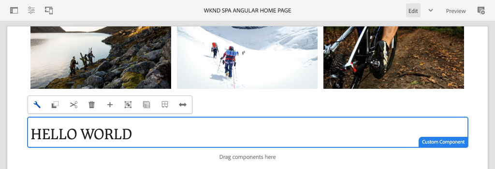
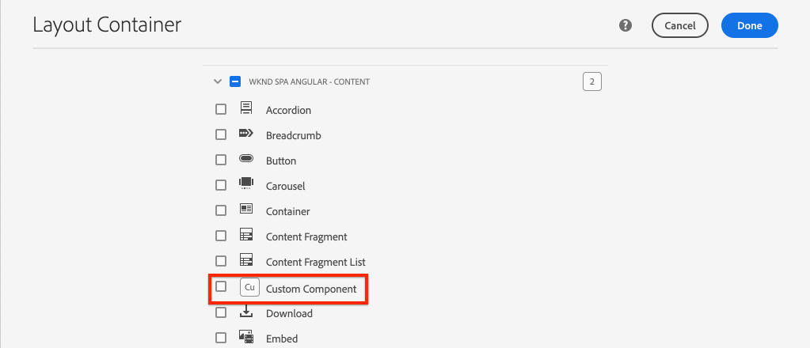

# 建立自訂元件 {#custom-component}

了解如何建立要與AEM SPA編輯器搭配使用的自訂元件。 了解如何開發製作對話方塊和Sling模型，以擴充JSON模型以填入自訂元件。

## 目標

1. 了解Sling模型在操控AEM提供的JSON模型API中的角色。
2. 了解如何建立新的AEM元件對話方塊。
3. 了解如何建立與SPA編輯器架構相容的&#x200B;**custom** AEM元件。

## 您將建置的

先前章節的重點是開發SPA元件，並將其對應至&#x200B;*現有的* AEM核心元件。 本章將著重說明如何建立和擴充&#x200B;*new* AEM元件，以及如何操作AEM提供的JSON模型。

簡單的`Custom Component`說明了建立新AEM元件所需的步驟。



## 必備條件

查看設定[本地開發環境](overview.md#local-dev-environment)所需的工具和說明。

### 取得程式碼

1. 透過Git下載本教學課程的起始點：

   ```shell
   $ git clone git@github.com:adobe/aem-guides-wknd-spa.git
   $ cd aem-guides-wknd-spa
   $ git checkout Angular/custom-component-start
   ```

2. 使用Maven將程式碼基底部署至本機AEM例項：

   ```shell
   $ mvn clean install -PautoInstallSinglePackage
   ```

   如果使用[AEM 6.x](overview.md#compatibility)新增`classic`設定檔：

   ```shell
   $ mvn clean install -PautoInstallSinglePackage -Pclassic
   ```

3. 安裝傳統[WKND參考站點](https://github.com/adobe/aem-guides-wknd/releases/latest)的已完成包。 [WKND參考站點](https://github.com/adobe/aem-guides-wknd/releases/latest)提供的影像將在WKND SPA上重新使用。 可使用[AEM套件管理器](http://localhost:4502/crx/packmgr/index.jsp)安裝套件。

   

您一律可以在[GitHub](https://github.com/adobe/aem-guides-wknd-spa/tree/Angular/custom-component-solution)上檢視完成的程式碼，或切換至分支`Angular/custom-component-solution`在本機檢出程式碼。

## 定義AEM元件

AEM元件定義為節點和屬性。 在項目中，這些節點和屬性在`ui.apps`模組中以XML檔案的形式表示。 接下來，在`ui.apps`模組中建立AEM元件。

>[!NOTE]
>
> [AEM元件基本概念的快速重新整理可能有助於](https://experienceleague.adobe.com/docs/experience-manager-learn/getting-started-wknd-tutorial-develop/project-archetype/component-basics.html)。

1. 在所選IDE中，開啟`ui.apps`資料夾。
2. 導覽至`ui.apps/src/main/content/jcr_root/apps/wknd-spa-angular/components`並建立名為`custom-component`的新資料夾。
3. 在`custom-component`資料夾下建立名為`.content.xml`的新檔案。 將下列項目填入`custom-component/.content.xml`:

   ```xml
   <?xml version="1.0" encoding="UTF-8"?>
   <jcr:root xmlns:sling="http://sling.apache.org/jcr/sling/1.0" xmlns:cq="http://www.day.com/jcr/cq/1.0" xmlns:jcr="http://www.jcp.org/jcr/1.0"
       jcr:primaryType="cq:Component"
       jcr:title="Custom Component"
       componentGroup="WKND SPA Angular - Content"/>
   ```

   

   `jcr:primaryType="cq:Component"`  — 標識此節點將是AEM元件。

   `jcr:title` 是要顯示給內容作者的值，並決 `componentGroup` 定製作UI中的元件分組。

4. 在`custom-component`資料夾下，建立另一個名為`_cq_dialog`的資料夾。
5. 在`_cq_dialog`資料夾下方建立名為`.content.xml`的新檔案，並填入以下內容：

   ```xml
   <?xml version="1.0" encoding="UTF-8"?>
   <jcr:root xmlns:sling="http://sling.apache.org/jcr/sling/1.0" xmlns:granite="http://www.adobe.com/jcr/granite/1.0" xmlns:cq="http://www.day.com/jcr/cq/1.0" xmlns:jcr="http://www.jcp.org/jcr/1.0" xmlns:nt="http://www.jcp.org/jcr/nt/1.0"
       jcr:primaryType="nt:unstructured"
       jcr:title="Custom Component"
       sling:resourceType="cq/gui/components/authoring/dialog">
       <content
           jcr:primaryType="nt:unstructured"
           sling:resourceType="granite/ui/components/coral/foundation/container">
           <items jcr:primaryType="nt:unstructured">
               <tabs
                   jcr:primaryType="nt:unstructured"
                   sling:resourceType="granite/ui/components/coral/foundation/tabs"
                   maximized="{Boolean}true">
                   <items jcr:primaryType="nt:unstructured">
                       <properties
                           jcr:primaryType="nt:unstructured"
                           jcr:title="Properties"
                           sling:resourceType="granite/ui/components/coral/foundation/container"
                           margin="{Boolean}true">
                           <items jcr:primaryType="nt:unstructured">
                               <columns
                                   jcr:primaryType="nt:unstructured"
                                   sling:resourceType="granite/ui/components/coral/foundation/fixedcolumns"
                                   margin="{Boolean}true">
                                   <items jcr:primaryType="nt:unstructured">
                                       <column
                                           jcr:primaryType="nt:unstructured"
                                           sling:resourceType="granite/ui/components/coral/foundation/container">
                                           <items jcr:primaryType="nt:unstructured">
                                               <message
                                                   jcr:primaryType="nt:unstructured"
                                                   sling:resourceType="granite/ui/components/coral/foundation/form/textfield"
                                                   fieldDescription="The text to display on the component."
                                                   fieldLabel="Message"
                                                   name="./message"/>
                                           </items>
                                       </column>
                                   </items>
                               </columns>
                           </items>
                       </properties>
                   </items>
               </tabs>
           </items>
       </content>
   </jcr:root>
   ```

   

   上面的XML檔案為`Custom Component`生成一個非常簡單的對話框。 檔案的關鍵部分是內部`<message>`節點。 此對話框將包含名為`Message`的簡單`textfield`，並將文本欄位的值保存到名為`message`的屬性。

   系統會在旁邊建立Sling模型，以透過JSON模型公開`message`屬性的值。

   >[!NOTE]
   >
   > 您可以檢視核心元件定義](https://github.com/adobe/aem-core-wcm-components/tree/master/content/src/content/jcr_root/apps/core/wcm/components)以檢視更多[對話方塊範例。 您也可以檢視其他表單欄位，例如`select`、`textarea`、`pathfield`，可在[CRXDE-Lite](http://localhost:4502/crx/de/index.jsp#/libs/granite/ui/components/coral/foundation/form)的`/libs/granite/ui/components/coral/foundation/form`下方取得。

   若使用傳統AEM元件，通常需要[ HTL](https://experienceleague.adobe.com/docs/experience-manager-htl/using/overview.html?lang=zh-Hant)指令碼。 由於SPA會轉譯元件，因此不需要HTL指令碼。

## 建立Sling模型

Sling模型是註解導向的Java &quot;POJO&#39;s&quot;（純舊Java物件），可方便將資料從JCR對應至Java變數。 [Sling Model](https://experienceleague.adobe.com/docs/experience-manager-learn/getting-started-wknd-tutorial-develop/project-archetype/component-basics.html#sling-models) 一般能封裝AEM元件的複雜伺服器端業務邏輯。

在SPA編輯器的內容中，Sling模型會透過使用[Sling Model Exporter](https://experienceleague.adobe.com/docs/experience-manager-learn/foundation/development/develop-sling-model-exporter.html)的功能，透過JSON模型公開元件的內容。

1. 在所選IDE中，開啟`core`模組。 `CustomComponent.java` 和 `CustomComponentImpl.java` 已建立，並在章節起始程式碼中逐步運用。

   >[!NOTE]
   >
   > 如果使用Visual Studio Code IDE，則安裝[Java](https://code.visualstudio.com/docs/java/extensions)的擴展可能會很有幫助。

2. 在`core/src/main/java/com/adobe/aem/guides/wknd/spa/angular/core/models/CustomComponent.java`開啟Java介面`CustomComponent.java`:

   

   這是Sling模型將實作的Java介面。

3. 更新`CustomComponent.java`以便擴展`ComponentExporter`介面：

   ```java
   package com.adobe.aem.guides.wknd.spa.angular.core.models;
   import com.adobe.cq.export.json.ComponentExporter;
   
   public interface CustomComponent extends ComponentExporter {
   
       public String getMessage();
   
   }
   ```

   實作`ComponentExporter`介面是JSON模型API自動擷取Sling模型的需求。

   `CustomComponent`介面包括單個getter方法`getMessage()`。 此方法會透過JSON模型公開製作對話方塊的值。 在JSON模型中，將僅導出空參數`()`的getter方法。

4. 在`core/src/main/java/com/adobe/aem/guides/wknd/spa/angular/core/models/impl/CustomComponentImpl.java`開啟`CustomComponentImpl.java`。

   這是`CustomComponent`介面的實現。 `@Model`注釋將Java類標識為Sling模型。 `@Exporter`注釋使Java類能夠通過Sling模型導出器進行序列化和導出。

5. 更新靜態變數`RESOURCE_TYPE`以指向先前練習中建立的AEM元件`wknd-spa-angular/components/custom-component`。

   ```java
   static final String RESOURCE_TYPE = "wknd-spa-angular/components/custom-component";
   ```

   元件的資源類型將系結Sling Model至AEM元件，並最終對應至Angular元件。

6. 將`getExportedType()`方法添加到`CustomComponentImpl`類以返回元件資源類型：

   ```java
   @Override
   public String getExportedType() {
       return CustomComponentImpl.RESOURCE_TYPE;
   }
   ```

   實作`ComponentExporter`介面時需要此方法，它將公開允許映射到Angular元件的資源類型。

7. 更新`getMessage()`方法以傳回由製作對話方塊保存的`message`屬性值。 使用`@ValueMap`注釋將JCR值`message`映射到Java變數：

   ```java
   import org.apache.commons.lang3.StringUtils;
   ...
   
   @ValueMapValue
   private String message;
   
   @Override
   public String getMessage() {
       return StringUtils.isNotBlank(message) ? message.toUpperCase() : null;
   }
   ```

   新增一些額外的「業務邏輯」，以傳回訊息的值作為大寫。 這可讓我們查看製作對話方塊所儲存的原始值與Sling模型公開的值之間的差異。

   >[!NOTE]
   >
   > 您可以在此處](https://github.com/adobe/aem-guides-wknd-spa/blob/Angular/custom-component-solution/core/src/main/java/com/adobe/aem/guides/wknd/spa/angular/core/models/impl/CustomComponentImpl.java)查看[已完成的CustomComponentImpl.java。

## 更新Angular元件

自訂元件的Angular程式碼已建立。 接下來，進行一些更新，將Angular元件對應至AEM元件。

1. 在`ui.frontend`模組中開啟檔案`ui.frontend/src/app/components/custom/custom.component.ts`
2. 觀察`@Input() message: string;`行。 預期轉換後的大寫值會對應至此變數。
3. 從AEM SPA Editor JS SDK匯入`MapTo`物件，並使用它對應至AEM元件：

   ```diff
   + import {MapTo} from '@adobe/cq-angular-editable-components';
   
    ...
    export class CustomComponent implements OnInit {
        ...
    }
   
   + MapTo('wknd-spa-angular/components/custom-component')(CustomComponent, CustomEditConfig);
   ```

4. 開啟`cutom.component.html` ，並觀察`{{message}}`的值將顯示在`<h2>`標籤的側邊。
5. 開啟`custom.component.css`並新增下列規則：

   ```css
   :host-context {
       display: block;
   }
   ```

   為了在元件為空時正確顯示AEM編輯器預留位置，`:host-context`或其他`<div>`必須設為`display: block;`。

6. 使用您的Maven技能，從專案目錄的根目錄，將所有更新部署至本機AEM環境：

   ```shell
   $ cd aem-guides-wknd-spa
   $ mvn clean install -PautoInstallSinglePackage
   ```

## 更新模板策略

接下來，導覽至AEM以驗證更新並允許將`Custom Component`新增至SPA。

1. 導覽至[http://localhost:4502/system/console/status-slingmodels](http://localhost:4502/system/console/status-slingmodels)以驗證新Sling模型的註冊。

   ```plain
   com.adobe.aem.guides.wknd.spa.angular.core.models.impl.CustomComponentImpl - wknd-spa-angular/components/custom-component
   
   com.adobe.aem.guides.wknd.spa.angular.core.models.impl.CustomComponentImpl exports 'wknd-spa-angular/components/custom-component' with selector 'model' and extension '[Ljava.lang.String;@6fb4a693' with exporter 'jackson'
   ```

   您應會看到上述兩行，指出`CustomComponentImpl`與`wknd-spa-angular/components/custom-component`元件相關聯，且已透過Sling模型匯出工具註冊。

2. 導覽至SPA頁面範本，網址為[http://localhost:4502/editor.html/conf/wknd-spa-angular/settings/wcm/templates/spa-page-template/structure.html](http://localhost:4502/editor.html/conf/wknd-spa-angular/settings/wcm/templates/spa-page-template/structure.html)。
3. 更新「配置容器」的策略，以將新`Custom Component`添加為允許的元件：

   

   保存對策略的更改，並將`Custom Component`作為允許的元件進行觀察：

   

## 製作自訂元件

接下來，使用AEM SPA編輯器製作`Custom Component`。

1. 導覽至[http://localhost:4502/editor.html/content/wknd-spa-angular/us/en/home.html](http://localhost:4502/editor.html/content/wknd-spa-angular/us/en/home.html)。
2. 在`Edit`模式中，將`Custom Component`新增至`Layout Container`:

   

3. 開啟元件的對話方塊，然後輸入包含某些小寫字母的訊息。

   

   這是在章節前面根據XML檔案建立的對話框。

4. 儲存變更。請注意，顯示的訊息會以所有大寫表示。

   

5. 導覽至[http://localhost:4502/content/wknd-spa-angular/us/en.model.json](http://localhost:4502/content/wknd-spa-angular/us/en.model.json)以檢視JSON模型。 搜尋 `wknd-spa-angular/components/custom-component`:

   ```json
   "custom_component_208183317": {
       "message": "HELLO WORLD",
       ":type": "wknd-spa-angular/components/custom-component"
   }
   ```

   請注意，JSON值會根據新增至Sling模型的邏輯而設為所有大寫字母。

## 恭喜！ {#congratulations}

恭喜您，您已學會如何建立自訂AEM元件，以及Sling模型和對話方塊如何與JSON模型搭配運作。

您一律可以在[GitHub](https://github.com/adobe/aem-guides-wknd-spa/tree/Angular/custom-component-solution)上檢視完成的程式碼，或切換至分支`Angular/custom-component-solution`在本機檢出程式碼。

### 後續步驟 {#next-steps}

[擴充核心元件](extend-component.md)  — 了解如何擴充現有核心元件以與AEM SPA編輯器搭配使用。了解如何將屬性和內容新增至現有元件，是擴充AEM SPA Editor實作功能的強大技術。
