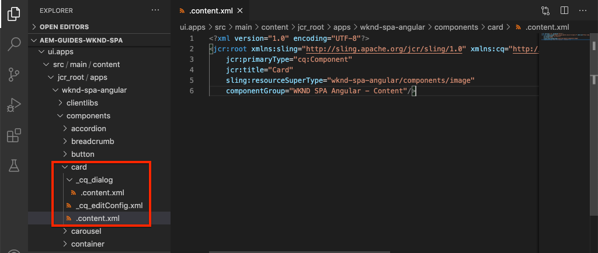
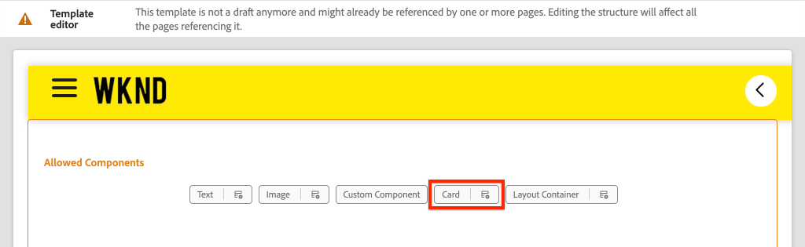
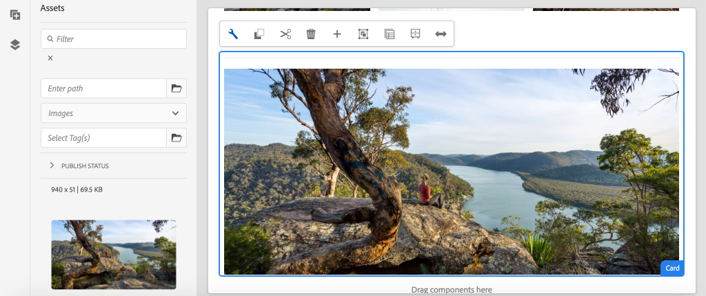

# 擴充核心元件 {#extend-component}

了解如何擴充現有的核心元件以與AEM SPA編輯器搭配使用。 了解如何擴充現有元件是自訂和擴充AEM SPA Editor實作功能的強大技術。

## 目標

1. 使用其他屬性和內容擴充現有的核心元件。
2. 使用了解元件繼承的基本內容 `sling:resourceSuperType`.
3. 了解如何使用 [委派模式](https://github.com/adobe/aem-core-wcm-components/wiki/Delegation-Pattern-for-Sling-Models) 以重複使用現有邏輯和功能。

## 您將建置的

在本章中，新增 `Card` 元件。 此 `Card` 元件延伸 [影像核心元件](https://experienceleague.adobe.com/docs/experience-manager-core-components/using/components/image.html) 新增其他內容欄位，例如「標題」和「呼叫動作」按鈕，以針對SPA內的其他內容執行預告角色。


>[!NOTE]
>
> 在實際實作中，僅使用 [Teaser元件](https://experienceleague.adobe.com/docs/experience-manager-core-components/using/components/teaser.html) 而非延伸 [影像核心元件](https://experienceleague.adobe.com/docs/experience-manager-core-components/using/components/image.html) 做 `Card` 元件（視專案需求而定）。 建議一律使用 [核心元件](https://experienceleague.adobe.com/docs/experience-manager-core-components/using/introduction.html) 盡可能直接。

## 必備條件

檢閱設定 [本地開發環境](overview.md#local-dev-environment).

### 取得程式碼

1. 透過Git下載本教學課程的起始點：

   ```shell
   $ git clone git@github.com:adobe/aem-guides-wknd-spa.git
   $ cd aem-guides-wknd-spa
   $ git checkout Angular/extend-component-start
   ```

2. 使用Maven將程式碼基底部署至本機AEM例項：

   ```shell
   $ mvn clean install -PautoInstallSinglePackage
   ```

   若使用 [AEM 6.x](overview.md#compatibility) 新增 `classic` 設定檔：

   ```shell
   $ mvn clean install -PautoInstallSinglePackage -Pclassic
   ```

3. 安裝傳統 [WKND參考網站](https://github.com/adobe/aem-guides-wknd/releases/tag/aem-guides-wknd-2.1.0). 提供的影像 [WKND參考網站](https://github.com/adobe/aem-guides-wknd/releases/latest) 在WKND SPA上重複使用。 可使用 [AEM Package Manager](http://localhost:4502/crx/packmgr/index.jsp).

   

您一律可以在上檢視完成的程式碼 [GitHub](https://github.com/adobe/aem-guides-wknd-spa/tree/Angular/extend-component-solution) 或切換到分支以本地簽出代碼 `Angular/extend-component-solution`.

## Inspect初始卡實作

章節啟動程式代碼已提供初始卡元件。 Inspect是卡片實作的起點。

1. 在所選IDE中，開啟 `ui.apps` 模組。
2. 導覽至 `ui.apps/src/main/content/jcr_root/apps/wknd-spa-angular/components/card` 和檢視 `.content.xml` 檔案。

   

   ```xml
   <?xml version="1.0" encoding="UTF-8"?>
   <jcr:root xmlns:sling="http://sling.apache.org/jcr/sling/1.0" xmlns:cq="http://www.day.com/jcr/cq/1.0" xmlns:jcr="http://www.jcp.org/jcr/1.0"
       jcr:primaryType="cq:Component"
       jcr:title="Card"
       sling:resourceSuperType="wknd-spa-angular/components/image"
       componentGroup="WKND SPA Angular - Content"/>
   ```

   屬性 `sling:resourceSuperType` 指向 `wknd-spa-angular/components/image` 表示 `Card` 元件繼承WKND SPA Image元件的功能。

3. Inspect檔案 `ui.apps/src/main/content/jcr_root/apps/wknd-spa-angular/components/image/.content.xml`:

   ```xml
   <?xml version="1.0" encoding="UTF-8"?>
   <jcr:root xmlns:sling="http://sling.apache.org/jcr/sling/1.0" xmlns:cq="http://www.day.com/jcr/cq/1.0" xmlns:jcr="http://www.jcp.org/jcr/1.0"
       jcr:primaryType="cq:Component"
       jcr:title="Image"
       sling:resourceSuperType="core/wcm/components/image/v2/image"
       componentGroup="WKND SPA Angular - Content"/>
   ```

   請注意， `sling:resourceSuperType` 指向 `core/wcm/components/image/v2/image`. 這表示WKND SPA Image元件繼承核心元件映像的功能。

   也稱為 [代理模式](https://experienceleague.adobe.com/docs/experience-manager-core-components/using/developing/guidelines.html#proxy-component-pattern) Sling資源繼承是功能強大的設計模式，可讓子元件視需要繼承功能和延伸/覆寫行為。 Sling繼承支援多種層級的繼承，因此最終新 `Card` 元件繼承核心元件映像的功能。

   許多開發團隊努力成為DRY（別重複）。 Sling繼承讓AEM成為可能。

4. 在 `card` 資料夾，開啟檔案 `_cq_dialog/.content.xml`.

   此檔案是 `Card` 元件。 如果使用Sling繼承，則可使用 [Sling Resource Merger](https://experienceleague.adobe.com/docs/experience-manager-65/developing/platform/sling-resource-merger.html) 覆蓋或擴展對話框的部分。 在此範例中，對話方塊已新增一個索引標籤，以從作者擷取其他資料以填入「卡片元件」。

   屬性，如 `sling:orderBefore` 允許開發人員選擇插入新索引標籤或表單欄位的位置。 在此情況下， `Text` 標籤 `asset` 標籤。 若要充分利用Sling Resource Merger，請務必了解 [影像元件對話方塊](https://github.com/adobe/aem-core-wcm-components/blob/master/content/src/content/jcr_root/apps/core/wcm/components/image/v2/image/_cq_dialog/.content.xml).

5. 在 `card` 資料夾，開啟檔案 `_cq_editConfig.xml`. 此檔案會指定AEM製作UI中的拖放行為。 擴充影像元件時，資源類型必須符合元件本身。 檢閱 `<parameters>` 節點：

   ```xml
   <parameters
       jcr:primaryType="nt:unstructured"
       sling:resourceType="wknd-spa-angular/components/card"
       imageCrop=""
       imageMap=""
       imageRotate=""/>
   ```

   大部分元件不需要 `cq:editConfig`、影像元件的子代為例外。

6. 在IDE交換機中， `ui.frontend` 模組，導覽至 `ui.frontend/src/app/components/card`:

   

7. Inspect檔案 `card.component.ts`.

   元件已運作完成，以對應至AEM `Card` 使用標準的元件 `MapTo` 函式。

   ```js
   MapTo('wknd-spa-angular/components/card')(CardComponent, CardEditConfig);
   ```

   回顧三個 `@Input` 類中的參數 `src`, `alt`，和 `title`. 這些是對應至AEM元件的Angular元件中預期的JSON值。

8. 開啟檔案 `card.component.html`:

   ```html
   <div class="card"  *ngIf="hasContent">
       <app-image class="card__image" [src]="src" [alt]="alt" [title]="title"></app-image>
   </div>
   ```

   在此示例中，我們選擇重複使用現有的Angular影像元件 `app-image` 只是通過 `@Input` 參數 `card.component.ts`. 在稍後的教學課程中，會新增並顯示其他屬性。

## 更新模板策略

使用此初始 `Card` 實作會檢閱AEM SPA編輯器中的功能。 若要查看初始 `Card` 元件需要更新模板策略。

1. 將入門程式碼部署至AEM的本機執行個體（如果尚未部署）:

   ```shell
   $ cd aem-guides-wknd-spa
   $ mvn clean install -PautoInstallSinglePackage
   ```

2. 導覽至SPA頁面範本，網址為 [http://localhost:4502/editor.html/conf/wknd-spa-angular/settings/wcm/templates/spa-page-template/structure.html](http://localhost:4502/editor.html/conf/wknd-spa-angular/settings/wcm/templates/spa-page-template/structure.html).
3. 更新「配置容器」的策略以添加新 `Card` 元件作為允許的元件：

   

   儲存對原則的變更，並觀察 `Card` 元件作為允許的元件：

   

## 製作初始卡片元件

接下來，編寫 `Card` 元件(使用AEM SPA編輯器)。

1. 導覽至 [http://localhost:4502/editor.html/content/wknd-spa-angular/us/en/home.html](http://localhost:4502/editor.html/content/wknd-spa-angular/us/en/home.html).
2. 在 `Edit` 模式，添加 `Card` 元件 `Layout Container`:

   

3. 從資產尋找器將影像拖放至 `Card` 元件：

   

4. 開啟 `Card` 元件對話方塊，並注意新增 **文字** 標籤。
5. 在 **文字** 標籤：

   

   **卡路徑**  — 在SPA首頁下方選擇頁面。

   **CTA文字** - 「了解詳情」

   **卡片標題**  — 留空

   **從連結的頁面取得標題**  — 勾選「 」核取方塊以指出「true」。

6. 更新 **資產中繼資料** 索引標籤，以新增 **替代文字** 和 **註解**.

   目前，在更新對話方塊後，不會顯示其他變更。 若要將新欄位公開給Angular元件，我們需要更新 `Card` 元件。

7. 開啟新標籤並導覽至 [CRXDE-Lite](http://localhost:4502/crx/de/index.jsp#/content/wknd-spa-angular/us/en/home/jcr%3Acontent/root/responsivegrid/card). Inspect下方的內容節點 `/content/wknd-spa-angular/us/en/home/jcr:content/root/responsivegrid` 查找 `Card` 元件內容。

   

   觀察屬性 `cardPath`, `ctaText`, `titleFromPage` 會由對話方塊保存。

## 更新Card Sling模型

若要最終將值從元件對話方塊公開給Angular元件，我們需要更新填入JSON的Sling模型 `Card` 元件。 我們還有機會實施兩個業務邏輯：

* 若 `titleFromPage` to **true**，傳回指定之頁面的標題 `cardPath` 否則，傳回 `cardTitle` 文本欄位。
* 傳回指定之頁面的上次修改日期 `cardPath`.

返回您選擇的IDE並開啟 `core` 模組。

1. 開啟檔案 `Card.java` at `core/src/main/java/com/adobe/aem/guides/wknd/spa/angular/core/models/Card.java`.

   請注意， `Card` 當前擴展的 `com.adobe.cq.wcm.core.components.models.Image` 因此會繼承 `Image` 介面。 此 `Image` 介面已擴展 `ComponentExporter` 介面，可將Sling模型匯出為JSON並由SPA編輯器對應。 因此，我們不需要明確延伸 `ComponentExporter` 介面，就像我們在 [自訂元件章節](custom-component.md).

2. 將下列方法新增至介面：

   ```java
   @ProviderType
   public interface Card extends Image {
   
       /***
       * The URL to populate the CTA button as part of the card.
       * The link should be based on the cardPath property that points to a page.
       * @return String URL
       */
       public String getCtaLinkURL();
   
       /***
       * The text to display on the CTA button of the card.
       * @return String CTA text
       */
       public String getCtaText();
   
   
   
       /***
       * The date to be displayed as part of the card.
       * This is based on the last modified date of the page specified by the cardPath
       * @return
       */
       public Calendar getCardLastModified();
   
   
       /**
       * Return the title of the page specified by cardPath if `titleFromPage` is set to true.
       * Otherwise return the value of `cardTitle`
       * @return
       */
       public String getCardTitle();
   }
   ```

   這些方法會透過JSON模型API公開，並傳遞至Angular元件。

3. 開啟 `CardImpl.java`. 這是 `Card.java` 介面。 為加速本教學課程，我們已部分研究此實作。  請注意， `@Model` 和 `@Exporter` 註解，以確保Sling模型能透過Sling模型匯出工具序列化為JSON。

   `CardImpl.java` 也會使用 [Sling模型的委派模式](https://github.com/adobe/aem-core-wcm-components/wiki/Delegation-Pattern-for-Sling-Models) 避免從影像核心元件重寫邏輯。

4. 請觀察下列行：

   ```java
   @Self
   @Via(type = ResourceSuperType.class)
   private Image image;
   ```

   以上附註會將名為的影像物件實例化 `image` 根據 `sling:resourceSuperType` 繼承 `Card` 元件。

   ```java
   @Override
   public String getSrc() {
       return null != image ? image.getSrc() : null;
   }
   ```

   接著，您就可以直接使用 `image` 物件以實作由定義的方法 `Image` 介面，而無須自行編寫邏輯。 此技術用於 `getSrc()`, `getAlt()`，和 `getTitle()`.

5. 接下來，實作 `initModel()` 啟動專用變數的方法 `cardPage` 根據 `cardPath`

   ```java
   @PostConstruct
   public void initModel() {
       if(StringUtils.isNotBlank(cardPath) && pageManager != null) {
           cardPage = pageManager.getPage(this.cardPath);
       }
   }
   ```

   此 `@PostConstruct initModel()` 會在Sling模型初始化時呼叫，因此這是初始化物件的良機，可供模型中的其他方法使用。 此 `pageManager` 是數個 [Java™備份的全局對象](https://experienceleague.adobe.com/docs/experience-manager-htl/content/global-objects.html) 透過 `@ScriptVariable` 註解。 此 [getPage](https://developer.adobe.com/experience-manager/reference-materials/cloud-service/javadoc/com/day/cq/wcm/api/PageManager.html) 方法傳入路徑並傳回AEM [頁面](https://developer.adobe.com/experience-manager/reference-materials/cloud-service/javadoc/com/day/cq/wcm/api/Page.html) 物件或null（如果路徑未指向有效頁面）。

   這會初始化 `cardPage` 變數，其他新方法會使用此變數來傳回基礎連結頁面的相關資料。

6. 檢閱已對應至已儲存製作對話方塊之JCR屬性的全域變數。 此 `@ValueMapValue` 批注用於自動執行映射。

   ```java
   @ValueMapValue
   private String cardPath;
   
   @ValueMapValue
   private String ctaText;
   
   @ValueMapValue
   private boolean titleFromPage;
   
   @ValueMapValue
   private String cardTitle;
   ```

   這些變數可用來實作 `Card.java` 介面。

7. 實作 `Card.java` 介面：

   ```java
   @Override
   public String getCtaLinkURL() {
       if(cardPage != null) {
           return cardPage.getPath() + ".html";
       }
       return null;
   }
   
   @Override
   public String getCtaText() {
       return ctaText;
   }
   
   @Override
   public Calendar getCardLastModified() {
      if(cardPage != null) {
          return cardPage.getLastModified();
      }
      return null;
   }
   
   @Override
   public String getCardTitle() {
       if(titleFromPage) {
           return cardPage != null ? cardPage.getTitle() : null;
       }
       return cardTitle;
   }
   ```

   >[!NOTE]
   >
   > 您可以檢視 [在此處完成CardImpl.java](https://github.com/adobe/aem-guides-wknd-spa/blob/Angular/extend-component-solution/core/src/main/java/com/adobe/aem/guides/wknd/spa/angular/core/models/impl/CardImpl.java).

8. 開啟終端機視窗，並只將更新部署至 `core` 使用Maven的模組 `autoInstallBundle` 從 `core` 目錄。

   ```shell
   $ cd core/
   $ mvn clean install -PautoInstallBundle
   ```

   若使用 [AEM 6.x](overview.md#compatibility) 新增 `classic` 設定檔。

9. 請在下列網址檢視JSON模型回應： [http://localhost:4502/content/wknd-spa-angular/us/en.model.json](http://localhost:4502/content/wknd-spa-angular/us/en.model.json) 並搜尋 `wknd-spa-angular/components/card`:

   ```json
   "card": {
       "ctaText": "Read More",
       "cardTitle": "Page 1",
       "title": "Woman chillaxing with river views in Australian bushland",
       "src": "/content/wknd-spa-angular/us/en/home/_jcr_content/root/responsivegrid/card.coreimg.jpeg/1595190732886/adobestock-216674449.jpeg",
       "alt": "Female sitting on a large rock relaxing in afternoon dappled light the Australian bushland with views over the river",
       "cardLastModified": 1591360492414,
       "ctaLinkURL": "/content/wknd-spa-angular/us/en/home/page-1.html",
       ":type": "wknd-spa-angular/components/card"
   }
   ```

   請注意，在中更新方法之後，JSON模型會以其他索引鍵/值組更新 `CardImpl` Sling模型。

## 更新Angular元件

現在，JSON模型中已填入 `ctaLinkURL`, `ctaText`, `cardTitle`，和 `cardLastModified` 我們可以更新Angular元件以顯示這些。

1. 返回到IDE並開啟 `ui.frontend` 模組。 （可選）從新的終端窗口啟動Webpack開發伺服器，以即時查看更改：

   ```shell
   $ cd ui.frontend
   $ npm install
   $ npm start
   ```

2. 開啟 `card.component.ts` at `ui.frontend/src/app/components/card/card.component.ts`. 新增其他 `@Input` 用於捕獲新模型的注釋：

   ```diff
   export class CardComponent implements OnInit {
   
        @Input() src: string;
        @Input() alt: string;
        @Input() title: string;
   +    @Input() cardTitle: string;
   +    @Input() cardLastModified: number;
   +    @Input() ctaLinkURL: string;
   +    @Input() ctaText: string;
   ```

3. 新增方法，以檢查動作呼叫是否就緒，並根據 `cardLastModified` 輸入：

   ```js
   export class CardComponent implements OnInit {
       ...
       get hasCTA(): boolean {
           return this.ctaLinkURL && this.ctaLinkURL.trim().length > 0 && this.ctaText && this.ctaText.trim().length > 0;
       }
   
       get lastModifiedDate(): string {
           const lastModifiedDate = this.cardLastModified ? new Date(this.cardLastModified) : null;
   
           if (lastModifiedDate) {
           return lastModifiedDate.toLocaleDateString();
           }
           return null;
       }
       ...
   }
   ```

4. 開啟 `card.component.html` 並新增下列標籤以顯示標題、動作呼叫和上次修改日期：

   ```html
   <div class="card"  *ngIf="hasContent">
       <app-image class="card__image" [src]="src" [alt]="alt" [title]="title"></app-image>
       <div class="card__content">
           <h2 class="card__title">
               {{cardTitle}}
               <span class="card__lastmod" *ngIf="lastModifiedDate">{{lastModifiedDate}}</span>
           </h2>
           <div class="card__action-container" *ngIf="hasCTA">
               <a [routerLink]="ctaLinkURL" class="card__action-link" [title]="ctaText">
                   {{ctaText}}
               </a>
           </div>
       </div>
   </div>
   ```

   已在新增Sass規則 `card.component.scss` 設定標題樣式、呼叫動作和上次修改日期。

   >[!NOTE]
   >
   > 您可以檢視已完成的 [Angular卡元件代碼在此處](https://github.com/adobe/aem-guides-wknd-spa/tree/Angular/extend-component-solution/ui.frontend/src/app/components/card).

5. 使用Maven從專案的根目錄部署完整變更至AEM:

   ```shell
   $ cd aem-guides-wknd-spa
   $ mvn clean install -PautoInstallSinglePackage
   ```

6. 導覽至 [http://localhost:4502/editor.html/content/wknd-spa-angular/us/en/home.html](http://localhost:4502/editor.html/content/wknd-spa-angular/us/en/home.html) 若要查看更新的元件：

   

7. 您應該可以重新編寫現有內容，以建立類似下列的頁面：

   

## 恭喜！ {#congratulations}

恭喜您，您已學會如何擴充AEM元件，以及Sling模型和對話方塊如何與JSON模型搭配運作。

您一律可以在上檢視完成的程式碼 [GitHub](https://github.com/adobe/aem-guides-wknd-spa/tree/Angular/extend-component-solution) 或切換到分支以本地簽出代碼 `Angular/extend-component-solution`.
